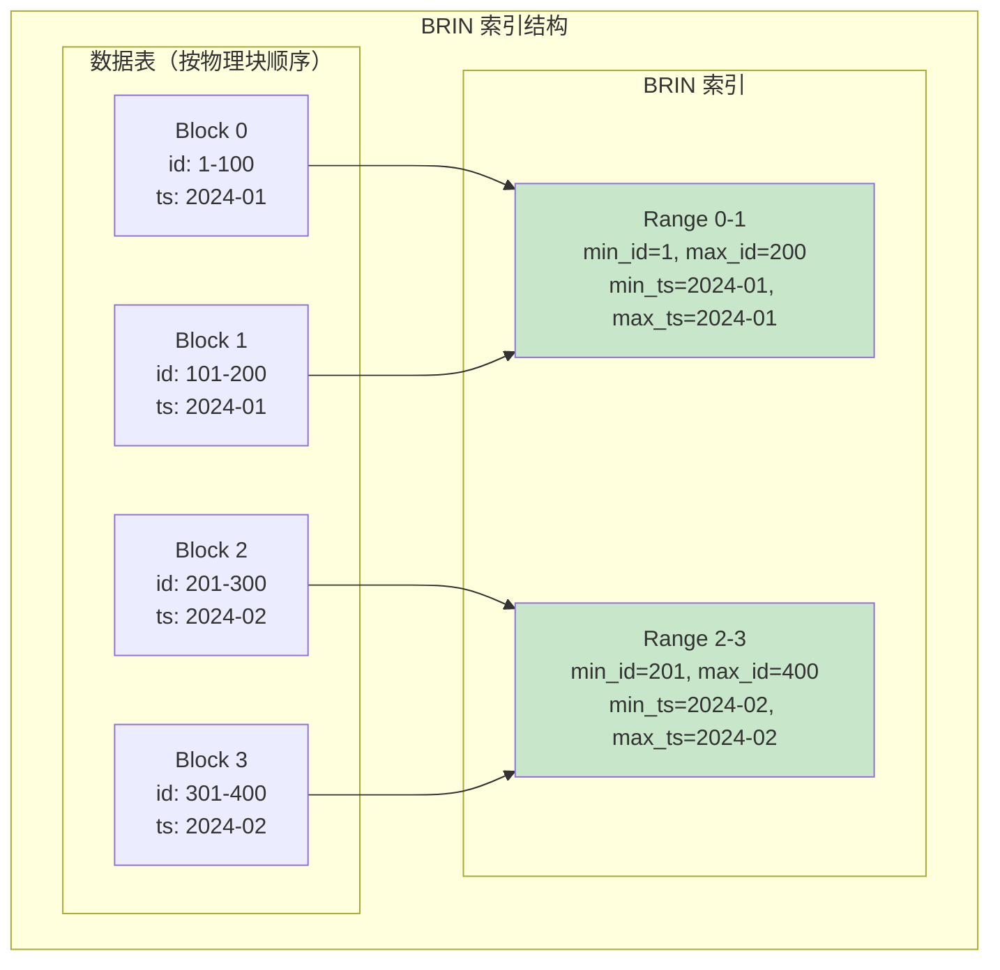
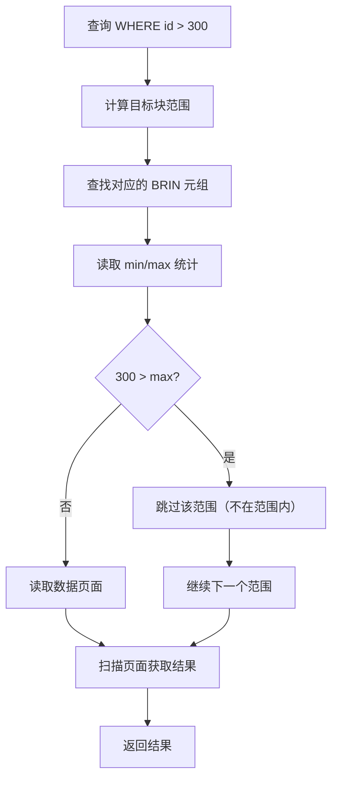
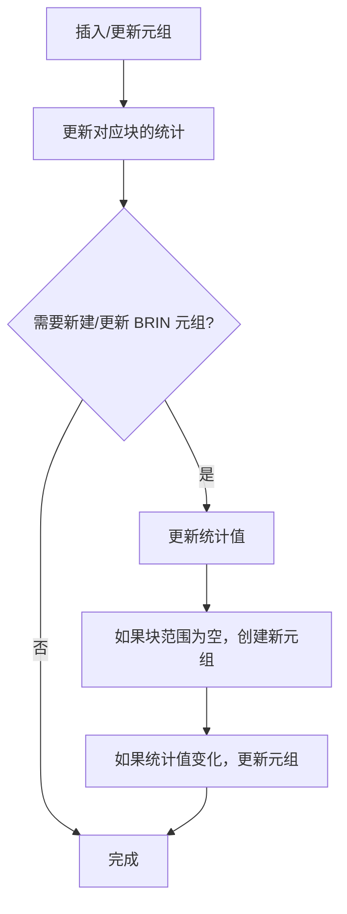

# BRIN 索引架构

> 本文档详细说明 Block Range Index (BRIN) 的原理、存储结构和增删改查逻辑。BRIN 是 PostgreSQL 10+ 引入的轻量级索引，适用于自然有序的大表。

---

## 1. 原理

### 1.1 什么是 BRIN

BRIN（块范围索引）是一种最小化索引，存储每个数据块（或块范围）的统计摘要信息。

**核心思想：**
- 不存储精确的键值位置
- 存储每个块范围的 min/max 等统计值
- 利用数据的物理顺序（块顺序）进行剪枝
- 索引极小（通常只有表的 1%）

### 1.2 BRIN vs B+Tree

| 特性 | B+Tree | BRIN |
|------|--------|------|
| 索引大小 | 大（与数据量对数相关） | 极小（与块数线性相关） |
| 写入开销 | 高 | 极低 |
| 查询类型 | =, <, >, BETWEEN | 仅范围查询 |
| 适用场景 | 随机插入、高选择性 | 顺序插入、自然有序 |

### 1.3 BRIN 结构



### 1.4 何时使用 BRIN

**适合 BRIN 的场景：**
- 时间序列数据（按时间顺序插入）
- 日志表（时间戳自然有序）
- 连续写入的 IoT 数据
- 分区表（每个分区独立有序）

**不适合 BRIN 的场景：**
- 随机插入的数据
- 更新频繁的表
- 无物理顺序的数据

---

## 2. 存储结构

### 2.1 索引页面结构

```
┌────────────────────────────────────────────────────────────┐
│                    BRIN 索引页面                             │
├────────────────────────────────────────────────────────────┤
│ PageHeaderData (24 bytes)                                  │
├────────────────────────────────────────────────────────────┤
│ ItemPointerData[0] ← pd_lower                             │
│ ItemPointerData[1]                                         │
│ ...                                                        │
├────────────────────────────────────────────────────────────┤
│ 空闲空间                                                   │
├────────────────────────────────────────────────────────────┤
│ BrinMemTuple[2] ← pd_upper                                │
│ BrinMemTuple[1]                                            │
│ BrinMemTuple[0] ← pd_special                              │
└────────────────────────────────────────────────────────────┘
```

### 2.2 统计摘要结构

```c
/**
 * BRIN 元组（统计摘要）
 */
typedef struct BrinMemTupleData {
    uint16_t    t_info;             // 标志和长度

    // 块范围信息
    BlockNumber blknum;             // 起始块号
    BlockNumber allStored;          // 是否存储了所有块

    // 存储每列的统计值（由操作符类定义）
    Datum       columns[1];         // 可变长度数组
} BrinMemTupleData;

/**
 * BRIN 元数据
 */
typedef struct BrinOpaqueData {
    uint32_t    bo_pagesPerRange;   // 每个 range 的块数
    uint32_t    bo_revmap;          // revmap 页面号
    uint32_t    bo_spell;           // 最后一个索引页面
} BrinOpaqueData;

/**
 * 索引常量
 */
#define BRIN_DEFAULT_PAGES_PER_RANGE  128   // 默认每个 range 128 页
#define BRIN_MIN_PAGES_PER_RANGE      1     // 最小值
#define BRIN_MAX_PAGES_PER_RANGE      256   // 最大值
```

### 2.3 RevMap（反向映射）

```c
/**
 * RevMap 存储反向映射：
 * BRIN 元组位置 → 对应的数据块范围
 *
 * 用于快速定位特定块范围的统计信息
 */
typedef struct BrinRevmap {
    BlockNumber rm_metaBlk;         // 元数据页面
    BlockNumber rm_pagesPerRange;   // 每个 range 的块数
    ItemPointer rm_pages[1];        // 指向 BRIN 元组的指针
} BrinRevmap;
```

---

## 3. 增删改查逻辑

### 3.1 查询



**查询算法伪代码：**
```c
/**
 * BRIN 范围查询
 */
ItemPointer *brin_range_scan(Relation rel, Datum lower, Datum upper,
                             OpComparison cmp_lower, OpComparison cmp_upper,
                             Snapshot snapshot, int *count) {
    // 1. 遍历每个块范围
    BlockNumber num_blocks = RelationGetNumberOfBlocks(rel);
    uint32_t pages_per_range = brin_get_pages_per_range(rel);

    ItemPointerSet results = NULL;
    int result_count = 0;

    for (BlockNumber block = 0; block < num_blocks; block += pages_per_range) {
        // 2. 获取该范围的统计摘要
        BrinMemTuple *summary = brin_get_summary(rel, block);

        if (summary == NULL) {
            // 没有摘要，需要扫描
            continue;
        }

        // 3. 使用统计值剪枝
        Datum min_val = summary->min_value;
        Datum max_val = summary->max_value;

        bool may_contain = true;

        // 检查下界
        if (cmp_lower == BTGreaterStrategyNumber) {
            if ( DatumGetInt32(upper) < min_val ) {
                may_contain = false;
            }
        }

        // 检查上界
        if (cmp_upper == BTLessStrategyNumber) {
            if ( DatumGetInt32(lower) > max_val ) {
                may_contain = false;
            }
        }

        // 4. 如果可能包含该范围，扫描数据页面
        if (may_contain) {
            BlockNumber end_block = Min(block + pages_per_range, num_blocks);

            for (BlockNumber b = block; b < end_block; b++) {
                Buffer buf = buffer_read(rel, b, ReadLock);
                Page page = buffer_get_page(buf);

                // 扫描页面中的元组
                ItemPointer *page_results = heap_scan_page(
                    rel, page, lower, upper, cmp_lower, cmp_upper, snapshot
                );

                if (page_results) {
                    results = append_item_pointers(results, &result_count,
                                                  page_results, page_result_count);
                }

                buffer_release(buf);
            }
        }
    }

    *count = result_count;
    return results->items;
}

/**
 * 获取块范围的统计摘要
 */
BrinMemTuple *brin_get_summary(Relation rel, BlockNumber block) {
    // 1. 计算该块属于哪个 range
    uint32_t pages_per_range = brin_get_pages_per_range(rel);
    BlockNumber range_start = (block / pages_per_range) * pages_per_range;

    // 2. 通过 revmap 查找对应的 BRIN 元组
    ItemPointer loc = revmap_lookup(rel, range_start);
    if (loc == NULL) {
        return NULL;
    }

    // 3. 读取 BRIN 元组
    return brin_fetch_tuple(rel, loc);
}
```

### 3.2 插入/更新



**插入/更新算法伪代码：**
```c
/**
 * BRIN 更新（插入/删除/更新时调用）
 */
int brin_update(Relation rel, ItemPointer heap_ptr, Datum *values,
                bool is_insert, uint32_t txn_id) {
    Buffer heap_buf = buffer_read(rel, ItemPointerGetBlockNumber(heap_ptr), ReadLock);
    Page heap_page = buffer_get_page(heap_buf);
    BlockNumber block_num = ItemPointerGetBlockNumber(heap_ptr);

    buffer_release(heap_buf);

    // 1. 计算该块属于哪个 range
    uint32_t pages_per_range = brin_get_pages_per_range(rel);
    BlockNumber range_start = (block_num / pages_per_range) * pages_per_range;

    // 2. 获取或创建该 range 的统计元组
    BrinMemTuple *summary = brin_get_summary(rel, range_start);

    if (summary == NULL) {
        // 创建新的统计元组
        summary = brin_create_summary(rel, range_start);
    }

    // 3. 更新统计值
    for (int i = 0; i < rel->rd_att->natts; i++) {
        if (is_insert) {
            summary->min_values[i] = Min(summary->min_values[i], values[i]);
            summary->max_values[i] = Max(summary->max_values[i], values[i]);
        } else {
            // 重新计算（简化处理，实际可能需要更复杂的逻辑）
            brin_refresh_summary(rel, range_start);
            break;
        }
    }

    // 4. 保存更新后的统计元组
    brin_store_summary(rel, summary);

    return 0;
}

/**
 * 刷新整个范围的统计（最保守但准确）
 */
void brin_refresh_summary(Relation rel, BlockNumber range_start) {
    uint32_t pages_per_range = brin_get_pages_per_range(rel);
    BlockNumber range_end = range_start + pages_per_range;

    // 初始化统计值
    BrinMemTuple *summary = brin_create_summary(rel, range_start);

    // 扫描范围内的所有页面
    for (BlockNumber block = range_start; block < range_end; block++) {
        Buffer buf;
        Page page;

        if (!buffer_exists(rel, block)) break;

        buf = buffer_read(rel, block, ReadLock);
        page = buffer_get_page(buf);

        // 更新每列的统计值
        OffsetNumber maxoff = PageGetMaxOffsetNumber(page);
        for (OffsetNumber i = FirstOffsetNumber; i <= maxoff; i++) {
            ItemId itemid = PageGetItemId(page, i);
            HeapTuple tuple = (HeapTuple)PageGetItem(page, itemid);

            // 更新每列的 min/max
            for (int col = 0; col < rel->rd_att->natts; col++) {
                Datum val = heap_getattr(tuple, col + 1, rel->rd_att);
                summary->min_values[col] = Min(summary->min_values[col], val);
                summary->max_values[col] = Max(summary->max_values[col], val);
            }
        }

        buffer_release(buf);
    }

    // 保存刷新后的统计
    brin_store_summary(rel, summary);
}
```

---

## 4. 面试知识点

### 4.1 常见问题

| 问题 | 答案要点 |
|------|----------|
| BRIN 适用于什么场景？ | 顺序插入的数据（时间序列、日志） |
| BRIN 为什么索引很小？ | 只存储块范围的统计值，不存储键值 |
| BRIN 的查询效率？ | 依赖数据的物理顺序，无序数据可能全表扫描 |
| BRIN vs B+Tree 如何选择？ | 大表+顺序写入选 BRIN，小表+随机访问选 B+Tree |
| pages_per_range 参数？ | 控制每个统计元组覆盖的块数，越大索引越小但越不精确 |

### 4.2 进阶问题

**Q: BRIN 的索引大小如何计算？**
> A: 索引大小 = (表块数 / pages_per_range) × 每元组大小。例如：1 亿行、8KB/块、128 块/range ≈ 78 万个元组，每个元组约 64 字节，总共约 50MB。

**Q: 如何判断 BRIN 是否有效？**
> A: 使用 ` brin_show_stats()` 查看统计值的区分度。如果 min/max 范围重叠严重，BRIN 无法有效剪枝。

---

*文档版本: v1.0*
*最后更新: 2026-07-12*
