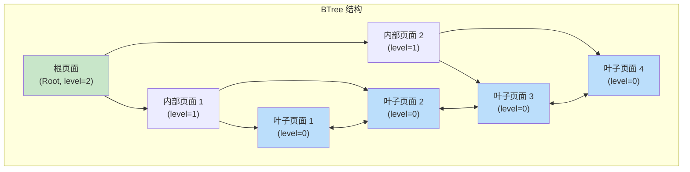
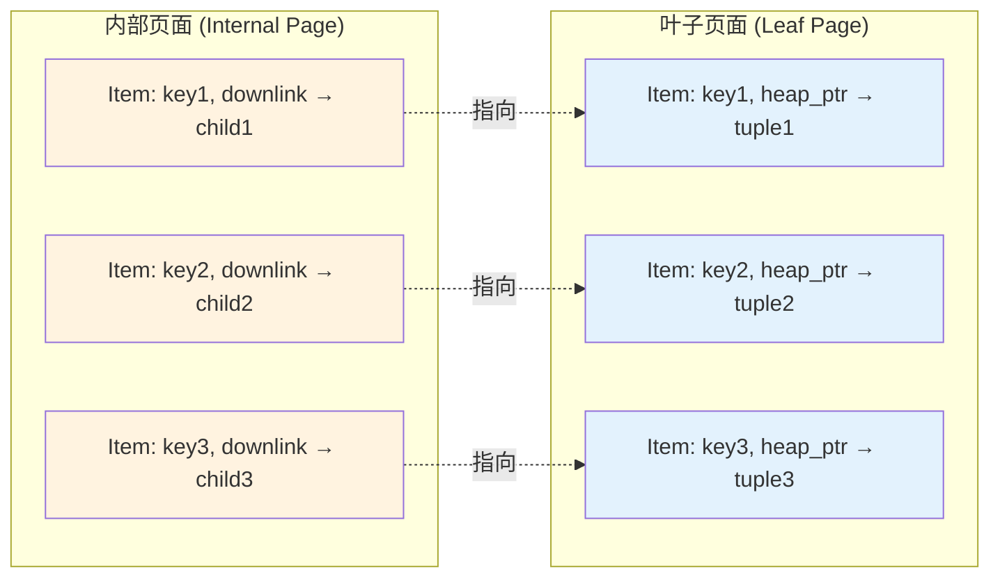
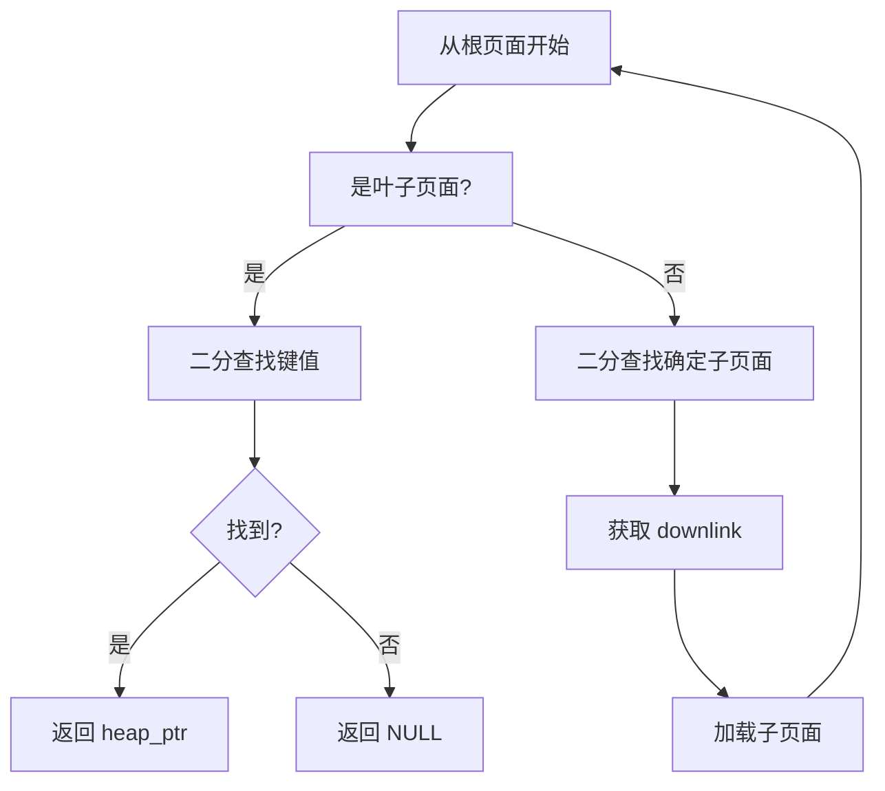
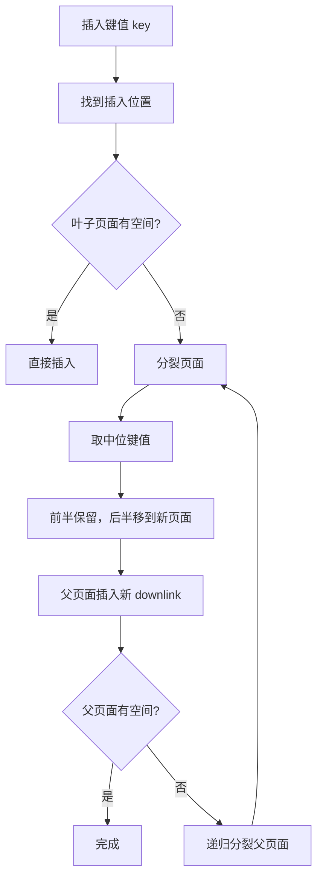
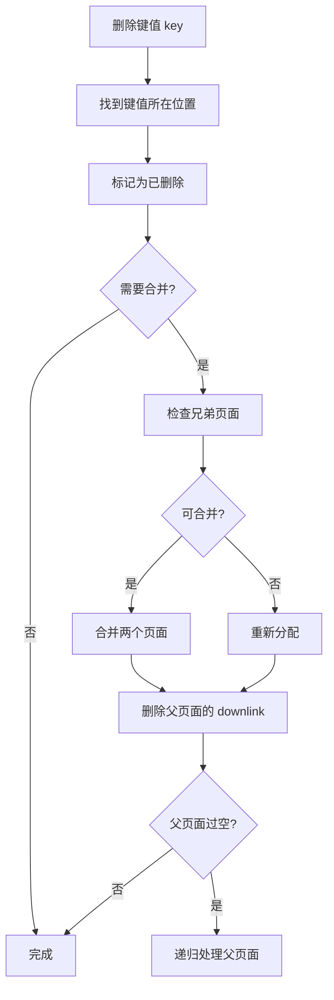

# BTree 索引架构

> 本文档详细说明 BTree 索引的原理、存储结构和增删改查逻辑。

---

## 1. 原理

### 1.1 什么是 BTree

BTree（Balance Tree，平衡树）是一种自平衡的多路搜索树，与二叉树不同，每个节点可以有多个子节点。

**核心特性：**
- 所有叶子节点在同一层级（平衡）
- 每个节点最多有 M 个子节点（M 阶 BTree）
- 每个节点最多存储 M-1 个键
- 节点至少半满（至少 ⌈M/2⌉ 个子节点）

### 1.2 BTree vs 二叉搜索树

| 特性 | BTree | 二叉搜索树 |
|------|-------|-----------|
| 阶数 | M 阶，多路 | 二叉 |
| 树高 | 低（3-4层常见） | 高（数据量大时） |
| I/O | 少（每页多键） | 多（频繁磁盘访问） |
| 平衡 | 自动平衡 | 可能退化为链表 |

### 1.3 为什么数据库用 BTree

1. **磁盘友好**：节点大小等于页面大小（8KB），一次 I/O 读取整个节点
2. **树高低**：4 层 BTree 可存储数十亿条记录
3. **范围查询快**：叶子节点链表支持快速范围扫描

---

## 2. 存储结构

### 2.1 整体结构



### 2.2 页面结构（8192 字节）

```
┌────────────────────────────────────────────────────────────┐
│                    页面 (8192 bytes)                        │
├────────────────────────────────────────────────────────────┤
│ PageHeaderData (20 bytes)                                  │
│  - magic: 0x05390A0B (BTPG_MAGIC)                         │
│  - btpo_flags: 页面类型标志                                │
│  - btpo_level: 层级（0=叶子）                              │
│  - btpo_prev: 前一个同层页面                               │
│  - btpo_next: 后一个同层页面                               │
│  - btpo_xact: 页面事务信息                                 │
│  - btpo_offset: 空闲空间起始偏移                           │
│  - btpo_count: 条目数                                      │
├────────────────────────────────────────────────────────────┤
│ Special Space ← pd_special (索引页面特有)                  │
│  - 存储索引特有的控制信息                                   │
├────────────────────────────────────────────────────────────┤
│ LinePointer 数组 ← pd_lower                                │
│  - 每个元组对应一个 4 字节的指针                           │
│  - 记录元组在页内的偏移                                     │
├────────────────────────────────────────────────────────────┤
│                    空闲空间                                 │
│                     (可用空间)                              │
├────────────────────────────────────────────────────────────┤
│ TupleData[0] ← pd_upper                                   │
│ TupleData[1] ← pd_upper - TupleLen[1]                      │
│ TupleData[2] ← pd_upper - TupleLen[1] - TupleLen[0]        │
└────────────────────────────────────────────────────────────┘
```

### 2.3 内部页面 vs 叶子页面



**内部页面条目结构：**
```c
// 内部页面元组
typedef struct BTInternalTupleData {
    IndexKeyData key;           // 索引键值
    BlockNumber downlink;       // 子页面块号
    uint16_t offnum;           // 元组偏移
} BTInternalTupleData;
```

**叶子页面条目结构：**
```c
// 叶子页面元组 (索引元组)
typedef struct BTreekirtData {
    Oid         heap_node;     // 堆表文件节点
    BlockNumber block_number;  // 堆元组所在块号
    uint16_t    offset;        // 元组在块内的偏移
    uint16_t    flags;         // 标志位
} BTreekirtData;
```

---

## 3. 增删改查逻辑

### 3.1 查找（Search）



**查找算法伪代码：**
```c
/**
 * BTree 精确查找
 *
 * @param rel 索引 Relation
 * @param key 查找的键值
 * @param snapshot 快照（用于 MVCC）
 * @return 堆元组指针，未找到返回 NULL
 */
void *btree_search(Relation rel, const void *key, Snapshot snapshot) {
    // 1. 从根页面开始
    BlockNumber root = btree_get_root(rel);
    BlockNumber current = root;

    // 2. 循环直到叶子页面
    while (!is_leaf_page(current)) {
        // 内部页面：二分查找确定下行链
        BTPageOpaque opaque = get_page_opaque(current);
        int pos = binary_search_internal(current, key);
        current = get_downlink(current, pos);
    }

    // 3. 在叶子页面二分查找
    int pos = binary_search_leaf(current, key);
    if (pos < 0) return NULL;

    // 4. 获取堆元组指针
    BTreekirtData *irt = get_leaf_item(current, pos);
    return heap_get_tuple(irt->heap_node,
                         irt->block_number,
                         irt->offset,
                         snapshot);
}

/**
 * 范围查找
 */
void *btree_range_scan(Relation rel, void *min_key, void *max_key) {
    // 1. 找到起始叶子页面
    BlockNumber leaf = btree_search_page(rel, min_key, true);

    // 2. 遍历叶子页面链表
    while (leaf != InvalidBlockNumber) {
        for (int i = 0; i < page_get_items(leaf); i++) {
            Item item = get_leaf_item(leaf, i);
            if (compare_key(item.key, max_key) > 0) {
                return;  // 超出范围
            }
            yield_result(item);
        }
        leaf = get_next_page(leaf);  // 链表下一页
    }
}
```

### 3.2 插入（Insert）



**插入算法伪代码：**
```c
/**
 * BTree 插入
 *
 * @param rel 索引 Relation
 * @param values 索引键值数组
 * @param heap_ptr 指向堆元组的指针
 * @param txn_id 事务 ID
 * @return 0 成功
 */
int btree_insert(Relation rel, Datum *values, ItemPointer heap_ptr,
                 uint32_t txn_id) {
    // 1. 从根向下搜索，找到应插入的叶子页面
    BTStack stack = btree_search_with_stack(rel, values);

    // 2. 在叶子页面插入
    BlockNumber leaf = stack->blkno;
    int result = btree_insert_on_leaf(leaf, values, heap_ptr, txn_id);

    if (result == BT_INSERT_NEED_SPLIT) {
        // 3. 页面已满，需要分裂
        btree_split_leaf(leaf, &newblk, &uplink_key);

        // 4. 更新父页面
        btree_insert_parent(rel, stack->parent, leaf, newblk,
                           uplink_key, txn_id);
    }

    // 5. 释放栈
    btree_free_stack(stack);

    return 0;
}

/**
 * 页面分裂
 */
void btree_split_leaf(BlockNumber oldblk, BlockNumber *newblk,
                      Datum *uplink_key) {
    // 分配新页面
    *newblk = buffer_alloc_new(rel);

    // 移动后半部分数据到新页面
    int mid = page_get_items(oldblk) / 2;
    for (int i = mid; i < page_get_items(oldblk); i++) {
        Item item = get_item(oldblk, i);
        page_add_item(*newblk, item, item->len);
    }

    // 设置新页面属性
    set_page_level(*newblk, get_page_level(oldblk));
    set_page_flags(*newblk, BTP_LEAF);

    // 链接叶子页面链表
    BlockNumber nextblk = get_next_page(oldblk);
    set_next_page(oldblk, *newblk);
    set_prev_page(*newblk, oldblk);
    set_next_page(*newblk, nextblk);

    // 获取上行键值（中位键）
    *uplink_key = get_item(*newblk, 0)->key;
}
```

### 3.3 删除（Delete）



**删除算法伪代码：**
```c
/**
 * BTree 删除
 */
int btree_delete(Relation rel, Datum *key, uint32_t txn_id) {
    // 1. 找到键值
    BTStack stack = btree_search_with_stack(rel, key);
    BlockNumber leaf = stack->blkno;
    int pos = find_on_leaf(leaf, key);

    if (pos < 0) {
        return -1;  // 未找到
    }

    // 2. 标记删除（不是真正删除）
    mark_item_dead(leaf, pos, txn_id);

    // 3. 检查是否需要平衡
    if (page_get_free_space(leaf) > threshold) {
        btree_balance_pages(rel, stack);
    }

    btree_free_stack(stack);
    return 0;
}

/**
 * 页面平衡（合并/重新分配）
 */
void btree_balance_pages(Relation rel, BTStack stack) {
    BlockNumber current = stack->blkno;
    BlockNumber parent = stack->parent->blkno;

    // 获取左右兄弟页面
    BlockNumber left = get_prev_page(current);
    BlockNumber right = get_next_page(current);

    // 计算当前页面条目数
    int cur_count = page_get_items(current);
    int min_items = get_must_have_items(rel);  // 最小条目数

    if (left != InvalidBlockNumber &&
        page_get_items(left) > min_items) {
        // 从左兄弟重新分配
        redistribute_pages(current, left, REDISTRIBUTE_LEFT);
    } else if (right != InvalidBlockNumber &&
               page_get_items(right) > min_items) {
        // 从右兄弟重新分配
        redistribute_pages(current, right, REDISTRIBUTE_RIGHT);
    } else if (left != InvalidBlockNumber) {
        // 合并到左兄弟
        merge_pages(current, left);
        delete_downlink(parent, current);
    } else if (right != InvalidBlockNumber) {
        // 合并到右兄弟
        merge_pages(current, right);
        delete_downlink(parent, current);
    }
}
```

### 3.4 更新（Update）

BTree 索引的更新通常通过删除 + 插入实现：

```c
/**
 * BTree 更新
 *
 * 更新索引键值需要删除旧条目，插入新条目
 */
int btree_update(Relation rel, Datum *old_key, Datum *new_key,
                 ItemPointer heap_ptr, uint32_t txn_id) {
    // 1. 删除旧键值
    btree_delete(rel, old_key, txn_id);

    // 2. 插入新键值
    btree_insert(rel, new_key, heap_ptr, txn_id);

    return 0;
}
```

---

## 4. 并发控制

### 4.1 锁类型

| 锁类型 | 粒度 | 用途 |
|--------|------|------|
| BTree 页面锁 | 页面 | 页面级并发控制 |
| 元组锁 | 元组 | 行级锁（等待/不等待） |
| 谓词锁 | 键范围 | 防止幻读 |

### 4.2 锁升级

```mermaid
flowchart TD
    A["请求元组锁"] --> B{"有排他锁?"
    B -->|否| C["获取共享锁"]
    B -->|是| D{"当前锁是共享锁?"
    D -->|是| E["等待排他锁释放"]
    D -->|否| F["成功"]
    C --> G{"有等待者?"
    G -->|是| H["升级为排他锁"]
    G -->|否| F
    E --> F
    H --> F
```

---

## 5. 面试知识点

### 5.1 常见问题

| 问题 | 答案要点 |
|------|----------|
| BTree 的时间复杂度？ | 查找、插入、删除都是 O(log M, N)，M 是阶数，N 是数据量 |
| 为什么 BTree 更适合磁盘？ | 每个节点一页，减少 I/O；树高低，查找路径短 |
| 页面分裂的时机？ | 页面满时分裂，保证至少半满 |
| 分裂点为什么选中间？ | 保证左右平衡，树高度一致 |
| 如何支持范围查询？ | 叶子页面双向链表，直接遍历 |
| 并发控制怎么做？ | 页面锁 + 乐观并发（MVCC） |
| BTree vs B+Tree？ | B+Tree 所有数据只在叶子，内部节点不存数据 |
| 删除为什么不直接删除？ | 标记删除，后续 VACUUM 清理，避免页面空洞 |

### 5.2 进阶问题

**Q: BTree 的分裂是向上蔓延的吗？为什么？**
> A: 是的。当叶子页面分裂时，需要在父页面插入新的 downlink。如果父页面也满了，就会继续分裂向上蔓延，直到根页面。这保证了树的平衡性。

**Q: 如何优化 BTree 的范围查询？**
> A: 1) 使用叶子页面双向链表顺序遍历；2) 预取相邻页面；3) 批量处理结果。

**Q: BTree 的空间利用率？**
> A: 保证至少半满，最差情况空间利用率约 50%。但实际平均约 66%（因为分裂点是中间）。

---

*文档版本: v1.0*
*最后更新: 2026-07-12*
