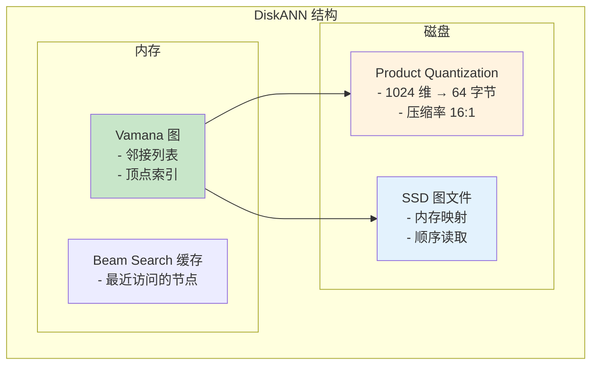
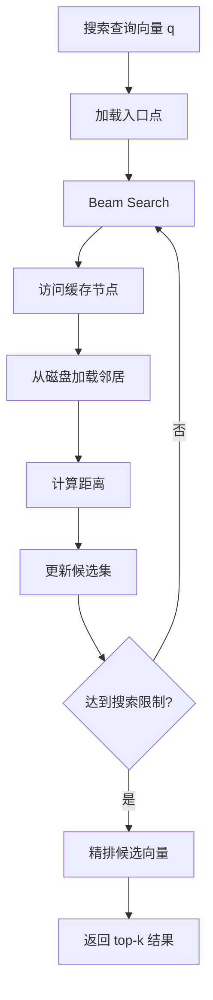

# DiskANN 索引架构

> 本文档详细说明 DiskANN（Disk-Approximate Nearest Neighbor）的原理、存储结构和搜索逻辑。DiskANN 是微软开源的大规模向量索引，专为磁盘存储优化。

---

## 1. 原理

### 1.1 什么是 DiskANN

DiskANN 是一种基于图的近似最近邻搜索算法，专为无法完全放入内存的大规模向量数据设计。

**核心思想：**
- 构建内存中的导航图（Vamana 图）
- 量化向量存储在磁盘上
- 使用 PQ（Product Quantization）压缩向量
- 支持内存映射（Memory-Mapped I/O）

### 1.2 DiskANN vs HNSW

| 特性 | HNSW | DiskANN |
|------|------|---------|
| 存储位置 | 内存 | 磁盘 |
| 向量压缩 | 可选 | 必须（PQ） |
| 索引大小 | 大 | 小（约 4-10% 原始大小） |
| 搜索延迟 | 低（毫秒级） | 中（毫秒到秒级） |
| 内存需求 | 高 | 低 |

### 1.3 DiskANN 结构



---

## 2. 存储结构

### 2.1 整体结构

```c
/**
 * DiskANN 元数据
 */
typedef struct DiskANNIndexMeta {
    uint32_t    dimension;          // 向量维度
    uint32_t    num_vectors;        // 向量数量
    uint32_t    pq_bytes;           // PQ 压缩后每个向量的字节数
    uint32_t    graph_degree;       // 图的度（每个节点的邻居数）
    uint32_t    graph_size;         // 图文件大小
    uint64_t    metadata_offset;    // 元数据偏移
} DiskANNIndexMeta;

/**
 * Vamana 图节点
 */
typedef struct VamanaNode {
    uint32_t    id;                 // 节点 ID
    uint32_t    out_degree;         // 出度（邻居数）
    uint32_t    neighbors[1];       // 邻居 ID 数组（变长）
} VamanaNode;

/**
 * PQ 码本
 */
typedef struct PQCodebook {
    uint32_t    num_subvectors;     // 子向量数量
    uint32_t    sub_dim;            // 子向量维度
    uint32_t    num_centroids;      // 每个子空间的聚类中心数
    float       centroids[1];       // 聚类中心（num_subvectors * num_centroids * sub_dim）
} PQCodebook;
```

### 2.2 文件布局

```
┌────────────────────────────────────────────────────────────┐
│                 DiskANN 索引文件                            │
├────────────────────────────────────────────────────────────┤
│ MetaData (固定大小)                                         │
│  - dimension: 1024                                         │
│  - num_vectors: 100000000                                  │
│  - pq_bytes: 64                                            │
│  - graph_degree: 64                                        │
├────────────────────────────────────────────────────────────┤
│ PQ Codebook                                                │
│  - 64 subvectors × 256 centroids × 4 bytes                │
│  - 总大小: 64 × 256 × 4 × 4 = 256 KB                      │
├────────────────────────────────────────────────────────────┤
│ PQ Vectors (已压缩向量)                                     │
│  - 100M × 64 bytes = 6.4 GB                               │
│  - 可以内存映射                                             │
├────────────────────────────────────────────────────────────┤
│ Vamana Graph                                               │
│  - 每个节点: 4 + 4 + graph_degree×4 bytes                  │
│  - 总大小: 100M × (4 + 4 + 64×4) ≈ 26 GB                   │
├────────────────────────────────────────────────────────────┤
│ Metadata Table                                             │
│  - 每个向量的元信息：大小、偏移等                           │
└────────────────────────────────────────────────────────────┘
```

---

## 3. 搜索逻辑

### 3.1 搜索流程



### 3.2 搜索算法

```c
/**
 * DiskANN 搜索
 *
 * @param index DiskANN 索引
 * @param query 查询向量（原始维度）
 * @param k 返回结果数
 * @param search_limit 搜索节点数限制
 * @return top-k 结果
 */
DiskANNResult *diskann_search(DiskANNIndex *index, const float *query,
                              int k, int search_limit) {
    uint32_t dim = index->meta->dimension;
    int pq_bytes = index->meta->pq_bytes;

    // 1. 将查询向量量化
    uint8_t *query_pq = malloc(pq_bytes);
    pq_encode(query, query_pq, index->codebook);

    // 2. 获取查询到所有 PQ 中心的距离
    float *query_to_centroid_dist = malloc(index->meta->num_subvectors *
                                           index->codebook->num_centroids * sizeof(float));
    pq_compute_distances(query, query_to_centroid_dist, index->codebook);

    // 3. 初始化搜索
    PriorityQueue *visited = pq_create(index->meta->graph_degree * 2);
    PriorityQueue *candidates = pq_create(search_limit);
    uint32_t *best_inserted_order = malloc(sizeof(uint32_t) * search_limit);
    int best_inserted_count = 0;

    // 4. 从入口点开始搜索
    uint32_t start = index->entry_point;
    pq_push(candidates, start, 0.0);
    pq_push(visited, start, 0.0);

    // 5. Beam Search
    while (!pq_empty(candidates) && best_inserted_count < search_limit) {
        // 取出一个候选
        uint32_t curr_id;
        float curr_dist;
        pq_pop(candidates, &curr_id, &curr_dist);

        // 如果当前候选比最远结果还远，可以提前停止
        if (best_inserted_count >= k) {
            float worst_dist = get_worst_distance(best_inserted_order, best_inserted_count);
            if (curr_dist > worst_dist) {
                break;
            }
        }

        // 6. 加载并搜索当前节点的邻居
        VamanaNode *node = diskann_load_node(index, curr_id);
        uint32_t *neighbors = node->neighbors;
        uint32_t degree = node->out_degree;

        for (uint32_t i = 0; i < degree; i++) {
            uint32_t neighbor_id = neighbors[i];

            // 检查是否访问过
            if (pq_contains(visited, neighbor_id)) {
                continue;
            }
            pq_push(visited, neighbor_id, curr_dist);

            // 计算距离（使用 PQ）
            float dist = diskann_compute_distance_pq(index, query_pq,
                                                     neighbor_id,
                                                     query_to_centroid_dist);

            // 加入候选队列
            pq_push(candidates, neighbor_id, dist);

            // 维护 best 列表
            if (best_inserted_count < search_limit) {
                best_inserted_order[best_inserted_count++] = neighbor_id;
            } else {
                // 替换最远的
                int worst_idx = find_worst(best_inserted_order, k);
                if (worst_idx >= 0) {
                    best_inserted_order[worst_idx] = neighbor_id;
                }
            }
        }

        free(node);
    }

    // 7. 精排：从磁盘加载原始向量重新计算距离
    DiskANNResult *results = diskann_rerank(index, query,
                                           best_inserted_order,
                                           best_inserted_count, k);

    // 清理
    free(query_pq);
    free(query_to_centroid_dist);
    free(best_inserted_order);
    pq_destroy(candidates);
    pq_destroy(visited);

    return results;
}

/**
 * 使用 PQ 距离计算（快速近似）
 */
float diskann_compute_distance_pq(DiskANNIndex *index, uint8_t *query_pq,
                                  uint32_t node_id,
                                  float *query_to_centroid_dist) {
    uint8_t *vec_pq = diskann_get_pq_vector(index, node_id);
    float dist = 0.0;

    // 累加每个子空间的距离
    for (uint32_t s = 0; s < index->meta->num_subvectors; s++) {
        uint8_t code = vec_pq[s];
        dist += query_to_centroid_dist[s * index->codebook->num_centroids + code];
    }

    return dist;
}

/**
 * 精排：加载原始向量重新计算精确距离
 */
DiskANNResult *diskann_rerank(DiskANNIndex *index, const float *query,
                              uint32_t *candidate_ids, int num_candidates,
                              int k) {
    DiskANNResult *results = malloc(sizeof(DiskANNResult) * k);

    // 加载 top candidates 的原始向量
    for (int i = 0; i < num_candidates; i++) {
        uint32_t id = candidate_ids[i];
        float *original_vec = diskann_load_original_vector(index, id);

        // 计算精确距离
        float dist = distance_l2(query, original_vec, index->meta->dimension);

        // 更新结果
        update_results(results, &num_candidates, id, dist, k);

        free(original_vec);
    }

    return results;
}
```

### 3.3 索引构建

```c
/**
 * DiskANN 索引构建
 */
int diskann_build(DiskANNIndex *index, float *vectors, uint32_t num_vectors,
                  uint32_t dimension, DiskANNBuildParams *params) {
    // 1. PQ 训练
    index->codebook = pq_train(vectors, num_vectors, dimension,
                               params->num_subvectors, params->num_centroids);

    // 2. 编码所有向量
    uint8_t *pq_vectors = malloc(num_vectors * params->pq_bytes);
    for (uint32_t i = 0; i < num_vectors; i++) {
        pq_encode(&vectors[i * dimension], &pq_vectors[i * params->pq_bytes],
                  index->codebook);
    }

    // 3. 构建 Vamana 图
    VamanaGraph *graph = vamana_build(pq_vectors, num_vectors,
                                      params->graph_degree,
                                      params->alpha);  // alpha 通常 1.2

    // 4. 保存索引
    diskann_save_index(index, graph, pq_vectors);

    return 0;
}

/**
 * Vamana 图构建
 */
VamanaGraph *vamana_build(uint8_t *pq_vectors, uint32_t num_vectors,
                          uint32_t max_degree, float alpha) {
    // 1. 初始化图（可以使用随机边或 KNN 图）
    VamanaGraph *graph = vamana_init(num_vectors, max_degree);

    // 2. Greedy 图构建
    for (uint32_t i = 0; i < num_vectors; i++) {
        uint32_t neighbors[max_degree];
        int num_neighbors = 0;

        // 贪心搜索找到最近的 max_degree 个邻居
        float *distances = malloc(num_vectors * sizeof(float));
        for (uint32_t j = 0; j < num_vectors; j++) {
            if (i == j) continue;
            distances[j] = pq_distance(&pq_vectors[i], &pq_vectors[j]);
        }

        // 取最近的 max_degree 个
        // （实际实现会更复杂，使用优先队列）
        num_neighbors = find_k_nearest(distances, num_vectors, i,
                                       neighbors, max_degree);

        // 添加邻居（同时添加双向边）
        vamana_add_neighbors(graph, i, neighbors, num_neighbors);

        free(distances);
    }

    // 3. 图剪枝（使用 alpha 参数控制）
    for (uint32_t i = 0; i < num_vectors; i++) {
        vamana_prune(graph, i, max_degree, alpha);
    }

    // 4. 选择入口点（度数最高的节点）
    graph->entry_point = vamana_find_entry_point(graph);

    return graph;
}

/**
 * 图剪枝
 */
void vamana_prune(VamanaGraph *graph, uint32_t node_id,
                  uint32_t max_degree, float alpha) {
    uint32_t *neighbors = graph->neighbors[node_id];
    uint32_t degree = graph->degrees[node_id];

    if (degree <= max_degree) {
        return;
    }

    // 使用 alpha 剪枝策略
    // 1. 按距离排序
    // 2. 贪心选择：每次选距离最小的，删除与其重叠的候选

    uint32_t *selected = malloc(max_degree * sizeof(uint32_t));
    int selected_count = 0;
    bool *removed = calloc(degree, sizeof(bool));

    for (uint32_t i = 0; i < degree; i++) {
        if (removed[i]) continue;

        uint32_t neighbor = neighbors[i];
        selected[selected_count++] = neighbor;

        if (selected_count >= max_degree) break;

        // 删除与新选中节点距离过近的候选
        for (uint32_t j = i + 1; j < degree; j++) {
            if (removed[j]) continue;

            float dist = pq_distance_between_neighbors(neighbors[i], neighbors[j]);
            if (dist < alpha * get_min_distance(neighbor, selected, selected_count)) {
                removed[j] = true;
            }
        }
    }

    // 更新邻居列表
    graph->degrees[node_id] = selected_count;
    for (uint32_t i = 0; i < selected_count; i++) {
        graph->neighbors[node_id][i] = selected[i];
    }

    free(selected);
    free(removed);
}
```

---

## 4. 面试知识点

| 问题 | 答案要点 |
|------|----------|
| DiskANN 的优势？ | 支持超大规模向量、内存占用小、磁盘友好 |
| 为什么需要 PQ？ | 压缩向量，减少磁盘 I/O |
| Vamana 图的特点？ | 使用 alpha 参数控制邻居选择，平衡精度和度 |
| DiskANN vs HNSW？ | DiskANN 适合磁盘存储，HNSW 适合内存 |

---

*文档版本: v1.0*
*最后更新: 2026-07-12*
