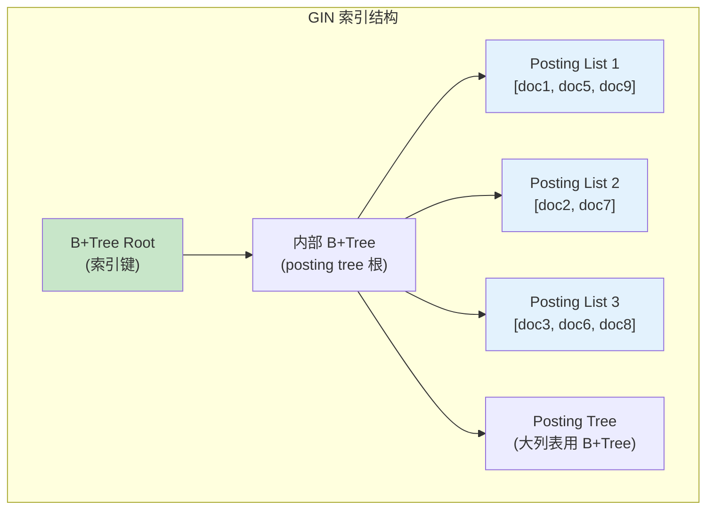
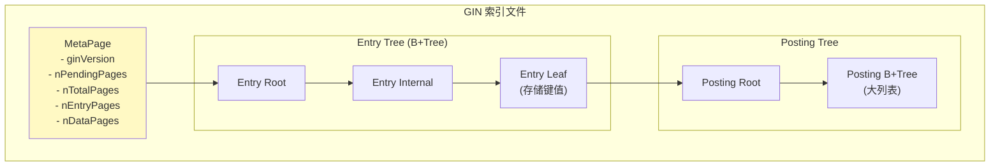

# GIN 索引架构

> 本文档详细说明 Generalized Inverted Index (GIN) 的原理、存储结构和增删改查逻辑。GIN 是 PostgreSQL 用于全文搜索和 JSONB 的专用索引。

---

## 1. 原理

### 1.1 什么是 GIN

GIN（通用倒排索引）是一种索引结构，将每个键值映射到包含该键的所有行。

**核心思想：**
- 正排索引：文档 → 包含的键
- 倒排索引：键 → 包含该键的文档列表
- 支持复合值（数组、JSON）的多值查询

### 1.2 GIN vs B+Tree

| 特性 | B+Tree | GIN |
|------|--------|-----|
| 索引目标 | 单值 | 多值（数组、全文） |
| 查询类型 | =, <, >, BETWEEN | @>, &&, @@ |
| 写入开销 | 低 | 高（需要更新多个 posting list） |
| 存储开销 | 低 | 较高 |
| 适用场景 | 等值/范围查询 | 包含查询、全文搜索 |

### 1.3 GIN 结构



---

## 2. 存储结构

### 2.1 整体结构



### 2.2 键值条目结构

```c
/**
 * GIN 索引元组
 */
typedef struct GinIndexTupleData {
    uint16_t    t_info;             // 标志和长度
    uint32_t    heapNode;           // 键值或 TID
} GinIndexTupleData;

/**
 * Posting List 条目
 */
typedef struct GinPostingList {
    uint32_t    count;              // 条目数量
    ItemPointerData heapPtrs[1];    // TID 数组
} GinPostingList;

/**
 * GIN 元数据页面
 */
typedef struct GinPageOpaqueData {
    uint32_t    rightlink;          // 右兄弟页面
    uint32_t    flags;              // 页面类型标志
    uint32_t    maxoff;             // 最大偏移（用于 posting list）
    uint32_t    nbytes;             // posting list 字节数
} GinPageOpaqueData;

/**
 * 页面类型
 */
#define GIN_DATA              0x0001  // 数据页面
#define GIN_DELETED           0x0002  // 已删除
#define GIN_META              0x0004  // 元数据页面
#define GIN_LIST              0x0008  // Posting list
#define GIN_TREE              0x0010  // Posting tree
```

---

## 3. 增删改查逻辑

### 3.1 插入

```c
/**
 * GIN 插入
 *
 * 对于数组列，每个元素单独索引
 */
int gin_insert(Relation rel, Datum *keys, int nkeys,
               ItemPointer heap_ptr, uint32_t txn_id) {
    // 遍历每个键值
    for (int i = 0; i < nkeys; i++) {
        Datum key = keys[i];

        // 查找或创建键值的 entry
        BlockNumber entry_root = GinGetEntryRoot(rel);
        BlockNumber entry_leaf = gin_find_entry(rel, entry_root, key);

        if (entry_leaf == InvalidBlockNumber) {
            // 键值不存在，创建新 entry
            entry_leaf = gin_create_entry(rel, key);
        }

        // 将 heap_ptr 添加到 posting list
        gin_insert_into_posting_list(rel, entry_leaf, heap_ptr);
    }

    return 0;
}

/**
 * 插入到 posting list
 */
void gin_insert_into_posting_list(Relation rel, BlockNumber entry_leaf,
                                  ItemPointer heap_ptr) {
    Buffer buf = buffer_read(rel, entry_leaf, WriteLock);
    Page page = buffer_get_page(buf);

    // 检查 posting list 是否存在
    GinPostingList *plist = gin_get_posting_list(page);

    if (plist == NULL || plist->count >= GIN posting_list_max_size) {
        // 需要创建 posting tree
        gin_create_posting_tree(rel, entry_leaf, heap_ptr);
    } else {
        // 直接添加到 posting list
        plist->heapPtrs[plist->count++] = *heap_ptr;

        // 保持有序（用于加速搜索）
        gin_sort_posting_list(plist);
    }

    buffer_mark_dirty(buf);
    buffer_release(buf);
}
```

### 3.2 查询

```c
/**
 * GIN 包含查询 (@>)
 *
 * 查找包含所有给定键值的行
 */
ItemPointer *gin_search(Relation rel, Datum *keys, int nkeys,
                        Snapshot snapshot, int *count) {
    ItemPointerSet result = NULL;
    int result_count = 0;

    // 遍历每个键值，获取 posting list
    ItemPointerSet *posting_lists = malloc(sizeof(ItemPointerSet) * nkeys);

    for (int i = 0; i < nkeys; i++) {
        BlockNumber entry_leaf = gin_find_entry(rel, keys[i]);
        if (entry_leaf == InvalidBlockNumber) {
            // 键值不存在，结果为空
            *count = 0;
            return NULL;
        }
        posting_lists[i] = gin_get_posting_list(rel, entry_leaf);
    }

    // 取交集（AND 逻辑）
    result = posting_lists[0];
    result_count = posting_lists[0]->count;

    for (int i = 1; i < nkeys && result_count > 0; i++) {
        result = intersect_item_pointers(result, &result_count,
                                         posting_lists[i]);
    }

    free(posting_lists);
    *count = result_count;

    return result->items;
}

/**
 * GIN 重叠查询 (&&)
 *
 * 查找包含任一给定键值的行
 */
ItemPointer *gin_search_any(Relation rel, Datum *keys, int nkeys,
                            Snapshot snapshot, int *count) {
    ItemPointerSet result = NULL;
    int result_count = 0;

    // 取并集（OR 逻辑）
    for (int i = 0; i < nkeys; i++) {
        BlockNumber entry_leaf = gin_find_entry(rel, keys[i]);
        if (entry_leaf != InvalidBlockNumber) {
            ItemPointerSet plist = gin_get_posting_list(rel, entry_leaf);
            result = union_item_pointers(result, &result_count, plist);
        }
    }

    *count = result_count;
    return result->items;
}
```

---

## 4. 面试知识点

| 问题 | 答案要点 |
|------|----------|
| GIN 适用于什么场景？ | 全文搜索、JSONB 包含查询、数组包含查询 |
| GIN vs B+Tree 的区别？ | GIN 一个键值对应多个 TID，支持多值查询 |
| GIN 的写入开销为什么高？ | 需要为复合值的每个元素单独索引 |
| Posting List vs Posting Tree？ | 小列表用数组，大列表用 B+Tree |

---

*文档版本: v1.0*
*最后更新: 2026-07-12*
