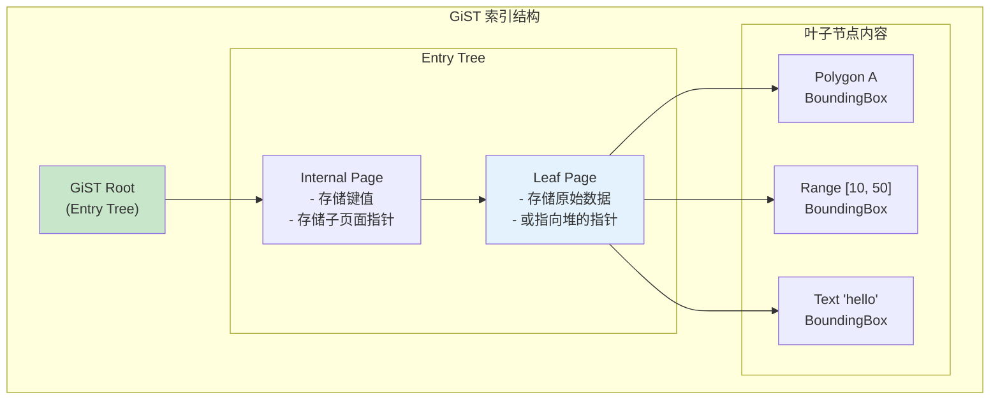

# GiST 索引架构

> 本文档详细说明 Generalized Search Tree (GiST) 的原理、存储结构和增删改查逻辑。GiST 是 PostgreSQL 的可扩展索引框架，支持多种索引类型。

---

## 1. 原理

### 1.1 什么是 GiST

GiST（通用搜索树）是一个可扩展的索引框架，允许用户定义自定义索引类型。

**核心思想：**
- 定义一致性函数（Consistent）
- 定义联合函数（Union）
- 定义惩罚函数（Penalty）
- 定义 Picksplit 函数

### 1.2 GiST 支持的索引类型

| 索引类型 | 数据类型 | 查询操作符 |
|----------|----------|-----------|
| B+Tree | 有序类型 | <, <=, =, >=, > |
| R-Tree | 几何类型 | &&, <@, @>, <<, >> |
| RD-Tree | 范围类型 | @>, <@, && |
| 全文搜索 | 文本 | @@ |
| UUID | UUID | =, <, > |

### 1.3 GiST 结构



---

## 2. 存储结构

### 2.1 核心结构

```c
/**
 * GiST 索引元组
 */
typedef struct GISTIndexTupleData {
    uint16_t    t_info;             // 标志和长度
    GISTENTRY    key;               // 键值（变长）
} GISTIndexTupleData;

/**
 * GiST Entry（内存中）
 */
typedef struct GISTENTRY {
    OffsetNumber offset;            // 页面内偏移
    BlockNumber blkno;              // 块号
    Datum       key;                // 键值
    bool        leafkey;            // 是否是叶子键
    Relation    rel;                // 索引 Relation
} GISTENTRY;

/**
 * GiST 页面操作码
 */
typedef struct GISTPageOpaqueData {
    uint32_t    rightlink;          // 右兄弟页面
    uint32_t    flags;              // 页面类型
    uint32_t    n，秦    // 页面中的条目数
    uint32_t    maxoff;             // 最大偏移
} GISTPageOpaqueData;

/**
 * 页面类型
 */
#define GIST_WRITE              0x0001  // 写页面
#define GIST_READY              0x0002  // 就绪
#define GIST_LEAF               0x0004  // 叶子页面
#define GIST_META               0x0008  // 元数据页面
```

### 2.2 键值结构（以几何类型为例）

```c
/**
 * 矩形（用于 R-Tree）
 */
typedef struct BOX {
    float       xmin;               // X 轴最小值
    float       ymin;               // Y 轴最小值
    float       xmax;               // X 轴最大值
    float       ymax;               // Y 轴最大值
} BOX;

/**
 * GiST 统一接口（操作符类定义）
 */
typedef struct GIST_OPS {
    // 一致性检查：entry 与 query 是否可能匹配
    bool (*Consistent)(GISTENTRY *entry, Datum query, StrategyNumber strategy);

    // 联合：合并多个 entry 的键值
    Datum (*Union)(GISTENTRY **entries, int n, Relation rel);

    // 惩罚值：插入新键时的"代价"
    float (*Penalty)(GISTENTRY *orig, GISTENTRY *new, float infFlags);

    // Picksplit：将一个页面分成两个
    GIST_SPLITVEC *(*Picksplit)(Page page, GISTENTRY **entries, int n);

    // 压缩：将 Datum 转换为存储格式
    Datum (*Compress)(Datum entry);

    // 解压：将存储格式转换为 Datum
    Datum (*Decompress)(Datum entry);

    // 距离计算（用于最近邻查询）
    float (*Distance)(GISTENTRY *entry, Datum query);
} GIST_OPS;
```

---

## 3. 增删改查逻辑

### 3.1 插入

```c
/**
 * GiST 插入
 */
int gist_insert(Relation rel, Datum value, ItemPointer heap_ptr,
                uint32_t txn_id) {
    GISTENTRY entry;
    entry.key = value;
    entry.blkno = InvalidBlockNumber;
    entry.leafkey = true;

    // 查找插入路径
    GISTStack *stack = gist_find_path(rel, &entry);

    // 在叶子页面插入
    gist_insert_on_page(rel, stack->leaf, &entry, heap_ptr);

    // 自底向上更新父页面的键值（Union）
    while (stack->parent != NULL) {
        gist_update_parent(rel, stack);
        stack = stack->parent;
    }

    return 0;
}

/**
 * Picksplit 算法（R-Tree 风格）
 */
GIST_SPLITVEC *gist_rtree_picksplit(Page page, GISTENTRY **entries, int n) {
    // 1. 找出一条分割线将条目分成两组
    // 2. 优化目标：最小化两组的外接矩形面积

    // 简单实现：按第一个维度排序
    qsort(entries, n, sizeof(GISTENTRY *), compare_by_xmin);

    // 贪心分割：前一半一组，后一半一组
    GIST_SPLITVEC *split = malloc(sizeof(GIST_SPLITVEC));
    split->nLeft = n / 2;
    split->nRight = n - n / 2;

    // 计算两组的联合键值
    split->leftUnion = compute_union(entries, 0, split->nLeft);
    split->rightUnion = compute_union(entries, split->nLeft, n);

    // 设置左右组
    for (int i = 0; i < n; i++) {
        if (i < split->nLeft) {
            split->spl_lattr[i] = entries[i]->key;
        } else {
            split->spl_rattr[i - split->nLeft] = entries[i]->key;
        }
    }

    return split;
}

/**
 * Penalty 函数：计算插入代价
 */
float gist_rtree_penalty(GISTENTRY *orig, GISTENTRY *new, float infFlags) {
    BOX *orig_box = (BOX *)orig->key;
    BOX *new_box = (BOX *)new->key;

    // 计算扩展后的面积增加量
    BOX union_box;
    union_box.xmin = Min(orig_box->xmin, new_box->xmin);
    union_box.ymin = Min(orig_box->ymin, new_box->ymin);
    union_box.xmax = Max(orig_box->xmax, new_box->xmax);
    union_box.ymax = Max(orig_box->ymax, new_box->ymax);

    float orig_area = (orig_box->xmax - orig_box->xmin) *
                      (orig_box->ymax - orig_box->ymin);
    float union_area = (union_box.xmax - union_box.xmin) *
                       (union_box.ymax - union_box.ymin);

    return union_area - orig_area;
}
```

### 3.2 查询

```c
/**
 * GiST 一致性查询
 *
 * @param rel 索引 Relation
 * @param query 查询条件
 * @param strategy 查询策略（操作符）
 * @param snapshot 快照
 * @return 匹配的 heap_ptr 数组
 */
ItemPointer *gist_search(Relation rel, Datum query, StrategyNumber strategy,
                         Snapshot snapshot, int *count) {
    GISTENTRY query_entry;
    query_entry.key = query;
    query_entry.leafkey = false;

    // 从根页面开始搜索
    ItemPointerSet results = NULL;
    int result_count = 0;

    gist_search_page(rel, GIST_ROOT_BLKNO, &query_entry, strategy,
                     &results, &result_count, snapshot);

    *count = result_count;
    return results->items;
}

/**
 * 递归搜索页面
 */
void gist_search_page(Relation rel, BlockNumber blkno,
                      GISTENTRY *query, StrategyNumber strategy,
                      ItemPointerSet *results, int *count, Snapshot snapshot) {
    Buffer buf = buffer_read(rel, blkno, ReadLock);
    Page page = buffer_get_page(buf);

    OffsetNumber maxoff = PageGetMaxOffsetNumber(page);

    for (OffsetNumber i = FirstOffsetNumber; i <= maxoff; i++) {
        ItemId itemid = PageGetItemId(page, i);
        GISTIndexTupleData *tup = (GISTIndexTupleData *)
            PageGetItem(page, itemid);

        GISTENTRY entry;
        entry.key = tup->key;
        entry.blkno = blkno;
        entry.offset = i;

        // 获取操作符类
        GIST_OPS *ops = rel->rd_gist_ops;

        // 调用 Consistent 函数判断是否需要搜索
        if (ops->Consistent(&entry, query->key, strategy)) {
            if (GistPageIsLeaf(page)) {
                // 叶子页面：检查可见性并返回结果
                ItemPointer heap_ptr = get_heap_ptr(tup);
                if (mvcc_visible(snapshot, heap_ptr)) {
                    add_to_results(results, count, heap_ptr);
                }
            } else {
                // 内部页面：递归搜索子页面
                gist_search_page(rel, entry.child_blkno, query, strategy,
                                 results, count, snapshot);
            }
        }
    }

    buffer_release(buf);
}

/**
 * Consistent 函数示例（R-Tree 的 && 操作符）
 */
bool gist_rtree_consistent(GISTENTRY *entry, Datum query, StrategyNumber strategy) {
    BOX *key = (BOX *)entry->key;
    BOX *query_box = (BOX *)query;

    switch (strategy) {
        case RTOverlapStrategyNumber:
            return boxes_overlap(key, query_box);

        case RTContainsStrategyNumber:
            return box_contains(key, query_box);

        case RTContainedByStrategyNumber:
            return box_within(key, query_box);

        case RTOverlapStrategyNumber:
            return boxes_overlap(key, query_box);

        default:
            return true;  // 默认返回 true（保守策略）
    }
}
```

---

## 4. 面试知识点

| 问题 | 答案要点 |
|------|----------|
| GiST 的优势？ | 可扩展，支持多种数据类型 |
| GiST 的核心函数？ | Consistent、Union、Penalty、Picksplit |
| GiST vs B+Tree？ | GiST 支持更复杂的查询操作符 |
| Penalty 函数的作用？ | 选择最优的子页面插入 |

---

*文档版本: v1.0*
*最后更新: 2026-07-12*
