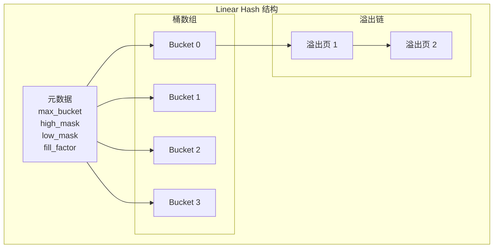
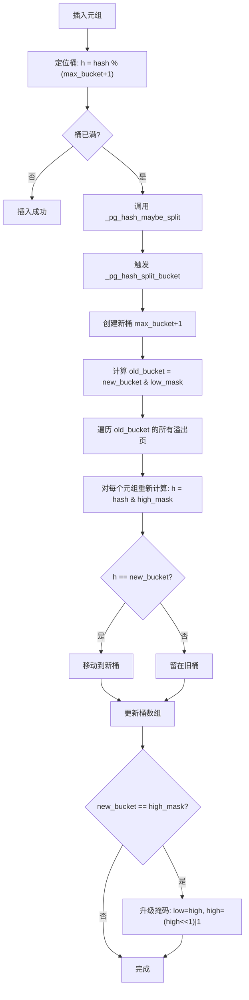
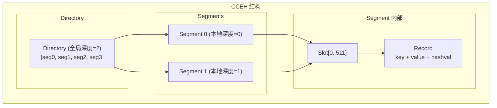
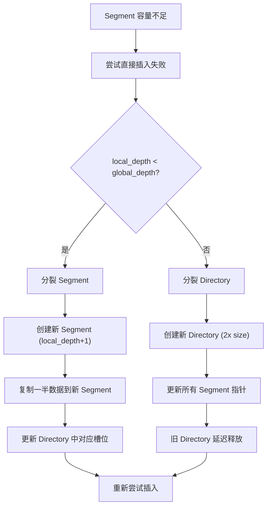
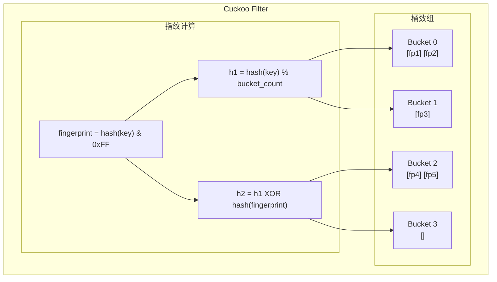
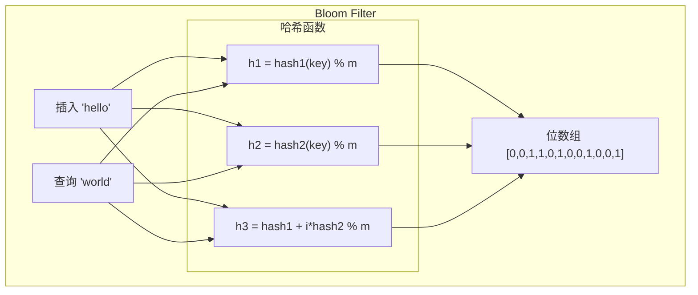
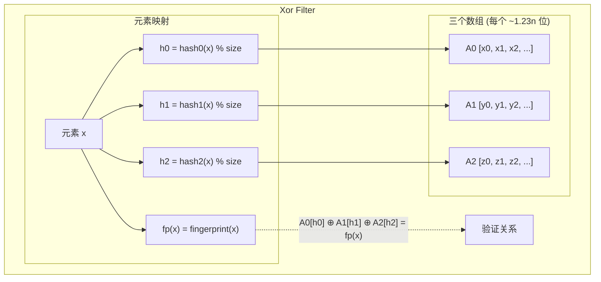

# Hash 索引架构

> 本文档详细说明项目中实现的 5 种 Hash 索引：PG-Linear Hash、CCEH、uckoo Filter、Bloom Filter、Xor Filter，以及它们的分裂/扩容机制。

---

## 1. Hash 索引类型总览

| 类型 | 用途 | 是否支持删除 | 是否支持精确查找 | 空间复杂度 |
|------|------|-------------|----------------|-----------|
| PG-Linear Hash | 数据库主索引 | ✅ | ✅ | O(n) |
| CCEH | 内存索引/持久化 | ✅ | ✅ | O(n) |
| Cuckoo Filter | 近似成员查询 | ✅ | ✅ (假阳性) | ~1.23n bits/项 |
| Bloom Filter | 近似成员查询 | ❌ | ✅ (假阳性) | ~1.44n bits/项 |
| Xor Filter | 近似成员查询 | ❌ | ✅ (假阳性) | ~1.23n bits/项 |

---

## 2. PG-Linear Hash（线性哈希）

### 2.1 原理

PG-Linear Hash 是一种动态扩展的哈希表，通过渐进式分裂实现平滑的容量增长。



### 2.2 核心数据结构

```c
/**
 * Linear Hash 索引
 */
typedef struct pg_hash_t {
    pg_hash_page_t **buckets;       /* 桶数组指针 */
    uint32_t bucket_alloc;          /* 桶数组容量 */
    uint32_t max_bucket;            /* 当前最大桶号（下一个分裂的桶） */
    uint32_t high_mask;             /* 高位掩码 (2^k - 1) */
    uint32_t low_mask;              /* 低位掩码 (2^(k-1) - 1) */
    
    int fill_factor;                /* 填充因子 (%) */
    int n_total;                    /* 总元组数 */
} pg_hash_t;

/**
 * 桶页面
 */
typedef struct pg_hash_page_t {
    uint32_t ntuples;               /* 当前元组数 */
    uint32_t max_tuples;            /* 最大元组数 (PAGE_MAX_ITEMS) */
    pg_hash_tuple_t **tuples;       /* 元组数组 */
    struct pg_hash_page_t *next_overflow;  /* 溢出页链表 */
} pg_hash_page_t;

/**
 * 元组
 */
typedef struct pg_hash_tuple_t {
    uint32_t t_hashval;             /* 哈希值 */
    void *key;                      /* 键 */
    uint32_t keylen;                /* 键长度 */
    void *value;                    /* 值 */
    uint32_t valuelen;              /* 值长度 */
} pg_hash_tuple_t;
```

### 2.3 分裂机制（核心）

Linear Hash 的分裂机制是其精髓：**每次插入后检查是否需要分裂，分裂时只处理一个桶**。



**关键公式：**
```c
/**
 * 计算元组应属于的桶号
 *
 * @param idx 索引
 * @param hashval 元组的哈希值
 * @return 桶号
 */
uint32_t _pg_hash_get_bucket_no(pg_hash_t *idx, uint32_t hashval) {
    uint32_t h = hashval & idx->high_mask;
    
    if (h <= idx->max_bucket) {
        return h;
    }
    
    return hashval & idx->low_mask;
}
```

### 2.4 分裂触发条件

```c
/**
 * _pg_hash_maybe_split — 检查是否需要分裂
 *
 * 触发条件：
 *   n_total * 100 > fill_factor * PAGE_MAX_ITEMS * (max_bucket + 1)
 *
 * 等价于：平均每桶元组数 > fill_factor * PAGE_MAX_ITEMS
 */
void _pg_hash_maybe_split(pg_hash_t *idx) {
    while ((uint64_t)idx->n_total * 100 >
           (uint64_t)idx->fill_factor * PG_HASH_PAGE_MAX_ITEMS * (idx->max_bucket + 1)) {
        if (_pg_hash_split_bucket(idx) != 0) {
            break;  /* OOM，停止分裂 */
        }
    }
}
```

### 2.5 分裂执行详解

```c
/**
 * _pg_hash_split_bucket — 分裂一个桶
 *
 * 步骤：
 * 1. 计算 new_bucket = max_bucket + 1
 * 2. 计算 old_bucket = new_bucket & low_mask
 * 3. 分配新桶的主页面
 * 4. 更新 max_bucket 和掩码
 * 5. 遍历旧桶的所有元组，重新分配
 */
int _pg_hash_split_bucket(pg_hash_t *idx) {
    uint32_t new_bucket = idx->max_bucket + 1;
    uint32_t old_bucket = new_bucket & idx->low_mask;
    
    /* 扩展桶数组 */
    if (new_bucket >= idx->bucket_alloc) {
        uint32_t new_alloc = idx->bucket_alloc * 2;
        _pg_hash_expand_table(idx, new_alloc);
    }
    
    /* 分配新桶的主页面 */
    pg_hash_page_t *new_primary = _pg_hash_page_create(false);
    
    /* 更新元数据（先更新，保证一致性） */
    idx->buckets[new_bucket] = new_primary;
    idx->max_bucket = new_bucket;
    
    /* 掩码升级 */
    if (new_bucket == idx->high_mask) {
        idx->low_mask = idx->high_mask;
        idx->high_mask = (idx->high_mask << 1) | 1u;
    }
    
    /* 重新分配旧桶的元组 */
    pg_hash_page_t *old_new_primary = _pg_hash_page_create(false);
    pg_hash_page_t *old_write = old_new_primary;
    pg_hash_page_t *new_write = new_primary;
    
    pg_hash_page_t *scan = idx->buckets[old_bucket];
    while (scan) {
        for (uint32_t i = 0; i < scan->ntuples; i++) {
            pg_hash_tuple_t *tup = scan->tuples[i];
            
            /* 重新计算桶号 */
            if (_pg_hash_get_bucket_no(idx, tup->t_hashval) == new_bucket) {
                /* 移动到新桶 */
                new_write->tuples[new_write->ntuples++] = tup;
            } else {
                /* 留在旧桶 */
                old_write->tuples[old_write->ntuples++] = tup;
            }
            
            scan->tuples[i] = NULL;  /* 标记已移动 */
        }
        
        pg_hash_page_t *next = scan->next_overflow;
        free(scan);  /* 释放旧页面结构 */
        scan = next;
    }
    
    idx->buckets[old_bucket] = old_new_primary;
    return 0;
}
```

### 2.6 查找流程

```c
/**
 * Linear Hash 查找
 */
void *pg_hash_search(pg_hash_t *idx, const void *key, uint32_t keylen) {
    uint32_t hashval = hash_func(key, keylen);
    uint32_t bucket = _pg_hash_get_bucket_no(idx, hashval);
    
    /* 遍历桶的溢出链 */
    for (pg_hash_page_t *page = idx->buckets[bucket];
         page != NULL;
         page = page->next_overflow) {
        
        for (uint32_t i = 0; i < page->ntuples; i++) {
            pg_hash_tuple_t *tup = page->tuples[i];
            
            if (tup && tup->t_hashval == hashval &&
                tup->keylen == keylen &&
                memcmp(tup->key, key, keylen) == 0) {
                return tup->value;
            }
        }
    }
    
    return NULL;  /* 未找到 */
}
```

---

## 3. CCEH（Concurrent Cuckoo Hashing with Epoch-Based Reclamation）

### 3.1 原理

CCEH 是一种支持高并发的 Cuckoo Hashing 实现，使用 Epoch-Based Reclamation 进行安全内存回收。



### 3.2 核心数据结构

```c
/**
 * CCEH 索引
 */
typedef struct cceh_index_t {
    cceh_directory_t *directory_root;      /* 目录根指针 */
    uint32_t segment_capacity;             /* 每个 Segment 的槽数 */
    atomic_uint segment_count;             /* Segment 数量 */
    atomic_uint n_total;                   /* 总记录数 */
    atomic_uint global_epoch;              /* 全局 Epoch */
    atomic_flag directory_latch;           /* 目录锁 */
} cceh_index_t;

/**
 * 目录
 */
typedef struct cceh_directory_t {
    uint32_t global_depth;                 /* 全局深度 */
    uint32_t size;                         /* 目录大小 (2^global_depth) */
    uint32_t version;                      /* 版本号 */
    cceh_segment_t **segments;             /* Segment 指针数组 */
} cceh_directory_t;

/**
 * Segment（一个桶）
 */
typedef struct cceh_segment_t {
    uint32_t local_depth;                  /* 本地深度 */
    uint32_t capacity;                     /* 槽容量 */
    atomic_uint slot_count;                /* 当前槽数 */
    cceh_slot_t *slots;                    /* 槽数组 */
    atomic_flag latch;                     /* 段锁 */
} cceh_segment_t;

/**
 * 槽
 */
typedef struct cceh_slot_t {
    atomic_uint8_t fingerprint;            /* 指纹 (1 字节) */
    atomic_uintptr_t record_ptr;           /* 记录指针 */
    atomic_uint8_t state;                  /* 状态 EMPTY/LIVE/RECLAIMING */
} cceh_slot_t;

/**
 * 记录
 */
typedef struct cceh_record_t {
    uint32_t hashval;                      /* 哈希值 */
    uint32_t keylen;                       /* 键长度 */
    uint32_t valuelen;                     /* 值长度 */
    void *key;                             /* 键数据 */
    void *value;                           /* 值数据 */
} cceh_record_t;
```

### 3.3 目录分裂机制



### 3.4 插入流程

```c
/**
 * CCEH 插入
 */
int cceh_insert(cceh_index_t *index, const void *key, uint32_t keylen,
                const void *value, uint32_t valuelen) {
    uint32_t hashval = _cceh_hash_func(key, keylen);
    uint8_t fingerprint = _cceh_fingerprint(hashval);
    
    /* 获取目录项 */
    cceh_directory_t *dir = atomic_load(&index->directory_root);
    uint32_t dir_idx = hashval & _cceh_depth_mask(dir->global_depth);
    cceh_segment_t *segment = dir->segments[dir_idx];
    
    /* 尝试在 Segment 中插入 */
    while (true) {
        _cceh_segment_lock(segment);
        
        /* 检查容量 */
        if (!_cceh_segment_has_space(segment)) {
            _cceh_segment_unlock(segment);
            
            /* 需要分裂 */
            if (segment->local_depth < dir->global_depth) {
                /* 本地分裂 */
                _cceh_segment_split(index, segment);
            } else {
                /* 目录分裂 */
                _cceh_directory_double(index);
            }
            
            /* 重新获取目录 */
            dir = atomic_load(&index->directory_root);
            dir_idx = hashval & _cceh_depth_mask(dir->global_depth);
            segment = dir->segments[dir_idx];
            continue;
        }
        
        /* 查找空槽或踢出 */
        int slot_idx = _cceh_segment_find_empty_or_evict(segment, fingerprint);
        
        if (slot_idx >= 0) {
            /* 插入成功 */
            _cceh_segment_store_record(segment, slot_idx, 
                                       hashval, key, keylen, value, valuelen);
            _cceh_segment_unlock(segment);
            
            atomic_fetch_add(&index->n_total, 1);
            return 0;
        }
        
        _cceh_segment_unlock(segment);
    }
}
```

### 3.5 Epoch-Based 并发控制

```c
/**
 * 读线程进入
 */
void _cceh_reader_enter(cceh_index_t *index) {
    cceh_thread_epoch_t *epoch_record = _cceh_thread_epoch_register(index);
    
    /* 记录当前全局 Epoch */
    atomic_store(&epoch_record->epoch,
                 atomic_load(&index->global_epoch),
                 memory_order_release);
    atomic_store(&epoch_record->active, true, memory_order_release);
}

/**
 * 读线程退出
 */
void _cceh_reader_exit(cceh_index_t *index) {
    atomic_store(&epoch_record->active, false, memory_order_release);
}

/**
 * 回收过期资源
 */
void _cceh_reclaim_retired(cceh_index_t *index) {
    uint32_t min_epoch = _cceh_min_active_epoch(index);
    
    /* 回收过期目录 */
    while (index->retired_directories) {
        if (index->retired_directories->retire_epoch < min_epoch) {
            _cceh_directory_drop(index->retired_directories->directory);
        }
    }
    
    /* 回收过期 Segment */
    while (index->retired_segments) {
        if (index->retired_segments->retire_epoch < min_epoch &&
            atomic_load(&segment->pin_count) == 0) {
            _cceh_segment_drop(segment, true);
        }
    }
}
```

---

## 4. Cuckoo Filter（布谷鸟过滤器）

### 4.1 原理

Cuckoo Filter 使用 Cuckoo Hashing 思想，每个元素有两个候选桶位置，通过"踢出"机制实现高空间利用率。



### 4.2 核心数据结构

```c
/**
 * Cuckoo Filter
 */
struct cuckoo_filter {
    cuckoo_bucket_t *buckets;      /* 桶数组 */
    size_t bucket_count;           /* 桶数量 (2 的幂次) */
    size_t item_count;             /* 已添加元素数 */
};

/**
 * 桶（每桶 2 个槽位）
 */
typedef struct cuckoo_bucket_t {
    cuckoo_slot_t slots[2];        /* 两个槽位 */
} cuckoo_bucket_t;

/**
 * 槽位
 */
typedef struct cuckoo_slot_t {
    bool occupied;                 /* 是否占用 */
    uint8_t fingerprint;           /* 指纹 (1 字节) */
} cuckoo_slot_t;
```

### 4.3 插入与踢出机制

```mermaid
flowchart TD
    A["插入 key"] --> B["计算 h1=hash%N, h2=h1⊕fp"]
    B --> C{"h1 位置有空槽?"}
    C -->|是| D["插入成功"]
    C -->|否| E{"h2 位置有空槽?"}
    E -->|是| F["插入到 h2"]
    E -->|否| G["踢出 h1 的元素"]
    
    G --> H["被踢出元素计算 h2"]
    H --> I{"h2 有空槽?"}
    I -->|是| J["被踢出元素移到 h2"]
    I -->|否| K["踢出 h2 的元素"]
    
    K --> L["递归踢出"]
    L --> M["最大踢出次数 500?"}
    M -->|是| N["插入失败"]
    M -->|否| I
    J --> D
```

### 4.4 代码实现

```c
/**
 * Cuckoo 插入
 */
int cuckoo_add(cuckoo_filter_t *filter, const void *key, size_t keylen) {
    uint32_t hash = base_hash(key, keylen);
    uint8_t fp = get_fingerprint(hash);
    size_t h1, h2;
    
    get_buckets(filter, hash, &h1, &h2);
    
    /* 尝试 h1 */
    if (find_empty_slot(&filter->buckets[h1]) >= 0) {
        filter->buckets[h1].slots[slot].occupied = true;
        filter->buckets[h1].slots[slot].fingerprint = fp;
        filter->item_count++;
        return 0;
    }
    
    /* 尝试 h2 */
    if (find_empty_slot(&filter->buckets[h2]) >= 0) {
        // ... 类似
        return 0;
    }
    
    /* 两个位置都满，踢出 */
    if (kick_and_reinsert(filter, &filter->buckets[h1], 0, fp, 0) == 0) {
        filter->item_count++;
        return 0;
    }
    
    return -1;  /* 插入失败 */
}

/**
 * 踢出与重新插入
 */
static int kick_and_reinsert(cuckoo_filter_t *filter,
                             cuckoo_bucket_t *bucket, int slot_idx,
                             uint8_t fingerprint, int depth) {
    if (depth >= CUCKOO_MAX_KICK) {
        return -1;  /* 踢出次数超限 */
    }
    
    uint8_t kicked_fp = bucket->slots[slot_idx].fingerprint;
    
    /* 将新元素放入槽位 */
    bucket->slots[slot_idx].fingerprint = fingerprint;
    
    /* 计算被踢出元素的候选位置 */
    uint32_t kick_hash = (uint32_t)kicked_fp;
    size_t h1, h2;
    get_buckets(filter, kick_hash, &h1, &h2);
    
    cuckoo_bucket_t *other = (bucket == filter->buckets + h1) ?
                              (filter->buckets + h2) : (filter->buckets + h1);
    
    /* 尝试在另一个位置插入 */
    if (try_insert_bucket(other, kicked_fp) == 0) {
        return 0;
    }
    
    /* 递归踢出 */
    return kick_and_reinsert(filter, other, depth % 2, kicked_fp, depth + 1);
}
```

### 4.5 查找与删除

```c
/**
 * Cuckoo 查找
 */
bool cuckoo_query(const cuckoo_filter_t *filter, const void *key, size_t keylen) {
    uint32_t hash = base_hash(key, keylen);
    uint8_t fp = get_fingerprint(hash);
    size_t h1, h2;
    
    get_buckets(filter, hash, &h1, &h2);
    
    /* 在两个候选桶中查找 */
    if (find_slot_with_fingerprint(&filter->buckets[h1], fp) >= 0) {
        return true;
    }
    if (find_slot_with_fingerprint(&filter->buckets[h2], fp) >= 0) {
        return true;
    }
    
    return false;
}

/**
 * Cuckoo 删除
 */
int cuckoo_delete(cuckoo_filter_t *filter, const void *key, size_t keylen) {
    uint32_t hash = base_hash(key, keylen);
    uint8_t fp = get_fingerprint(hash);
    size_t h1, h2;
    
    get_buckets(filter, hash, &h1, &h2);
    
    /* 在 h1 桶中查找并删除 */
    int slot = find_slot_with_fingerprint(&filter->buckets[h1], fp);
    if (slot >= 0) {
        filter->buckets[h1].slots[slot].occupied = false;
        filter->item_count--;
        return 0;
    }
    
    /* 在 h2 桶中查找并删除 */
    slot = find_slot_with_fingerprint(&filter->buckets[h2], fp);
    if (slot >= 0) {
        filter->buckets[h2].slots[slot].occupied = false;
        filter->item_count--;
        return 0;
    }
    
    return 1;  /* 元素不存在 */
}
```

---

## 5. Bloom Filter（布隆过滤器）

### 5.1 原理

Bloom Filter 使用 k 个哈希函数将元素映射到位数组的 k 个位置，实现 O(1) 空间的近似成员查询。



### 5.2 核心参数计算

```c
/**
 * 计算最优位数组大小
 * 公式: m = -n * ln(p) / (ln(2)^2)
 */
static size_t optimal_size(size_t n, double p) {
    double m = -((double)n * log(p)) / 0.4804530139182014;
    size_t size = (size_t)ceil(m);
    return (size + 7) & ~((size_t)7);  /* 对齐到 8 */
}

/**
 * 计算最优哈希函数数量
 * 公式: k = (m/n) * ln(2)
 */
static size_t optimal_hash_count(size_t n, size_t m) {
    double k = ((double)m / (double)n) * 0.6931471805599453;
    return (size_t)ceil(k);
}

/**
 * 双哈希法生成 k 个哈希值
 * h(i) = h1 + i * h2 mod m
 */
static void double_hash(const bloom_filter_t *filter,
                        const void *key, size_t keylen,
                        size_t *indices) {
    uint32_t h1 = fnv_1a_hash(key, keylen);
    uint32_t h2 = fnv_1a_hash(key + keylen/2, keylen/2);
    
    for (size_t i = 0; i < filter->hash_count; i++) {
        indices[i] = (size_t)((h1 + (uint64_t)i * h2) % filter->size);
    }
}
```

### 5.3 特性分析

| 特性 | 说明 |
|------|------|
| 假阴性 | 不可能（存在的一定能查到） |
| 假阳性 | 可能（不存在但查到） |
| 删除操作 | 不支持 |
| 空间节省 | ~1.44 bits/项（1% 假阳性率） |

---

## 6. Xor Filter（异或过滤器）

### 6.1 原理

Xor Filter 使用三个数组 A0、A1、A2，通过 XOR 运算实现空间高效的概率数据结构。



### 6.2 构造算法

```c
/**
 * Xor Filter 构造（贪婪算法）
 *
 * 核心思想：找出只在一个位置出现的元素，优先分配
 */
static int construct_filter(xor_filter_t *filter) {
    size_t n = filter->item_count;
    size_t size = filter->size;
    
    /* 初始化位置计数器 */
    size_t *counter0 = calloc(size, sizeof(size_t));
    size_t *counter1 = calloc(size, sizeof(size_t));
    size_t *counter2 = calloc(size, sizeof(size_t));
    
    for (size_t i = 0; i < n; i++) {
        counter0[filter->h0_positions[i]]++;
        counter1[filter->h1_positions[i]]++;
        counter2[filter->h2_positions[i]]++;
    }
    
    /* 贪婪分配 */
    size_t assigned = 0;
    bool changed = true;
    
    while (assigned < n && changed) {
        changed = false;
        
        for (size_t i = 0; i < n; i++) {
            if (elements[i].assigned) continue;
            
            int array_idx = -1;
            uint32_t pos = 0;
            
            /* 找只有一个候选位置的元素 */
            if (counter0[elements[i].h0] == 1) {
                array_idx = 0;
                pos = elements[i].h0;
            } else if (counter1[elements[i].h1] == 1) {
                array_idx = 1;
                pos = elements[i].h1;
            } else if (counter2[elements[i].h2] == 1) {
                array_idx = 2;
                pos = elements[i].h2;
            }
            
            if (array_idx >= 0) {
                /* 分配元素 */
                elements[i].assigned = true;
                assigned++;
                changed = true;
                
                /* XOR 指纹到对应位置 */
                filter->arrays[array_idx][pos] ^= elements[i].fingerprint;
                
                /* 更新计数器 */
                for (size_t j = 0; j < n; j++) {
                    if (elements[j].assigned) continue;
                    if (elements[j].h0 == pos) counter0[pos]--;
                    if (elements[j].h1 == pos) counter1[pos]--;
                    if (elements[j].h2 == pos) counter2[pos]--;
                }
            }
        }
    }
    
    return (assigned < n) ? -1 : 0;  /* 构造失败返回 -1 */
}
```

### 6.3 查询验证

```c
/**
 * Xor Filter 查询
 *
 * 验证: A0[h0] ⊕ A1[h1] ⊕ A2[h2] == fp(x)
 */
bool xor_filter_query(const xor_filter_t *filter, const void *key, size_t keylen) {
    uint32_t h0, h1, h2;
    uint32_t fp;
    
    get_positions(filter, key, keylen, &h0, &h1, &h2);
    fp = get_fingerprint(key, keylen);
    
    /* XOR 解码 */
    uint32_t xored = filter->arrays[0][h0] ^ 
                     filter->arrays[1][h1] ^ 
                     filter->arrays[2][h2];
    
    return xored == fp;
}
```

---

## 7. Hash 索引对比总结

### 7.1 特性对比

| 特性 | PG-Linear Hash | CCEH | Cuckoo Filter | Bloom Filter | Xor Filter |
|------|---------------|------|---------------|--------------|------------|
| 精确查找 | ✅ | ✅ | ✅ | ✅ | ✅ |
| 支持删除 | ✅ | ✅ | ✅ | ❌ | ❌ |
| 并发安全 | ❌ | ✅ | ❌ | ❌ | ❌ |
| 持久化 | ✅ | ✅ | ❌ | ❌ | ❌ |
| 空间效率 | 中 | 中 | 高 | 高 | 最高 |
| 分裂/扩容 | 渐进 | 目录倍增 | 重建 | N/A | N/A |

### 7.2 使用场景

| 场景 | 推荐索引 |
|------|----------|
| 数据库主索引 | PG-Linear Hash |
| 高并发内存索引 | CCEH |
| 缓存层去重 | Cuckoo Filter |
| 快速存在性检查 | Bloom Filter |
| 空间最优的成员查询 | Xor Filter |

### 7.3 面试知识点

**Q: Linear Hash 为什么渐进分裂而不是一次性扩展？**
> A: 避免一次性扩展带来的性能尖刺。渐进分裂保证每次分裂只影响一个桶，整体时间复杂度平滑。

**Q: Cuckoo Filter 的踢出机制有什么好处？**
> A: 1) 保证高空间利用率（>95%）；2) 插入时间均摊 O(1)；3) 支持动态扩容。

**Q: Bloom Filter 能删除元素吗？为什么？**
> A: 不能。因为多个元素可能共享同一位，清除会导致其他元素出现假阴性。

**Q: Xor Filter 的构造可能失败吗？**
> A: 可能。当贪婪算法无法分配所有元素时会失败，需要重新分配或增加数组大小。

---

*文档版本: v2.0*
*最后更新: 2026-07-12*
