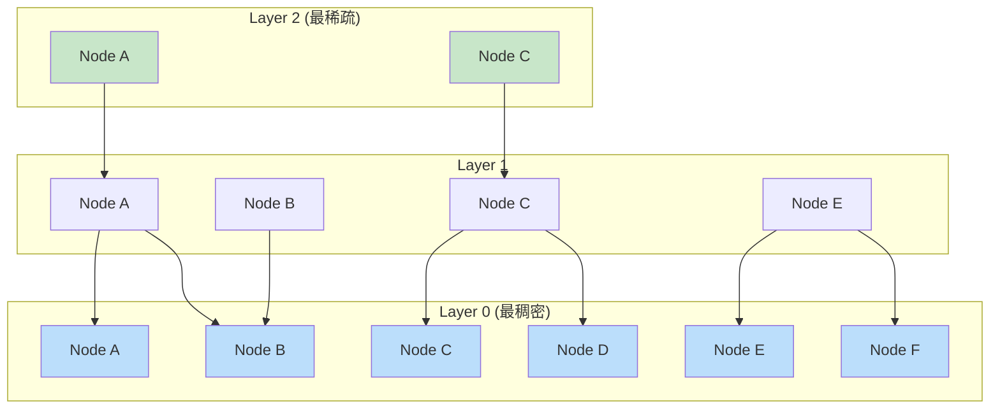
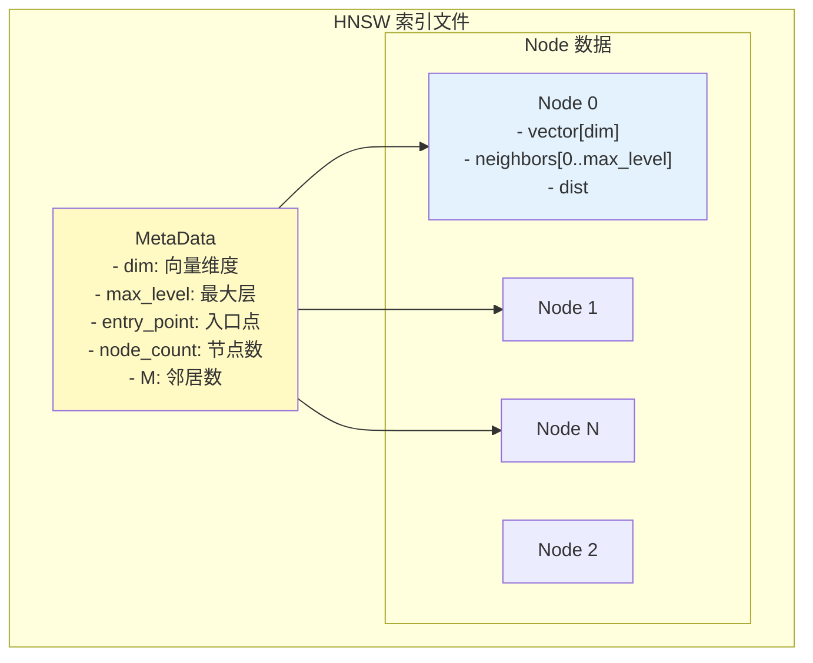
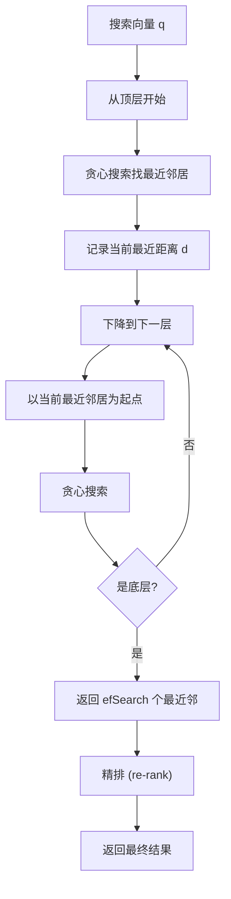
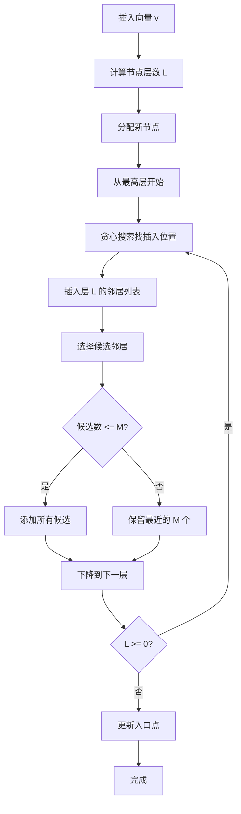
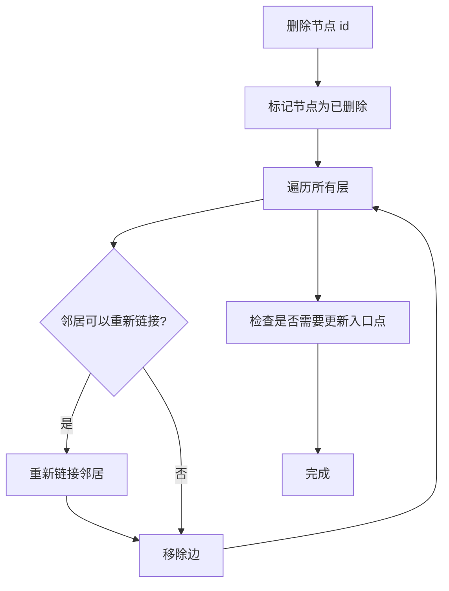

# HNSW 索引架构

> 本文档详细说明 Hierarchical Navigable Small World (HNSW) 向量索引的原理、存储结构和增删改查逻辑。

---

## 1. 原理

### 1.1 什么是 HNSW

HNSW 是一种基于图的近似最近邻（ANN）搜索算法，通过构建多层跳表结构实现高效的向量检索。

**核心思想：**
- 构建多层图，上层稀疏、下层稠密
- 从顶层开始，快速定位大致区域
- 逐层向下精确定位
- 使用贪心搜索找到最近邻

### 1.2 核心概念



| 参数 | 说明 | 推荐值 |
|------|------|--------|
| M | 每层每个节点的最大邻居数 | 16-64 |
| efConstruction | 构建时搜索范围 | 100-400 |
| efSearch | 搜索时搜索范围 | 50-1000 |
| maxLevel | 最大层数 | log(1/n) 概率决定 |

### 1.3 为什么 HNSW 快速

1. **分层结构**：上层跳过大部分节点
2. **小世界图**：平均路径长度短（类似六度分隔）
3. **贪心搜索**：每步选择最近的邻居
4. **可调精度**：通过 efSearch 平衡速度和精度

---

## 2. 存储结构

### 2.1 整体结构



### 2.2 节点结构

```c
/**
 * HNSW 节点
 */
typedef struct HNSWNode {
    uint64_t id;                    // 节点唯一 ID
    float *vector;                  // 向量数据
    uint16_t level;                 // 节点所在最大层

    // 每层邻居列表（动态大小）
    HNSWNeighbors {
        uint64_t *neighbors;        // 邻居节点 ID 数组
        float *distances;           // 到邻居的距离数组
        uint16_t count;             // 当前邻居数
        uint16_t capacity;          // 邻居数组容量
    } levels[max_level + 1];
} HNSWNode;

/**
 * 元数据
 */
typedef struct HNSWMeta {
    uint32_t dim;                   // 向量维度
    uint32_t M;                     // 每个节点的邻居数
    uint32_t efConstruction;        // 构建参数
    uint32_t max_level;             // 当前最大层
    uint64_t entry_point;           // 入口节点 ID
    uint64_t node_count;            // 总节点数
    uint64_t entry_level;           // 入口节点所在层
} HNSWMeta;

/**
 * 距离计算函数类型
 */
typedef float (*distance_func_t)(const float *a, const float *b, uint32_t dim);

/**
 * 支持的距离度量
 */
typedef enum DistanceMetric {
    METRIC_L2,     // 欧氏距离
    METRIC_COSINE, // 余弦相似度
    METRIC_IP       // 内积（点积）
} DistanceMetric;
```

### 2.3 页面布局

```
┌────────────────────────────────────────────────────────────┐
│                 HNSW 索引文件                               │
├────────────────────────────────────────────────────────────┤
│ MetaPage (8192 bytes)                                      │
│  - dim: 128                                               │
│  - M: 16                                                  │
│  - efConstruction: 200                                    │
│  - max_level: 12                                          │
│  - entry_point_id: 999999                                 │
│  - node_count: 1000000                                    │
├────────────────────────────────────────────────────────────┤
│ Node Data Pages (多个)                                     │
│  ┌────────────────────────────────────────────────────┐   │
│  │ PageHeader                                          │   │
│  │ Node[0]: id, level, vector[dim], neighbors[]       │   │
│  │ Node[1]: ...                                       │   │
│  │ ...                                                 │   │
│  └────────────────────────────────────────────────────┘   │
├────────────────────────────────────────────────────────────┤
│ Neighbor Lists (可选分离存储)                              │
│  - 用于优化大邻居列表的存储                                 │
└────────────────────────────────────────────────────────────┘
```

---

## 3. 增删改查逻辑

### 3.1 搜索（Search）



**搜索算法伪代码：**
```c
/**
 * HNSW 搜索
 *
 * @param index HNSW 索引
 * @param query 查询向量
 * @param k 返回最近邻数量
 * @param ef 搜索范围（越大越精确）
 * @return k 个最近邻的 (id, distance) 列表
 */
HNSWResult *hnsw_search(HNSWIndex *index, const float *query,
                        uint32_t k, uint32_t ef) {
    uint32_t dim = index->meta->dim;
    distance_func_t dist_func = get_distance_func(index->metric);

    // 如果索引为空，返回空结果
    if (index->meta->node_count == 0) {
        return NULL;
    }

    // 1. 从顶层开始，贪心搜索找到入口点
    uint64_t curr = index->meta->entry_point;
    uint64_t level = index->meta->entry_level;

    for (int l = level; l > 0; l--) {
        float best_dist = dist_func(query, get_node_vector(index, curr), dim);
        bool changed = true;

        while (changed) {
            changed = false;
            HNSWNode *node = get_node(index, curr);

            // 遍历当前层的所有邻居
            for (uint32_t i = 0; i < node->levels[l].count; i++) {
                uint64_t neighbor_id = node->levels[l].neighbors[i];
                float d = dist_func(query, get_node_vector(index, neighbor_id), dim);

                if (d < best_dist) {
                    best_dist = d;
                    curr = neighbor_id;
                    changed = true;
                }
            }
        }
    }

    // 2. 底层搜索，维护 ef 个候选
    // 使用优先队列（最小堆）按距离排序
    PriorityQueue *candidates = pq_create(ef);
    PriorityQueue *visited = pq_create(ef * 2);  // 避免重复访问

    pq_push(candidates, curr, best_dist);
    pq_push(visited, curr, best_dist);

    float bound = best_dist;  // 最远候选的距离

    // 3. 贪心搜索 + 候选队列
    while (!pq_empty(candidates)) {
        // 取出最远的候选
        uint64_t curr_id;
        float curr_dist;
        pq_pop(candidates, &curr_id, &curr_dist);

        // 如果当前候选比最远结果还远，可以停止
        if (curr_dist > bound) {
            break;
        }

        HNSWNode *curr_node = get_node(index, curr_id);

        // 检查当前节点的邻居
        for (uint32_t i = 0; i < curr_node->levels[0].count; i++) {
            uint64_t neighbor_id = curr_node->levels[0].neighbors[i];
            float d = dist_func(query, get_node_vector(index, neighbor_id), dim);

            // 检查是否访问过
            if (pq_contains(visited, neighbor_id)) {
                continue;
            }
            pq_push(visited, neighbor_id, d);

            // 如果比最远结果好，加入候选队列
            if (d < bound || pq_size(candidates) < ef) {
                pq_push(candidates, neighbor_id, d);
                if (pq_size(candidates) > ef) {
                    pq_pop(candidates, NULL, &bound);  // 更新边界
                }
            }
        }
    }

    // 4. 提取 top-k 结果
    HNSWResult *results = malloc(sizeof(HNSWResult) * k);
    for (uint32_t i = 0; i < k && !pq_empty(candidates); i++) {
        pq_pop(candidates, &results[i].id, &results[i].distance);
    }

    pq_destroy(candidates);
    pq_destroy(visited);

    return results;
}
```

### 3.2 插入（Insert）



**插入算法伪代码：**
```c
/**
 * HNSW 插入
 */
int hnsw_insert(HNSWIndex *index, uint64_t id, const float *vector) {
    uint32_t dim = index->meta->dim;
    uint32_t M = index->meta->M;
    uint32_t efConstruction = index->meta->efConstruction;
    distance_func_t dist_func = get_distance_func(index->metric);

    // 1. 计算新节点的层数（概率衰减）
    uint32_t level = hnsw_random_level(index);

    // 2. 分配新节点
    HNSWNode *node = hnsw_node_create(id, vector, level);

    // 3. 如果是第一个节点，直接设为入口点
    if (index->meta->node_count == 0) {
        index->meta->entry_point = id;
        index->meta->entry_level = level;
        index->meta->max_level = level;
        save_node(index, node);
        index->meta->node_count++;
        save_meta(index);
        return 0;
    }

    // 4. 从顶层开始，逐层插入
    uint64_t curr = index->meta->entry_point;
    uint64_t curr_level = index->meta->entry_level;

    // 存储每层的搜索路径（用于插入邻居）
    SearchPath *paths = malloc(sizeof(SearchPath) * (level + 1));

    for (int l = curr_level; l > level; l--) {
        // 贪心搜索到目标层
        curr = hnsw_greedy_search_layer(index, vector, curr, l);
        paths[l].ep = curr;
    }

    // 5. 在目标层及以下插入
    for (int l = level; l >= 0; l--) {
        // 贪心搜索获取候选
        PriorityQueue *candidates = hnsw_search_layer(index, vector,
                                                      curr, l, efConstruction);

        // 选择 M 个最近邻居
        PriorityQueue *neighbors = pq_create(M);

        while (!pq_empty(candidates) && pq_size(neighbors) < M) {
            uint64_t neighbor_id;
            float dist;
            pq_pop(candidates, &neighbor_id, &dist);
            pq_push(neighbors, neighbor_id, dist);
        }

        // 添加双向边
        while (!pq_empty(neighbors)) {
            uint64_t neighbor_id;
            float dist;
            pq_pop(neighbors, &neighbor_id, &dist);

            // 新节点 -> 邻居
            hnsw_add_neighbor(node, l, neighbor_id, dist);

            // 邻居 -> 新节点（检查邻居的邻居数）
            HNSWNode *neighbor = get_node(index, neighbor_id);
            if (neighbor->levels[l].count >= M) {
                // 需要剪枝：重新选择 M 个最近
                hnsw_select_neighbors(neighbor, l, M);
            }
            hnsw_add_neighbor(neighbor, l, id, dist);
            save_node(index, neighbor);
        }

        // 更新当前节点为搜索结果中的最近点
        curr = paths[l].ep;

        pq_destroy(candidates);
        pq_destroy(neighbors);
    }

    // 6. 更新入口点（如果新节点层更高）
    if (level > index->meta->entry_level) {
        index->meta->entry_point = id;
        index->meta->entry_level = level;
    }
    index->meta->max_level = max(index->meta->max_level, level);
    index->meta->node_count++;

    save_node(index, node);
    save_meta(index);

    free(paths);
    return 0;
}

/**
 * 计算节点的随机层数
 * 概率：P(L) = exp(-L / lambda) * (1 - exp(-1/lambda))
 * 通常简化为：P(L) = 1/M^L
 */
uint32_t hnsw_random_level(HNSWIndex *index) {
    uint32_t max_level = index->meta->max_level;
    float r = (float)rand() / RAND_MAX;
    uint32_t level = 0;

    while (r > 0.0f && level < max_level + 1) {
        r -= 1.0f / pow(index->meta->M, level);
        level++;
    }

    return level > 0 ? level - 1 : 0;
}

/**
 * 选择最近的 M 个邻居
 */
void hnsw_select_neighbors(HNSWNode *node, uint32_t level, uint32_t M) {
    // 获取当前邻居和它们的距离
    uint32_t count = node->levels[level].count;

    if (count <= M) return;

    // 简单选择：冒泡排序取最近的 M 个
    for (uint32_t i = 0; i < count - 1; i++) {
        for (uint32_t j = 0; j < count - i - 1; j++) {
            if (node->levels[level].distances[j] >
                node->levels[level].distances[j + 1]) {
                // 交换
                swap(&node->levels[level].neighbors[j],
                     &node->levels[level].neighbors[j + 1]);
                swap(&node->levels[level].distances[j],
                     &node->levels[level].distances[j + 1]);
            }
        }
    }

    // 移除多余的邻居
    node->levels[level].count = M;
}
```

### 3.3 删除（Delete）



**删除算法伪代码：**
```c
/**
 * HNSW 删除
 */
int hnsw_delete(HNSWIndex *index, uint64_t id) {
    HNSWNode *node = get_node(index, id);
    if (node == NULL) {
        return -1;  // 节点不存在
    }

    uint32_t level = node->level;

    // 1. 从每一层移除该节点的边
    for (int l = level; l >= 0; l--) {
        // 获取该节点的邻居
        for (uint32_t i = 0; i < node->levels[l].count; i++) {
            uint64_t neighbor_id = node->levels[l].neighbors[i];
            HNSWNode *neighbor = get_node(index, neighbor_id);

            // 从邻居的邻居列表中移除当前节点
            hnsw_remove_neighbor(neighbor, l, id);

            // 检查是否需要修复（邻居数过少）
            if (neighbor->levels[l].count < index->meta->M / 2) {
                // 重新选择邻居
                hnsw_renumber_neighbor(index, neighbor, l);
            }

            save_node(index, neighbor);
        }
    }

    // 2. 标记节点为已删除
    node->deleted = true;
    save_node(index, node);

    // 3. 如果是入口点，需要更新
    if (id == index->meta->entry_point) {
        hnsw_update_entry_point(index);
    }

    index->meta->node_count--;
    save_meta(index);

    return 0;
}

/**
 * 更新入口点
 */
void hnsw_update_entry_point(HNSWIndex *index) {
    // 找到最高层的任意节点
    // 简化：从最高层找到任意一个未删除节点
    uint64_t new_entry = HNSW_INVALID_ID;
    uint32_t new_level = 0;

    // 遍历所有节点找最高层未删除的
    for (uint64_t i = 0; i < index->meta->node_count; i++) {
        HNSWNode *node = get_node(index, i);
        if (!node->deleted && node->level > new_level) {
            new_entry = node->id;
            new_level = node->level;
        }
    }

    index->meta->entry_point = new_entry;
    index->meta->entry_level = new_level;
}
```

---

## 4. 距离计算

### 4.1 常用距离度量

```c
/**
 * L2 距离（欧氏距离）
 */
float distance_l2(const float *a, const float *b, uint32_t dim) {
    float sum = 0.0f;
    for (uint32_t i = 0; i < dim; i++) {
        float diff = a[i] - b[i];
        sum += diff * diff;
    }
    return sqrtf(sum);
}

/**
 * 余弦距离
 */
float distance_cosine(const float *a, const float *b, uint32_t dim) {
    float dot = 0.0f;
    float norm_a = 0.0f;
    float norm_b = 0.0f;

    for (uint32_t i = 0; i < dim; i++) {
        dot += a[i] * b[i];
        norm_a += a[i] * a[i];
        norm_b += b[i] * b[i];
    }

    return 1.0f - dot / (sqrtf(norm_a) * sqrtf(norm_b));
}

/**
 * 内积（用于归一化向量）
 */
float distance_ip(const float *a, const float *b, uint32_t dim) {
    float dot = 0.0f;
    for (uint32_t i = 0; i < dim; i++) {
        dot += a[i] * b[i];
    }
    return -dot;  // 返回负的内积（因为要找最小值）
}

/**
 * 优化：SIMD 加速的 L2 距离
 */
float distance_l2_simd(const float *a, const float *b, uint32_t dim) {
    float sum[4] = {0.0f, 0.0f, 0.0f, 0.0f};

    uint32_t i = 0;
    // SIMD 处理（假设 dim 是 4 的倍数）
    for (; i + 3 < dim; i += 4) {
        __m128 va = _mm_loadu_ps(a + i);
        __m128 vb = _mm_loadu_u ps(b + i);
        __m128 diff = _mm_sub_ps(va, vb);
        __m128 sq = _mm_mul_ps(diff, diff);
        __m128 s = _mm_loadu_ps(sum);
        s = _mm_add_ps(s, sq);
        _mm_storeu_ps(sum, s);
    }

    float result = sum[0] + sum[1] + sum[2] + sum[3];

    // 处理剩余元素
    for (; i < dim; i++) {
        float diff = a[i] - b[i];
        result += diff * diff;
    }

    return sqrtf(result);
}
```

---

## 5. 参数调优

### 5.1 参数说明

| 参数 | 影响 | 推荐值 | 说明 |
|------|------|--------|------|
| M | 召回率/内存 | 16-64 | 邻居数，越大召回越高但内存越大 |
| efConstruction | 构建时间/召回率 | 100-400 | 构建时搜索范围 |
| efSearch | 查询时间/召回率 | 50-1000 | 查询时搜索范围 |
| dim | - | 按需 | 向量维度，越高内存越大 |
| max_elements | - | 按需 | 预估数据量 |

### 5.2 性能基准

```
数据集: SIFT-1M (128 维, 100 万向量)
硬件: Intel i7-8700K, 64GB RAM

配置: M=16, efConstruction=200
构建时间: ~5 分钟
索引大小: ~2.5 GB

efSearch=10:  QPS=50000, 召回率=0.85
efSearch=50:  QPS=15000, 召回率=0.95
efSearch=200: QPS=5000,  召回率=0.98
efSearch=500: QPS=2000,  召回率=0.99
```

---

## 6. 面试知识点

### 6.1 常见问题

| 问题 | 答案要点 |
|------|----------|
| HNSW 的时间复杂度？ | 构建 O(n log n)，搜索 O(log n) 到 O(n) |
| HNSW vs IVF-PQ？ | HNSW 精度高但内存大；IVF-PQ 内存小但精度低 |
| 为什么用多层结构？ | 加速搜索：上层跳过大部分节点 |
| ef 参数的作用？ | 控制搜索范围，越大越精确但越慢 |
| M 参数的选择？ | 平衡精度和内存，通常 16-64 |
| 如何处理删除？ | 标记删除 + 延迟重建（避免图结构破坏） |

### 6.2 进阶问题

**Q: HNSW 的搜索一定能找到最近邻吗？**
> A: 不一定。贪心搜索是近似算法，不保证全局最优。但在实践中，如果参数设置合理（efSearch 足够大），召回率可以接近 1.0。

**Q: 如何在大规模数据中使用 HNSW？**
> A: 1) 分片：将数据分成多个 HNSW 分片；2) 层次聚类：先用 IVF 聚类，再在每个簇内建 HNSW；3) 增量索引：支持增量插入新数据。

**Q: HNSW 与 IVF-PQ 如何选择？**
> A: HNSW 适合：内存充足、精度要求高、查询延迟敏感。IVF-PQ 适合：内存受限、数据量大、可接受一定精度损失。也可以组合使用：IVF 做粗排，HNSW 做精排。

---

*文档版本: v1.0*
*最后更新: 2026-07-12*
