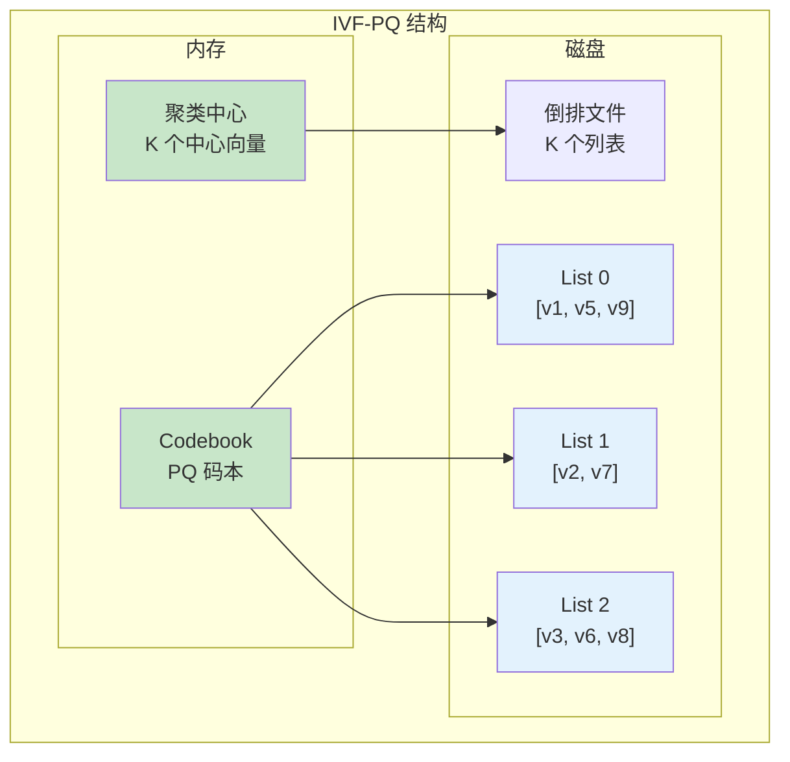
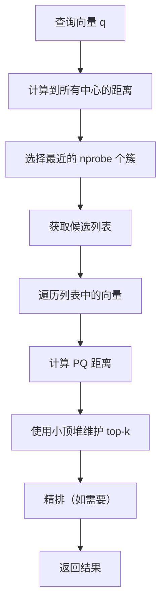

# IVF-PQ 索引架构

> 本文档详细说明 IVF-PQ（Inverted File with Product Quantization）索引的原理、存储结构和增删改查逻辑。

---

## 1. 原理

### 1.1 什么是 IVF-PQ

IVF-PQ 是一种混合索引结构，结合了倒排索引（IVF）和乘积量化（PQ）。

**核心思想：**
- 使用聚类将向量分成多个簇
- 每个簇对应一个倒排列表
- 列表中存储量化的向量
- 搜索时只扫描相关簇

### 1.2 IVF-PQ 结构



---

## 2. 存储结构

### 2.1 核心结构

```c
/**
 * IVF-PQ 索引
 */
typedef struct IVFPQIndex {
    uint32_t    dimension;          // 向量维度
    uint32_t    num_centroids;      // 聚类中心数 K
    uint32_t    num_subvectors;     // PQ 子向量数
    uint32_t    bits_per_code;      // 每个码字的位数
    uint32_t    pq_bytes;           // PQ 编码后字节数

    // 聚类中心
    float      *centroids;          // [K * dimension]

    // PQ 码本
    PQCodebook *codebook;

    // 倒排列表
    InvertedList *inverted_lists;   // [K] 个倒排列表
} IVFPQIndex;

/**
 * 倒排列表
 */
typedef struct InvertedList {
    uint32_t    count;              // 向量数量
    uint32_t    capacity;           // 容量
    uint8_t    *codes;              // PQ 编码的向量 [count * pq_bytes]
    uint64_t   *ids;                // 原始向量 ID [count]
} InvertedList;

/**
 * PQ 码本
 */
typedef struct PQCodebook {
    uint32_t    num_subvectors;     // 子向量数
    uint32_t    sub_dim;            // 子向量维度 (dim / num_subvectors)
    uint32_t    num_codes;          // 码字数 (2^bits_per_code)
    float      *centroids;          // [num_subvectors * num_codes * sub_dim]
} PQCodebook;
```

---

## 3. 搜索逻辑

### 3.1 搜索流程



### 3.2 搜索算法

```c
/**
 * IVF-PQ 搜索
 */
IVFPQResult *ivfpq_search(IVFPQIndex *index, const float *query,
                          int k, int nprobe) {
    uint32_t dim = index->dimension;
    uint32_t K = index->num_centroids;

    // 1. 计算查询到所有中心的距离
    float *center_dists = malloc(K * sizeof(float));
    for (uint32_t i = 0; i < K; i++) {
        center_dists[i] = distance_l2(query, &index->centroids[i * dim], dim);
    }

    // 2. 找到最近的 nprobe 个簇
    uint32_t *best_centroids = malloc(nprobe * sizeof(uint32_t));
    find_top_k(center_dists, K, best_centroids, nprobe);

    // 3. 初始化优先队列
    PriorityQueue *results = pq_create(k);

    // 4. 遍历选中的簇
    for (int p = 0; p < nprobe; p++) {
        uint32_t centroid_id = best_centroids[p];
        InvertedList *list = &index->inverted_lists[centroid_id];

        // 计算查询到所有码字的距离
        float *code_dists = pq_compute_all_distances(query, index->codebook);

        // 遍历列表中的向量
        for (uint32_t i = 0; i < list->count; i++) {
            uint8_t *code = &list->codes[i * index->pq_bytes];

            // 计算 PQ 距离
            float dist = pq_distance_from_code(code, code_dists, index->codebook);

            // 更新结果
            pq_push_with_id(results, list->ids[i], dist);
            if (pq_size(results) > k) {
                pq_pop(results, NULL, NULL);
            }
        }

        free(code_dists);
    }

    // 5. 提取结果
    IVFPQResult *final_results = malloc(sizeof(IVFPQResult) * k);
    for (int i = 0; i < k && !pq_empty(results); i++) {
        pq_pop(results, &final_results[i].id, &final_results[i].distance);
    }

    free(center_dists);
    free(best_centroids);
    pq_destroy(results);

    return final_results;
}

/**
 * PQ 距离计算优化
 */
float *pq_compute_all_distances(const float *query, PQCodebook *codebook) {
    uint32_t num_sv = codebook->num_subvectors;
    uint32_t sub_dim = codebook->sub_dim;
    uint32_t num_codes = codebook->num_codes;

    float *dists = malloc(num_sv * num_codes * sizeof(float));

    for (uint32_t s = 0; s < num_sv; s++) {
        // 提取查询向量的子向量
        float query_sub[sub_dim];
        memcpy(query_sub, query + s * sub_dim, sub_dim * sizeof(float));

        // 计算到所有码字的距离
        for (uint32_t c = 0; c < num_codes; c++) {
            float *centroid = &codebook->centroids[(s * num_codes + c) * sub_dim];
            dists[s * num_codes + c] = distance_l2(query_sub, centroid, sub_dim);
        }
    }

    return dists;
}
```

---

## 4. 面试知识点

| 问题 | 答案要点 |
|------|----------|
| IVF-PQ 的搜索流程？ | 聚类 → 选簇 → 扫描列表 → PQ 距离 |
| nprobe 参数的作用？ | 控制搜索的簇数量，越大越精确越慢 |
| 为什么用 PQ？ | 压缩向量，减少内存和计算开销 |
| IVF-PQ vs HNSW？ | IVF-PQ 内存小但精度低；HNSW 精度高但内存大 |

---

*文档版本: v1.0*
*最后更新: 2026-07-12*
