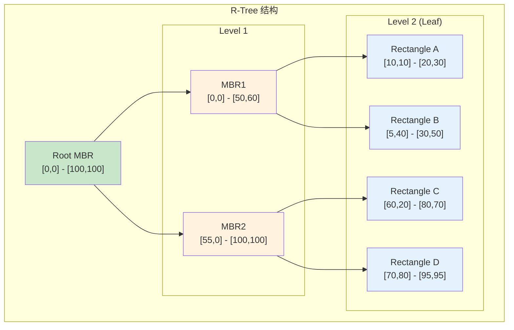

# R-Tree 索引架构

> 本文档详细说明 R-Tree 索引的原理、存储结构和增删改查逻辑。R-Tree 是用于空间数据（几何对象、地理数据）的专用索引。

---

## 1. 原理

### 1.1 什么是 R-Tree

R-Tree 是一种用于索引多维空间数据的数据结构，将空间对象组织成嵌套的最小外接矩形（MBR）。

**核心思想：**
- 每个节点对应一个 MBR（最小外接矩形）
- 父节点的 MBR 包含所有子节点的 MBR
- 叶子节点存储实际的空间对象
- 保持树平衡（所有叶子在同一层）

### 1.2 R-Tree vs B+Tree

| 特性 | B+Tree | R-Tree |
|------|--------|--------|
| 数据维度 | 1 维 | 多维 |
| 查询类型 | 等值、范围 | 空间包含、相交、最近邻 |
| 节点形状 | 区间 | 矩形/多维框 |
| 分裂策略 | 按值分裂 | 按空间分裂 |

### 1.3 R-Tree 结构



---

## 2. 存储结构

### 2.1 节点结构

```c
/**
 * 矩形（MBR）
 */
typedef struct RTreeRect {
    int         dimensions;         // 维度数
    float       coords[1];          // [min0, max0, min1, max1, ...]
} RTreeRect;

/**
 * R-Tree 节点
 */
typedef struct RTreeNode {
    bool        is_leaf;            // 是否叶子节点
    int         count;              // 子节点数量
    int         max_count;          // 最大子节点数
    RTreeRect  *mbr;                // 本节点的 MBR
    RTreeNodeEntry entries[1];      // 子节点条目（变长）
} RTreeNode;

/**
 * 节点条目
 */
typedef struct RTreeNodeEntry {
    RTreeRect  *mbr;                // 子节点的 MBR
    union {
        RTreeNode *child;           // 内部节点：子节点指针
        RTreeLeafEntry *leaf;       // 叶子节点：实际对象
    } ptr;
} RTreeNodeEntry;

/**
 * 叶子条目（存储实际对象）
 */
typedef struct RTreeLeafEntry {
    RTreeRect  *mbr;                // 对象的 MBR
    ItemPointer heap_ptr;           // 指向堆元组的指针
} RTreeLeafEntry;

/**
 * 节点容量
 */
#define RTREE_FILL_FACTOR   0.7     // 填充因子
#define RTREE_MAX_ENTRIES   100     // 最大条目数
#define RTREE_MIN_ENTRIES   50      // 最小条目数（用于再平衡）
```

---

## 3. 增删改查逻辑

### 3.1 插入

```c
/**
 * R-Tree 插入
 */
int rtree_insert(RTree *tree, RTreeRect *rect, ItemPointer heap_ptr) {
    // 1. 选择最佳叶子节点（面积增量最小）
    RTreeNode *leaf = rtree_choose_leaf(tree, rect);

    // 2. 在叶子节点插入
    rtree_insert_into_node(leaf, rect, heap_ptr);

    // 3. 自底向上调整树
    rtree_condense_tree(tree, leaf);

    return 0;
}

/**
 * 选择最佳叶子节点
 */
RTreeNode *rtree_choose_leaf(RTree *tree, RTreeRect *rect) {
    RTreeNode *node = tree->root;

    while (!node->is_leaf) {
        float best_area_inc = INFINITY;
        RTreeNode *best_child = NULL;

        // 遍历所有子节点，找面积增量最小的
        for (int i = 0; i < node->count; i++) {
            RTreeNodeEntry *entry = &node->entries[i];
            float area_inc = rtree_area_increase(entry->mbr, rect);

            if (area_inc < best_area_inc) {
                best_area_inc = area_inc;
                best_child = entry->ptr.child;
            } else if (area_inc == best_area_inc) {
                // 平局时选择面积更小的
                if (rtree_area(entry->mbr) < rtree_area(best_child->mbr)) {
                    best_child = entry->ptr.child;
                }
            }
        }

        node = best_child;
    }

    return node;
}

/**
 * 计算面积增量
 */
float rtree_area_increase(RTreeRect *mbr, RTreeRect *new_rect) {
    RTreeRect union_rect = rtree_union(mbr, new_rect);
    float new_area = rtree_area(&union_rect);
    float old_area = rtree_area(mbr);
    return new_area - old_area;
}

/**
 * 节点分裂
 */
void rtree_split_node(RTreeNode *node, RTreeNodeEntry *new_entry) {
    // 使用 R*-Tree 分裂算法
    // 1. 找出一条分割线
    // 2. 将条目分成两组

    // 简化：使用面积最小化原则
    RTreeRect **all_entries = malloc(sizeof(RTreeRect *) * (node->count + 1));
    for (int i = 0; i < node->count; i++) {
        all_entries[i] = node->entries[i].mbr;
    }
    all_entries[node->count] = new_entry->mbr;

    // 按第一个维度的中心点排序
    qsort(all_entries, node->count + 1, sizeof(RTreeRect *),
          compare_by_first_dim_center);

    // 贪心分割：前一半一组，后一半一组
    int split_point = (node->count + 1) / 2;

    RTreeNode *node1 = rtree_create_node(false);
    RTreeNode *node2 = rtree_create_node(false);

    for (int i = 0; i < split_point; i++) {
        rtree_add_entry(node1, all_entries[i]);
    }
    for (int i = split_point; i < node->count + 1; i++) {
        rtree_add_entry(node2, all_entries[i]);
    }

    // 替换原节点
    *node = *node1;
    node->next = node2;

    free(all_entries);
}
```

### 3.2 空间查询

```c
/**
 * 空间查询：查找与给定矩形相交的所有对象
 */
ItemPointer *rtree_search(RTree *tree, RTreeRect *query_rect,
                          Snapshot snapshot, int *count) {
    ItemPointerSet results = NULL;
    int result_count = 0;

    rtree_search_node(tree->root, query_rect, &results, &result_count, snapshot);

    *count = result_count;
    return results->items;
}

/**
 * 递归搜索节点
 */
void rtree_search_node(RTreeNode *node, RTreeRect *query_rect,
                       ItemPointerSet *results, int *count, Snapshot snapshot) {
    if (node->is_leaf) {
        // 叶子节点：检查每个条目
        for (int i = 0; i < node->count; i++) {
            RTreeLeafEntry *leaf = node->entries[i].ptr.leaf;

            // 检查是否相交
            if (rtree_rects_intersect(leaf->mbr, query_rect)) {
                // 检查可见性
                if (mvcc_visible(snapshot, leaf->heap_ptr)) {
                    add_to_results(results, count, leaf->heap_ptr);
                }
            }
        }
    } else {
        // 内部节点：检查哪些子节点可能相交
        for (int i = 0; i < node->count; i++) {
            RTreeRect *child_mbr = node->entries[i].mbr;

            if (rtree_rects_intersect(child_mbr, query_rect)) {
                // 需要搜索子节点
                rtree_search_node(node->entries[i].ptr.child, query_rect,
                                  results, count, snapshot);
            }
        }
    }
}

/**
 * 检查两个矩形是否相交
 */
bool rtree_rects_intersect(RTreeRect *a, RTreeRect *b) {
    for (int d = 0; d < a->dimensions; d++) {
        float a_min = a->coords[2 * d];
        float a_max = a->coords[2 * d + 1];
        float b_min = b->coords[2 * d];
        float b_max = b->coords[2 * d + 1];

        // 在任意维度上不重叠，则不相交
        if (a_max < b_min || b_max < a_min) {
            return false;
        }
    }
    return true;
}

/**
 * 包含查询：查找完全包含查询矩形的对象
 */
bool rtree_contains(RTreeRect *container, RTreeRect *contained) {
    for (int d = 0; d < container->dimensions; d++) {
        float c_min = container->coords[2 * d];
        float c_max = container->coords[2 * d + 1];
        float i_min = contained->coords[2 * d];
        float i_max = contained->coords[2 * d + 1];

        if (i_min < c_min || i_max > c_max) {
            return false;
        }
    }
    return true;
}
```

### 3.3 最近邻查询

```c
/**
 * 最近邻查询
 */
ItemPointer *rtree_nearest_neighbor(RTree *tree, RTreeRect *query_point,
                                    int k, int *count) {
    // 使用最佳优先搜索（Best-First Search）
    PriorityQueue *queue = pq_create(100);
    ItemPointerSet results = NULL;

    // 将根节点加入队列
    pq_push(queue, tree->root, 0.0);

    while (!pq_empty(queue) && results.count < k) {
        RTreeNode *node;
        float min_dist;
        pq_pop(queue, (void **)&node, &min_dist);

        if (node->is_leaf) {
            // 叶子节点：找最近的对象
            for (int i = 0; i < node->count; i++) {
                RTreeLeafEntry *leaf = node->entries[i].ptr.leaf;
                float dist = rtree_min_distance(query_point, leaf->mbr);
                add_to_results_with_dist(&results, leaf->heap_ptr, dist);
            }
        } else {
            // 内部节点：将子节点加入队列
            for (int i = 0; i < node->count; i++) {
                RTreeRect *child_mbr = node->entries[i].mbr;
                float dist = rtree_min_distance(query_point, child_mbr);
                pq_push(queue, node->entries[i].ptr.child, dist);
            }
        }
    }

    pq_destroy(queue);

    *count = results.count;
    return results.items;
}

/**
 * 计算点到矩形的最小距离
 */
float rtree_min_distance(RTreeRect *point, RTreeRect *rect) {
    float dist = 0.0;

    for (int d = 0; d < point->dimensions; d++) {
        float p = point->coords[d];  // 假设 point 是退化矩形（单点）
        float r_min = rect->coords[2 * d];
        float r_max = rect->coords[2 * d + 1];

        if (p < r_min) {
            dist += (r_min - p) * (r_min - p);
        } else if (p > r_max) {
            dist += (p - r_max) * (p - r_max);
        }
    }

    return sqrtf(dist);
}
```

---

## 4. 面试知识点

| 问题 | 答案要点 |
|------|----------|
| R-Tree 适用于什么场景？ | 地理信息系统、CAD、空间数据库 |
| 如何选择分裂策略？ | 最小化重叠面积和周长 |
| 如何优化 R-Tree？ | R*-Tree 使用重新插入策略 |
| R-Tree vs Quadtree？ | R-Tree 更适合稀疏数据，Quadtree 更适合均匀分布 |

---

*文档版本: v1.0*
*最后更新: 2026-07-12*
