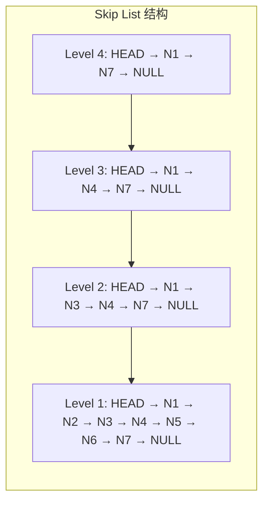
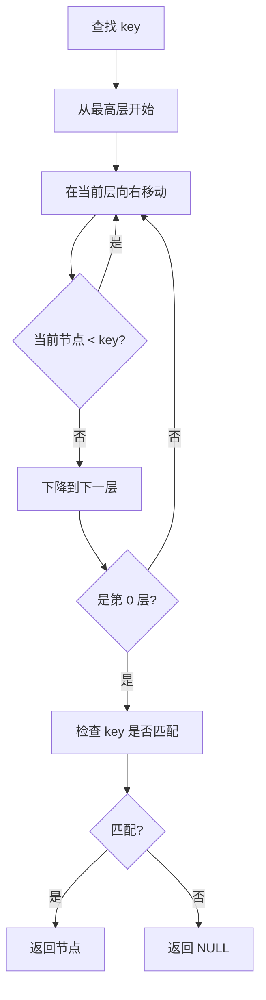
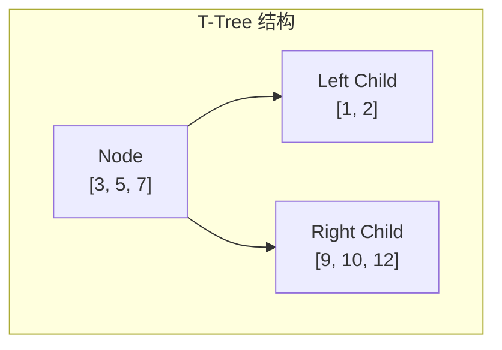
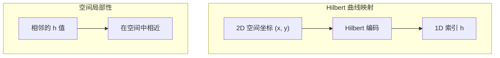
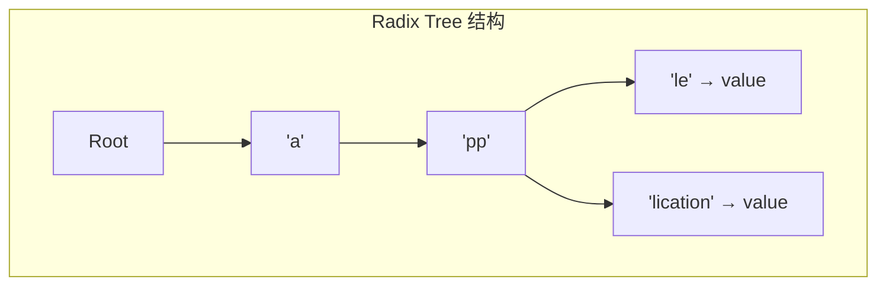

# 其他索引架构文档

> 本文档补充项目中其他索引类型的架构说明：Skip List、T-Tree、Hilbert 曲线等。

---

## 1. Skip List（跳表）

### 1.1 原理

Skip List 是一种概率数据结构，通过多级索引实现 O(log n) 的查找、插入和删除。



### 1.2 核心数据结构

```c
/**
 * Skip List
 */
typedef struct skip_list_t {
    skip_list_node_t *header;       /* 头节点 */
    uint32_t level;                 /* 当前最大层级 */
    uint32_t size;                  /* 元素数量 */
    skip_list_compare_fn compare;   /* 比较函数 */
    void *compare_ctx;              /* 比较函数上下文 */
} skip_list_t;

/**
 * Skip List 节点
 */
typedef struct skip_list_node_t {
    void *key;                      /* 键 */
    uint32_t keylen;                /* 键长度 */
    void *value;                    /* 值 */
    uint32_t valuelen;              /* 值长度 */
    uint32_t level;                 /* 节点层级 */
    struct skip_list_node_t **forward;  /* 前向指针数组 */
} skip_list_node_t;

#define SKIP_LIST_MAX_LEVEL 32      /* 最大层级 */
#define SKIP_LIST_DEFAULT_MAX_LEVEL 16
```

### 1.3 层级生成算法

```c
/**
 * 随机生成层级
 * 概率 P=0.5 晋升到更高层级
 */
uint32_t _skip_list_random_level(void) {
    uint32_t level = 1;
    while ((rand() < (RAND_MAX / 2)) && (level < SKIP_LIST_MAX_LEVEL)) {
        level++;
    }
    return level;
}
```

### 1.4 查找流程



### 1.5 插入流程

```c
/**
 * Skip List 插入
 */
int skip_list_insert(skip_list_t *list, const void *key, uint32_t keylen,
                     const void *value, uint32_t valuelen) {
    skip_list_node_t **update = _skip_list_find(list, key, keylen);
    
    /* 检查是否已存在 */
    skip_list_node_t *x = update[0]->forward[0];
    if (x && _skip_list_compare(list, key, keylen, x->key, x->keylen) == 0) {
        /* 更新值 */
        free(x->value);
        x->value = malloc(valuelen);
        memcpy(x->value, value, valuelen);
        free(update);
        return 0;
    }
    
    /* 生成新节点层级 */
    uint32_t new_level = _skip_list_random_level();
    
    /* 如果新层级超过当前最大层级，更新头节点 */
    if (new_level > list->level) {
        for (uint32_t i = list->level + 1; i <= new_level; i++) {
            update[i] = list->header;
        }
        list->level = new_level;
    }
    
    /* 创建新节点 */
    skip_list_node_t *new_node = _skip_list_node_create(list, key, keylen,
                                                         value, valuelen, new_level);
    
    /* 更新前向指针 */
    for (uint32_t i = 0; i <= new_level; i++) {
        new_node->forward[i] = update[i]->forward[i];
        update[i]->forward[i] = new_node;
    }
    
    list->size++;
    free(update);
    return 0;
}
```

---

## 2. T-Tree（T 树）

### 2.1 原理

T-Tree 是一种平衡二叉搜索树，每个节点包含多个键值，结合了 AVL 树和 B-Tree 的特点。



### 2.2 核心数据结构

```c
/**
 * T-Tree 索引
 */
typedef struct ttree_index_t {
    ttree_node_t *root;             /* 根节点 */
    uint32_t min_keys;              /* 最小键数 */
    uint32_t max_keys;              /* 最大键数 (2*min_keys - 1) */
    uint32_t size;                  /* 总元素数 */
    ttree_compare_fn compare;       /* 比较函数 */
    void *compare_ctx;              /* 比较函数上下文 */
} ttree_index_t;

/**
 * T-Tree 节点
 */
typedef struct ttree_node_t {
    ttree_record_t *records;        /* 键值数组 */
    uint32_t nkeys;                 /* 当前键数 */
    bool is_leaf;                   /* 是否叶子节点 */
    struct ttree_node_t *left;      /* 左子树 */
    struct ttree_node_t *right;     /* 右子树 */
} ttree_node_t;

/**
 * 记录
 */
typedef struct ttree_record_t {
    void *key;
    uint32_t keylen;
    void *value;
    uint32_t valuelen;
} ttree_record_t;

#define TTREE_DEFAULT_MIN_KEYS 4
#define TTREE_MIN_MIN_KEYS 2
```

### 2.3 查找流程

```c
/**
 * T-Tree 查找
 *
 * 特点：先在节点内二分查找，再决定往哪棵子树
 */
const ttree_record_t *_ttree_find_record_const(const ttree_index_t *index,
                                               const ttree_node_t *node,
                                               const void *key, uint32_t keylen) {
    if (!node) return NULL;
    
    /* 在节点内二分查找 */
    int pos = _ttree_find_in_node(index, node, key, keylen);
    if (pos >= 0) return &node->records[pos];
    
    if (node->is_leaf) return NULL;
    
    /* 根据 key 大小决定往哪棵子树 */
    if (node->nkeys == 0) {
        return _ttree_find_record_const(index, node->left, key, keylen);
    }
    
    int cmp = _ttree_compare(index, key, keylen,
                             node->records[0].key, node->records[0].keylen);
    if (cmp < 0) {
        return _ttree_find_record_const(index, node->left, key, keylen);
    }
    
    cmp = _ttree_compare(index, key, keylen,
                         node->records[node->nkeys - 1].key,
                         node->records[node->nkeys - 1].keylen);
    if (cmp >= 0) {
        return _ttree_find_record_const(index, node->right, key, keylen);
    }
    
    /* key 在中间，继续往左子树找 */
    return _ttree_find_record_const(index, node->left, key, keylen);
}
```

---

## 3. Hilbert 曲线空间索引

### 3.1 原理

Hilbert 曲线是一种空间填充曲线，将 2D/3D 空间映射到 1D 索引，保持空间局部性。



### 3.2 核心数据结构

```c
/**
 * Hilbert 索引
 */
typedef struct hilbert_index_t {
    hilbert_record_t *records;      /* 记录数组（按 Hilbert code 排序） */
    uint32_t capacity;              /* 容量 */
    uint32_t count;                 /* 记录数 */
    uint32_t order;                 /* Hilbert 曲线阶数 */
    hilbert_bbox_t data_bbox;       /* 数据边界框 */
} hilbert_index_t;

/**
 * Hilbert 记录
 */
typedef struct hilbert_record_t {
    uint64_t hilbert_code;          /* Hilbert 编码 */
    uint64_t item_id;               /* 数据项 ID */
    hilbert_bbox_t bbox;            /* 边界框 */
} hilbert_record_t;

/**
 * 2D 边界框
 */
typedef struct hilbert_bbox_t {
    double min_x, min_y;
    double max_x, max_y;
} hilbert_bbox_t;

#define HILBERT_MAX_ORDER 32
#define HILBERT_DEFAULT_ORDER 16
```

### 3.3 Hilbert 编码算法

```c
/**
 * 2D Hilbert 编码
 *
 * @param x X 坐标 [0, 1]
 * @param y Y 坐标 [0, 1]
 * @param order 曲线阶数
 * @return Hilbert 码
 */
uint64_t hilbert_encode2d(double x, double y, uint32_t order) {
    uint32_t n = 1U << order;
    uint32_t ix = (uint32_t)(x * (n - 1));
    uint32_t iy = (uint32_t)(y * (n - 1));
    
    uint64_t d = 0;
    uint32_t rx, ry;
    
    for (uint32_t level = order; level > 0; level--) {
        rx = (ix >> (level - 1)) & 1;
        ry = (iy >> (level - 1)) & 1;
        
        d += (uint64_t)(1U << (2 * (level - 1))) * DIR[ry][rx];
        
        /* 应用变换 */
        if (ry == 0) {
            if (rx == 1) {
                ix ^= ((1U << (level - 1)) - 1);
                iy ^= ((1U << (level - 1)) - 1);
            }
            /* 交换 ix 和 iy */
            uint32_t t = ix;
            ix = iy;
            iy = t;
        }
    }
    
    return d;
}
```

### 3.4 空间查询

```c
/**
 * 范围查询
 */
uint32_t hilbert_index_range_query(const hilbert_index_t *index,
                                   const hilbert_bbox_t *query,
                                   uint64_t *results,
                                   uint32_t max_results) {
    /* 计算查询框的 Hilbert 范围 */
    uint64_t min_h, max_h;
    hilbert_bbox_range(query, index->order, &min_h, &max_h);
    
    uint32_t found = 0;
    
    /* 遍历所有记录 */
    for (uint32_t i = 0; i < index->count && found < max_results; i++) {
        const hilbert_record_t *rec = &index->records[i];
        
        /* Hilbert 码范围过滤 */
        if (rec->hilbert_code < min_h || rec->hilbert_code > max_h) {
            continue;
        }
        
        /* 精确边界框检查 */
        if (rec->bbox.max_x < query->min_x || rec->bbox.min_x > query->max_x ||
            rec->bbox.max_y < query->min_y || rec->bbox.min_y > query->max_y) {
            continue;
        }
        
        results[found++] = rec->item_id;
    }
    
    return found;
}
```

---

## 4. Radix Tree（基数树）

### 4.1 原理

Radix Tree（也叫 Patricia Tree）是一种压缩前缀树，适合存储字符串键。



### 4.2 核心数据结构

```c
/**
 * Radix Tree 节点
 */
typedef struct radix_node_t {
    char *prefix;                   /* 公共前缀 */
    uint32_t prefix_len;            /* 前缀长度 */
    void *value;                    /* 值（如果是叶子节点） */
    uint32_t valuelen;              /* 值长度 */
    
    radix_node_t *children[256];    /* 子节点数组（按下一个字节索引） */
    uint32_t child_count;           /* 子节点数 */
} radix_node_t;

/**
 * Radix Tree
 */
typedef struct radix_tree_t {
    radix_node_t *root;
    uint32_t size;
} radix_tree_t;
```

---

## 5. 索引类型对比

| 索引类型 | 时间复杂度 | 空间复杂度 | 适用场景 |
|----------|-----------|-----------|----------|
| Skip List | O(log n) | O(n) | 有序集合、内存数据库 |
| T-Tree | O(log n) | O(n) | 内存数据库、范围查询 |
| Hilbert | O(1) 编码 | O(n) | 空间索引、GIS |
| Radix Tree | O(k) | O(n) | 字符串键、IP 路由 |

---

## 6. 面试知识点

**Q: Skip List 相比平衡树的优势？**
> A: 1) 实现简单，无旋转操作；2) 范围查询高效；3) 并发友好（无全局锁）。

**Q: T-Tree 相比 B+Tree 的区别？**
> A: T-Tree 是二叉结构，每个节点存多个键；B+Tree 是多叉结构，更适应磁盘 I/O。

**Q: Hilbert 曲线相比 Z-Order 的优势？**
> A: Hilbert 曲线连续性更好，相邻的码在空间中也相邻；Z-Order 可能有较大跳跃。

**Q: Radix Tree 的压缩原理？**
> A: 合并公共前缀，减少树的高度和节点数量，适合前缀重复度高的字符串集。

---

*文档版本: v1.0*
*最后更新: 2026-07-12*