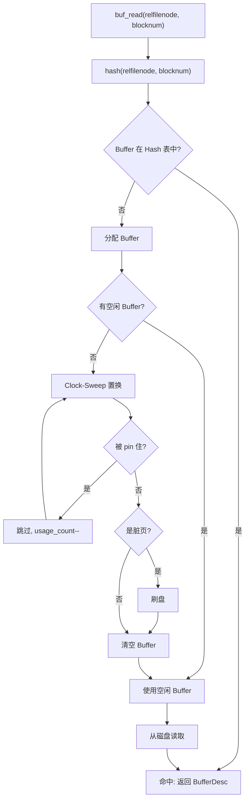
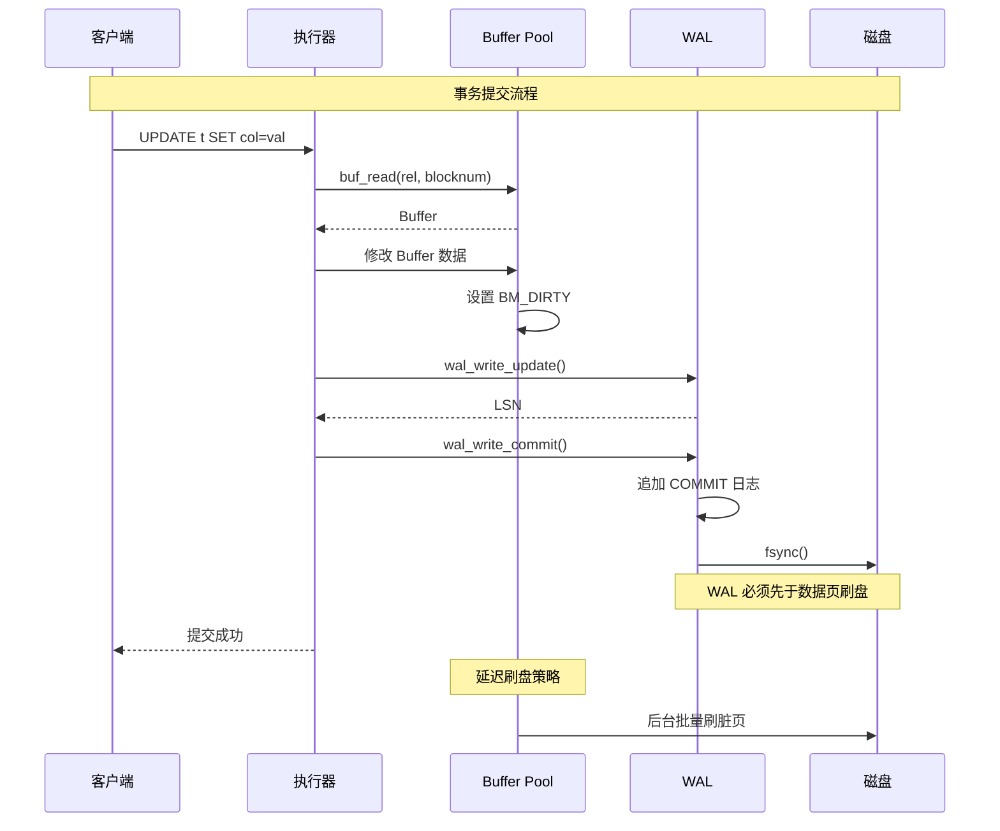
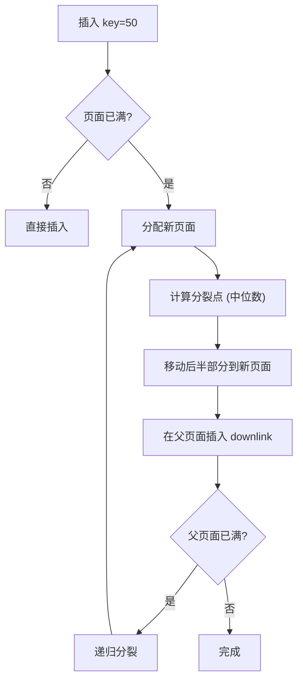
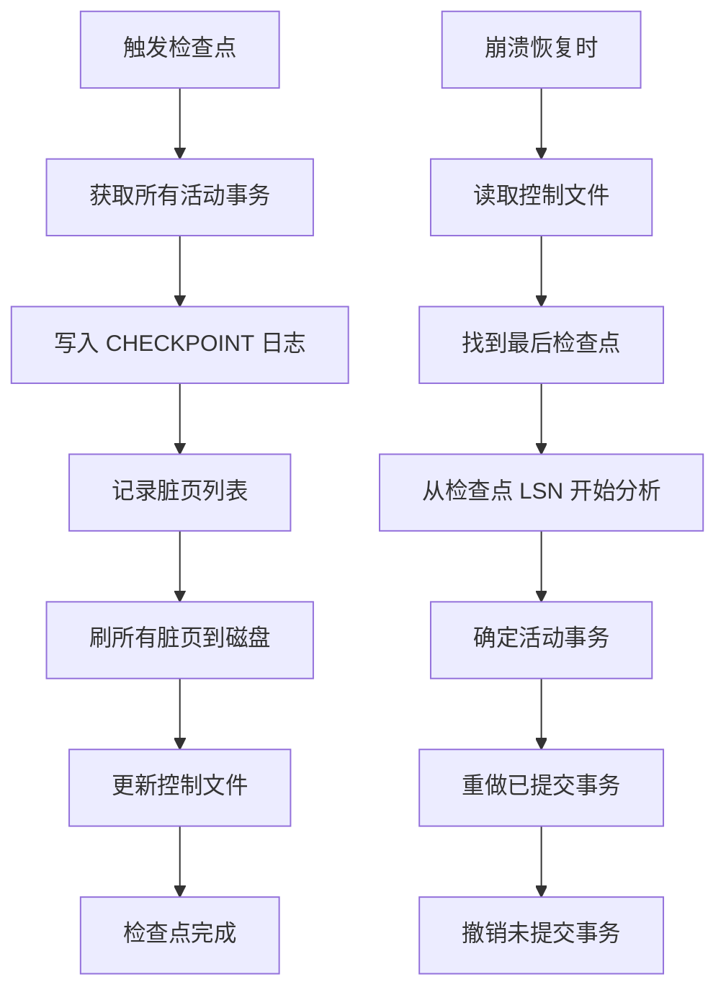
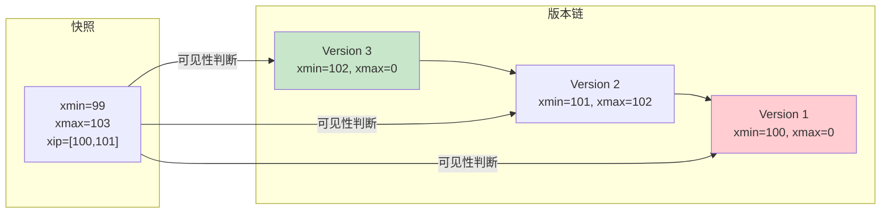

# 存储引擎详细模块架构与实现规划

> 本文档补充架构图的细节信息，并提供模块实现的优先级规划。

---

## 1. Buffer Pool 详细架构

### 1.1 核心数据结构

```c
/**
 * Buffer 描述符 - 每个 Buffer 有一个描述符
 */
struct BufferDesc_s {
    uint32_t    buf_id;           // Buffer ID (0 到 N-1)
    BufferState state;            // 状态标志（atomic）
    uint32_t    relfilenode;      // 物理文件节点
    BlockNumber blocknum;         // 块号
    int         usage_count;      // Clock-Sweep 计数

    LSN         last_written;     // 最后写入的 LSN

    // Hash 链表指针（用于快速查找）
    uint32_t    hash_prev;        // Hash 链表前驱
    uint32_t    hash_next;        // Hash 链表后继

    // 引用计数（pin 计数）
    int         refcount;         // 引用计数（atomic）
};

/**
 * Buffer 状态标志
 */
#define BM_VALID           0x00000001  // 页面数据有效
#define BM_DIRTY           0x00000002  // 页面被修改
#define BM_PINNED          0x00000004  // 页面被 pin 住
#define BM_IO_IN_PROGRESS  0x00000008  // 正在读取
#define BM_IO_COMPLETED    0x00000010  // 读取完成
#define BM_WRITING         0x00000020  // 正在写入
#define BM_JUST_DIRTIED    0x00000040  // 刚刚标记为脏
```

### 1.2 Hash 表查找流程



### 1.3 Clock-Sweep 算法

```
算法：Clock-Sweep（第二次机会）

1. 初始化 Clock Hand 指向第一个 Buffer
2. 当需要置换时：
   a. 检查当前 Buffer 的 usage_count
   b. 如果 usage_count > 0：
      - usage_count--
      - Clock Hand 移到下一个 Buffer
   c. 如果 usage_count == 0 且未被 pin：
      - 置换这个 Buffer
   d. 如果被 pin：
      - 跳过，Clock Hand 移到下一个
3. 循环直到找到可置换的 Buffer

优化：
- usage_count 表示最近访问次数
- 被访问时 usage_count++ 且不超过阈值
- 被 pin 的页面不能被置换
```

### 1.4 Buffer 与 WAL 协作



---

## 2. BTree 索引详细架构

### 2.1 页面结构

```c
/**
 * BTree 页面头部 (20 bytes)
 */
typedef struct BTPageHeaderData {
    uint16_t    btpo_flags;       // 页面标志 (BTP_LEAF/BTP_INTERNAL/...)
    uint16_t    btpo_level;       // 树层级（0=叶子）
    uint32_t    btpo_prev;        // 上一页面（叶子页面双向链表）
    uint32_t    btpo_next;        // 下一页面
    uint32_t    btpo_xact;        // 页面事务信息
    uint16_t    btpo_offset;      // 空闲空间起始偏移
    uint16_t    btpo_count;       // 页面中的条目数
} BTPageHeaderData;

/**
 * 叶子页面条目 (索引元组)
 */
typedef struct BTreekirtData {
    Oid         heap_node;        // 堆页面节点
    uint32_t    block_number;     // 块号
    uint16_t    offset;           // 在页面中的偏移
    uint16_t    flags;           // 标志
    // 键值数据紧随其后
} BTreekirtData;

/**
 * 内部页面条目 (指向子页面)
 */
typedef struct BTInternalTupleData {
    uint32_t    block_number;     // 子页面块号
    uint16_t    offnum;          // 元组偏移
    uint8_t     downlink_offset; // 下链偏移
    uint8_t     flags;           // 标志
} BTInternalTupleData;
```

### 2.2 页面布局

```
┌─────────────────────────────────────────────────────────┐
│                    页面 (8192 bytes)                     │
├─────────────────────────────────────────────────────────┤
│ PageHeaderData (20 bytes)                                │
│  - btpo_flags: 0x0001 (leaf)                            │
│  - btpo_level: 0                                        │
│  - btpo_prev/next: 页面链表指针                         │
│  - btpo_count: 条目数                                   │
│  - btpo_offset: 空闲空间起始                            │
├─────────────────────────────────────────────────────────┤
│ ItemData[0] ← pd_lower                                 │
│ ItemData[1]                                             │
│ ItemData[2]                                             │
│ ...                                                     │
├─────────────────────────────────────────────────────────┤
│                   空闲空间                              │
│                                                         │
│                                                         │
├─────────────────────────────────────────────────────────┤
│ TupleData[2] ← pd_upper (数据向低地址生长)             │
│ TupleData[1]                                            │
│ TupleData[0] ← pd_special (特殊空间起始)                │
└─────────────────────────────────────────────────────────┘

注：
- pd_lower 指向 ItemData 数组开始
- pd_upper 指向最后一个已使用字节 + 1
- Item 从两端向中间生长
```

### 2.3 BTree 查找算法

```c
/**
 * BTree 范围查找
 *
 * 伪代码：
 *
 * btree_range_scan(rel, lower_bound, upper_bound):
 *   1. 从根页面开始
 *   2. 下降到叶子页面：
 *      - 在内部页面二分查找
 *      - key < keys[i] → 进入左子树
 *      - 否则继续向右
 *      - downlink[i] → 子页面
 *   3. 在叶子页面查找 lower_bound
 *   4. 遍历叶子页面直到 upper_bound
 *   5. 通过 heap_ptr 获取堆元组
 */
```

### 2.4 分裂算法



---

## 3. WAL 详细架构

### 3.1 日志记录格式

```c
/**
 * WAL 文件头 (64 bytes)
 */
typedef struct wal_file_header {
    uint32_t magic;          // 0x57414C31 ("WAL1")
    uint32_t version;        // 版本号 (1)
    uint32_t page_size;     // 数据库页面大小
    uint32_t checksum;       // 头部校验和
    char     reserved[48];  // 保留字段
} wal_file_header_t;

/**
 * 日志记录头 (24 bytes)
 */
typedef struct wal_record_header {
    uint8_t  type;          // 日志类型
    uint8_t  size[3];       // 记录大小（小端序，3字节）
    uint64_t lsn;           // 日志序列号
    uint32_t txn_id;        // 事务ID
    uint32_t prev_lsn;      // 上一条日志的 LSN
    uint32_t checksum;       // 记录校验和
} wal_record_header_t;

/**
 * 日志类型
 */
typedef enum wal_log_type {
    WAL_LOG_BEGIN = 1,      // 事务开始
    WAL_LOG_INSERT = 2,     // 插入记录
    WAL_LOG_UPDATE = 3,     // 更新记录
    WAL_LOG_DELETE = 4,    // 删除记录
    WAL_LOG_COMMIT = 5,     // 事务提交
    WAL_LOG_ABORT = 6,      // 事务回滚
    WAL_LOG_CHECKPOINT = 7  // 检查点
} wal_log_type_t;
```

### 3.2 LSN (Log Sequence Number)

```
LSN 格式：64 位整数
  - 高位：WAL 文件号
  - 低位：文件内偏移

例如：0x00000001_00001000
  - 文件号：1
  - 偏移：0x1000 = 4096

特点：
  - 单调递增
  - 可比较先后顺序
  - 可定位到具体文件位置
```

### 3.3 检查点流程



---

## 4. MVCC 详细架构

### 4.1 事务 ID 与快照

```c
/**
 * 事务 ID
 */
typedef int64_t mvcc_txn_id_t;
#define MVCC_INVALID_TXN_ID ((mvcc_txn_id_t)0)
#define MVCC_MAX_TXN_ID INT64_MAX

/**
 * 行版本指针
 */
typedef struct mvcc_ctid {
    uint32_t block_num;   // 页面号
    uint16_t offset;     // 页面内偏移/槽号
} mvcc_ctid_t;

/**
 * MVCC 快照
 *
 * 快照在事务开始时创建，包含事务开始时的状态：
 * - xmin: 快照创建时的最小活动事务 ID
 * - xmax: 快照创建时的最大已分配事务 ID
 * - xip_list: 快照创建时活跃的事务 ID 列表
 */
typedef struct mvcc_snapshot {
    mvcc_txn_id_t xmin;           // 最小活动事务 ID
    mvcc_txn_id_t xmax;           // 最大已分配事务 ID

    /* 活跃事务 ID 列表 */
    mvcc_txn_id_t *xip_list;      // 数组
    int xip_count;                 // 列表长度
    int xip_capacity;              // 数组容量
} mvcc_snapshot_t;
```

### 4.2 可见性判断算法

```c
/**
 * 判断版本是否对快照可见
 *
 * 可见性规则（PostgreSQL 风格）：
 *
 * 版本 V 对快照 S 可见当且仅当：
 *
 * 1. xmin 规则：V.xmin 在快照中已提交
 *    - V.xmin < S.xmax（事务在快照之前开始）
 *    - V.xmin 不在 S.xip_list 中（事务在快照时已结束）
 *
 * 2. xmax 规则：V 未被已提交的事务删除
 *    - V.xmax = 0（从未被删除）
 *    - 或 V.xmax 在快照中仍活跃（未提交）
 *    - 或 V.xmax >= S.xmax（删除事务在快照之后）
 *
 * 3. 自可见：事务自身创建的版本始终可见
 *    - V.xmin == 当前事务ID
 */
bool mvcc_version_visible(
    const mvcc_snapshot_t *snapshot,
    mvcc_txn_id_t xmin,
    mvcc_txn_id_t xmax,
    mvcc_txn_id_t cur_txn_id
) {
    // 规则 3: 自可见
    if (xmin == cur_txn_id) {
        return true;
    }

    // 规则 1: xmin 必须在快照开始时已提交
    if (xmin >= snapshot->xmax) {
        return false;  // 事务在快照之后开始
    }

    if (xmin < snapshot->xmin) {
        // xmin < xmin，说明在快照之前可能已提交
        // 需要检查是否有更早的开始但更晚提交的事务
        // （简化：假设已提交）
        return true;
    }

    // 检查 xmin 是否在活跃事务列表中
    for (int i = 0; i < snapshot->xip_count; i++) {
        if (snapshot->xip_list[i] == xmin) {
            return false;  // 事务在快照时仍活跃
        }
    }

    // 规则 2: xmax 检查
    if (xmax == 0) {
        return true;  // 从未被删除
    }

    // xmax 在快照中
    if (xmax < snapshot->xmin) {
        return true;  // 删除事务在快照之前已结束
    }

    if (xmax >= snapshot->xmax) {
        return true;  // 删除事务在快照之后开始
    }

    // 检查 xmax 是否在活跃列表中
    for (int i = 0; i < snapshot->xip_count; i++) {
        if (snapshot->xip_list[i] == xmax) {
            return true;  // 删除事务未提交
        }
    }

    // xmax 已提交，但提交在快照之后，不可见
    return false;
}
```

### 4.3 版本链与可见性



**版本链遍历过程：**
```
快照 S: xmin=99, xmax=103, xip=[100, 101]

查找可见版本：

1. 检查 V3 (xmin=102, xmax=0):
   - xmin=102 >= xmax=103? 否
   - xmin=102 在 xip=[100,101]? 否
   - xmin=102 > xmin=99 且 < xmax=103 ✓
   - xmax=0 → 从未被删除 ✓
   → V3 可见！返回 V3

（V2 被 V3 的 xmax=102 标记为已删除，
 且事务 102 在快照时已提交，所以 V2 不可见）
```

---

## 5. Heap 存储详细架构

### 5.1 页面结构

```c
/**
 * 堆表页面头部 (24 bytes)
 */
typedef struct PageHeaderData {
    uint32_t    pd_lsn;           // 最后修改的 LSN
    uint16_t    pd_checksum;      // 页面校验和
    uint16_t    pd_flags;         // 页面标志
    uint16_t    pd_lower;         // 空闲空间起始位置
    uint16_t    pd_upper;         // 空闲空间结束位置
    uint16_t    pd_special;       // 特殊空间起始位置
    uint16_t    pd_pagesize_version; // 页面大小和版本
    uint32_t    pd_prune_xid;     // 可清理的最早事务 ID
    uint16_t    pd_xid_base;      // 事务 ID 基准
    uint16_t    pd_multi_base;    // 多事务 ID 基准
} PageHeaderData;

/**
 * LinePointer (6 bytes)
 */
typedef struct HeapLinePointerData {
    uint32_t    t_off;            // 元组在页面中的偏移
    uint8_t     t_flags;         // 标志
    uint8_t     t_xmax;          // 删除事务 ID（高位）
} HeapLinePointerData;
```

### 5.2 页面空间管理

```
┌─────────────────────────────────────────────────────────┐
│                    页面 (8192 bytes)                     │
├─────────────────────────────────────────────────────────┤
│ PageHeaderData (24 bytes)                               │
│  - pd_lsn: 最后修改的日志序列号                         │
│  - pd_lower: LinePointer 数组开始位置                   │
│  - pd_upper: 空闲空间结束位置                           │
│  - pd_special: 特殊空间起始（索引页面使用）             │
├─────────────────────────────────────────────────────────┤
│ LinePointer[0] ← pd_lower                              │
│ LinePointer[1]                                          │
│ LinePointer[2] (flags=DELETED)                         │
│ LinePointer[3]                                         │
│ ...                                                     │
├─────────────────────────────────────────────────────────┤
│                   空闲空间                              │
│                                                         │
│                                                         │
├─────────────────────────────────────────────────────────┤
│ Tuple[3] ← pd_upper (向低地址生长)                     │
│ Tuple[2]                                                │
│ Tuple[1]                                                │
│ Tuple[0] ← pd_special                                  │
└─────────────────────────────────────────────────────────┘
```

### 5.3 HOT 更新

```
Heap-Only Tuple (HOT) 更新：

场景：UPDATE t SET col='new' WHERE id=1;

优化策略：
1. 尽量在同一页面内完成更新
2. 避免更新所有索引（索引只更新必要列）

步骤：
1. 在同一页面添加新 Tuple
2. 旧 Tuple 的 t_xmax = 当前事务ID
3. 旧 Tuple 的 t_ctid → 新 Tuple 位置
4. 只标记旧 Tuple 为已删除

好处：
- 减少页面 I/O
- 减少索引更新（只更新必要的索引列）
- 后续 VACUUM 可清理旧版本
```

---

## 6. 模块实现优先级规划

### 6.1 优先级矩阵

| 优先级 | 模块 | 理由 | 工作量 | 风险 |
|--------|------|------|--------|------|
| P0 | SQL Executor (基础) | 端到端跑通是面试关键 | 高 | 高 |
| P0 | Buffer Pool | 核心基础设施 | 中 | 中 |
| P0 | Heap AM | 基础存储引擎 | 中 | 低 |
| P1 | BTree AM | 索引是加分项 | 中 | 中 |
| P1 | WAL | 事务持久性保障 | 中 | 中 |
| P1 | MVCC | 并发控制核心 | 高 | 高 |
| P2 | Catalog | 元数据管理 | 低 | 低 |
| P2 | SQL Executor (完整) | 全面 SQL 支持 | 高 | 高 |
| P3 | 向量索引 | AI 方向加分 | 高 | 低 |
| P3 | 分布式 (Raft) | 大厂加分项 | 高 | 高 |

### 6.2 阶段一：核心可运行 (1-2 个月)

**目标：端到端可跑通 SELECT 查询**

```
阶段一任务清单：

1. [P0] Buffer Pool 完善
   - 实现 buf_read/buf_new/buf_write
   - 实现 Clock-Sweep 置换
   - 实现脏页刷盘
   - 单元测试通过

2. [P0] Heap AM 完善
   - 实现 heap_insert/heap_scan
   - 实现页面空间管理
   - 与 Buffer Pool 集成
   - 单元测试通过

3. [P0] SQL Executor 基础
   - 简化版 SELECT 解析
   - 全表扫描执行
   - 条件过滤
   - 端到端测试

4. [P1] WAL 基础
   - 日志写入
   - 日志刷盘
   - 崩溃恢复基础
```

### 6.3 阶段二：核心功能完备 (2-3 个月)

**目标：支持基础事务和索引**

```
阶段二任务清单：

1. [P1] BTree AM 完善
   - 实现 bt_insert/bt_lookup
   - 实现页面分裂
   - 实现范围扫描
   - 单元测试通过

2. [P1] WAL 完善
   - 实现完整恢复流程
   - 实现检查点
   - 与 Buffer Pool 集成

3. [P1] MVCC 基础
   - 实现快照管理
   - 实现可见性判断
   - 版本链基础
   - 垃圾回收基础

4. [P2] Catalog 基础
   - 系统表定义
   - OID 分配
   - 元数据查询
```

### 6.4 阶段三：能力提升 (3-4 个月)

**目标：完整事务支持和优化**

```
阶段三任务清单：

1. [P1] MVCC 完善
   - 完整事务支持
   - Undo 日志
   - VACUUM 优化
   - 并发测试

2. [P2] SQL Executor 完善
   - JOIN 执行
   - 聚合查询
   - 排序/分组
   - 索引扫描

3. [P2] 性能优化
   - 缓冲区优化
   - 查询优化器基础
   - 性能测试

4. [P3] 向量索引
   - HNSW 实现
   - 与 SQL 集成
   - 演示 demo
```

### 6.5 阶段四：深度与亮点 (4-6 个月)

**目标：形成技术亮点**

```
阶段四任务清单：

1. [P3] 分布式 Raft
   - Leader 选举
   - 日志复制
   - 故障恢复

2. [P3] 深度优化
   - BTree 并发控制
   - Lock-free 数据结构
   - 性能调优

3. 文档完善
   - 架构设计文档
   - API 文档
   - 性能测试报告

4. 面试准备
   - 代码讲解稿
   - 架构图整理
   - 常见问题准备
```

### 6.6 具体代码完善计划

#### Buffer Pool 完善计划

**现状分析：**
- 头文件完整: `engineering/include/db/buf.h`
- 需要检查: `bufmgr.c` 实现完整性

**TODO 清单：**
```
□ 1. 检查 bufmgr.c 编译是否通过
□ 2. 补全 buf_read 缺失逻辑
□ 3. 补全 Clock-Sweep 置换实现
□ 4. 补全脏页刷盘逻辑
□ 5. 添加单元测试
□ 6. 性能测试
```

#### BTree 完善计划

**现状分析：**
- 已有: `btree_core.c`, `btree_insert.c`, `btree_delete.c`, `btree_lookup.c`, `btree_persist.c`
- 需要检查: 分裂逻辑是否完整

**TODO 清单：**
```
□ 1. 检查 btree_insert.c 分裂逻辑
□ 2. 补全页面分裂递归处理
□ 3. 补全 btree_delete.c 合并逻辑
□ 4. 补全 btree_lookup.c 二分查找
□ 5. 添加单元测试
□ 6. 添加基准测试
```

#### SQL Executor 完善计划

**现状分析：**
- 37 处 TODO（最多）
- 需要端到端跑通

**TODO 清单：**
```
□ 1. 简化版 SQL 解析器（支持 SELECT）
□ 2. 词法分析器
□ 3. 语法树构建
□ 4. 语义分析
□ 5. 执行计划生成
□ 6. 全表扫描执行器
□ 7. 条件过滤执行器
□ 8. 端到端测试
□ 9. SELECT WHERE 测试
□ 10. INSERT 测试
□ 11. UPDATE 测试
□ 12. DELETE 测试
```

---

## 7. 面试知识点对照

### 7.1 Buffer Pool 面试点

| 问题 | 答案要点 |
|------|----------|
| 为什么需要 Buffer Pool？ | 磁盘 I/O 慢，内存缓存热点数据，减少磁盘访问 |
| Clock-Sweep vs LRU？ | Clock-Sweep 无锁实现简单，性能好；LRU 需要维护有序链表，开销大 |
| 脏页什么时候刷盘？ | 置换前、检查点、后台线程批量刷 |
| Pin/Unpin 的作用？ | 防止正在使用的页面被置换 |
| Hash 表的作用？ | O(1) 查找，避免遍历所有 Buffer |

### 7.2 BTree 面试点

| 问题 | 答案要点 |
|------|----------|
| BTree vs B+Tree？ | B+Tree 所有数据在叶子，内非叶子不存数据；BTree 所有节点都可存数据 |
| 分裂点为什么选中间？ | 保证左右平衡，树高度一致 |
| 范围查询怎么优化？ | 叶子页面双向链表，直接遍历 |
| 并发控制怎么实现？ | 页面锁、元婴锁 |

### 7.3 WAL 面试点

| 问题 | 答案要点 |
|------|----------|
| WAL 是什么？ | Write-Ahead Logging，修改数据前先写日志 |
| 为什么先写 WAL？ | 保证崩溃后可恢复 |
| Redo vs Undo？ | Redo 重做已提交事务；Undo 撤销未提交事务 |
| 检查点的作用？ | 减少恢复时间，WAL 不需要从开头重演 |
| LSN 是什么？ | 日志序列号，唯一标识日志位置 |

### 7.4 MVCC 面试点

| 问题 | 答案要点 |
|------|----------|
| MVCC 是什么？ | 多版本并发控制，读不阻塞写，写不阻塞读 |
| Read View 是什么？ | 事务开始时的快照，包含 xmin/xmax/xip_list |
| 可见性怎么判断？ | xmin 已提交 + xmax 未提交/未开始 |
| 什么是版本链？ | UPDATE 生成新版本，旧版本通过 ctid 指向新版本 |
| 垃圾回收怎么做？ | VACUUM 清理不可见版本，更新文件 |

---

## 8. 推荐学习资源

### 8.1 书籍

1. **《Database System Concepts》** - 基础概念
2. **《Database System Implementation》** - 深入实现
3. **《PostgreSQL 源码分析》** - 参考本项目实现
4. **《Designing Data-Intensive Applications》** - 分布式概念

### 8.2 源码参考

1. **PostgreSQL** - 最完整的参考实现
2. **SQLite** - 轻量级参考
3. **CMU 15445** - 课程项目参考
4. **TinySQL** - Rust 实现的教学数据库

### 8.3 在线课程

1. **CMU 15-445/645** - 数据库系统
2. **MIT 6.830** - 数据库系统进阶
3. **Stanford CS346** - 数据库实现

---

*文档版本: v1.0*
*最后更新: 2026-07-12*
