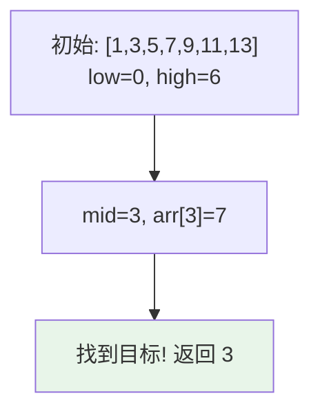
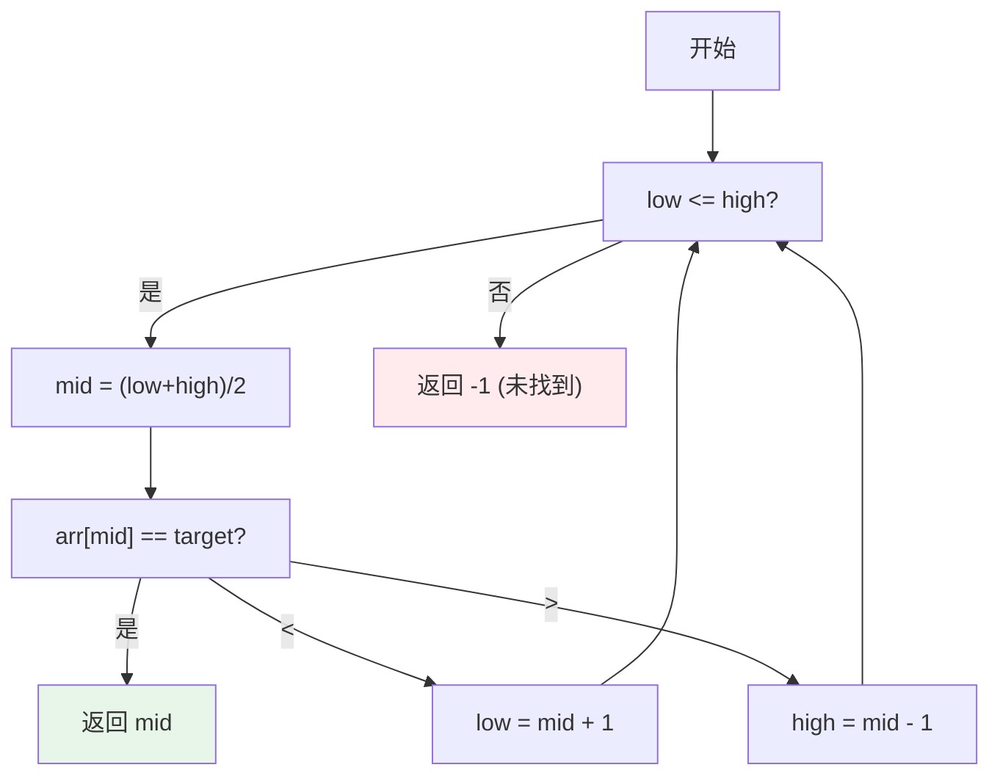

# 二分查找 (Binary Search)

## 概述

二分查找是一种在有序数组中查找目标元素的算法，每次将搜索范围缩小一半。

## 基本操作

| 操作 | 时间复杂度 | 说明 |
|------|-----------|------|
| 查找 | O(log n) | 二分查找 |
| 左侧边界 | O(log n) | 第一个 >= 目标的位置 |
| 右侧边界 | O(log n) | 最后一个 <= 目标的位置 |

## 可视化示例

### 二分查找过程

在有序数组 `[1, 3, 5, 7, 9, 11, 13]` 中查找 `7`：



### 二分查找步骤



### 示例：查找插入位置

将 `5` 插入有序数组 `[1, 2, 4, 6, 7]`：

```
结果: [1, 2, 4, <span style='color:#9f9'>5</span>, 6, 7]
索引:  0  1  2   3    4  5
```

## 实现文件

| 文件 | 说明 |
|------|------|
| [impl/bsearch.c](impl/bsearch.c) | 二分查找实现 |
| [binary_search.c](binary_search.c) | 二分查找函数 |

## LeetCode 题目

| 题号 | 题目 | 难度 |
|------|------|------|
| 2070 | [魔法列表](../2070_magic_list/) | 中等 |
| 3280 | [将日期转换为天数](../3280_count_days/) | 简单 |
