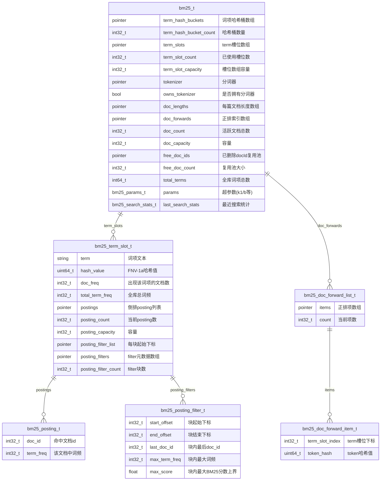
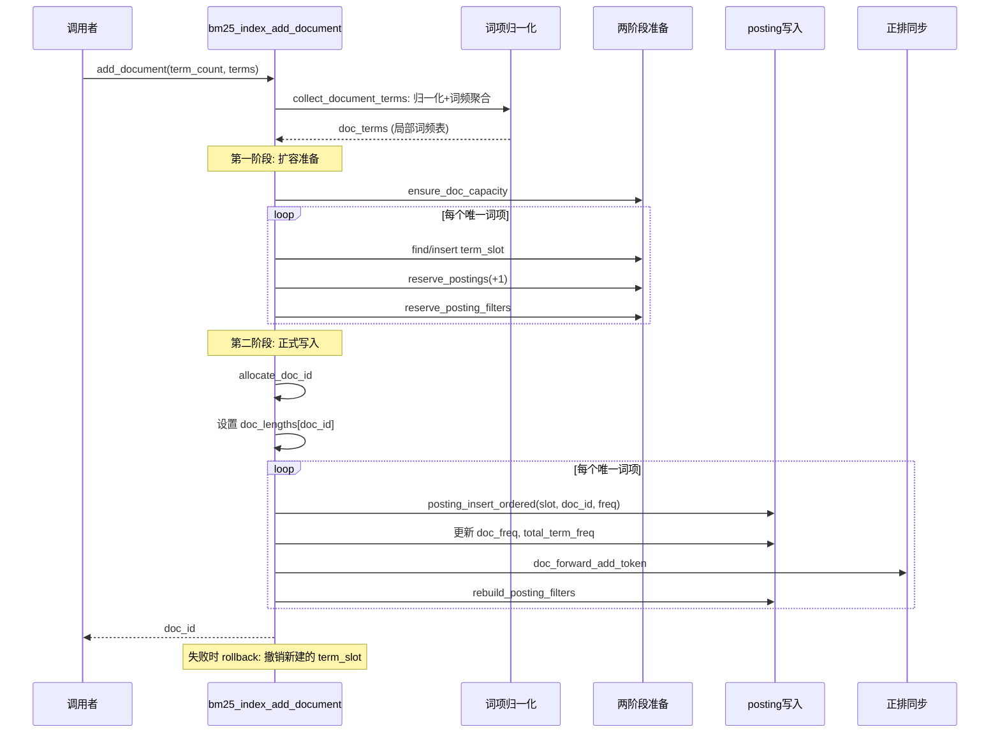
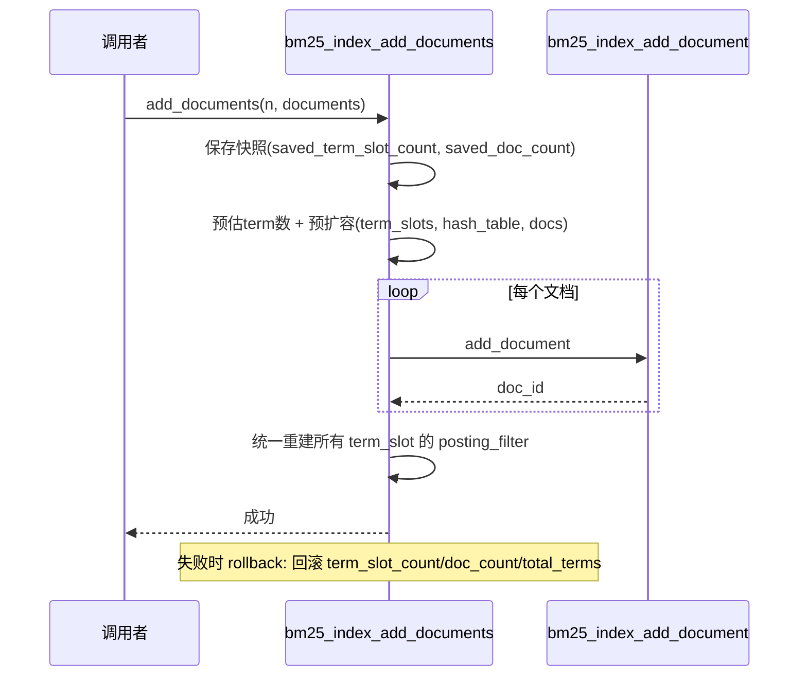
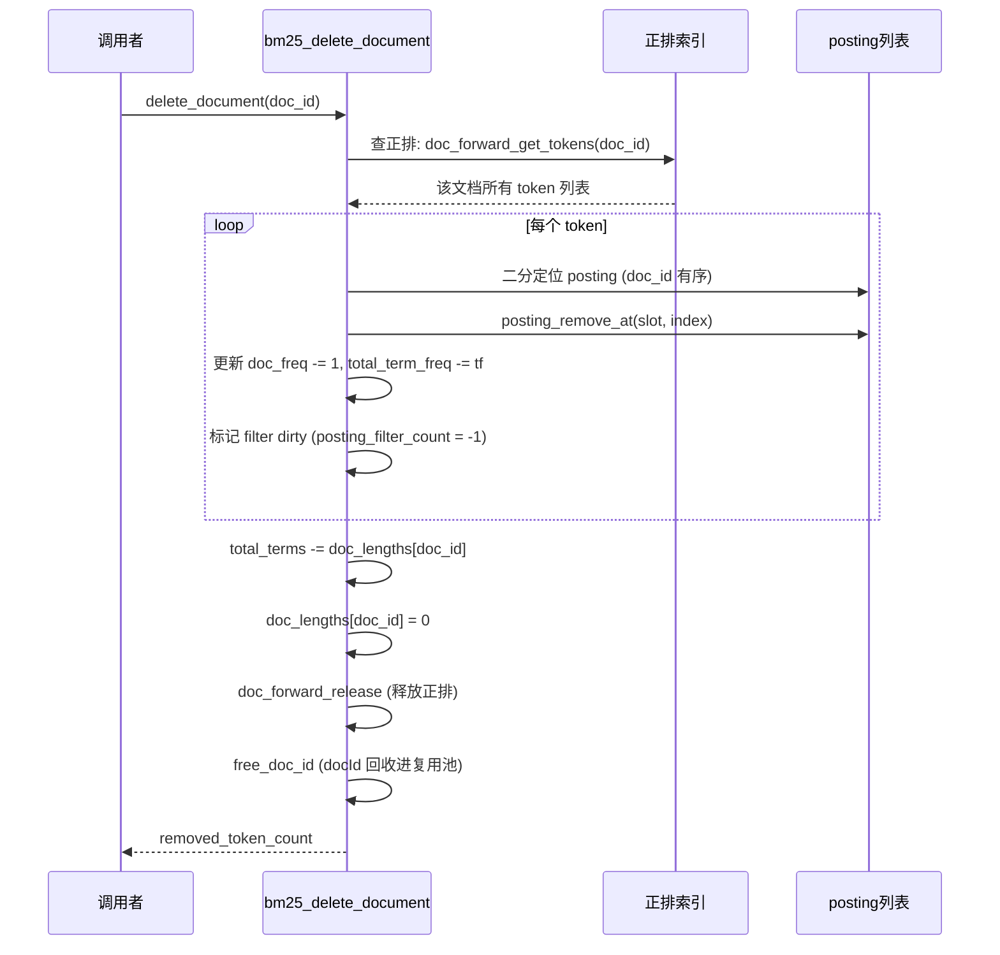
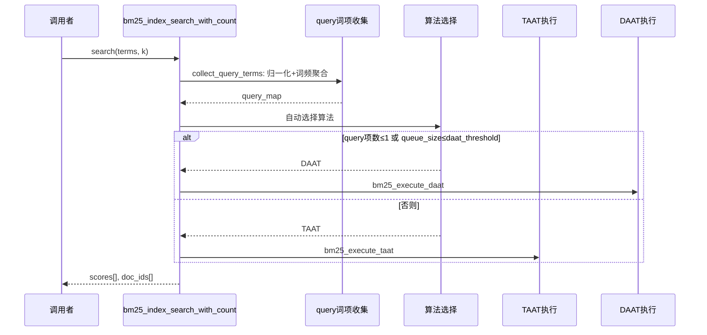
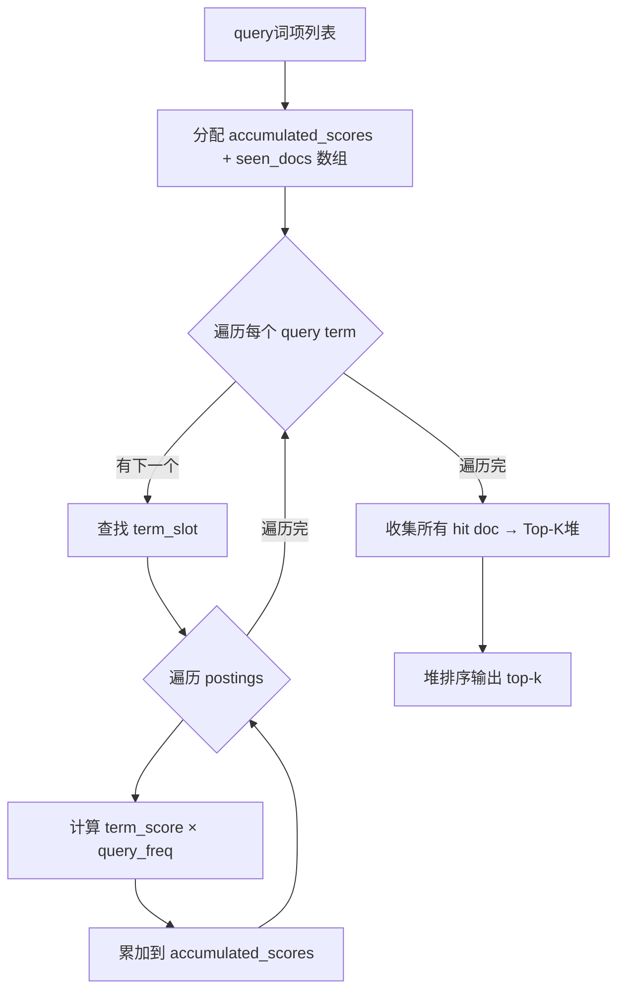
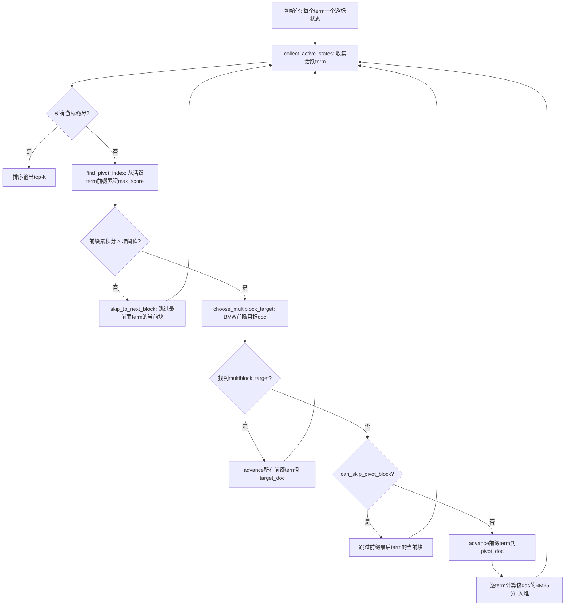
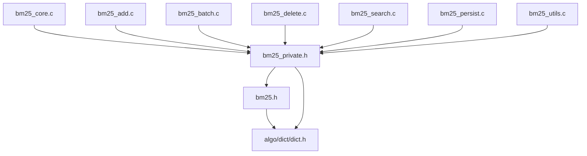

# BM25 索引设计文档

## 1. 背景与概述

BM25（Best Match 25）是一种基于概率检索模型的文本倒排索引，是信息检索领域最经典的打分函数之一。它通过构建"词项→文档"的倒排映射，在查询时对候选文档做精确 BM25 打分并返回 Top-K。

**适用场景**：全文搜索、文档检索、关键词匹配。要求精确 Top-K、支持增量写入和删除、无需训练。

**核心思想**：对文档集合中的每个词项维护一个按 doc_id 有序的 posting 列表，查询时遍历命中词项的 posting 计算 BM25 分数，通过 Top-K 堆输出结果。

---

## 2. 算法原理

### 2.1 BM25 打分公式

```
BM25(q, d) = Σ IDF(t) × TF(t, d)

IDF(t) = ln((N - df + 0.5) / (df + 0.5) + 1)

TF(t, d) = tf × (k1 + 1) / (tf + k1 × (1 - b + b × |d| / avg_dl))
```

- `N`：文档总数
- `df`：出现词项 t 的文档数
- `tf`：词项 t 在文档 d 中的词频
- `|d|`：文档 d 的长度
- `avg_dl`：平均文档长度
- `k1`、`b`：超参数（默认 k1=1.2, b=0.75）

### 2.2 倒排索引结构

```
                          ┌─────────────────────┐
                          │   term_hash_buckets  │  ← 哈希表：term → term_slot_index
                          └──────────┬──────────┘
                                     │
              ┌──────────────────────┼──────────────────────┐
              ▼                      ▼                      ▼
        ┌──────────┐          ┌──────────┐          ┌──────────┐
        │term_slot │          │term_slot │          │term_slot │
        │ "hello"  │          │ "world"  │   ...    │  "foo"   │
        ├──────────┤          ├──────────┤          ├──────────┤
        │ postings │          │ postings │          │ postings │
        │ [0]:d0,tf│          │ [0]:d1,tf│          │ [0]:d0,tf│
        │ [1]:d3,tf│          │ [1]:d2,tf│          │ [1]:d4,tf│
        │ ...      │          │ ...      │          │ ...      │
        ├──────────┤          ├──────────┤          ├──────────┤
        │ filters  │          │ filters  │          │ filters  │
        │ (块加速)  │          │ (块加速)  │          │ (块加速)  │
        └──────────┘          └──────────┘          └──────────┘
```

每个 term_slot 包含：
- **postings**：按 doc_id 升序排列的 posting 数组，每个 posting 含 `(doc_id, term_freq)`
- **posting_filters**：块级加速元数据，每 16 个 posting 一块

---

## 3. 核心数据结构

### 3.1 ER 图



### 3.2 Posting Filter 块级加速结构

Posting Filter 是本索引最关键的优化结构。它将每个 term 的 posting 列表按固定窗口（默认 16）切分为块，每块预计算元数据：

```
postings:    [d0,tf] [d3,tf] [d7,tf] [d9,tf] │ [d10,tf] [d15,tf] [d20,tf] [d22,tf] │ ...
             └──────── block 0 ──────────┘     └─────────── block 1 ───────────┘

filters:     {start:0, end:4, last_doc:9,  max_tf:X, max_score:Y}
             {start:4, end:8, last_doc:22, max_tf:Z, max_score:W}
```

DAAT 搜索时，filter 的 `max_score` 提供该块内任意 posting 的最高可能分数上界。如果一块的 max_score 累积不足以超过 Top-K 堆阈值，整块跳过。

### 3.3 正排索引

```
doc_forwards[doc_id]
  └── items: [(term_slot_index=2, hash=0xABCD), (term_slot_index=5, hash=0x1234), ...]
```

正排索引记录每个文档包含哪些词项，用于删除时反向查找需要清理的 posting。删除流程：正排→找到每个 term_slot→二分定位 posting→移除→标记 filter dirty。

---

## 4. 存储设计

### 4.1 内存布局

BM25 是全内存索引（支持磁盘持久化）：

```
┌────────────────────────────────────────────────────────────────┐
│                           bm25_t                                │
├────────────────────────────────────────────────────────────────┤
│  term_hash_buckets  [pointer × bucket_count]   哈希桶指针数组    │
│  term_slots         [bm25_term_slot_t × N]     term槽位数组     │
│    ├── term          [char × len]              词项字符串        │
│    ├── postings      [bm25_posting_t × M]      倒排列表          │
│    ├── posting_filter_list [int32 × F]         块起始下标        │
│    └── posting_filters [bm25_posting_filter_t × F] 块元数据      │
│  doc_lengths        [int32 × doc_count]        文档长度          │
│  doc_forwards       [bm25_doc_forward_list_t × doc_count]       │
│    └── items        [bm25_doc_forward_item_t × K] 正排项        │
│  free_doc_ids       [int32 × free_count]       复用池            │
└────────────────────────────────────────────────────────────────┘
```

### 4.2 磁盘格式（二进制文件）

```
┌──────────────────────────────────────────────────────────────┐
│ Header (32 bytes)                                            │
│   magic: int32   = 0x35324D42  ("BM25")                      │
│   version: int32 = 1                                         │
│   k1: float                                                  │
│   b: float                                                   │
│   term_slot_count: int32                                     │
│   doc_count: int32                                           │
│   total_terms: int64                                         │
│   free_doc_count: int32                                      │
├──────────────────────────────────────────────────────────────┤
│ Terms Section (逐 term 顺序写入)                               │
│   for each term_slot:                                        │
│     term_len: uint16                                         │
│     term: char[term_len]                                     │
│     doc_freq: int32                                          │
│     total_term_freq: int32                                   │
│     hash_value: uint64                                       │
│     posting_count: int32                                     │
│     postings: (doc_id:int32, term_freq:int32)[posting_count] │
├──────────────────────────────────────────────────────────────┤
│ Doc Lengths Section                                          │
│   doc_lengths: int32[doc_count]                              │
├──────────────────────────────────────────────────────────────┤
│ Forward Index Section                                        │
│   for each doc:                                              │
│     fw_count: int32                                          │
│     items: (term_slot_index:int32, token_hash:uint64)[N]     │
├──────────────────────────────────────────────────────────────┤
│ Free DocId Pool                                              │
│   free_doc_ids: int32[free_doc_count]                        │
└──────────────────────────────────────────────────────────────┘
```

加载时按顺序恢复：Header→逐 term 重建 term_slot+postings→doc_lengths→正排索引→复用池。posting filter 在加载时标记 dirty（`posting_filter_count = -1`），延迟到首次搜索时重建。

---

## 5. DML 流程

### 5.1 添加文档（`bm25_index_add_document`）



**关键优化**：

- **两阶段提交**：第一阶段先完成所有扩容和 term_slot 创建（保证后续写入不会半途失败），第二阶段才正式分配 doc_id 和写入 posting。如果第二阶段失败，回滚时只撤销新建的 term_slot
- **有序插入**：`posting_insert_ordered` 使用二分查找定位插入位置，保持 posting 数组始终按 doc_id 升序，这对 DAAT 的游标拉链至关重要
- **Filter 立即重建**：每次添加后立即重建该 term 的 posting filter，保证后续搜索能立即使用块级加速

### 5.2 批量添加（`bm25_index_add_documents`）



**关键优化**：
- **预扩容**：根据预估唯一 term 数提前扩容 term_slots 和哈希表，避免逐文档扩容
- **快照回滚**：失败时恢复 `term_slot_count`、`doc_count`、`total_terms` 到添加前状态

### 5.3 删除（`bm25_delete_document`）



**关键优化**：
- **正排反向查找**：删除时通过正排索引直接定位到需要修改的 term_slot，无需遍历整个倒排词典
- **Filter dirty 延迟重建**：删除后仅标记 `posting_filter_count = -1`，下次搜索或保存时再重建，避免每次删除后重建所有 filter
- **DocId 复用池**：`free_doc_ids` 数组保存已回收的 doc_id，新文档分配时优先从复用池取出，避免 doc_id 无限增长

---

## 6. DQL 流程（搜索）

### 6.1 搜索主流程



**自动算法选择规则**：
1. 用户显式指定 TAAT/DAAT → 直接使用
2. AUTO 模式：query 仅 1 个 term → DAAT（拉链更高效）
3. AUTO 模式：`candidate_queue_size ≤ daat_threshold` → DAAT（小 k 场景 DAAT 剪枝优势大）
4. 否则 → TAAT（多 term 时全量累加更直接）

### 6.2 TAAT（Term-At-A-Time）策略

```
for each query term:
    for each posting in term_slot:
        accumulated_scores[posting.doc_id] += term_score × query_freq

将所有非零得分的 doc 送入 Top-K 堆 → 排序输出
```



**特点**：需要 O(doc_count) 的累加数组，适合多 term、大 k 场景。所有 term 的 posting 都完整遍历，无剪枝。

### 6.3 DAAT（Document-At-A-Time）策略



**关键优化**：

#### 6.3.1 Pivot 剪枝（`bm25_daat_find_pivot_index`）

DAAT 的核心剪枝策略。从第一个活跃 term 开始累加各 term 当前块（posting filter）的 `max_score × query_freq` 上界：

```
upper_bound = 0
for i in 0..active_count:
    upper_bound += current_block_upper_bound(term_i)
    if upper_bound > heap_threshold:
        return i   // i 就是 pivot_index
```

- 只有前 `pivot_index` 个 term 需要参与当前候选 doc 的精确打分
- 如果所有 term 的上界累加都不超过堆阈值，整块跳过

#### 6.3.2 BMW 多块前瞻（`bm25_daat_choose_multiblock_target`）

Block-Max WAND 变体。当 pivot 确定后，从前 `prefix_count` 个 term 的前 `BM25_BMW_BLOCK_LOOKAHEAD=3` 个 block 的 `last_doc_id + 1` 中收集候选 doc 集合，对每个候选计算前缀 term 的累积上界，选满足 `upper_bound ≤ threshold` 的最大 doc 作为跳转目标。这样一次可以跳过多个 block。

#### 6.3.3 二分跳块（`bm25_daat_advance_to_doc_with_stats`）

当需要将某个 term 的游标前进到 target_doc 时，使用 filter 的 `last_doc_id` 做二分查找定位目标所在的 block，一次性跳过多个 block。

---

## 7. 优化算法汇总

| 优化 | 位置 | 说明 |
|------|------|------|
| Posting Filter 块级加速 | `bm25_posting_filter_t` | 每 16 个 posting 预计算 max_score 上界，DAAT 整块跳过 |
| Pivot 剪枝 | `bm25_daat_find_pivot_index` | 只对前 pivot 个 term 精确打分，其余跳过 |
| BMW 多块前瞻 | `bm25_daat_choose_multiblock_target` | 前瞻 3 个 block 找最优跳转目标，批量跳过 |
| 二分跳块 | `bm25_daat_advance_to_doc_with_stats` | 用 filter.last_doc_id 二分定位目标块 |
| 两阶段提交插入 | `bm25_index_add_document` | 先扩容再写入，失败可回滚 |
| 正排反向删除 | `bm25_doc_forward_list_t` | 删除时 O(正排大小) 定位需修改的 posting |
| DocId 复用池 | `free_doc_ids` | 已删除 docId 回收复用，避免无限增长 |
| Filter dirty 延迟重建 | 标记 `posting_filter_count=-1` | 删除后延迟重建，下次搜索/保存时统一处理 |
| FNV-1a 哈希 | `bm25_hash_term` | 64-bit 非加密哈希，分布均匀、计算快速 |
| 搜索统计 | `bm25_search_stats_t` | 记录 block_skip_count、scored_doc_count、time_cost_us |

---

## 8. 参数配置说明

| 参数 | 默认值 | 范围 | 说明 |
|------|-------|------|------|
| `k1` | 1.2 | >0 | TF 饱和度控制，越大词频影响越大 |
| `b` | 0.75 | [0,1] | 文档长度归一化，0=不归一化，1=完全归一化 |
| `candidate_queue_size` | 0(即=k) | ≥k | 候选堆大小，越大召回越高但排序成本越大 |
| `posting_filter_window` | 16 | 1~256 | 每个 filter 块覆盖的 posting 数 |
| `daat_threshold` | 默认值 | 1~N | 候选堆 ≤ 此值时优先用 DAAT |
| `search_algorithm` | AUTO | TAAT/DAAT/AUTO | 搜索算法选择 |

**调优方向**：
- 长文档场景：增大 `b`，抑制长文档优势
- 高召回需求：增大 `candidate_queue_size`
- 加速搜索：增大 `daat_threshold`（更多走 DAAT），减小 `candidate_queue_size`
- 加速插入：减小 `posting_filter_window`（更少 filter 重建）

---

## 9. 复杂度分析

| 操作 | 时间复杂度 | 空间复杂度 |
|------|-----------|-----------|
| 添加文档 | O(T × (log P + log T + F)) | O(T × P_avg) |
| 批量添加 | O(N × T × log P) | O(Σ postings) |
| 删除 | O(F × log P) | O(1) |
| TAAT 搜索 | O(Q × P_total + N × log k) | O(N) |
| DAAT 搜索 | O(Q × log B + H × Q × log k) | O(Q) |
| 保存 | O(S × (1 + P_avg)) | O(1) |
| 加载 | O(S × (1 + P_avg) + N) | O(索引大小) |
| 存储 | — | O(N + Σ P + Σ F) |

- `T`：文档中唯一 term 数，`P`：该 term 的 posting 数，`F`：正排大小
- `Q`：查询 term 数，`B`：跳过的 block 数，`H`：实际打分文档数
- `N`：文档总数，`S`：term 槽位数

---

## 10. API 接口一览

| 函数 | 说明 |
|------|------|
| `bm25_index_create()` | 创建索引（默认参数） |
| `bm25_index_create_with_params(params)` | 创建索引（自定义参数） |
| `bm25_index_create_with_tokenizer(params, tokenizer)` | 创建索引（自定义参数+分词器） |
| `bm25_index_add(index, document)` | 添加文档（token/文本双模式） |
| `bm25_index_add_document(index, n, terms)` | 添加文档（token 模式） |
| `bm25_index_add_text(index, text)` | 添加文档（原始文本模式） |
| `bm25_index_add_documents(index, n, docs, ids)` | 批量添加文档 |
| `bm25_delete_document(index, doc_id)` | 按 ID 删除文档 |
| `bm25_index_search(index, n, terms, k, scores, ids)` | 搜索 Top-K |
| `bm25_index_search_query(index, query, k, scores, ids)` | 搜索（统一 query 输入） |
| `bm25_index_search_text(index, text, k, scores, ids)` | 搜索（原始文本） |
| `bm25_index_search_with_count(...)` | 搜索（含命中数） |
| `bm25_index_reset(index)` | 清空数据，保留参数和分词器 |
| `bm25_index_size(index)` | 查询活跃文档数 |
| `bm25_index_average_doc_length(index)` | 查询平均文档长度 |
| `bm25_index_doc_length(index, doc_id)` | 查询某文档长度 |
| `bm25_index_set_params(index, params)` | 设置超参数 |
| `bm25_index_get_params(index, params)` | 获取超参数 |
| `bm25_index_get_last_search_stats(index, stats)` | 获取最近搜索统计 |
| `bm25_index_set_tokenizer(index, tokenizer)` | 设置分词器 |
| `bm25_index_get_tokenizer(index)` | 获取分词器 |
| `bm25_save(index, path)` | 保存到磁盘 |
| `bm25_index_load(path)` | 从磁盘加载 |
| `bm25_index_drop(index)` | 销毁索引 |

---

## 11. 依赖关系



内部文件职责：

| 文件 | 职责 |
|------|------|
| `bm25_core.c` | 创建（三种构造器统一入口）、销毁、reset、参数管理、统计 |
| `bm25_add.c` | 单文档添加（两阶段提交：扩容→写入）、文本分词后添加 |
| `bm25_batch.c` | 批量添加（预扩容→逐文档添加→统一重建 filter→快照回滚） |
| `bm25_delete.c` | 删除（正排反向查找→二分定位→移除→filter dirty） |
| `bm25_search.c` | TAAT 搜索、DAAT 搜索（Pivot+BMW+二分跳块）、自动算法选择、Top-K 堆 |
| `bm25_persist.c` | 二进制磁盘 save/load（Header+Terms+DocLengths+Forward+FreePool） |
| `bm25_utils.c` | 内部工具：FNV-1a 哈希、容量扩容、posting 有序增删、filter 重建、BM25 公式计算 |

---

## 12. 已知限制与未来规划

| 限制 | 说明 |
|------|------|
| 内存占用 | 全内存索引，无增量磁盘换入换出；正排索引占用额外内存 |
| 批量回滚粒度粗 | 批量添加失败时仅回滚 term_slot 计数和 doc_count，已成功插入的文档 posting 无法单独撤销 |
| 无增量持久化 | save/load 是全量操作，不支持 WAL 或增量 checkpoint |
| 无并发控制 | 单线程设计，不支持并发读写 |
| Filter 重建开销 | 每次插入后立即重建 filter，批量场景不如延迟统一重建 |

**未来规划**：
- [ ] 支持 WAL 增量持久化，减少全量 save 频率
- [ ] 支持读写锁，允许并发搜索
- [ ] 批量插入后延迟统一重建 filter
- [ ] 支持文档级更新（替换字段内容）
