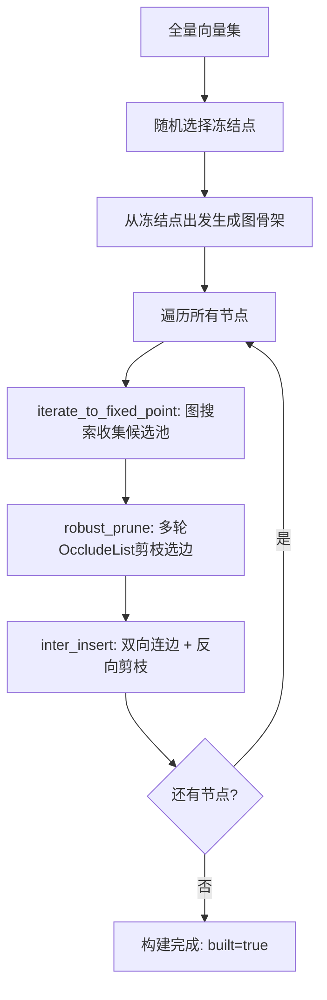
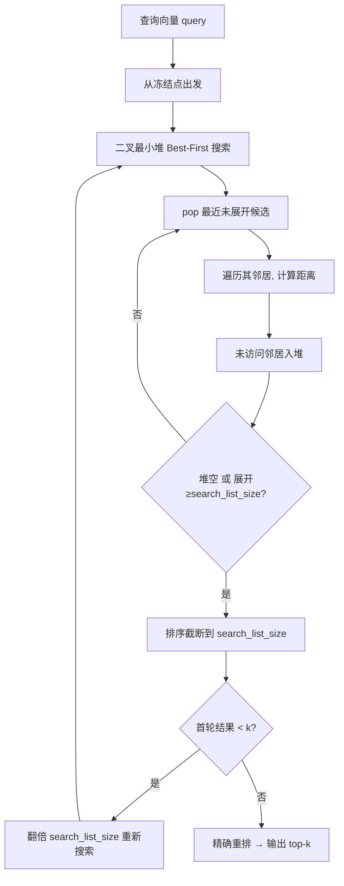
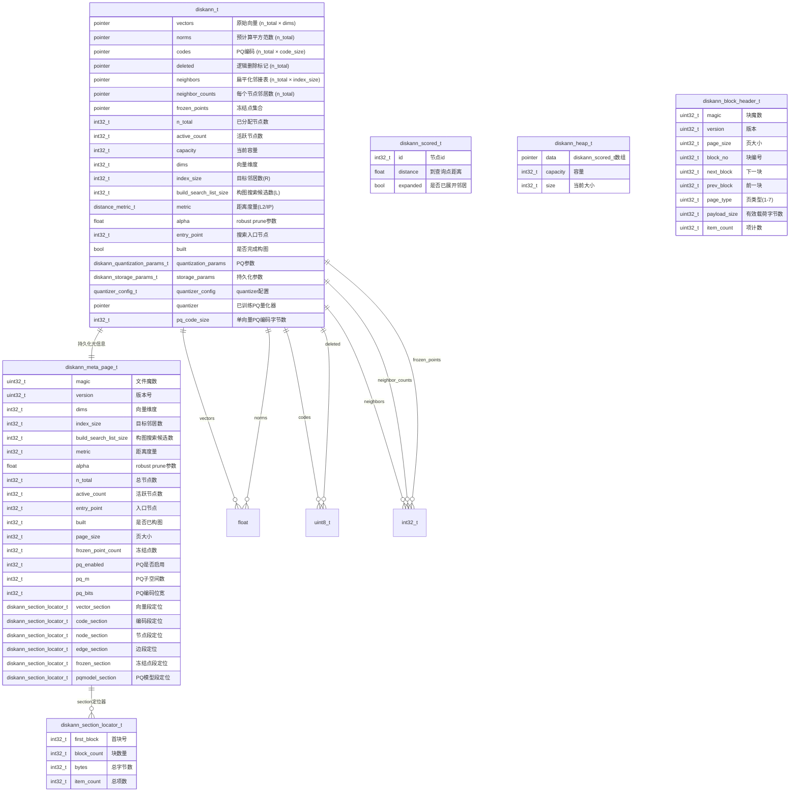
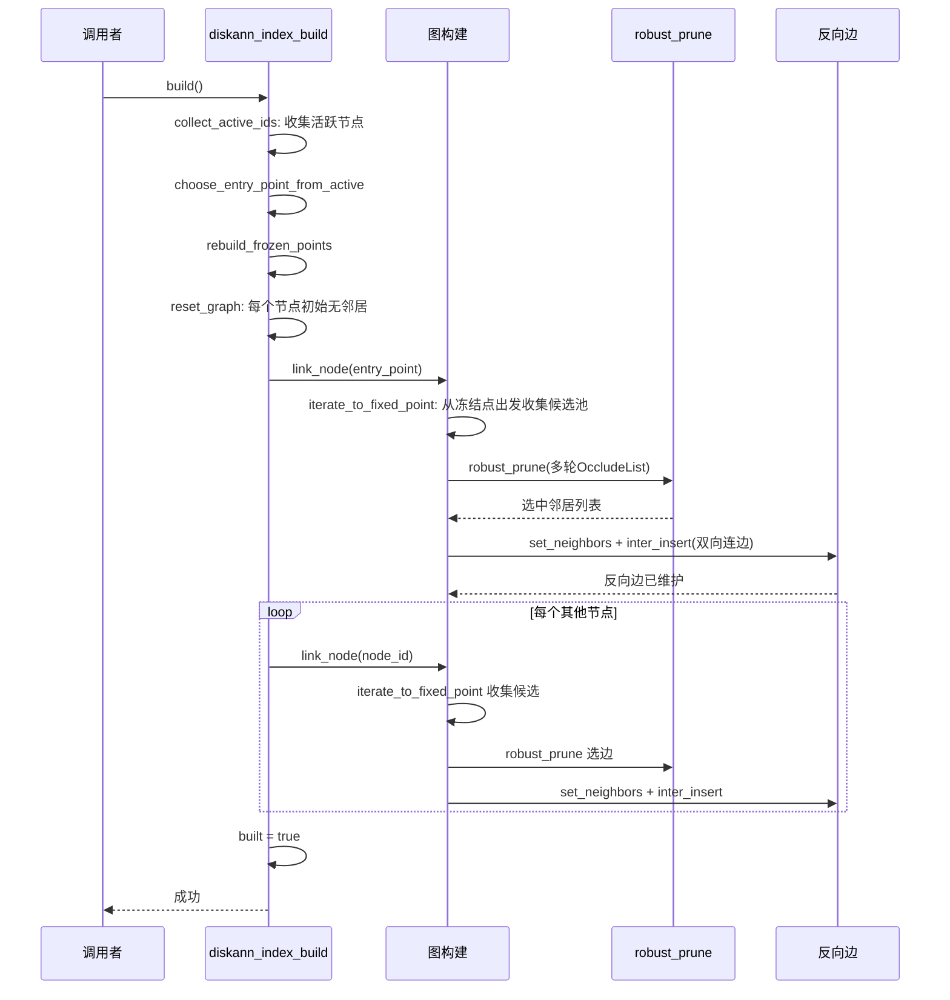
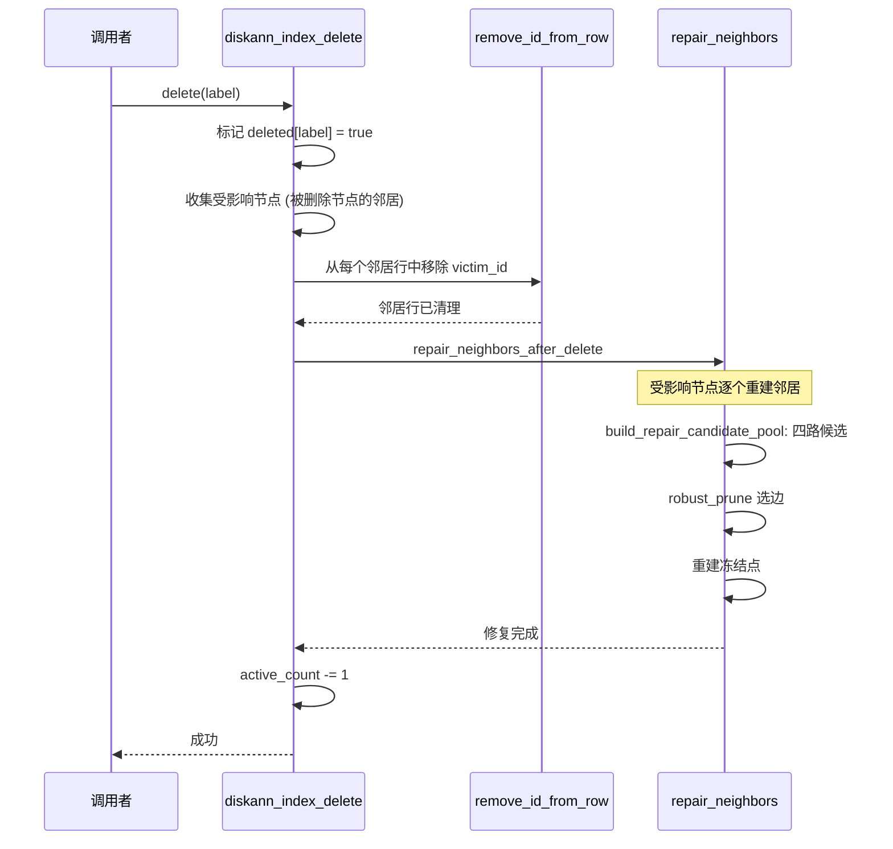
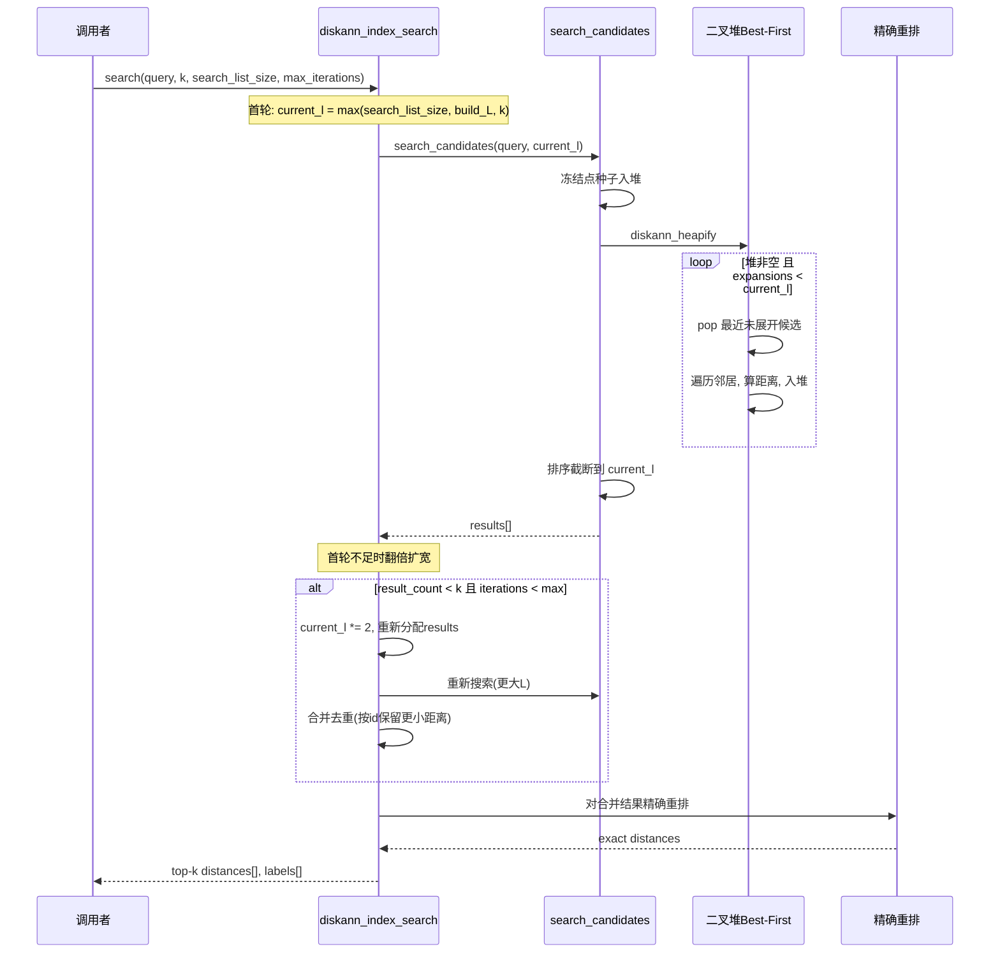
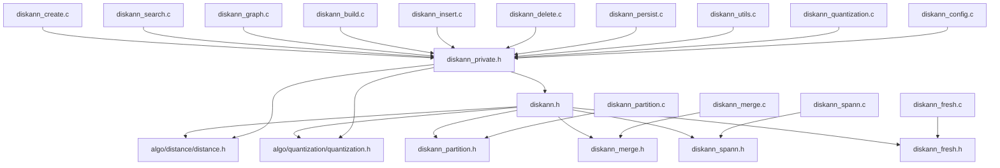

# DiskANN 索引设计文档

## 1. 背景与概述

DiskANN（Disk-based Approximate Nearest Neighbor）是微软提出的面向 SSD 的近似最近邻搜索算法。它基于 Vamana 图结构，通过块式分页文件实现"图在磁盘、数据按需加载"，突破了全内存索引的容量上限。

**适用场景**：千万级以上稠密向量，内存受限但有 SSD，支持增量插入与删除，要求亚毫秒级延迟。

**核心思想**：用 Vamana 算法构建稀疏邻居图（长程边 + 短程边），Robust Prune（多轮 α 递增的 OccludeList 剪枝）保证图质量。搜索时从冻结点种子出发做贪心图遍历。

---

## 2. 算法原理

### 2.1 Vamana 图与 Robust Prune

DiskANN 的核心不同于 HNSW 的分层结构——它只构建**一层图**，但通过以下机制保证搜索效率：

```
               ┌─────●─────┐
               │     │     │
               ●     │     ●
               │╲    │    ╱│
               │ ╲   │   ╱ │
               │  ╲  │  ╱  │
               │   ╲ │ ╱   │
               │    ╲│╱    │
               ●─────●─────●
               │    ╱│╲    │
               │   ╱ │ ╲   │
               │  ╱  │  ╲  │
               │ ╱   │   ╲ │
               ●     ●     ●

        长程边（稀疏跳） + 短程边（精细搜） = 可导航小世界
```

**Robust Prune** 是 Vamana 构图的关键：给定候选池（按距离排序），对候选从近到远依次检查——如果已有选中邻居比当前候选更靠近节点本身，则当前候选被"遮挡"跳过。α 参数控制遮挡容忍度：

```
α × distance(selected, candidate) ≤ distance(candidate, node)
→ candidate 被遮挡，跳过
```

多轮策略：从 α=1.0 开始，每轮 ×1.2，最后一轮到目标 α 值。逐步收紧剪枝，避免早期过度丢弃。

### 2.2 构建流程



### 2.3 搜索流程



---

## 3. 核心数据结构

### 3.1 ER 图



### 3.2 扁平化邻接表

DiskANN 只有一个图（非分层），所有邻居存储在单一扁平数组中：

```
neighbors[node_id * index_size .. (node_id+1) * index_size)
  └── 该节点的邻居 ID 列表

neighbor_counts[node_id]
  └── 实际邻居数（≤ index_size）
```

每行的槽位预分配到 `index_size`，实际邻居不足时槽位值为 -1。

### 3.3 二叉堆（Array-based Min-Heap）

搜索使用数组二叉最小堆管理候选，直接包装 `diskann_scored_t` 数组（无额外内存分配）：

```
heap.data  ─→ candidates 数组 (复用, 无额外分配)
heap.size  ─→ 当前堆大小
heap.capacity ─→ 最大容量

heapify:   O(n) 建堆
push:      O(log n) 插入
pop:       O(log n) 弹出最小
skip_expanded: 跳过堆顶已展开节点
```

### 3.4 冻结点（Frozen Points）

冻结点是图上的稳定入口种子集，类似于 HNSW 的 entry_point 但扩展到多个：

```
frozen_points[0..frozen_point_count)
  └── 全局稳定的高质量入口节点（通常选在图中心附近）
```

搜索和构图都从冻结点集合出发，即使 entry_point 因删除而失效也能正常搜索。

---

## 4. 存储设计

### 4.1 内存布局

```
┌────────────────────────────────────────────────────────────┐
│                       diskann_t                              │
├────────────────────────────────────────────────────────────┤
│  vectors          [float × n_total × dims]     原始向量      │
│  norms            [float × n_total]            平方范数      │
│  codes            [uint8 × n_total × code_size] PQ编码      │
│  deleted          [uint8 × n_total]            删除标记      │
│  neighbors        [int32 × n_total × index_size] 邻接表     │
│  neighbor_counts  [int32 × n_total]            邻居数       │
│  frozen_points    [int32 × frozen_point_count]  冻结点      │
│  quantizer        → PQ量化器                    码本+配置    │
└────────────────────────────────────────────────────────────┘
```

### 4.2 磁盘布局（块式分页文件）

DiskANN 的持久化设计是其区别于 HNSW/IVF 的关键特色。文件按固定页大小（默认 4096B）分成多个块，每块带通用头。

```
┌────────────────────────────────────────────────────────────┐
│ Meta Page (块 0, page_type=1)                               │
│   magic + version + 全部配置 + 6 个 section_locator          │
├────────────────────────────────────────────────────────────┤
│ Vector Section (page_type=2)                                │
│   block_header → payload: float[dims] × item_count           │
│   可能跨多个块 (通过 next_block 链接)                        │
├────────────────────────────────────────────────────────────┤
│ Code Section (page_type=3)                                  │
│   block_header → payload: uint8[code_size] × item_count      │
├────────────────────────────────────────────────────────────┤
│ Node Section (page_type=4)                                  │
│   block_header → payload: diskann_node_record_t[]            │
│   每个 record: {id, neighbor_count, deleted, reserved}       │
├────────────────────────────────────────────────────────────┤
│ Edge Section (page_type=5)                                  │
│   block_header → payload: int32[neighbor_count] × N          │
├────────────────────────────────────────────────────────────┤
│ Frozen Section (page_type=6)                                │
│   block_header → payload: int32[frozen_point_count]          │
├────────────────────────────────────────────────────────────┤
│ PQ Model Section (page_type=7)                              │
│   block_header → payload: 量化器码本                          │
└────────────────────────────────────────────────────────────┘
```

**块通用头结构（`diskann_block_header_t`，每块开头）**：

```
┌────────────────────────────────────────────────┐
│  magic: uint32       (8B)  块校验魔数          │
│  version: uint32     (4B)  版本                │
│  page_size: uint32   (4B)  页大小              │
│  block_no: uint32    (4B)  当前块编号          │
│  next_block: uint32  (4B)  下一个同类型块      │
│  prev_block: uint32  (4B)  上一个同类型块      │
│  page_type: uint32   (4B)  页类型(1-7)         │
│  payload_size: uint32(4B)  载荷字节数           │
│  item_count: uint32  (4B)  本块项数            │
├────────────────────────────────────────────────┤
│  payload: uint8[payload_size]                   │
└────────────────────────────────────────────────┘
```

**Section 定位器**：元信息页中的 `diskann_section_locator_t` 记录每种数据的起始块、块数、字节数、项数。

---

## 5. DML 流程

### 5.1 批量构建（`diskann_index_build`）



**关键步骤**：

1. **收集活跃节点**：跳过已删除的，收集所有活跃节点 ID
2. **选入口点**：从活跃节点中选一个（靠近中心位置）
3. **重建冻结点**：从入口出发做贪婪搜索，找到 `frozen_point_count` 个分布均匀的种子
4. **逐个链接**：对每个节点执行 link 流程（见 5.2）

### 5.2 增量插入 Link 流程（`diskann_link_node` → `diskann_incremental_insert_node`）

```mermaid
sequenceDiagram
    participant Link as diskann_link_node
    participant Iter as iterate_to_fixed_point
    participant Prune as robust_prune
    participant Inter as inter_insert

    Link->>Iter: iterate_to_fixed_point(node_id)
    Note over Iter: 从冻结点出发, 二叉堆贪心搜索
    Iter-->>Link: 候选池 (按距离排序)

    Link->>Prune: robust_prune(candidates)
    Note over Prune: 多轮 α 递增 OccludeList 剪枝
    Prune-->>Link: 选中邻居列表

    Link->>Link: set_neighbors_for_node: 写入正向边
    Link->>Inter: inter_insert: 维护反向边
    loop 每个选中邻居
        Inter->>Inter: 未满→直接加; 已满→重新robust_prune
    end
    Inter-->>Link: 反向边维护完成
```

**关键优化**：

- **冻结点种子**：iterate_to_fixed_point 从冻结点集合出发而非单入口，提高候选池质量
- **多轮 OccludeList**：robust_prune 的 α 从 1.0 逐步递增到目标值，早期松后期紧，避免过度剪枝
- **反向边维护**：inter_insert 保证图的双向连通性——目标节点未满时直接追加，已满时把"旧邻居+新邻居"重新 robust_prune

### 5.3 删除（`diskann_index_delete`）



**关键优化**：

- **逻辑删除**：只标记 `deleted[label] = true`，不立即清理数据，减少删除开销
- **四路候选池**（`diskann_build_repair_candidate_pool`）：修复时候选来自——①自己的旧邻居 ②受害节点邻居 ③二跳邻居（邻居的邻居）④冻结点
- **受影响节点判定**：仅修复与被删除节点互为邻居的节点，而非全图重建
- **退化判断**：受影响节点过多时退化为全量 rebuild

---

## 6. DQL 流程（搜索）

### 6.1 搜索主流程



**关键优化**：

- **冻结点种子**：搜索从多个冻结点出发而非单入口，避免单入口在删除后失效
- **二叉堆 Best-First**：数组二叉最小堆包装 candidates 数组，无额外 malloc；`skip_expanded` 跳过已展开节点
- **渐进搜索扩宽**：首轮搜索不足 k 个时自动翻倍 `search_list_size` 重新搜索，多轮结果合并去重
- **精确重排**：对候选做原始向量精确距离计算，保证最终 top-k 精度

---

## 7. 优化算法详解

### 7.1 多轮递增 OccludeList（Robust Prune）

```
rounds = ceil(log(alpha) / log(1.2))

for round in 0..rounds:
    cur_alpha = 1.0 × 1.2^round  (最后一轮 clamp 到 target α)
    重置 occlude_factor 数组

    for each (candidate_i, dist_i) in pool (按距离升序):
        if occluded: continue
        if not selected: 选中 candidate_i

        for each candidate_j after i:
            between_ij = fast_l2(candidate_i, candidate_j)
            if cur_alpha × between_ij ≤ dist_j:
                occlude[j] = true   // i 遮挡了 j

如果选不够 index_size: 按距离补齐
```

α 越大 → 每轮遮挡越激进 → 图越稀疏但长程边越多。

### 7.2 快速 L2 距离（预计算范数）

```
diskann_fast_l2(id_a, id_b) = ||v[a] - v[b]||²
  = norms[a] + norms[b] - 2 × dot(v[a], v[b])
```

`norms[i] = ||v[i]||²` 在添加向量时预计算，L2 距离只需一次点积 + 两次加法，省去平方和计算。

### 7.3 渐进搜索扩宽

```
current_l = max(search_list_size, build_L, k)
iterations = 0
while result_count < k and iterations < max_iterations:
    search_candidates(query, current_l)
    if iterations == 0: merged = results
    else: 合并去重(按id保留更小距离)
    if current_l >= active_count: break
    current_l = min(current_l * 2, active_count)
    iterations++
```

避免一次用过大 L 导致搜索变慢，先用小 L 探路，不足再翻倍。

### 7.4 删除修复的四路候选池

```
候选来源:
1. 自己的旧邻居（排除已删除）
2. 被删除节点的邻居（受害节点）
3. 二跳邻居（邻居的邻居）
4. 冻结点
→ 全部去重后送入 robust_prune
```

---

## 8. 参数配置说明

| 参数 | 默认值 | 范围 | 说明 |
|------|-------|------|------|
| `dims` | 构造指定 | >0 | 向量维度 |
| `index_size` (R) | 构造指定 | 4~256 | 目标邻居数，越大召回越高但内存/搜索成本越大 |
| `build_search_list_size` (L) | 构造指定 | ≥R | 构图时搜索候选数，越大图质量越高但构图越慢 |
| `search_list_size` | 查询指定 | ≥k | 搜索时扫描候选数，越大召回越高 |
| `max_iterations` | 1 | 1~10 | 渐进搜索最大轮数 |
| `alpha` | 1.2 | 1.0~2.0 | Robust Prune 遮挡参数，越大图越稀疏 |
| `metric` | 构造指定 | L2/IP | 距离度量 |
| `pq_m` | dims%m==0 | 1~dims | PQ 子空间数 |
| `pq_bits` | 自动 | 4~8 | PQ 编码位宽 |
| `page_size` | 4096 | >header+meta | 磁盘页大小 |
| `frozen_point_count` | 4 | 1~N | 冻结点数量 |

**调优方向**：
- 提高召回：增大 `index_size`、`build_search_list_size`、`search_list_size`
- 降低内存：减小 `index_size`，启用 PQ
- 加速构图：减小 `build_search_list_size`、`alpha`
- 大容量场景：增大 `frozen_point_count`（更多入口种子）
- SSD 优化：`page_size` 对齐 SSD 物理页大小（4KB/8KB）

---

## 9. 复杂度分析

| 操作 | 时间复杂度 | 空间复杂度 |
|------|-----------|-----------|
| 创建 | O(1) | O(initial_capacity × (dims + index_size)) |
| 构建 | O(N × L × log N × R) | O(L × N) 临时 |
| 增量插入 | O(L × log N × R + R × log R) | O(L) |
| 搜索 | O(L × log N × R) | O(L + N_visited) |
| 删除 | O(A × L × R) | O(L × N) |
| 保存 | O(N × (dims + code_size + R)) | O(1) |
| 加载 | O(N × (dims + code_size + R)) | O(N × (dims + R)) |
| 存储（内存） | — | O(N × (dims + R + code_size)) |

- `N`：节点总数，`R`：index_size，`L`：search_list_size
- `A`：受影响节点数（删除时）

---

## 10. API 接口一览

| 函数 | 说明 |
|------|------|
| `diskann_index_create(dims, index_size, build_L, metric)` | 创建索引 |
| `diskann_index_add(index, n, vectors)` | 批量添加向量（不构图） |
| `diskann_index_insert(index, vector, label)` | 增量插入单个向量（含图链接） |
| `diskann_index_delete(index, label)` | 按 ID 删除（标记+修复） |
| `diskann_index_build(index)` | 构建 Vamana 图 |
| `diskann_index_train_pq(index)` | 训练 PQ 量化器 |
| `diskann_index_search(index, query, k, L, max_iter, dist, labels)` | 搜索 Top-K |
| `diskann_index_save(index, path)` | 保存到磁盘（块式分页格式） |
| `diskann_index_load(path)` | 从磁盘加载 |
| `diskann_index_size(index)` | 查询总节点数 |
| `diskann_index_active_size(index)` | 查询活跃节点数 |
| `diskann_index_dims(index)` | 查询向量维度 |
| `diskann_index_entry_point(index)` | 查询入口节点 |
| `diskann_index_frozen_point_count(index)` | 查询冻结点数 |
| `diskann_index_is_built(index)` | 查询是否已构图 |
| `diskann_index_has_pq(index)` | 查询是否启用 PQ |
| `diskann_index_set_alpha(index, alpha)` | 设置 alpha 参数 |
| `diskann_index_get_alpha(index)` | 获取 alpha 参数 |
| `diskann_index_set_quantization_params(index, params)` | 设置量化参数 |
| `diskann_index_get_quantization_params(index, params)` | 获取量化参数 |
| `diskann_index_set_storage_params(index, params)` | 设置存储参数 |
| `diskann_index_get_storage_params(index, params)` | 获取存储参数 |
| `diskann_index_drop(index)` | 销毁索引 |

## 12. 新增优化方案 (v2)

### 12.1 Merge-Vamana（分图合并）

Merge-Vamana 解决超大规模数据（亿级向量）的单次构图瓶颈，支持分图独立构建后合并。

**核心思想**：
```
┌─────────┐  ┌─────────┐  ┌─────────┐
│ 子图 G1  │  │ 子图 G2  │  │ 子图 G3  │     ← 3 个分区独立构建
│  100万  │  │  100万  │  │  100万  │
└────┬────┘  └────┬────┘  └────┬────┘
     │            │            │
     └────────────┼────────────┘
                  ↓
         ┌─────────────────┐
         │  Merge 合并     │
         │  1. 节点去重   │
         │  2. 边合并     │
         │  3. 跨分区边   │
         └────────┬────────┘
                  ↓
         ┌─────────────────┐
         │  全局图 G      │
         │   300万节点    │
         └─────────────────┘
```

**分区策略**：
- `DISKANN_PARTITION_RANDOM`：随机分配向量到分区
- `DISKANN_PARTITION_KMEANS`：K-Means 聚类分区
- `DISKANN_PARTITION_COORDINATE_RANGE`：按坐标范围切分

**使用示例**：
```c
diskann_config_t *config = diskann_config_default(128, DISTANCE_METRIC_L2);
config->merge.enabled = true;
config->merge.partition_count = 8;
config->merge.overlap_ratio = 0.1f;  // 10% 重叠

diskann_t *index = diskann_index_create_with_config(config);
```

### 12.2 SPANN（分区层次索引）

SPANN (SParse ANN) 通过将向量空间分区，使搜索只访问相关分区，减少 IO 操作。

**核心思想**：
```
查询 ──→ Partition Selection (路由)
               │
               ├──→ P1 (不相关, skip)  ✓
               ├──→ P2 (相关, 搜索子图)  ✓
               ├──→ P3 (相关, 搜索子图)  ✓
               └──→ P4 (不相关, skip)  ✓

关键: 需要轻量级分区元数据快速判断相关性
```

**使用示例**：
```c
diskann_config_t *config = diskann_config_default(128, DISTANCE_METRIC_L2);
config->spann.enabled = true;
config->spann.max_partitions = 128;
config->spann.search_partitions = 8;  // 每次最多搜索 8 个分区

diskann_t *index = diskann_index_create_with_config(config);
```

### 12.3 FreshDiskANN（增量更新）

FreshDiskANN 将索引分为静态区（Frozen）和动态区（Fresh），支持高频增量插入。

**核心思想**：
```
┌─────────────────────┐  ┌─────────────────────┐
│   静态区 (Frozen)   │  │   动态区 (Fresh)    │
│                     │  │                     │
│  原始向量 + 图结构   │  │  原始向量 + 图结构   │
│  磁盘持久化         │  │  内存索引           │
└─────────────────────┘  └─────────────────────┘

搜索: 静态区(磁盘IO) + 动态区(内存) → 合并结果
合并: 当动态区达到 merge_threshold → 合并到静态区
```

**使用示例**：
```c
diskann_config_t *config = diskann_config_default(128, DISTANCE_METRIC_L2);
config->fresh.enabled = true;
config->fresh.fresh_capacity = 100000;   // 动态区容量 10 万
config->fresh.merge_threshold = 80000;   // 8 万时触发合并

diskann_t *index = diskann_index_create_with_config(config);
```

### 12.4 统一配置架构

所有优化通过 `diskann_config_t` 统一控制：

```c
typedef struct diskann_config {
    /* 基础参数 */
    int32_t dims;
    int32_t index_size;
    int32_t build_search_list_size;
    distance_metric_t metric;

    /* 各模块配置 */
    diskann_quantization_config_t quantization;
    diskann_merge_config_t merge;
    diskann_spann_config_t spann;
    diskann_fresh_config_t fresh;
    diskann_storage_config_t storage;
} diskann_config_t;
```

**配置优先级**：
1. 基础参数 (dims, metric, index_size)
2. 量化配置 (quantization) ─→ 创建量化器
3. 存储配置 (storage) ─→ 初始化持久化
4. Merge 配置 (merge) ─→ 可选，延后处理
5. SPANN 配置 (spann) ─→ 可选，延后处理
6. Fresh 配置 (fresh) ─→ 可选，延后处理

---

## 13. 依赖关系



内部文件职责：

| 文件 | 职责 |
|------|------|
| `diskann_create.c` | 创建、销毁、参数管理、访问器 |
| `diskann_search.c` | Best-First 搜索（二叉堆）、渐进扩宽、精确重排、SPANN/Fresh 搜索 |
| `diskann_graph.c` | Robust Prune、iterate_to_fixed_point、inter_insert、删除修复 |
| `diskann_build.c` | 批量 Vamana 构图、冻结点重建 |
| `diskann_insert.c` | 增量插入 |
| `diskann_delete.c` | 逻辑删除标记 + repair_neighbors_after_delete |
| `diskann_persist.c` | 块式分页 save/load、扩展持久化 |
| `diskann_utils.c` | 容量扩容、范数预计算、距离函数、堆操作 |
| `diskann_quantization.c` | PQ 训练、编码、ADC 距离计算 |
| `diskann_config.c` | 统一配置管理 |
| `diskann_partition.c` | 分区策略（Random/K-Means/Coordinate-Range） |
| `diskann_merge.c` | Merge-Vamana 子图合并 |
| `diskann_spann.c` | SPANN 分区索引 |
| `diskann_fresh.c` | FreshDiskANN 动态区管理 |

---

## 14. 已知限制与未来规划

| 限制 | 说明 |
|------|------|
| 构建耗时 | 全量 Vamana 构图 O(N × L × log N × R)，大规模数据构建慢 |
| 批量添加不构图 | `diskann_index_add` 仅添加向量不自动构图，需要显式调用 build |
| 删除影响面 | 删除后邻居修复可能影响大量节点，极端情况退化为全量重建 |
| 无并发支持 | 单线程设计，搜索和写入不兼容 |
| PQ 重建受限 | 当前仅支持非量化模式下的向量重建 |

**未来规划**：
- [ ] 支持并行构图（多线程 link_node）
- [ ] 支持 WAL 增量持久化
- [ ] 支持读写锁（并发搜索）
- [ ] 实现 PQ 解码重建向量
- [ ] 支持磁盘直读模式（不预加载全部向量到内存）
- [ ] Merge 合并后图质量优化（增加跨分区边）
- [ ] SPANN 路由算法优化（使用更复杂的距离模型）
- [ ] Fresh 自动后台合并（不影响搜索）
