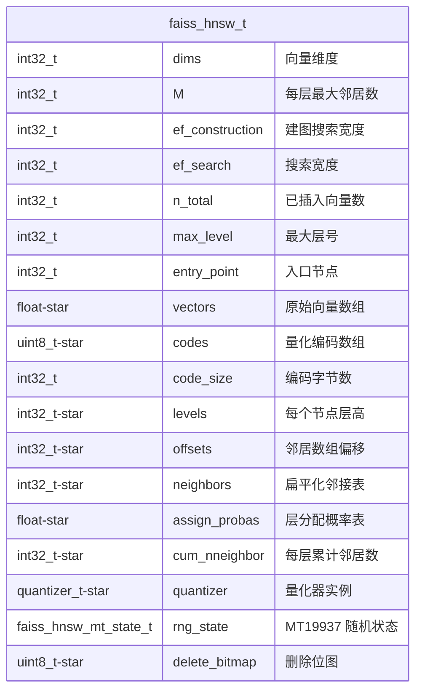
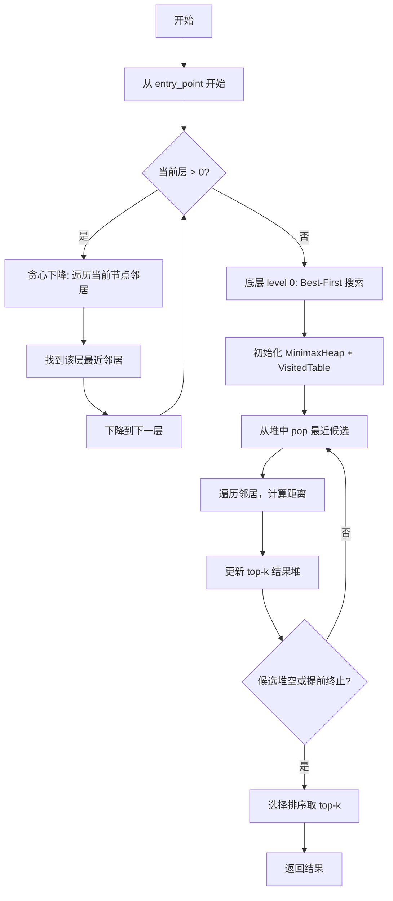
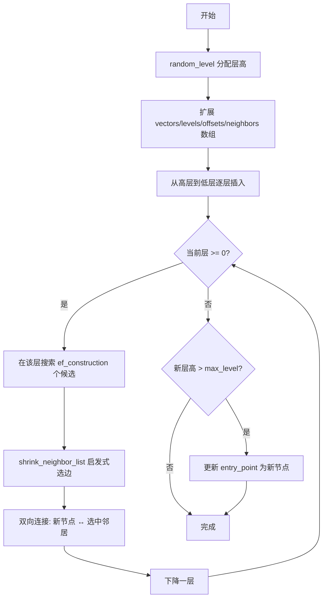

# faiss_hnsw 设计文档

## 概述

faiss_hnsw 是内存版 HNSW 索引实现，参考 FAISS `HNSW.cpp` 重写，使用 C11 语言实现，无外部依赖。

## 整体架构

```
┌─────────────────────────────────────────────────────────────┐
│                       faiss_hnsw_t                          │
├─────────────────────────────────────────────────────────────┤
│  向量存储：float *vectors（连续内存数组）                    │
│  图结构：levels / offsets / neighbors（flattened 邻居数组）  │
│  量化编码：codes + code_size（可选 SQ/PQ/LVQ/RaBitQ）       │
│  搜索辅助：MinimaxHeap + VisitedTable                         │
│  随机数：MT19937（seed=12345，与 FAISS 一致）               │
└─────────────────────────────────────────────────────────────┘
```

## 核心数据结构



## 搜索流程



## 插入流程



## 扁平化邻接表布局

HNSW 的关键设计：所有层级的邻接信息存储在**单一扁平数组 `neighbors`** 中。

```
offsets[node]  ────────────┬──────────────────────┬──────────────────────
                          │  Level 0 neighbors    │  Level 1 neighbors
                          │  (最多 2M 个)          │  (最多 M 个)
                          │                       │
neighbors:  [n0,n1,...│n2,n3,..│-1,-1,...│n4,...│-1,...│ ... ]
                │         │         │
                │         │         └── 上层邻居
                │         └── M个槽(底层2M)
                └── cum_nneighbor[layer_no] 定位
```

读取节点 `no` 在 `layer_no` 层的邻居：

```c
begin = offsets[no] + cum_nneighbor[layer_no];
end   = offsets[no] + cum_nneighbor[layer_no + 1];
// neighbors[begin .. end) 即为该节点在该层的邻居列表
```

## 量化集成

| 量化类型 | 说明 | code_size |
|---------|------|-----------|
| QUANTIZATION_TYPE_NONE | 原始浮点向量 | 0 |
| QUANTIZATION_TYPE_SQ | 标量量化（8-bit） | dims |
| QUANTIZATION_TYPE_PQ | 乘积量化 | pq_m × ceil(pq_bits/8) |
| QUANTIZATION_TYPE_LVQ | 学习向量量化 | 由量化器配置 |
| QUANTIZATION_TYPE_RQ | RaBitQ 量化 | 由量化器配置 |

量化路径：
- **插入时**：调用 `quantizer_encode()` 将浮点向量编码为 `codes`
- **搜索时**：预计算 ADC 距离表（`quantizer_compute_distance_table`），后续只需 O(1) 查表

## 与 FAISS 的差异

| 特性 | FAISS HNSW | faiss_hnsw |
|------|-----------|------------|
| 语言 | C++17 | C11 |
| 随机数 | std::mt19937 | MT19937 手写实现 |
| 堆 | std::priority_queue | MinimaxHeap 手写实现 |
| 访问表 | 位图 | VisitedTable 手写实现 |
| 距离计算 | FAISS 距离函数 | 内联 L2/Cosine 实现 |
| 接口风格 | 类方法 | 函数指针 + 结构体 |
| 内存管理 | RAII | 手动 malloc/free |

## 文件结构

| 文件 | 职责 |
|------|------|
| `faiss_hnsw.h` | 公共 API 头文件（不透明指针） |
| `faiss_hnsw_internal.h` | 内部结构体定义 |
| `faiss_hnsw_create.c` | 创建、销毁、参数管理 |
| `faiss_hnsw_insert.c` | 向量存储、层高分配、图构建 |
| `faiss_hnsw_search.c` | 搜索（贪心下降 + Best-First） |
| `faiss_hnsw_search_layer.c` | 单层搜索算法 |
| `faiss_hnsw_level.c` | 层高分配概率计算 |
| `faiss_hnsw_minimax_heap.c` | MinimaxHeap 实现 |
| `faiss_hnsw_visited_table.c` | VisitedTable 实现 |
| `faiss_hnsw_quantize.c` | 量化相关辅助函数 |
| `faiss_hnsw_stubs.c` | 占位实现（未完成功能） |

## API 接口

```c
// 创建索引
faiss_hnsw_t *faiss_hnsw_index_create(int32_t M, int32_t dims,
    int32_t ef_construction, distance_metric_t metric,
    quantization_type_t quant_type);

// 批量插入向量
int32_t faiss_hnsw_index_add(faiss_hnsw_t *index, int32_t n,
    const float *vectors);

// 搜索最近邻
int32_t faiss_hnsw_index_search(faiss_hnsw_t *index, const float *query,
    int32_t k, int32_t ef_search, float *distances, int32_t *ids);

// 销毁索引
void faiss_hnsw_index_drop(faiss_hnsw_t *index);
```

## 已知限制

- 不支持删除操作（需重建索引）
- 不支持持久化（全内存，进程重启后需重建）
- 无批量搜索优化（单 query 搜索，高并发需上层并行）