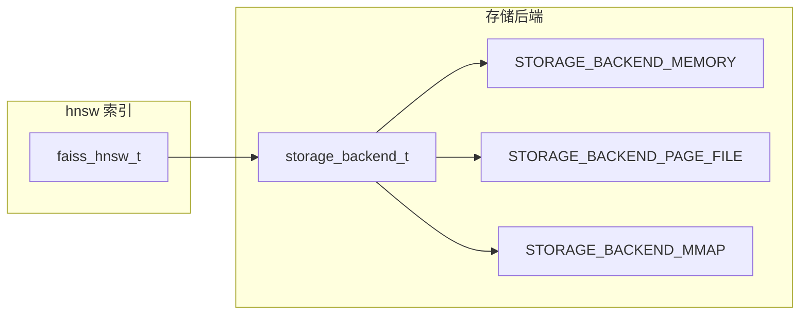
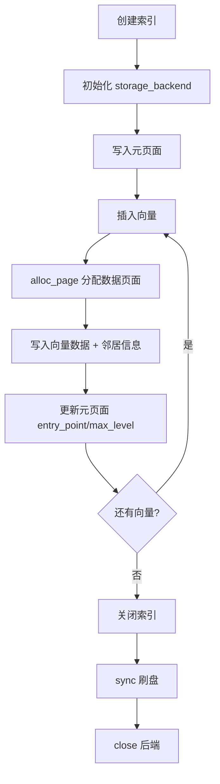
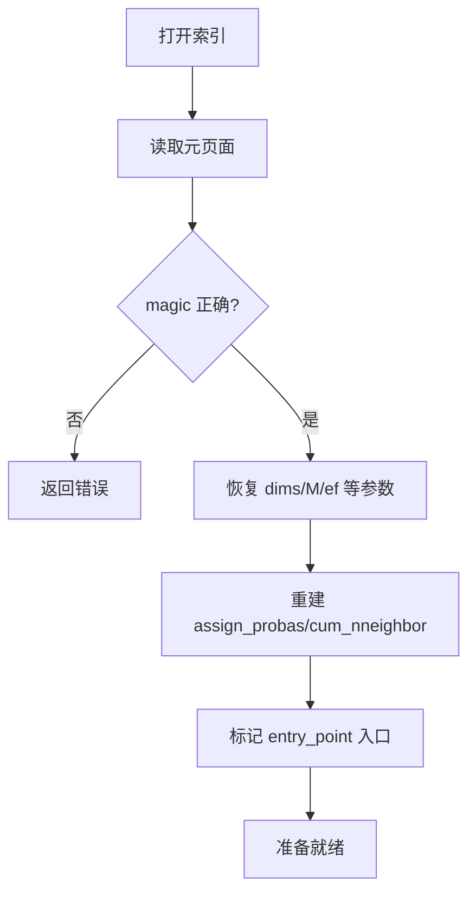
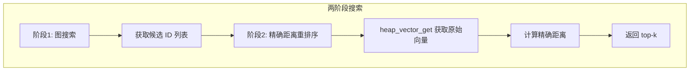
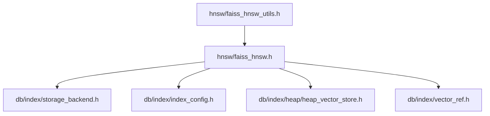

# hnsw 设计文档（持久化版）

## 概述

hnsw 是持久化版 HNSW 索引实现，参考 pgVector `hnsw.c` 的页面管理风格，与 faiss_hnsw 共享相同的图算法逻辑，区别仅在存储层。

## 核心差异：内存版 vs 持久化版

| 特性 | faiss_hnsw（内存版） | hnsw（持久化版） |
|------|---------------------|------------------|
| 向量存储 | `float *vectors` 连续数组 | `storage_backend_t` 页面文件 |
| 图结构 | `levels/offsets/neighbors` 数组 | 页面内嵌 + 动态加载 |
| 生命周期 | 进程内有效 | 持久化到磁盘 |
| 恢复能力 | 无 | 支持从文件恢复 |
| Heap 存储 | 不支持 | 支持 `heap_vector_store_t` |
| 删除支持 | 位图标记 | `vector_delete_bitmap_t` |

## 页面布局

```mermaid
flowchart TD
    subgraph 元页面 [元页面 Page 0]
        M1[magic: 0x484E5357 'HNSW']
        M2[version: 1]
        M3[dims, M, ef_construction, ef_search]
        M4[max_level, entry_point, n_total]
        M5[metric, quantization_type]
        M6[code_size, quantizer_config]
    end
    subgraph 数据页面 [数据页面 Page 1..N]
        D1[页面头部: page_id, next_page]
        D2[向量数据块: dims × float]
        D3[邻居信息: level_count, neighbors[]]
    end
    M1 --> M2 --> M3 --> M4 --> M5 --> M6
    D1 --> D2 --> D3
```

## 存储后端架构



存储后端选择策略（`faiss_hnsw_index_create_with_config`）：
- `persist_enabled=false` → `STORAGE_BACKEND_MEMORY`
- `persist_enabled=true` + `storage_type=PAGE_FILE` → `STORAGE_BACKEND_PAGE_FILE`
- `persist_enabled=true` + `storage_type=MMAP` → `STORAGE_BACKEND_MMAP`

## 持久化流程



## 恢复流程



## Heap 向量存储集成



当 `heap_store != NULL` 时：
- `vector_refs[i]` 保存第 i 个向量在 Heap 中的位置
- 搜索阶段通过 `heap_vector_get` 获取原始向量做精确重排序
- 索引本身不再持有完整向量（`vectors` 保持为 NULL）

## 算法一致性

持久化版 hnsw 与内存版 faiss_hnsw 使用相同的算法逻辑：

| 算法组件 | 实现 |
|---------|------|
| 层级分配概率 | `ml = 1/log(M)`，与 FAISS 一致 |
| 搜索算法 | 逐层贪婪下降 + 底层 beam search |
| 建链策略 | search → shrink → add_link |
| ef_construction | 控制构图精度 |
| 启发式选边 | `shrink_neighbor_list` 避免邻居遮挡 |

## 删除支持

```c
// 删除标记（不实际删除，仅标记）
int32_t faiss_hnsw_index_delete(faiss_hnsw_t *index, int32_t id);
int32_t faiss_hnsw_index_delete_batch(faiss_hnsw_t *index, const int32_t *ids, int32_t n);

// 撤销删除
int32_t faiss_hnsw_index_undelete(faiss_hnsw_t *index, int32_t id);

// 查询删除状态
bool faiss_hnsw_index_is_deleted(const faiss_hnsw_t *index, int32_t id);
```

删除实现为位图标记，搜索时跳过已删除节点。

## API 接口

```c
// 使用配置创建（支持持久化）
faiss_hnsw_t *faiss_hnsw_index_create_with_config(const index_config_t *config);

// 绑定存储后端
int faiss_hnsw_index_set_storage(faiss_hnsw_t *index, storage_backend_t *backend);

// 绑定 Heap 向量存储
int faiss_hnsw_index_set_heap_store(faiss_hnsw_t *index, heap_vector_store_t *heap_store);
heap_vector_store_t *faiss_hnsw_index_get_heap_store(const faiss_hnsw_t *index);

// 删除相关 API
int32_t faiss_hnsw_index_delete(faiss_hnsw_t *index, int32_t id);
int32_t faiss_hnsw_index_delete_batch(faiss_hnsw_t *index, const int32_t *ids, int32_t n);
int32_t faiss_hnsw_index_undelete(faiss_hnsw_t *index, int32_t id);
bool faiss_hnsw_index_is_deleted(const faiss_hnsw_t *index, int32_t id);
```

## 实现状态

当前为**占位实现**（`hnsw_placeholder.c`），以下功能待完成：

- [ ] 页面布局设计与实现
- [ ] 持久化写入流程
- [ ] 从文件恢复图结构
- [ ] Heap 向量存储集成
- [ ] 删除位图完整实现
- [ ] 存储后端绑定与生命周期管理

## 依赖关系

