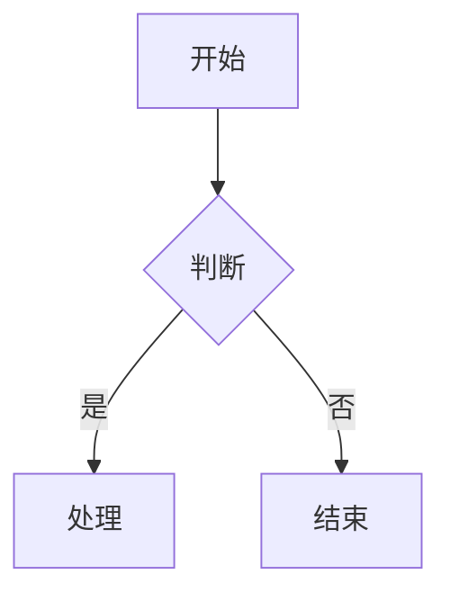

# Mermaid to Excalidraw

将 Mermaid 图表转换为 Excalidraw 手绘风格的命令行工具。

## 安装

```bash
pip install -e .
```

或者安装依赖后直接运行：

```bash
pip install click
python -m mermaid2excalidraw.main --help
```

## 使用方法

### 单文件转换

```bash
mermaid2excalidraw convert input.mmd -o output.excalidraw.json
```

### 批量转换

```bash
mermaid2excalidraw batch diagrams/ -o output/ -r
```

### 预览

```bash
mermaid2excalidraw preview diagram.mmd
```

## 支持的 Mermaid 语法

### 节点形状

| Mermaid | 形状 |
|---------|------|
| `[label]` | 矩形 |
| `(label)` | 圆角矩形 |
| `((label))` | 圆形 |
| `{label}` | 菱形 |
| `[(label)]` | 圆柱形 |

### 边类型

| Mermaid | 样式 |
|---------|------|
| `-->` | 实线箭头 |
| `--text-->` | 带标签的实线 |
| `-.->` | 虚线箭头 |
| `==>` | 加粗箭头 |

### 子图

```mermaid
subgraph id[标签]
    A --> B
end
```

## 示例

### 输入 (simple-flow.mmd)



### 输出

生成的 Excalidraw JSON 可以在 VSCode 的 Excalidraw 插件中直接打开。

## 开发

```bash
# 运行测试
python tests/test_parser.py
python tests/test_layout.py
python tests/test_integration.py

# 或使用 pytest
pip install pytest
pytest tests/
```

## 项目结构

```
mermaid2excalidraw/
├── parser/          # Mermaid 解析器
│   ├── ir.py        # 中间表示定义
│   └── flowchart.py # 流程图解析
├── layout/          # 布局引擎
│   └── layered.py   # 层次布局算法
├── style/           # 样式配置
│   └── default.py    # 默认主题
├── generator/        # Excalidraw 生成器
│   └── excalidraw.py
├── tests/           # 测试用例
├── examples/        # 示例文件
└── main.py         # CLI 入口
```

## License

MIT
