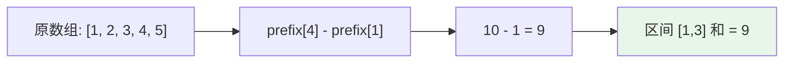

# 前缀和 (Prefix Sum)

## 概述

前缀和是一种预处理技术，通过预先计算数组的前 n 项和来加速区间查询。

## 基本公式

```
prefix[i] = arr[0] + arr[1] + ... + arr[i-1]

区间和 [l, r] = prefix[r+1] - prefix[l]
```

## 可视化示例

### 前缀和构建过程

```
原数组:   [1,  2,  3,  4,  5]
索引:       0   1   2   3   4

前缀和:   [0,  1,  3,  6, 10, 15]
索引:       0   1   2   3   4   5
           ↑
         prefix[0] = 0 (哨兵)
```

### 区间和查询

查询区间 [1, 3] 的和 (即求 2+3+4)：



## LeetCode 题目

| 题号 | 题目 | 难度 |
|------|------|------|
| 3159 | [查询运算后球的价值](../3159_query_results/) | 中等 |
