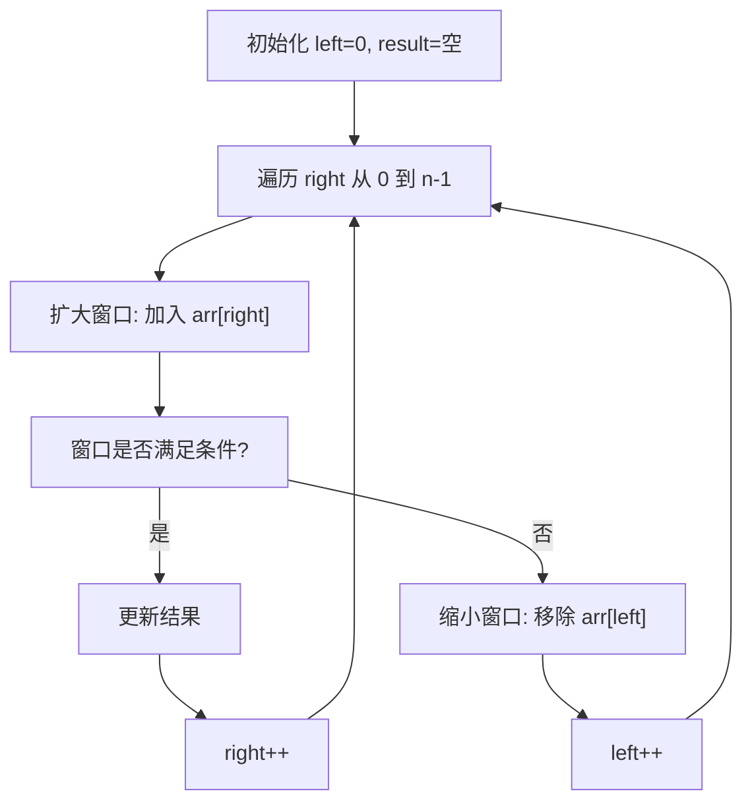

# 滑动窗口 (Sliding Window)

## 概述

滑动窗口是一种通过维护一个窗口来遍历数组的技术，可以将 O(n²) 的问题优化到 O(n)。

## 窗口类型

| 类型 | 说明 |
|------|------|
| 固定窗口 | 窗口大小固定 |
| 变化窗口 | 窗口大小根据条件变化 |

## 可视化示例

### 滑动窗口示意

```
数组: [1, 3, -1, -3, 5, 3, 6, 7]
窗口大小 k = 3

窗口1: [<span style='color:#9f9'>1, 3, -1</span>, -3, 5, 3, 6, 7]  → max = 3
窗口2: [1, <span style='color:#9f9'>3, -1, -3</span>, 5, 3, 6, 7]  → max = 3
窗口3: [1, 3, -1, <span style='color:#9f9'>-3, 5, 3</span>, 6, 7]  → max = 5
窗口4: [1, 3, -1, -3, <span style='color:#9f9'>5, 3, 6</span>, 7]  → max = 6
窗口5: [1, 3, -1, -3, 5, <span style='color:#9f9'>3, 6, 7</span>]  → max = 7

结果: [3, 3, 5, 6, 7]
```

### 滑动窗口算法流程



## LeetCode 题目

| 题号 | 题目 | 难度 |
|------|------|------|
| 1984 | [学生分数的最小差值](../1984_minimum_difference/) | 简单 |
| 2270 | [分割数组的方案数](../2270_ways_to_split/) | 中等 |
| 3297 | [统计相似字符串对的数目](../3297_count_matching/) | 简单 |
