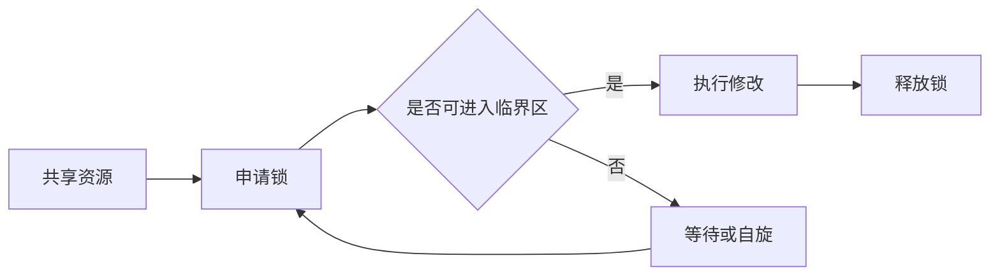
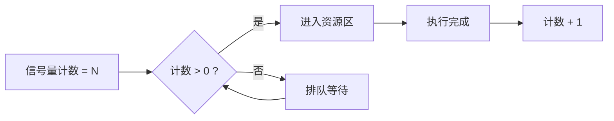
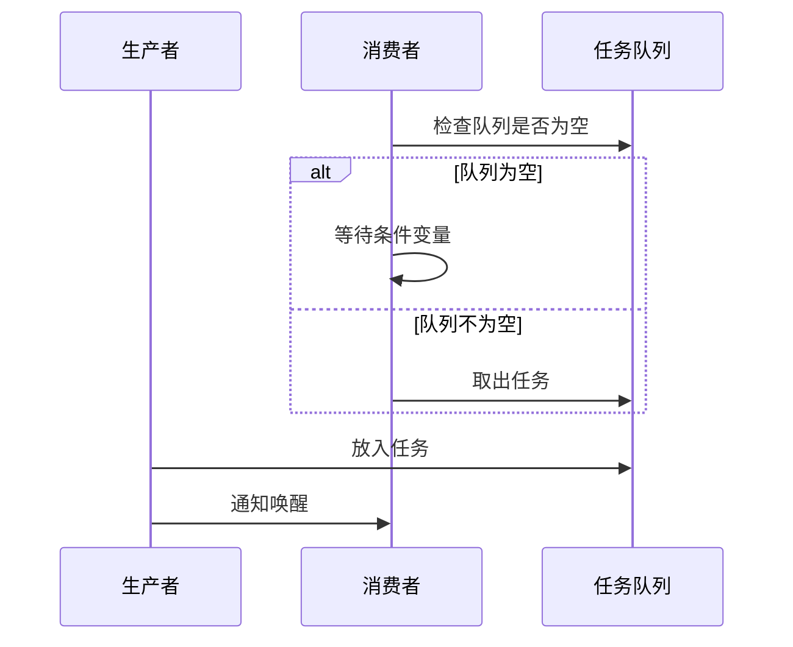
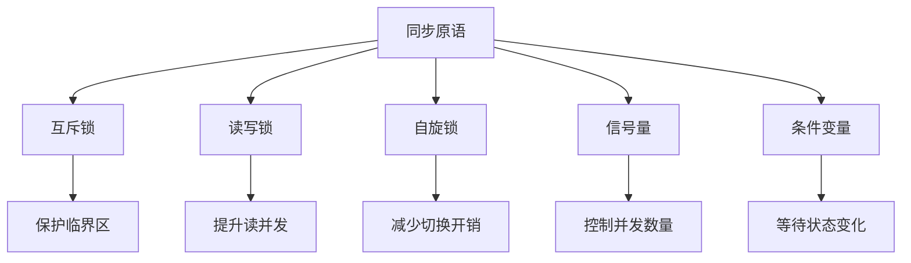

# 锁机制

> 面试定位：这篇内容重点回答“为什么需要锁”“锁有哪些类型”“死锁为什么会发生”“业务里怎么避免锁问题”这几类高频问题。

---

## 1. 锁是什么

锁是一种并发控制手段，用来协调多个线程、进程或事务对共享资源的访问。

共享资源可以是：

- 内存中的共享变量。
- 文件、句柄、缓存条目。
- 数据库中的行、页、表。

锁的核心作用很简单：

- 保证同一时刻只有符合条件的访问可以进入临界区。
- 让并发操作在逻辑上表现得像“按某种顺序执行”。

如果没有锁，多个执行单元可能同时修改同一份数据，结果就会出现覆盖、丢失更新、脏数据等问题。

---

## 2. 为什么需要锁

并发本身不是问题，问题在于“多个执行单元同时修改同一资源”。

常见场景：

1. 余额扣减。
- 两个请求同时给同一账户扣款，如果没有保护，可能出现超扣或余额不一致。

2. 库存扣减。
- 多个订单同时抢最后一件商品，没有锁就会出现超卖。

3. 配置刷新。
- 一个线程在更新配置，另一个线程正在读取，可能读到中间态。

4. 数据库并发写。
- 多个事务同时更新同一行，如果不控制并发，结果无法保证正确性。

一句话总结：

- 锁的本质是用可控的等待，换取数据一致性。

---

## 3. 锁的基本构成

一个锁通常至少要回答 4 个问题：

1. 锁住谁。
- 是某个对象、某一行数据、某个范围，还是整张表。

2. 锁住什么操作。
- 是读、写，还是只允许一种读写模式。

3. 谁能拿锁。
- 是所有人都能排队，还是只有满足条件的访问能进入。

4. 什么时候释放。
- 是函数返回时释放，还是事务提交时释放，还是显式解锁时释放。

只要把这 4 件事说清楚，锁问题基本就能讲明白。

---

## 4. 常见类型

### 4.1 按作用范围分

1. 互斥锁
- 同一时刻只允许一个执行单元进入临界区。
- 最常见的锁模型。
- 优势：语义直接，容易理解，适合保护短临界区。
- 劣势：冲突时会阻塞，可能带来上下文切换开销；临界区太长时吞吐会明显下降。

2. 读写锁
- 允许多个读者并发读。
- 写者独占，写入时会阻塞读和写。
- 适合“读多写少”的场景。
- 优势：读并发能力强，适合读远多于写的业务。
- 劣势：实现更复杂；读者太多时，写锁可能饿死；写入高峰期性能会明显下降。

3. 自旋锁
- 获取不到锁时不会立即睡眠，而是原地忙等一小段时间。
- 适合锁持有时间很短的场景。
- 优势：没有阻塞和唤醒带来的上下文切换开销，短临界区下很高效。
- 劣势：会持续占用 CPU 资源；如果持锁时间长，整体效率会很差。

4. 递归锁
- 同一个线程可以重复获取同一把锁。
- 主要用于避免同线程重复进入时自我阻塞。
- 优势：避免同线程重入导致的自锁问题。
- 劣势：容易掩盖设计问题；如果滥用，会让锁的边界变得不清晰。

### 4.2 按控制粒度分

1. 线程锁
- 保护进程内共享内存。

2. 进程间锁
- 保护跨进程共享资源。
- 常见实现包括文件锁、信号量、共享内存锁。

3. 数据库锁
- 保护表、行、间隙、范围等数据资源。
- 常见于事务隔离与并发控制。

### 4.3 信号量

信号量本质上不是“互斥访问某一份资源”，而是“控制可同时进入的数量”。

1. 计数信号量。
- 维护一个可用资源计数，计数大于 0 时允许进入，小于等于 0 时等待。
- 适合连接池、资源池、限流槽位这类“有固定额度”的场景。

2. 二元信号量。
- 计数只有 0 和 1，效果接近一把互斥锁。
- 但它更偏向“资源许可”的语义。

优势：

- 能表达“允许最多 N 个并发”的需求，语义比单纯互斥锁更贴近资源管理。
- 适合池化资源控制，例如最多允许 100 个任务同时执行。

劣势：

- 容易被误用成锁，导致设计语义混乱。
- 释放与获取必须严格成对，否则会出现资源泄漏或超发。

### 4.4 条件变量

条件变量也不是锁，它的作用是“让线程在条件不满足时睡眠，等条件变化后再被唤醒”。

典型用法是和互斥锁配合：

- 先加锁检查条件。
- 如果条件不满足，就等待条件变量。
- 被唤醒后重新检查条件，再继续执行。

最常见场景：

- 生产者消费者模型。
- 任务队列为空时，消费者等待；任务到来时，生产者通知消费者。

优势：

- 避免忙等，不会像自旋锁那样持续占用 CPU。
- 能把“等待某个状态出现”这件事表达得很清楚。

劣势：

- 必须和锁一起使用，单独使用没有意义。
- 需要用 while 反复检查条件，不能只判断一次，否则容易被虚假唤醒影响。

### 4.5 常见同步原语怎么选

- 需要“只允许一个人进来”时，优先看互斥锁。
- 需要“允许 N 个并发额度”时，优先看信号量。
- 需要“等待某个状态成立”时，优先看条件变量。
- 需要“极短时间的临界区”时，可以考虑自旋锁。
- 需要“读多写少”时，可以考虑读写锁。

### 4.6 按数据库中的粒度分

1. 表锁
- 锁整张表。
- 冲突范围大，并发能力较弱。

2. 行锁
- 锁具体记录。
- 并发能力更强，是 OLTP 场景最常见的细粒度锁。

3. 间隙锁
- 锁记录之间的间隔范围。
- 主要用于抑制范围插入引发的幻读。

4. 临键锁
- 记录锁 + 间隙锁的组合。
- 常见于范围查询和锁定读场景。

### 4.7 一张图看懂常见同步原语的差异

---

## 5. 锁的两个核心属性：共享与排他

锁的最常见分类其实可以先用这两个词理解。

### 5.1 共享锁

- 允许多个读者同时持有。
- 适合“只读不改”的场景。
- 典型语义是“大家都能看，但不能改”。

### 5.2 排他锁

- 同一时刻只能有一个持有者。
- 适合修改操作。
- 典型语义是“我在改，别人先等着”。

你可以把它理解成：

- 共享锁解决“读并发”。
- 排他锁解决“写冲突”。

---

## 6. 锁为什么会冲突

锁冲突不是故障，本质上是并发访问同一资源时的正常现象。

常见冲突来源：

1. 读写冲突。
- 一个事务在读，另一个事务在写。

2. 写写冲突。
- 两个事务同时修改同一资源。

3. 范围冲突。
- 一个事务锁住一段范围，另一个事务想在这段范围里插入或更新。

4. 锁顺序冲突。
- 两个事务各自先拿不同的锁，再去申请对方已经持有的锁，形成循环等待。

在数据库里，很多看似“莫名其妙”的阻塞，实际上都能归结到这几类冲突。

---

## 7. 死锁是什么

死锁是指多个执行单元彼此等待对方释放资源，形成一个无法自动结束的等待环。

### 7.1 死锁成立的典型条件

1. 互斥条件。
- 资源一次只能被一个执行单元占有。

2. 占有并等待。
- 已经拿着一部分资源，同时继续申请别的资源。

3. 不可抢占。
- 已经持有的锁不能被强行收回。

4. 循环等待。
- A 等 B，B 等 C，C 又等 A。

只要这四个条件同时满足，就有可能发生死锁。

### 7.2 一个经典例子

假设两个事务分别按相反顺序更新两行数据：

- T1 先锁 A，再锁 B。
- T2 先锁 B，再锁 A。

执行过程可能变成：

1. T1 拿到 A。
2. T2 拿到 B。
3. T1 等 B。
4. T2 等 A。

这时双方都不肯先退让，系统就进入死锁。

数据库通常会检测到这种环路，然后回滚其中一个事务，打破循环。

---

## 8. 怎么避开死锁

死锁不能完全消灭，但可以显著降低发生概率。

### 8.1 统一加锁顺序

- 所有事务按相同顺序访问资源。
- 例如统一按主键升序更新。

这是最有效、最稳定的方法之一。

### 8.2 缩短持锁时间

- 事务越长，持锁越久，冲突概率越高。
- 尽量减少事务中的网络调用、复杂计算和无关逻辑。

### 8.3 让锁粒度更小

- 能锁行就别锁表。
- 能锁单条记录就别锁范围。
- 粒度越大，并发能力越差。

### 8.4 让访问路径更稳定

- 数据库里尽量走索引。
- 避免全表扫描导致锁范围扩大。

### 8.5 做好重试机制

- 遇到死锁或锁等待超时，做幂等重试。
- 重试前最好带随机退避，避免多个请求同时再次撞上。

### 8.6 控制热点资源

- 对高频更新的单行、单表、单库存进行拆分、分片或异步化。
- 热点越集中，锁冲突越严重。

### 8.7 关注饥饿问题

- 读写锁在读请求持续不断时，写请求可能长期排队，甚至出现写锁饿死。
- 这类问题通常要靠公平策略、写优先策略或业务层限流来缓解。

---

## 9. 数据库里锁和事务的关系

很多人会把“锁”和“事务”混在一起，但它们不是一回事。

### 9.1 事务解决什么

- 保证一组操作要么全成功，要么全失败。
- 强调的是一致性边界。

### 9.2 锁解决什么

- 保证并发访问时资源不会被同时破坏。
- 强调的是并发控制。

### 9.3 它们的关系

- 事务通常会在执行过程中申请锁。
- 事务提交或回滚后，很多锁才会释放。
- 所以事务越长，锁持有时间通常也越长。

一句话记忆：

- 事务负责“做成一件事”，锁负责“别让别人同时乱动”。

---

## 10. 什么场景使用什么锁

### 10.1 共享资源读多写少

- 适合读写锁。
- 例如配置中心、缓存元数据、字典表查询。
- 优势：读并发高。
- 劣势：写者可能饥饿，且锁管理逻辑更复杂。

### 10.2 共享资源写冲突明显

- 适合互斥锁或数据库排他锁。
- 例如库存扣减、账户余额更新。
- 优势：语义直接，能把资源保护得很清楚。
- 劣势：并发度低，冲突时更容易出现阻塞和上下文切换。

### 10.3 临界区很短

- 可以考虑自旋锁。
- 适合高并发、短持有时间场景。
- 优势：没有阻塞唤醒成本，短临界区表现很好。
- 劣势：长时间占用 CPU，临界区一长就不划算。

### 10.4 数据库写操作

- 用事务和行锁保障一致性。
- 尽量不要靠应用层“看起来没问题”的并发控制去赌结果。
- 优势：精度高，能把写冲突限制在较小范围内。
- 劣势：实现和排查成本较高，容易受索引和访问顺序影响。

### 10.5 范围查询 + 更新

- 需要格外注意范围锁、间隙锁和幻读问题。
- 这类场景最容易出现“看起来只是查一下，实际上锁住了一片范围”。

### 10.6 信号量和条件变量更适合什么

- 信号量适合“资源数量受限”的场景，比如连接池、线程池、限流槽位。
- 条件变量适合“等待状态发生变化”的场景，比如任务队列、生产者消费者。
- 它们和互斥锁、自旋锁不是一类东西，但经常一起出现。

### 10.7 各类原语优劣一眼看懂

| 原语 | 优势 | 劣势 | 适用场景 |
| --- | --- | --- | --- |
| 互斥锁 | 简单直接，容易保证正确性 | 冲突时会阻塞，可能有上下文切换 | 短临界区资源保护 |
| 读写锁 | 读并发高 | 写者可能饿死，复杂度更高 | 读多写少 |
| 自旋锁 | 没有睡眠唤醒开销 | 长时间占 CPU | 极短临界区 |
| 信号量 | 适合控制并发数量 | 语义更偏资源计数，易误用 | 池化资源、限流 |
| 条件变量 | 避免忙等，表达等待状态清楚 | 必须配合锁，容易写错等待条件 | 任务队列、状态通知 |
| 递归锁 | 解决同线程重入问题 | 容易掩盖设计缺陷 | 重入调用链 |

---

## 11. 一个更实用的判断框架

遇到锁问题时，可以按下面顺序判断：

1. 资源是什么。
- 行、表、对象、文件，还是缓存键。

2. 冲突是什么。
- 读写冲突、写写冲突，还是范围冲突。

3. 锁粒度是否过大。
- 粒度越大，并发越差。

4. 持锁时间是否过长。
- 事务或临界区越长，问题越严重。

5. 资源访问顺序是否一致。
- 如果顺序不一致，死锁概率会明显上升。

按这 5 步排查，通常能很快定位大多数锁相关问题。

---

## 12. 面试 30 秒回答模板

问题：请你讲一下锁机制。

参考回答：

锁是一种并发控制手段，用来协调多个执行单元对共享资源的访问，避免数据被同时修改导致不一致。常见类型包括互斥锁、读写锁、自旋锁，以及数据库里的表锁、行锁、间隙锁和临键锁。锁冲突本质上来自读写竞争、写写竞争或锁顺序冲突，死锁则是多个事务彼此等待对方释放资源形成循环等待。业务里通常通过统一加锁顺序、缩短事务、减小锁粒度、走索引和重试机制来降低锁冲突和死锁概率。

---

## 13. 总结

锁的价值不是“让并发消失”，而是“让并发在可控范围内发生”。

如果你能记住这几个关键词，锁问题就基本串起来了：

- 共享资源。
- 临界区。
- 共享与排他。
- 锁粒度。
- 持锁时间。
- 死锁与重试。

理解这些，再去看数据库锁、线程锁、分布式锁，思路都会清晰很多。

