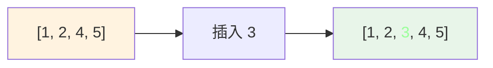
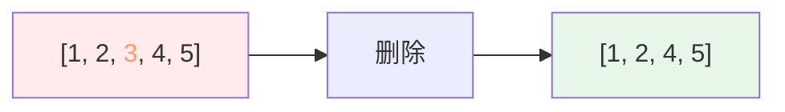

# 数组 (Array)

## 概述

数组是最基本的数据结构，用一段连续的内存空间存储相同类型的元素。

## 基本操作

| 操作 | 时间复杂度 | 说明 |
|------|-----------|------|
| 随机访问 | O(1) | 通过索引直接访问 |
| 查找 | O(n) | 遍历查找 |
| 插入 | O(n) | 需要移动后续元素 |
| 删除 | O(n) | 需要移动后续元素 |

## 可视化示例

### 数组结构

```
索引:   [0]    [1]    [2]    [3]    [4]
        ┌──────┬──────┬──────┬──────┬──────┐
数组:   │  1   │  2   │  3   │  4   │  5   │
        └──────┴──────┴──────┴──────┴──────┘
内存:   0x100  0x104  0x108  0x10C  0x110
```

### 插入操作示例

在数组 `[1, 2, 4, 5]` 中插入 `3` 到索引 2：



步骤说明：
1. 从末尾开始，将 `[4, 5]` 向后移动一位
2. 在索引 2 位置插入 `3`
3. 结果：`[1, 2, 3, 4, 5]`（新增元素用绿色标识）

### 删除操作示例

从数组 `[1, 2, 3, 4, 5]` 中删除索引 2 的元素 `3`：



步骤说明：
1. 标记要删除的元素 `3`
2. 将 `[4, 5]` 向前移动
3. 结果：`[1, 2, 4, 5]`（被删元素用红色标识）

## 实现文件

| 文件 | 说明 |
|------|------|
| [impl/array.c](impl/array.c) | 数组基本操作实现 |

## LeetCode 题目

| 题号 | 题目 | 难度 |
|------|------|------|
| 0080 | [删除有序数组中的重复项 II](../0080_remove_duplicates/) | 中等 |
| 0133 | [数组压缩](./0133_reduce_array/) | 困难 |
| 1493 | [删掉一个元素以后全为 1 的最长子数组](./1493_longest_one_row/) | 中等 |
| 2006 | [差的绝对值为 K 的数对数目](./2006_count_pairs/) | 简单 |
| 2469 | [温度转换](./2469_convert_temperature/) | 简单 |
| 3046 | [分割数组](./3046_split_array/) | 简单 |
| 3065 | [超过阈值的最少操作数](./3065_min_operations/) | 简单 |
