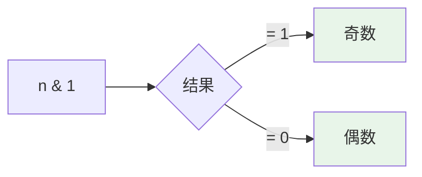
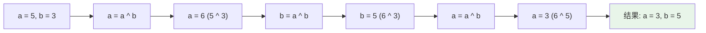

# 位运算 (Bit Operations)

## 概述

位运算是对二进制数的位进行操作的运算，包括与、或、异或、取反、左移、右移等。

## 基本操作

| 操作 | 符号 | 说明 |
|------|------|------|
| 与 | `&` | 两位都为 1 时结果为 1 |
| 或 | `|` | 任一位为 1 时结果为 1 |
| 异或 | `^` | 两位不同时结果为 1 |
| 非 | `~` | 位取反 |
| 左移 | `<<` | 各位左移，低位补 0 |
| 右移 | `>>` | 各位右移，高位补符号位 |

## 可视化示例

### 位运算示例

```
a = 5  (二进制: 0101)
b = 3  (二进制: 0011)

a & b = 1  (0001)  - 按位与
a | b = 7  (0111)  - 按位或
a ^ b = 6  (0110)  - 按位异或
~a   = -6         - 按位取反
a << 1 = 10 (1010) - 左移
a >> 1 = 2  (0010) - 右移
```

### 奇偶判断



### 交换两个数 (不使用临时变量)



## LeetCode 题目

| 题号 | 题目 | 难度 |
|------|------|------|
| 2275 | [按位与结果大于零的最长组合](../2275_bit_and/) | 中等 |
| 2595 | [奇偶数](../2595_even_odd_bit/) | 简单 |
