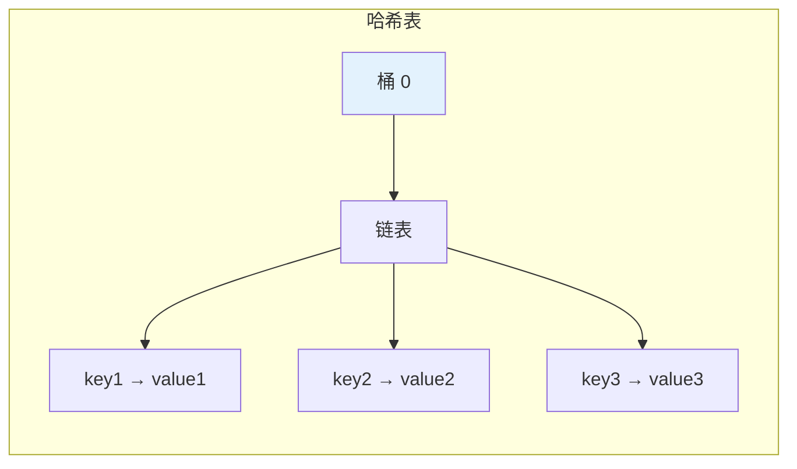

# 哈希表 (Hash Table)

## 概述

哈希表通过哈希函数将键映射到数组的索引位置，实现 O(1) 平均时间复杂度的查找、插入和删除。

## 基本操作

| 操作 | 平均时间复杂度 | 最坏时间复杂度 |
|------|---------------|---------------|
| 查找 | O(1) | O(n) |
| 插入 | O(1) | O(n) |
| 删除 | O(1) | O(n) |

## 可视化示例

### 哈希表结构

```
键 (Key)        哈希函数       桶 (Bucket)
┌────────┐    ┌──────────┐    ┌─────────────────┐
│ "apple" │──▶│ hash()   │──▶│ 0: [apple, 5]   │
├────────┤    │ = 2      │    ├─────────────────┤
│ "banana"│──▶│ hash()   │──▶│ 1: [banana, 3]  │
├────────┤    │ = 0      │    ├─────────────────┤
│ "cherry"│──▶│ hash()   │──▶│ 2: [cherry, 9]  │
└────────┘    └──────────┘    └─────────────────┘
```

### 冲突处理 (链地址法)



## 实现文件

| 文件 | 说明 |
|------|------|
| [impl/hash_table.c](impl/hash_table.c) | 哈希表实现 |

## LeetCode 题目

| 题号 | 题目 | 难度 |
|------|------|------|
| 1366 | [通过投票对团队排名](../1366_rank_teams/) | 困难 |
| 1367 | [二叉树中的链表](../1367_linked_list_tree/) | 中等 |
