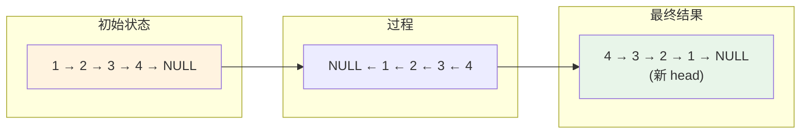
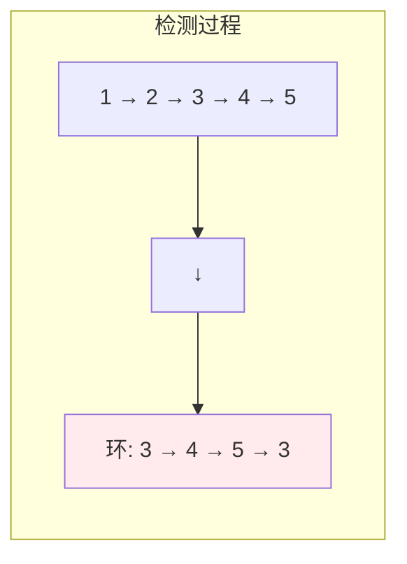

# 链表 (Linked List)

## 概述

链表是一种物理存储单元上非连续、非顺序的存储结构，数据元素的逻辑顺序通过链表中的指针链接次序实现。

## 基本操作

| 操作 | 时间复杂度 | 说明 |
|------|-----------|------|
| 头部插入 | O(1) | 直接修改头指针 |
| 尾部插入 | O(n) | 需要遍历到尾部 |
| 指定位置插入 | O(n) | 需要遍历到位置 |
| 删除 | O(n) | 需要遍历到位置 |
| 查找 | O(n) | 需要遍历 |

## 可视化示例

### 单链表结构

```
链表: head -> [1] -> [2] -> [3] -> [4] -> NULL

       ┌───────┐     ┌───────┐     ┌───────┐
       │ data  │     │ data  │     │ data  │
       │  1    │     │  2    │     │  3    │
       ├───────┤     ├───────┤     ├───────┤
  ───▶ │ next  │────▶│ next  │────▶│ next  │────▶ NULL
       └───────┘     └───────┘     └───────┘
```

### 反转链表示例

反转链表 `[1] -> [2] -> [3] -> [4]`：



### 快慢指针检测环



步骤说明：
1. 快指针每次走两步，慢指针每次走一步
2. 如果存在环，快慢指针必定相遇
3. 相遇点即为环的入口

## 实现文件

| 文件 | 说明 |
|------|------|
| [impl/single_list.c](impl/single_list.c) | 单链表实现 |
| [impl/linked_list.c](impl/linked_list.c) | 链表通用操作 |
| [impl/skip_list.c](impl/skip_list.c) | 跳表实现 |

## LeetCode 题目

| 题号 | 题目 | 难度 |
|------|------|------|
| 0019 | [删除链表的第 N 个结点](../0019_remove_nth/) | 中等 |
| 0142 | [环形链表 II](../0142_detect_cycle/) | 中等 |
| 0143 | [重排链表](../0143_reorder_list/) | 中等 |
| 0206 | [反转链表](../0206_reverse_list/) | 简单 |
| 0445 | [两数相加 II](../0445_add_two_numbers/) | 中等 |
