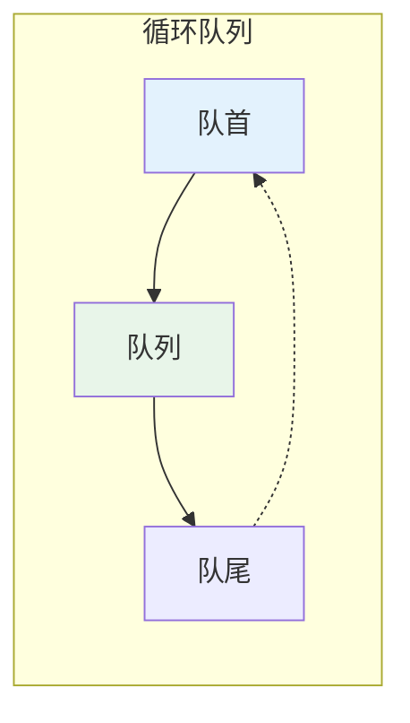
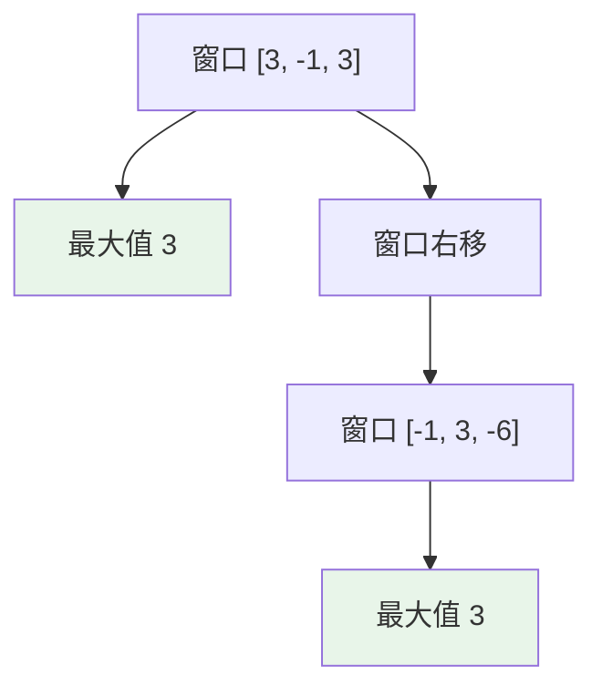

# 队列 (Queue)

## 概述

队列是一种先进先出 (FIFO) 的数据结构，只允许在队尾插入，在队头删除。

## 基本操作

| 操作 | 时间复杂度 | 说明 |
|------|-----------|------|
| enqueue (入队) | O(1) | 在队尾添加元素 |
| dequeue (出队) | O(1) | 从队头移除元素 |
| front | O(1) | 查看队头元素 |
| rear | O(1) | 查看队尾元素 |
| isEmpty | O(1) | 判断是否为空 |

## 可视化示例

### 队列结构

```
队头 (Front)                        队尾 (Rear)
┌───────┬───────┬───────┬───────┬───────┐
│   1   │   2   │   3   │   4   │   5   │
└───────┴───────┴───────┴───────┴───────┘
   ↓                                   ↑
 dequeue()                          enqueue(6)
```

### 循环队列



### 单调队列滑动窗口



## 实现文件

| 文件 | 说明 |
|------|------|
| [impl/queue.c](impl/queue.c) | 队列基本实现 |
| [impl/circle_queue.c](impl/circle_queue.c) | 循环队列实现 |
| [impl/deque.c](impl/deque.c) | 双端队列实现 |
| [impl/priority_queue.c](impl/priority_queue.c) | 优先队列实现 |
| [impl/monotonic_queue.c](impl/monotonic_queue.c) | 单调队列实现 |

## LeetCode 题目

| 题号 | 题目 | 分类 |
|------|------|------|
| 1705 | [吃苹果的最大数目](../1705_eaten_apples/) | 堆/优先队列 |
