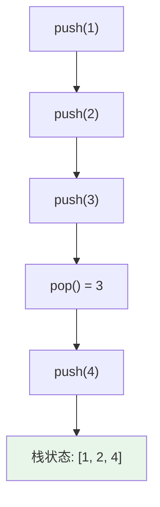
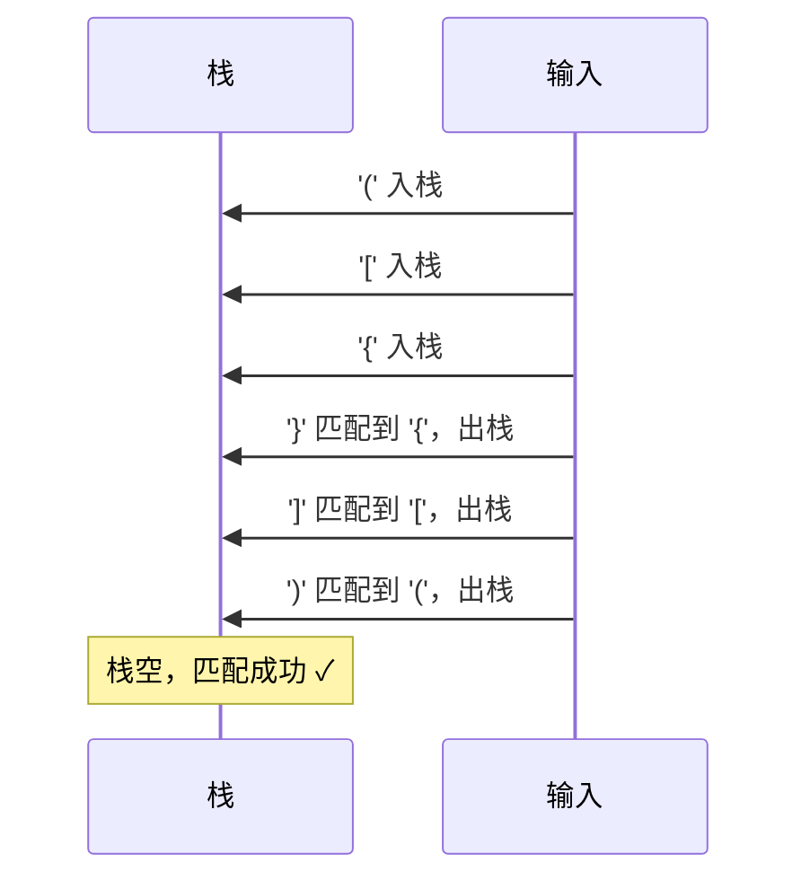

# 栈 (Stack)

## 概述

栈是一种后进先出 (LIFO) 的数据结构，只允许在栈顶进行插入和删除操作。

## 基本操作

| 操作 | 时间复杂度 | 说明 |
|------|-----------|------|
| push (入栈) | O(1) | 在栈顶添加元素 |
| pop (出栈) | O(1) | 移除栈顶元素 |
| top (查看栈顶) | O(1) | 返回栈顶元素 |
| isEmpty | O(1) | 判断是否为空 |

## 可视化示例

### 栈结构

```
栈顶 (Top)
┌───────┐
│   5   │  ← pop()
├───────┤
│   4   │
├───────┤
│   3   │
├───────┤
│   2   │
├───────┤
│   1   │  ← 栈底
└───────┘
```

### 入栈出栈示例

对栈依次执行：push(1), push(2), push(3), pop(), push(4)



### 括号匹配示例

验证 `([{}])` 是否合法：



## 实现文件

| 文件 | 说明 |
|------|------|
| [impl/stack_by_array.c](impl/stack_by_array.c) | 顺序栈实现 |
| [impl/stack_by_list.c](impl/stack_by_list.c) | 链式栈实现 |
| [impl/monotonic_stack.c](impl/monotonic_stack.c) | 单调栈实现 |

## LeetCode 题目

| 题号 | 题目 | 难度 |
|------|------|------|
| 0020 | [有效的括号](../0020_valid_parentheses/) | 简单 |
