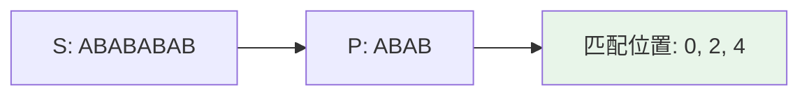
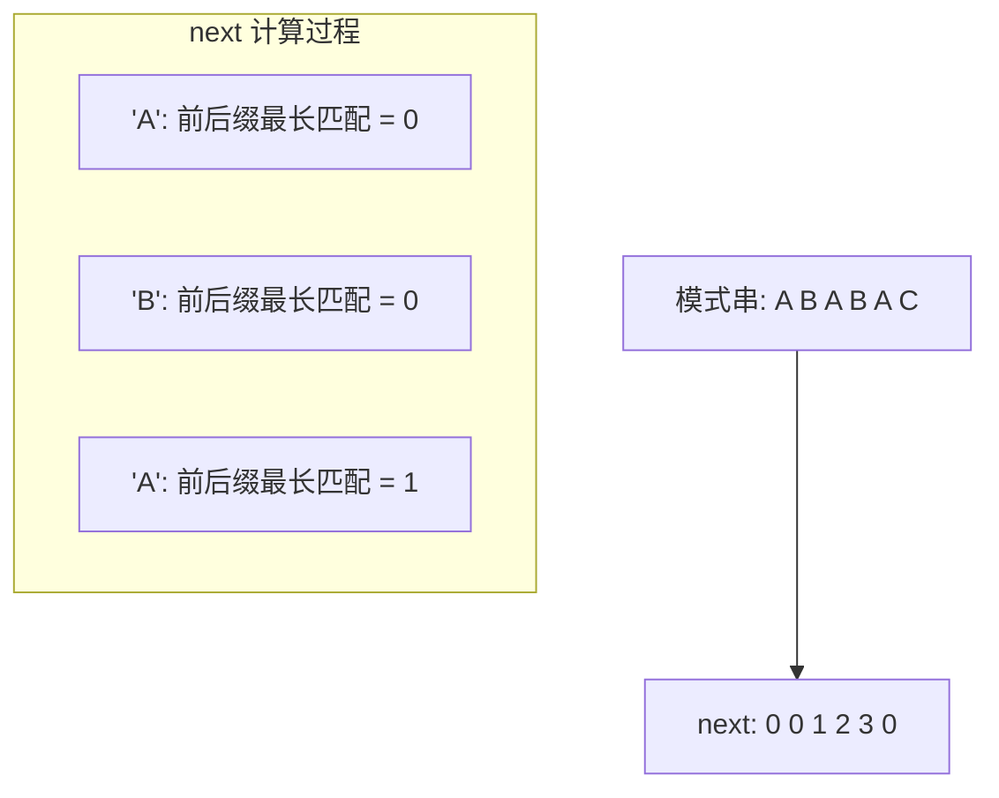

# 字符串 (String)

## 概述

字符串是由字符组成的有序序列，是编程中最常用的数据类型之一。

## 基本操作

| 操作 | 时间复杂度 | 说明 |
|------|-----------|------|
| 长度 | O(1) | 直接获取 |
| 连接 | O(n+m) | 合并两个字符串 |
| 子串查找 | O(n*m) | 朴素算法 |
| 子串查找 | O(n+m) | KMP 算法 |

## 可视化示例

### 字符串结构

```
字符串: "Hello World"
索引:    H  e  l  l  o     W  o  r  l  d
        0  1  2  3  4  5  6  7  8  9  10
```

### 子串查找示例

在 `S = "ABABABAB"` 中查找 `P = "ABAB"`：



### KMP 算法 next 数组



## 实现文件

| 文件 | 说明 |
|------|------|
| [impl/str.c](impl/str.c) | 字符串基本操作 |
| [impl/string.c](impl/string.c) | 字符串处理函数 |

## LeetCode 题目

| 题号 | 题目 | 难度 |
|------|------|------|
| 0551 | [学生出勤记录 I](../0551_student_attendance/) | 简单 |
| 1941 | [检查是否所有字符出现次数相同](../1941_same_occurrences/) | 简单 |
| 2264 | [字符串中最大的 3 位数字](../2264_largest_good/) | 简单 |
| 3019 | [按键变更的次数](../3019_key_changes/) | 简单 |
