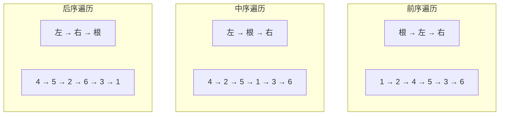
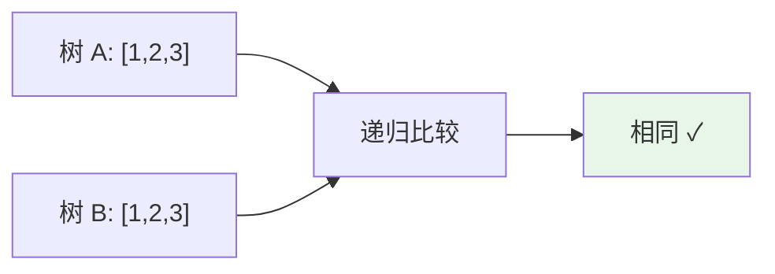

# 二叉树 (Binary Tree)

## 概述

二叉树是每个节点最多有两个子树的树结构，通常子树被称作"左子树"和"右子树"。

## 基本操作

| 操作 | 时间复杂度 | 说明 |
|------|-----------|------|
| 遍历（前/中/后序） | O(n) | 访问所有节点 |
| 查找 | O(n) | 最坏情况退化成链表 |
| 插入 | O(n) | 需要维护平衡 |
| 删除 | O(n) | 需要维护平衡 |

## 可视化示例

### 二叉树结构

```
        1
       / \
      2   3
     / \   \
    4   5   6
```

### 遍历顺序对比



### 相同树判定

判断两棵二叉树是否相同：



## 实现文件

| 文件 | 说明 |
|------|------|
| [impl/binary_tree.c](impl/binary_tree.c) | 二叉树基本操作 |
| [impl/tree.c](impl/tree.c) | 通用树操作 |

## LeetCode 题目

| 题号 | 题目 | 难度 |
|------|------|------|
| 0100 | [相同的树](../0100_same_tree/) | 简单 |
| 0222 | [完全二叉树的节点个数](../0222_count_complete/) | 中等 |
