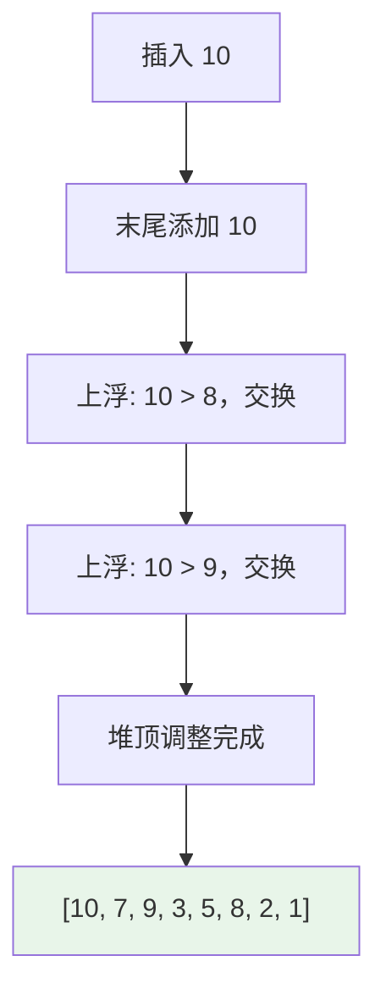
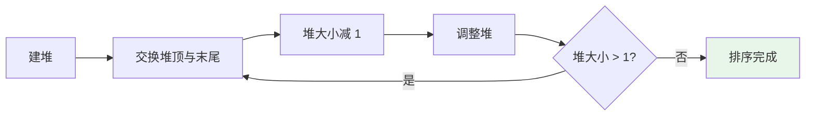

# 堆 (Heap)

## 概述

堆是一种完全二叉树，分为最大堆和最小堆：
- **最大堆**：父节点的值 >= 子节点的值
- **最小堆**：父节点的值 <= 子节点的值

## 基本操作

| 操作 | 时间复杂度 | 说明 |
|------|-----------|------|
| 插入 | O(log n) | 上浮调整 |
| 删除堆顶 | O(log n) | 下沉调整 |
| 获取最值 | O(1) | 直接获取根节点 |
| 建堆 | O(n) | 批量构建 |

## 可视化示例

### 堆结构 (最大堆)

```
        9
       / \
      7   8          数组: [9, 7, 8, 3, 5, 6, 2, 1]
     / \ / \
    3  5 6  2
```

### 插入操作示例

向堆 `[9, 7, 8, 3, 5]` 中插入 `10`：



### 堆排序过程



## 实现文件

| 文件 | 说明 |
|------|------|
| [impl/heap.c](impl/heap.c) | 堆的基本实现 |
| [impl/max_heap.c](impl/max_heap.c) | 最大堆实现 |
| [impl/min_heap.c](impl/min_heap.c) | 最小堆实现 |

## LeetCode 题目

| 题号 | 题目 | 难度 |
|------|------|------|
| 1705 | [吃苹果的最大数目](../1705_eaten_apples/) | 困难 |
| 3066 | [超过阈值的最少操作数 II](../3066_min_operations/) | 中等 |
