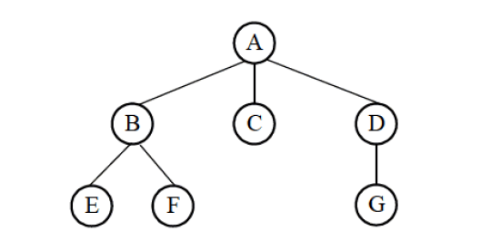
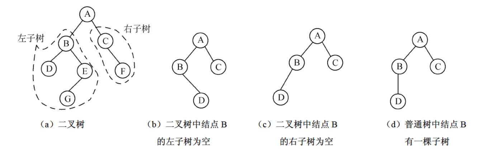
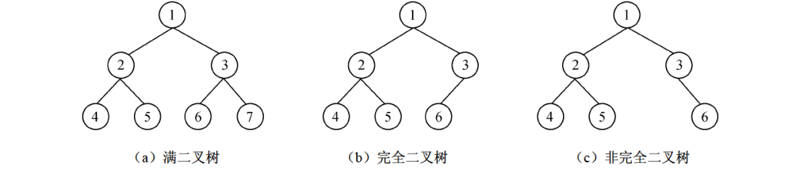

[TOC]

# SDE

## 一、计算机系统知识


## 二、程序设计语言基础


 ## 三、数据结构


### 3.1 栈


### 3.2 队列

#### 3.2.1循环队列


```C
#define MAX_CIR_QUEUE_SIZE 100

typedef struct cir_queue {
    void *item;    // 存储的空间
    int item_size; // 单个元素的大小
    int front;     // 队头位置
    int rear;      // 队尾位置
    int capacity;  // 队列容量
    int count;     // 当前元素数量
} cir_queue_t;

// 查看队头元素（不出队）
int circle_peek(const cir_queue_t *cq, void *data)
{
    if (cq == NULL || data == NULL || circle_is_empty(cq)) {
        return -1;
    }
    
    char *source = (char *)cq->item + cq->front * cq->item_size;
    memcpy(data, source, cq->item_size);
    return 0;
}

// 检查队列是否为空
bool circle_is_empty(const cir_queue_t *cq)
{
    return (cq == NULL) ? true : (cq->count == 0);
}

// 检查队列是否已满
bool circle_is_full(const cir_queue_t *cq)
{
    return (cq == NULL) ? true : (cq->count == cq->capacity - 1);
}

// 获取队列中元素数量
int circle_size(const cir_queue_t *cq)
{
    return (cq == NULL) ? 0 : cq->count;
}

// 获取队列容量
int circle_capacity(const cir_queue_t *cq)
{
    return (cq == NULL) ? 0 : (cq->capacity - 1);
}

// 清空队列（但不释放内存）
void circle_clear(cir_queue_t *cq)
{
    if (cq != NULL) {
        cq->front = 0;
        cq->rear = 0;
        cq->count = 0;
    }
}

// 释放队列
void circle_free(cir_queue_t *cq)
{
    if (cq != NULL) {
        if (cq->item != NULL) {
            free(cq->item);
        }
        free(cq);
    }
}

cir_queue_t *initcircle_queue(int capacity, int item_size)
{
    if (capacity > MAX_CIR_QUEUE_SIZE || capacity <= 0 || item_size <= 0) {
        return NULL;
    }

    // 先分配队列结构体内存
    cir_queue_t *q = (cir_queue_t *)malloc(sizeof(cir_queue_t));
    if (q == NULL) {
        return NULL;
    }

    // 再分配数据存储空间
    q->item = malloc(item_size * capacity);
    if (q->item == NULL) {
        free(q);  // 释放已分配的结构体
        return NULL;
    }

    // 所有资源都成功分配后，才设置字段
    q->item_size = item_size;
    q->front = 0;
    q->rear = 0;
    q->capacity = capacity;
    q->rear = 0;

    return q;
}

// 打印队列状态（调试用）
void circle_print_status(const cir_queue_t *cq, const char *name)
{
    if (cq == NULL) {
        printf("%s: NULL\n", name);
        return;
    }

    printf("%s: front=%d, rear=%d, count=%d, capacity=%d, empty=%d, full=%d\n",
           name, cq->front, cq->rear, cq->count, cq->capacity - 1, 
           circle_is_empty(cq), circle_is_full(cq));
}

int circle_enqueue(cir_queue_t *cq, const void *data)
{
    if (cq == NULL || data == NULL) {
        return -1;
    }

    // 检查队列是否已满
    if (circle_is_full(cq)) {
        return -1;
    }

    // 计算目标位置的指针
    char *target = (char *)cq->item + cq->rear * cq->item_size;
    memcpy(target, data, cq->item_size);

    // 更新队尾位置和计数
    cq->rear = (cq->rear + 1) % cq->capacity;
    cq->count++;

    return 0;
}

// 出队操作
int circle_dequeue(cir_queue_t *cq, void *data)
{
    // 参数检查
    if (cq == NULL || data == NULL) {
        return -1;
    }

    // 检查队列是否为空
    if (circle_is_empty(cq)) {
        return -1;
    }

    // 计算源位置的指针
    char *source = (char *)cq->item + cq->front * cq->item_size;
    memcpy(data, source, cq->item_size);
    
    // 更新队头位置和计数
    cq->front = (cq->front + 1) % cq->capacity;
    cq->count--;

    return 0;
}

```


### 3.3 字符串


#### 3.3.1 KMP模式匹配


### 3.4 数组


### 3.5 矩阵


### 3.6 广义表


### 3.7 树

#### 3.7.1 树的基本概念

（1）双亲、孩子和兄弟。结点的子树的根称为该结点的孩子；相应地，该结点称为其子结点的双亲。具有相同双亲的结点互为兄弟。

（2）结点的度。一个结点的子树的个数记为该结点的度。例如，A的度为3，B的度为2，C的度为0，D的度为1。

（3）叶子结点。叶子结点也称为终端结点，指度为0的结点。例如，图3-16中，E、F、C、G都是叶子结点。

（4）内部结点。度不为0的结点，也称为分支结点或非终端结点。除根结点以外，分支结点也称为内部结点。例如，图 3-16 中，B、D 都是内部结点。

（5）结点的层次。根为第一层，根的孩子为第二层，依此类推，若某结点在第 i 层，则其孩子结点在第 i+1 层。例如，图 3-16 中，A 在第 1 层，B、C、D 在第 2 层，E、F 和 G 在第 3 层。

（6）树的高度。一棵树的最大层数记为树的高度（或深度）。例如，图 3-16 所示树的高度为 3。

（7）有序（无序）树。若将树中结点的各子树看成是从左到右具有次序的，即不能交换，则称该树为有序树，否则称为无序树。



#### 3.7.2 二叉树

##### 3.7.2.1 定义

​	二叉树是 n(n≥0) 个结点的有限集合，它或者是空树（n=0），或者是由一个根结点及两棵不相交的且分别称为左、右子树的二叉树所组成。可见，二叉树同样具有递归性质。

​	需要特别注意的是，尽管树和二叉树的概念之间有许多联系，但它们是两个不同的概念。树和二叉树之间最主要的区别是：二叉树中结点的子树要区分左子树和右子树，即使在结点只有一棵子树的情况下，也要明确指出该子树是左子树还是右子树。另外，二叉树结点最大度为2，而树中不限制结点的度数，如图所示。




##### 3.7.2.2 性质

（1）二叉树第 i 层（i≥1）上最多有2^i-1^个结点。此性质只要对层数 i 进行数学归纳证明即可。

（2）高度为 k*k* 的二叉树最多有2^k^ - 1个结点（k ≥ 1）。 

   (3) 对于任何一棵二叉树，若其叶子结点数为 n~0~，度为2的结点数为 n~2~，则 n~0~ =  n~2~ + 1。

   (4) 具有 n 个结点的完全二叉树的深度为 ⌊log⁡~2~n⌋+1。


若深度为 k*k* 的二叉树有 2^k−1^ 个结点，则称其为满二叉树。可以对满二叉树中的结点进行连续编号：约定编号从根结点起，自上而下、自左至右依次进行。深度为 k，有 n 个结点的二叉树，当且仅当其每一个结点都与深度为 k的满二叉树中编号从 1 至 n 的结点一一对应时，称之为完全二叉树。满二叉树如图 (a) 所示，高度为 3 的一个完全二叉树如图 (b) 所示。

在一个高度为 h 的完全二叉树中，除了第 h 层（即最后一层），其余各层都是满的。在第 h 层上的结点必须从左到右依次放置，不能留空。图 (c) 所示的二叉树不是完全二叉树，因为 6 号结点的左边有空结点。





## 四、操作系统知识


## 五、软件工程知识基础


## 六、结构化开发方法


## 七、面向对象技术


## 八、算法设计与分析


## 九、数据库技术基础


## 十、网络与信息安全基础


## 十一、标准化和软件知识产权基础知识


## 十二、软件系统分析与设计


 