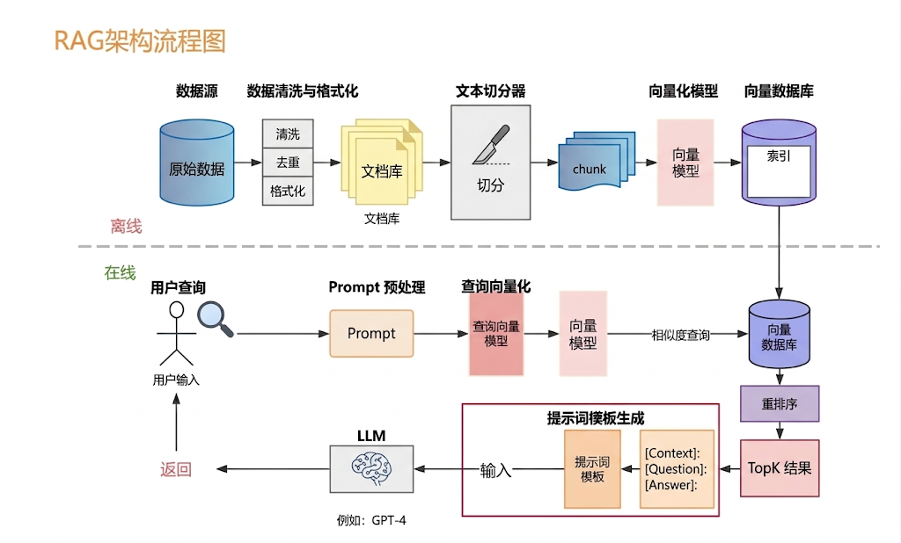

# 向量数据库面试总结

---

## 第一章：向量数据库

### 1.1 向量数据库解决什么问题
假设你有 100 万个文本块，每个文本块都被转换成了一个 1536 维的向量。当用户提问时，你需要快速找到和问题向量最相近的 Top-10 个文本块。

如果是暴力搜索，那每次查询都要和 100 万个向量逐一计算相似度，速度完全不可接受。

向量数据库就是为解决这个问题而生的。它使用特殊的索引结构（如 HNSW、IVF、PQ 等），能够在海量向量中实现**毫秒级的近似最近邻搜索（ANN）**。

### 1.2 向量数据库的核心原理
100 万个 1536 维的向量，暴力逐一比对肯定不行，那向量数据库是怎么做到毫秒级检索的？

核心思路是**用空间换时间**，通过提前构建索引结构，让检索的时候不需要遍历所有向量。目前主流的索引思路有三种。

最常用的一种叫 **HNSW**，你可以把它理解成「在一栋大楼里找人」。想象你要在一栋 50 层的大楼里找一个叫「张三」的人。如果一层一层、一间一间地找，得找到什么时候？但如果大楼有一个智能导航系统，先告诉你在第 30 层，再告诉你在 3012 房间，几步就找到了。HNSW 就是给所有向量建了这么一个「多层导航图」，从粗到细、层层缩小范围，几跳就能定位到目标。这种方式查询速度极快（毫秒级），召回率也高，是目前大多数向量数据库的默认选择。

第二种思路叫 **IVF**，核心思想是「先分区域再搜索」。就好比快递分拣中心不会一个一个找包裹，而是先把包裹按地区分成几堆（华东堆、华南堆、华北堆），找到上海来的包裹就只去「华东堆」里翻就行了。IVF 也是这样，先把所有向量按相似度聚成若干个「桶」，查询的时候先判断目标最可能在哪几个桶里，然后只在这几个桶内搜索，不用遍历全部向量。它的好处是内存效率高，适合超大规模数据，但因为只搜索部分桶，所以会损失一点召回率。

第三种思路叫 **PQ**，核心是「压缩存储」。你想象一下，如果每个向量的信息量很大，存起来特别占内存怎么办？PQ 的做法是把一个完整的向量切成几段，每段做一个「简化版」的表示，就像把一张高清照片压缩成缩略图，虽然细节丢了，但关键特征还在。这样每个向量只需要很少的字节就能存，在内存有限的场景下特别实用。通常 PQ 会和 IVF 结合使用，先分桶再压缩，兼顾速度和内存。

### 1.3 主流向量数据库对比

目前市面上的向量数据库选择非常多，我挑几个最主流的，像跟朋友聊天一样，给你说说各自的特点和我的使用感受。

#### 1.3.1 Milvus

这个应该是目前开源向量数据库里最有名的一个了，由 Zilliz 公司开发维护，GitHub 上有 2 万多 Star。它最大的优势就是「能扛」，支持十亿级甚至百亿级的向量规模，索引类型也很丰富，HNSW、IVF、PQ 都支持，还有 GPU 加速选项。如果你的项目是那种企业级的、数据量特别大的场景，Milvus 基本上是首选。它的生态也很完善，Python、Java、Go 的 SDK 都有。但说实话，Milvus 的部署和维护有一定门槛，通常需要 Kubernetes 来编排，如果你团队没有 DevOps 经验，上手会有点吃力。

#### 1.3.2 Pinecone

如果你不想折腾基础设施，Pinecone 可能是最省心的选择。它是一个全托管的 SaaS 服务，你不需要自己部署任何东西，注册个账号、几行代码就能开始用。自动扩缩容、零运维，对开发团队特别友好。但它的缺点也很明显：一是付费的，而且费用不算便宜；二是数据存在第三方服务器上，如果你的数据有合规要求（比如不能出境），就不太合适了。

#### 1.3.3 Weaviate

原生支持混合检索，也就是向量检索和 BM25 关键词检索可以一起做，不用你自己去拼接两套系统。它还内置了多种 Embedding 模型的集成，可以直接在 Weaviate 内部完成文本到向量的转换，省了一个步骤。如果你要做混合检索的 RAG 系统，Weaviate 是开箱即用的，体验很好。不过在大规模数据场景下，它的性能会比 Milvus 弱一些，适合中小规模的应用。

#### 1.3.4 Chroma

则是另外一个极端。它主打的就是「轻量」和「简单」，Python 原生支持，装个 pip 包就能用，API 设计得非常简洁。如果你是在做原型验证、个人项目、或者教学演示，Chroma 是最方便的。但它的功能和性能都比较有限，不支持分布式，也没有安全机制（没有加密、没有权限控制），所以不太适合用在生产环境里。

#### 1.3.5 Qdrant

这个是后起之秀，用 Rust 语言写的，所以单机性能非常强。在 2025 年的一些基准测试中，Qdrant 的 QPS 和延迟表现都是同类产品里最好的。它也支持丰富的过滤条件和混合检索。如果你的场景对响应速度有很高要求，或者想自建但不想用那么重的 Milvus，Qdrant 是一个很好的折中选择。不过它的分布式方案相对来说还比较新，如果你需要多节点的集群部署，可能需要多测试一下稳定性。

### 1.4 选型建议

- 如果你只是想快速做个 POC 验证一下效果，直接用 Chroma，轻量、上手快，别在基础设施上花太多时间。
- 如果是中小规模的生产应用，预算充足的话可以考虑 Pinecone，省心；如果需要私有化部署，Weaviate 是个不错的选择。
- 如果是大规模的企业级应用，数据量上亿的那种，那基本就得选 Milvus 了，它的扩展性最好。
- 如果你对性能有极致要求，想自建但不想用 Milvus 那么重的方案，Qdrant 值得试试。

另外还有一个趋势值得说一下，就是**传统数据库的向量扩展**。

比如 PostgreSQL 的 pgvector 插件、Elasticsearch 的向量搜索功能。如果你的项目已经在用 PostgreSQL 或 ES，不想为了 RAG 再引入一套新的数据库组件，用它们的向量扩展也是一个很务实的选择。

虽然性能比不上专门的向量数据库，但对于中小规模来说完全够用，而且运维成本几乎为零。

---

## 第二章：向量索引的选型

### 2.1 向量索引简介
向量索引是提升大规模向量检索效率的核心。常见索引分为精确检索（Brute-force）和近似检索（ANN）。ANN 索引通过牺牲部分精度换取极高的检索速度。

### 2.2 主流向量索引算法详解

#### 2.2.1 Brute-force（暴力检索）
- **原理**：全量遍历所有向量，计算距离，返回最近邻。
- **优点**：结果绝对精确，易于实现，无需构建索引。
- **缺点**：随数据量线性变慢，无法扩展到大规模数据。
- **适用场景**：数据量小（<10万）、对精度要求极高、离线批量分析。
- **数据库支持**：几乎所有数据库均支持，Faiss/Milvus/Weaviate/Qdrant等。

#### 2.2.2 IVF（倒排文件索引）
- **原理**：将向量聚类分桶，查询时只在部分桶内做精确检索。
- **优点**：查询速度快，支持批量检索，索引构建速度快。
- **缺点**：精度略低于暴力检索，参数（桶数、probe数）需调优。
- **适用场景**：中大规模数据（10万~千万），对性能有要求，批量检索。
- **数据库支持**：Faiss（IVF/IVFPQ）、Milvus（IVF系列）、部分商业库。

#### 2.2.3 HNSW（分层小世界图）
- **原理**：构建多层图结构，节点间有近邻边，查询时高效跳跃。
- **优点**：高查准率，低延迟，支持动态增删，适合高并发。
- **缺点**：索引构建慢，内存消耗大，参数（M/ef）需调优。
- **适用场景**：大规模数据（百万~亿级），实时检索，高并发场景。
- **数据库支持**：Milvus、Qdrant、Weaviate、Faiss（支持但不如专用库高效）。

#### 2.2.4 PQ/IVFPQ（乘积量化/倒排乘积量化）
- **原理**：将高维向量分块量化，极大压缩存储，结合IVF提升检索速度。
- **优点**：存储省，适合超大规模数据，查询速度快。
- **缺点**：精度损失明显，参数调优复杂。
- **适用场景**：超大规模数据（千万~亿级），对存储敏感，允许精度损失。
- **数据库支持**：Faiss（PQ/IVFPQ）、Milvus（IVFPQ）。

#### 2.2.5 DiskANN
- **原理**：基于磁盘的ANN索引，支持大规模数据分布式存储。
- **优点**：支持TB级数据，扩展性强，查询速度快。
- **缺点**：实现复杂，对硬件依赖高，社区支持有限。
- **适用场景**：极大规模、分布式、对内存敏感的场景。
- **数据库支持**：Milvus（DiskANN），部分商业库。

### 2.3 场景与索引选型对照
| 场景类型         | 推荐索引      | 代表数据库及表现         |
|------------------|--------------|-------------------------|
| 小数据/高精度    | Brute-force  | Faiss/Milvus均表现优秀   |
| 中大数据/高性能  | IVF, HNSW    | Faiss(IVF)/Milvus(HNSW) |
| 实时/高并发      | HNSW         | Milvus/Qdrant/Weaviate  |
| 超大数据/低存储  | PQ/IVFPQ     | Faiss(IVFPQ)/Milvus     |
| 分布式/超大规模  | DiskANN      | Milvus(DiskANN)         |
| 动态更新频繁     | HNSW         | Qdrant/Milvus           |

#### 说明：
- Faiss 在单机场景下IVF、PQ等索引性能极佳，适合离线批量检索。
- Milvus 在分布式、实时检索、HNSW/DiskANN等场景下表现突出，支持动态扩展。
- Qdrant/Weaviate 在HNSW索引下支持高效动态增删，适合在线服务。
- PQ/IVFPQ适合对存储极度敏感的离线场景。

### 2.4 选型流程建议
1. 明确业务需求（数据量、QPS、延迟、精度）。
2. 结合数据库支持的索引类型，做小规模实验。
3. 关注索引构建、更新、查询的综合表现。
4. 评估资源消耗与维护难度。
5. 结合社区/厂商支持，选用主流方案。

---

### 2.5 不同硬件（CPU/NPU）下的索引适配建议

#### 2.5.1 基于CPU核的索引选择
- **Brute-force**：CPU多核可并行加速暴力检索，适合小数据量高精度场景。
- **IVF/IVFPQ**：CPU对IVF、IVFPQ等聚类型索引支持良好，适合中大规模数据，Faiss等库在CPU上有高效实现。
- **HNSW**：CPU多核可并行构建和查询，适合高并发、实时检索。
- **PQ/LSH**：CPU可高效执行量化和哈希操作，适合对存储敏感的批量检索。
- **DiskANN**：部分实现支持CPU，适合大数据量但对实时性要求不极高的场景。

#### 2.5.2 基于NPU/AI加速器的索引选择
- **Brute-force**：NPU/AI芯片可极大加速大规模暴力检索，适合高吞吐、低延迟场景。
- **IVF/IVFPQ**：部分AI芯片支持聚类和量化操作，能进一步提升批量检索性能。
- **HNSW**：部分NPU对图结构支持有限，HNSW在AI芯片上加速效果依赖具体实现。
- **PQ/LSH**：NPU对大规模矩阵运算和量化有天然优势，适合极大规模、低精度场景。
- **DiskANN**：如AI芯片支持大容量外部存储访问，可提升分布式检索性能。

#### 2.5.3 选型建议
- **CPU优先**：通用性强，适合大多数索引类型，易于部署和维护。
- **NPU/AI加速器优先**：适合极大规模、极高QPS、低延迟场景，优先选择Brute-force、IVF、PQ等可高度并行的索引。
- **混合部署**：部分场景可采用CPU+NPU协同，离线构建索引用CPU，在线检索用NPU加速。

> **注意**：不同数据库对AI芯片的支持程度不同，需结合实际硬件和数据库文档评估。

---

## 第三章：RAG（检索增强生成）相关流程

### 3.1 RAG的背景

简单的说，RAG就是给大模型外挂一个知识库。那么大模型为什么需要外挂这么一个知识库？

#### 3.1.1.1 大模型的「知识困局」

你有没有遇到过这样的情况：问 ChatGPT 一个你们公司内部的问题，比如「我们公司今年的年假政策是什么」，它要么告诉你「我无法获取你们公司的内部信息」，要么就开始一本正经地编答案，说得头头是道，但全是错的。

这就是大模型的第一个困境：**知识有截止日期**。大模型的知识来自于训练数据，而训练数据是有时间窗口的。比如 ChatGPT 的某个版本，训练数据的截止日期是 2023 年 4 月，那么 2023 年 4 月之后发生的任何事情，它都不知道。你问它 2026 年发生了什么大事，它要么说不知道，要么就开始「编」。

第二个困境是：**大模型不知道你公司的私有数据**。你公司的产品文档、内部规章制度、客户信息、项目资料……这些数据从来没有出现在大模型的训练集中，它怎么可能知道？

第三个困境是：**大模型会「幻觉」**。所谓幻觉，就是大模型会非常自信地说出一些听起来很专业但完全是编造的内容。你问它一个不存在的研究论文，它能给你编出一个标题、作者、摘要、甚至 DOI 号，看起来像模像样，但全是假的。这在需要高准确性的场景（比如医疗、法律、金融）中，是不可接受的。

理解了这三个困境，你就能理解 RAG 要解决什么问题了。

打个比方。大模型就像一个参加了「闭卷考试」的学生，所有知识都得靠脑子记。但这个考试有个问题：题目会问到最新的知识（知识截止日期）、会问到课本上没有的内部资料（私有数据），而且这个学生还会「编答案」（幻觉）。

那怎么解决？最直觉的办法就是**给他开卷考试**，允许他翻参考书。

RAG 就是这个思路。RAG 的全称是 **Retrieval-Augmented Generation**，翻译过来就是「检索增强生成」。核心思想非常简单：

1. 先从外部知识库中**检索（Retrieval）** 出和用户问题相关的资料
2. 把检索到的资料作为**增强（Augmented）** 上下文，和用户的问题一起给到大模型
3. 大模型基于这些真实的资料来**生成（Generation）** 回答

这样一来，大模型的回答就有了「依据」，不再是凭空编造，而是基于真实文档生成的。知识可以随时更新（更新知识库就行），私有数据也能用了（把公司文档放进知识库），幻觉问题也大幅减少了（有真实资料做参考）。

但是**RAG也不是万能的**，它解决的是「大模型缺乏特定知识」的问题，但它不能：

- 改变大模型的推理能力（如果模型本身推理不行，给再多资料也没用）

- 改变大模型的输出风格（如果你希望模型用特定风格回答，这需要微调）

- 保证 100% 的准确性（检索可能召回错误的文档，模型也可能曲解文档内容）


### 3.2 RAG 的整体流程
一个完整的 RAG 系统其实分为两个大阶段：**索引阶段（离线）** 和 **查询阶段（在线）**。



#### 3.2.1 离线建库流程
1. **文档加载**：这一步是把各种格式的文档加载进来。企业里的文档格式五花八门，PDF、Word、Excel、PPT、HTML、Markdown……每种格式都有不同的解析方式。比如 PDF 就比较麻烦，尤其是包含表格、图片、多栏排版的 PDF，解析起来很费劲。这一步的目标是把各种格式的文档统一转成纯文本。

2. **文档切割（Chunking）**：文档加载完之后，你不可能把一整本 100 页的文档直接扔给大模型，因为大模型的上下文窗口是有限的。所以需要把长文档切成一个个小的文本块（Chunk），每个文本块大概几百到几千个字符。

   但切割这个事情没有看起来那么简单。你如果机械地按固定长度切，很可能一句话被切成了两半，或者一个完整的段落被拆开了，这样检索的时候就会丢失上下文。所以文档切割策略是 RAG 系统中非常关键的一环。

3. **向量化（Embedding）**：

4. 文本块切好之后，下一步是把每个文本块转换成一个数学向量（一串数字）。这个步骤叫 Embedding（嵌入）。你可以这样理解：Embedding 模型把一段文本「翻译」成了一个高维空间中的坐标点，语义相近的文本在这个空间中的距离也相近。

   比如「今天天气很好」和「今天阳光明媚」这两句话意思差不多，它们经过 Embedding 之后，在向量空间中的距离就会很近。而「今天天气很好」和「Python 是一种编程语言」意思差很远，在向量空间中的距离也会很远。

5. **写入向量数据库**：就是把所有文本块的向量存入向量数据库。向量数据库是专门用来存储和检索向量的数据库，它能高效地进行「相似度搜索」，也就是给你一个查询向量，它能快速找到和它最相近的 Top-K 个向量。

6. **建立索引**：根据数据量和性能需求选择 HNSW、IVF、DiskANN 等索引。

#### 3.2.2 在线问答流程
1. **用户提问向量化**：用户提出一个问题，比如「公司年假政策是什么」。系统首先用同样的 Embedding 模型，把这个问题也转换成一个向量。

2. **相似度检索**：拿着问题的向量，去向量数据库中进行相似度搜索，找到和这个问题语义最相近的 Top-K 个文本块。比如可能检索出了这样几个文本块：

   - 「公司全职员工入职满一年后享有 10 天带薪年假」

   - 「年假可以拆分使用，每次不少于半天」

   - 「未使用的年假可以累积到下一年，但最多累积 5 天」。

3. **构造增强 Prompt**：把检索出来的文本块和用户的原始问题拼在一起，构造一个增强版的 Prompt。大概长这样：

   「请根据以下参考资料回答用户的问题。参考资料：[检索出的文本块]。用户问题：公司年假政策是什么？」

4. **大模型生成回答**：把增强版的 Prompt 发给大模型，大模型基于这些真实的参考资料来生成回答。因为它有了具体的参考资料，就不会凭空编造了。

在实际生产中，为了提升效果，还会加入查询改写、多路召回、重排序（Re-rank）等技术。

### 3.3 微调和 RAG 各自区别是什么
#### 3.3.1 什么是微调

微调（Fine-tuning），简单来说就是拿一个已经预训练好的大模型，用你自己的数据对它进行进一步的训练，让它在特定领域或特定任务上表现更好

微调的方式也有不同的级别。

- 最重的方式是**全量微调**，也就是更新模型的所有参数，效果最好但成本极高，需要大量 GPU 资源，一般只有大厂才玩得起。
- 比较轻量的方式叫**参数高效微调**，比如现在最流行的 LoRA 技术，它只训练一个很小的「低秩适配器」，不动模型主体，所以硬件需求大幅降低，一张消费级显卡就能跑。
- 还有一种叫**指令微调**，是用「指令-回答」格式的数据来微调，目的是让模型学会听懂指令、按指令来回答，而不是自由发挥。

#### 3.3.2 核心维度的对比

##### 3.3.2.1 知识更新方式

这是两者最核心的差异。微调要更新知识，就得重新训练模型，成本高、周期长。

比如公司每个月都更新产品手册，如果用微调，每个月都得重新训练一次模型。但 RAG 就简单多了，只需要把新的产品手册替换掉知识库里的旧文档，重新做一下索引就行，模型完全不用动，成本极低，而且几乎可以实时更新。

##### 3.3.2.2 准确性

微调的模型是靠「记忆」来回答的，有可能记错或者记混。而且很多人有个误解，以为微调后模型就会严格按照训练数据来回答，其实不是的。微调更多是让模型学到了数据的「模式」和「风格」，对具体事实的准确性并不一定有保障。RAG 就不一样了，回答是基于检索到的真实文档的，可追溯、可验证，只要检索不出大问题，准确性通常比微调更高。

##### 3.3.2.3 语言风格控制

这个维度反而是微调的强项。如果你希望模型用文言文回答、用特定的客服话术回答、模仿某个名人的说话方式，微调能做到。因为它在训练过程中就学会了这种风格。RAG 对输出风格的控制能力就比较有限了，检索到的内容只是给模型的「参考」，但模型最终怎么组织语言，还是取决于模型本身。

##### 3.3.2.4 成本

两者的成本结构不一样。微调的初始成本高，你需要准备大量高质量训练数据、租 GPU 资源，但推理阶段的成本相对较低，因为不需要走检索流程。RAG 正好反过来，初始成本低，不需要训练模型，建个知识库就行，但每次查询都有检索开销，token 消耗也更多，因为你得把检索到的文档都塞进 Prompt 里。

#### 3.3.3 什么时候用微调，什么时候用 RAG

**大多数场景下，优先选 RAG。** 尤其是需要回答的内容必须严格基于特定文档（比如法律条款、产品手册、公司制度），或者知识更新频繁（比如新闻问答、股票分析），或者涉及大量私有数据没法全部用来微调，再或者需要回答可追溯、有出处的场景，RAG 都是最合适的选择。

**微调更适合这几类需求。** 一是你需要模型输出特定的风格或格式，比如客服话术、法律文书格式，这种「风格」层面的需求微调更擅长。二是你需要模型学会某种「能力」而不仅仅是「知识」，比如学会用某种特定的编程语法，这种需要内化的能力微调效果更好。三是你的数据量不大且不经常更新，而且对推理速度有很高要求，不想每次查询都走检索流程。

在实际生产中，最成熟的做法其实是**微调 + RAG 结合**。先用微调让模型适应你的领域和风格（比如让它学会你的行业术语和回答格式），再用 RAG 来提供实时、准确的知识支撑。两者互补，效果最好。

### 3.4 RAG 中的文档切割策略有哪些
#### 3.4.1 为什么文档切割这么重要

为什么不直接把整篇文档存进去，非要切成小块？

最根本的原因是大模型的**上下文窗口有限**。

虽然现在大模型的上下文窗口越来越大，GPT-4 Turbo 已经支持 128K tokens，Claude 3 更是号称支持 200K tokens，但你不可能把知识库里的所有文档都塞进一次请求的 Prompt 里。所以必须先检索出最相关的部分，再把这部分内容喂给大模型。

而要检索，就得先把文档切成小块，这样才能精确匹配到和用户问题最相关的那个片段。如果你不切割，整篇文档作为一个检索单元，那用户问「公司年假多少天」，你可能会把整个 100 页的员工手册都检索出来，大模型的上下文窗口根本装不下。

但切割这个事有个两难：

- **切得太小**：每个文本块信息太少，可能丢失上下文。比如把「公司全职员工入职满一年后享有 10 天带薪年假」切成「公司全职员工入职满一年后享有」和「10 天带薪年假」，第一块根本不知道在说什么。

- **切得太大**：每个文本块信息太多，检索精度下降，而且浪费大模型的上下文窗口。

所以，**怎么切、切多大、在哪切** 就成了一门学问

### 3.4.2 切割策略

##### 3.4.2.1  固定大小切割

最简单粗暴的方法，就是按照固定的字符数或 token 数来切。比如每 500 个字符切一块。

这个方法的好处是简单、可预测、容易实现。但缺点也很明显：它完全不考虑文本的语义和结构，很可能把一句话或一个段落从中间切开。

比如下面这段话：

「公司全职员工入职满一年后享有 10 天带薪年假。年假可以拆分使用，每次不少于半天。」

如果按固定 30 个字符来切，可能会切成：

- 「公司全职员工入职满一年后享有 10」
- 「天带薪年假。年假可以拆分使用，每次不」
- 「少于半天。」

这就完全破坏了语义。

为了缓解这个问题，通常会引入**重叠（Overlap）**，也就是相邻的两个文本块之间有一段重复的内容。比如每个块 500 字符，重叠 50 字符，这样即使句子被切开了，相邻块之间还有一部分重复信息可以保持连贯。

不过重叠也不能解决所有问题，只能算是一个「补丁」。

##### 3.4.2.2 递归字符切割

这是目前**最常用的切割策略**，也是 LangChain 框架中 `RecursiveCharacterTextSplitter` 的实现方式。

它的核心思想是：**按照文本的自然边界来切，而不是死板地按字符数切。**

具体来说，它维护一个分隔符的优先级列表，比如 `["\n\n", "\n", "。", "！", "？", "；", "，", " "]`。它会先尝试用双换行符（段落分隔符）来切，如果切出来的块还是太大，就用单换行符来切，如果还是太大，就用句号来切……依次类推，直到块的大小符合要求。

这样做的好处是，它尽量**保持段落、句子、短语的自然完整性**，不会把一句话从中间切开。

打个比方，这就像你整理一本书的时候，先按「章」来分，一章太大的话就按「节」来分，一节太大的话就按「段」来分。这样分出来的结果，每块内容都是相对完整和独立的。

##### 3.4.2.3 基于文档结构的切割

这种方法是利用文档本身的格式结构来切割。

比如 Markdown 文档，可以按照标题层级来切：一级标题下面是一块，二级标题下面是一块。这样切出来的内容天然具有语义完整性。

再比如代码文件，可以按函数、类来切。HTML 可以按标签来切。PDF 可以按页面来切。

这种方法的好处是**充分尊重文档的结构**，切出来的块语义完整。但缺点是只适用于格式规范的文档，如果文档本身结构混乱，或者没有明显的格式标记，就不太好用了。

##### 3.4.2.4 语义切割

前面三种方法都是基于「规则」的，不管内容是什么，都按照预设的规则来切。语义切割则不一样，它是基于内容的**语义相似度**来决定在哪切。

核心思想是：**把语义相似的句子放在一起，语义发生转折的地方就是切割点。**

具体怎么做呢？先把文档按句子切分，然后计算相邻句子之间的语义相似度（用 Embedding 模型把句子转成向量，然后计算余弦相似度）。如果相邻句子的相似度很高，说明它们在讨论同一个话题，应该放在同一个块里；如果相似度突然下降，说明话题发生了转变，这里就是一个切割点。

打个比方，一篇文章前半段在讲「TCP 三次握手的原理」，后半段在讲「UDP 协议的特点」。这两个话题虽然都属于网络协议，但语义上有明显的转变。语义切割就能识别出这个转变点，在前半段和后半段之间切一刀。

这种方法的切割质量最高，但计算成本也最大，因为需要对每个句子都做 Embedding 计算。

##### **3.4.2.5** Agent 驱动的智能切割

这是最近出现的前沿方法。思路是用 LLM 本身来判断应该怎么切。

具体做法是：先用上述方法生成初始的文本块，然后用 LLM 来审视每个块，判断这个块的内容是否完整、是否需要和相邻的块合并或拆分。LLM 充当一个「智能编辑」的角色，根据对内容的理解来做出切割决策。

这种方法理论上效果最好，因为 LLM 能理解文本的深层语义。但成本也是最高的，因为需要大量调用 LLM。

#### 3.4.3 实战建议

在实际项目中，不需要追求最复杂的方法。一个务实的策略是：

1. **起步阶段**：直接用递归字符切割（`RecursiveCharacterTextSplitter`），块大小 256-512 tokens，重叠 10%-20%。这个方案简单有效，能覆盖大多数场景。
2. **优化阶段**：如果你的文档有清晰的结构（Markdown、HTML），切换到基于文档结构的切割，通常能带来显著的提升。
3. **进阶阶段**：如果对检索质量有更高要求，尝试语义切割或者「父子块」策略（存储小块用于精准检索，但返回给大模型的是包含上下文的父块）。

### 3.5 Re-rank
**向量检索返回的结果，顺序一定是最优的吗？**

答案是：**不一定。** 这就是 Re-rank（重排序）要解决的问题。

在 RAG 系统中，检索阶段用的是 **Bi-Encoder（双编码器）**，也就是 Embedding 模型。它的工作方式是把查询和文档分别编码成向量，然后通过计算向量之间的余弦相似度来判断相关性。

这种方式有一个先天的不足：**它是把查询和文档「分别」处理的**。模型在编码一篇文档的时候，根本不知道用户会问什么问题。所以它只能生成一个「泛化的、平均化的」语义向量，无法针对具体的查询做优化。

打个比方。这就像一个图书管理员在给每本书写摘要的时候，不知道读者会问什么问题。他只能写一个通用的摘要，覆盖这本书的主要内容。但读者来问「这本书有没有讲到 XX」的时候，通用摘要可能不够精确。

更具体地说，Bi-Encoder 有两个关键缺陷。

一是**信息压缩损失**。就好比你用一句话来总结一篇论文，再精彩的总结也不可能把每个细节都留住。Embedding 也是一样，一段几百字的文本被压缩成一串数字，那些细微但关键的信息可能就丢了。

二是**缺乏查询意图感知**。文档的向量是在索引阶段就预先计算好的，那时候根本不知道用户会问什么。所以同一篇文档的向量，不管用户是在问事实、做对比分析还是查步骤说明，都是完全一样的，没法根据不同的问题做出针对性的判断。

Re-rank 使用的是 **Cross-Encoder（交叉编码器）**。它和 Bi-Encoder 的根本区别在于：**它把查询和文档拼在一起，让模型同时看到两者，进行深度的交互分析。**

具体来说，Cross-Encoder 把查询和文档拼成这样一个输入：

```
[CLS] 用户的问题 [SEP] 检索到的文档内容 [SEP]
```

然后把整个输入送进 Transformer 模型，通过自注意力机制（Self-Attention），让查询中的每个词都能和文档中的每个词进行交互。模型能精确地分析查询的每个关键词在文档中是否有对应的回答，文档的内容是否真正满足了查询的意图。

打个比方。如果说 Bi-Encoder 是「各自写好简历然后匹配」，Cross-Encoder 就是「面对面面试」，面试官（查询）可以直接针对候选人（文档）的具体经历逐条追问，判断他是否真的适合这个岗位。

既然 Cross-Encoder 这么厉害，为什么不直接用它来检索？

答案是：**太慢了。**

Bi-Encoder 的检索之所以快，是因为文档的向量是预先计算好的，检索的时候只需要计算查询的向量，然后做向量相似度搜索就行，几毫秒就能搞定。

而 Cross-Encoder 需要把查询和每一个候选文档都拼在一起，送进模型做一次完整的推理。如果你有 1000 万篇文档，就要做 1000 万次推理，这个速度完全不可接受。

所以实际的方案是**两阶段检索**：

- 第一阶段用 Bi-Encoder（向量检索）快速从全部文档中筛出 Top-50 或 Top-100 候选文档，这一步追求的是速度和召回率，宁可多捞一些，不能漏掉相关的。

- 第二阶段再用 Cross-Encoder（Re-rank）对这 50-100 个候选文档做精细化重排序，因为数量已经很少了，所以即使是较慢的 Cross-Encoder 也能在可接受的时间内完成。

#### 3.5.1 主流的 Re-rank 模型

- **Cohere Rerank** 是目前用得最多的商业方案之一，它是一个 SaaS API 服务，效果好、接入简单，基本上几行代码就能用起来
- **BGE-Reranker** 是目前开源模型里的标杆，由智源研究院出品，有 base 和 large 两个版本。它在中文场景下表现特别好，而且可以本地部署，数据安全有保障。很多国内企业在生产环境中用的就是它
- **ms-marco-MiniLM** 是微软基于 MiniLM 训练的一个轻量级 Cross-Encoder，模型体积很小，推理速度快，适合资源有限的场景。比如服务器 GPU 不多，或者对延迟要求很高，这个模型就很合适。
-  **Jina Reranker**，Jina AI 出品的，支持多语言，如果你有英文之外的检索需求可以关注一下；以及 **bce-reranker**，网易有道开源的双语重排序模型，中英文混合场景下效果不错。

#### 3.5.2 Re-rank 带来的提升

在复杂查询场景下，比如那种需要多跳推理的问题（「A 公司收购了 B 公司后，B 公司的创始人去了哪里」这种需要串联多个文档的问题），准确率提升可以达到 40% 到 50%，效果非常惊人。在简单的事实查询场景下，提升相对小一些，大约 18% 左右。在模糊查询场景下（用户的表述不太精确），提升约 30% 到 40%。

另外 Databricks 的测试还表明，经过重排序后的检索结果，能让大模型的幻觉率降低约 35%。这说明 Re-rank 不只是让检索更准了，它还能间接提升最终回答的质量和可靠性

#### 3.5.3 实战建议

最后分享几个实战中的经验。首先是候选数量的设置，**先检索 50 到 100 个候选，再重排到 Top-5 或 Top-10**，这个配置性价比最高。候选太多会增加 Re-rank 的耗时，候选太少又可能把真正相关的文档漏掉。

其次，不需要所有查询都做 Re-rank。对于简单的事实查询，Re-rank 的提升有限，你可以设置一个条件触发机制，比如只在初排 Top-1 的分数低于某个阈值时才启动重排序。但对于复杂查询，Re-rank 的收益非常大，建议始终开启。

### 3.6 Embedding 算法
计算机只能理解数字，不能理解文字。那怎么让计算机理解「今天天气很好」和「今天阳光明媚」这两句话意思差不多呢？

答案就是 Embedding：**把文本转换成高维空间中的数值向量，让语义相近的文本在向量空间中的距离也相近。**

这个思想其实很朴素：如果能给每个词或每段话找到一个「坐标」，使得意思相近的东西在空间中离得近，意思不同的东西离得远，那计算机就能通过计算距离来判断语义相似度了。

#### 3.6.1 静态词向量时代（2013 年）

**Word2Vec** 是 Embedding 技术的奠基之作，由 Google 在 2013 年提出。

它的核心思想来自一个语言学假说：**「上下文相似的词，语义也相似」**。也就是说，如果两个词经常出现在相似的上下文中，那它们的意思可能差不多。

Word2Vec 有两种训练方式：

- **CBOW（连续词袋模型）**：用上下文来预测中间的词。比如给你「今天___很好」，让你猜空格处是什么词。
- **Skip-Gram（跳字模型）**：用一个词来预测它的上下文。比如给你「天气」，让你猜它周围可能出现哪些词。

Word2Vec 最有意思的一个特性是它能做「词语类比」。比如通过向量运算：「国王 - 男人 + 女人 ≈ 女王」。这说明它确实在某种程度上学到了词语之间的语义关系。

**但 Word2Vec 有一个根本性的缺陷：它给每个词只生成一个固定的向量。**

这意味着它无法处理多义词。比如「苹果」这个词，在「我吃了一个苹果」和「苹果发布了新 iPhone」中意思完全不同，但 Word2Vec 给它们的向量是一样的。而且在 Word2Vec 的世界里，「银行」不管是「河岸」还是「金融机构」都是同一个向量。

除了 Word2Vec，这个时代还有 **GloVe**（全局向量）和 **FastText**（支持子词级别的表示）等模型，思路都差不多。

#### 3.6.2 上下文嵌入时代（2018 年）

那 Word2Vec 这个「一个词一个固定向量」的问题，有没有人解决呢？有，2018 年 Google 提出了一个革命性的模型，叫 **BERT**，它直接把 Embedding 技术带入了一个全新的时代。

2018 年 Google 提出 BERT，它用 Transformer 的自注意力机制替代了传统的循环神经网络，实现了真正的**双向上下文理解**。

BERT 和 Word2Vec 最大的区别是：**同一个词在不同语境下会生成不同的向量。**

比如「我去银行存钱」和「河岸边的风景很美」中都有「银行/岸」，BERT 能根据上下文给它们生成不同的向量，准确区分多义词。

BERT 的预训练方式也很有意思：

- **MLM（遮盖语言模型）**：随机遮盖 15% 的词，让模型通过上下文来预测被遮盖的词。这强迫模型学会理解上下文。
- **NSP（下一句预测）**：给模型两句话，让它判断第二句是否是第一句的下一句。这帮助模型学会理解句子之间的关系。

在 RAG 场景中，通常取 BERT 输出的 `[CLS]` token 的向量作为整段文本的向量表示。

**但 BERT 也有局限**：早期版本的上下文窗口只有 512 tokens，对于长文档处理能力有限。而且 BERT 是一个通用的语言理解模型，并不是专门为「检索」这个任务设计的，所以在 RAG 场景下的检索效果还有提升空间。

#### 3.6.3 融合与优化时代（2023 年至今）

既然 BERT 上下文窗口不够长、又不是专门为检索设计的，那能不能做一个「又长又专」的 Embedding 模型呢？这就是第三代要解决的问题。

到了 2023 年，Embedding 技术进入了第三代，代表性的模型是**智源研究院的 BGE 系列**和 **OpenAI 的 text-embedding 系列**。

**BGE-M3** 是 2023 年发布的一个里程碑模型，它的「M3」代表三个多：

- **Multi-Granularity（多粒度）**：能处理句子、段落、篇章、文档等不同粒度的输入，最大支持 8192 tokens。
- **Multi-Functionality（多功能）**：一站式集成稠密检索、稀疏检索和多向量检索三种能力，一次推理就能得到三种输出。
- **Multi-Language（多语言）**：支持 100 多种语言。

BGE-M3 为什么能同时支持三种检索？因为它不仅能生成稠密向量（用于语义检索），还能通过线性变换生成稀疏向量（用于关键词匹配），还能生成多向量表示（用于更精细的匹配）。这在混合检索场景中非常有用。

**OpenAI 的 text-embedding 系列**也非常流行。从早期的 text-embedding-ada-002 到 2024 年发布的 text-embedding-3-small 和 text-embedding-3-large，OpenAI 的 Embedding API 以使用简单、效果好著称。其中 text-embedding-3-large 的维度高达 3072，在 MTEB 榜单上表现优异。

#### 3.6.4 基于大模型的 Embedding（2025 年）

前面三代 Embedding 模型的「基座」都是 BERT 这种编码器模型。但 2025 年大模型（LLM）的理解能力已经远超 BERT 了，那能不能直接用大模型来做 Embedding 呢？

这就是第四代的核心思路。代表性的工作包括 **LLM2Vec**、**Qwen3-Embedding**、**Seed1.5-Embedding**（字节跳动）等。

核心思路是：大模型有远超传统编码器模型的语义理解能力，如果能把这种能力迁移到 Embedding 生成上，效果会有质的飞跃。不过大模型直接输出的向量质量并不好，所有向量都挤在一起，区分不开，需要经过专门的训练才能用于检索。

2025 年字节跳动发布的 **Seed1.5-Embedding** 在 MTEB 榜单上达到了中英文 SOTA 水平，证明了 LLM-based Embedding 的巨大潜力。

#### 3.6.5 怎么选 Embedding 模型

- **看榜单**：参考 MTEB 排行榜，这是目前最权威的 Embedding 模型评测榜单。

- **中文场景优先选国产模型**：BGE 系列、M3E 系列、ACGE 系列在中文场景下表现通常优于 OpenAI 的模型。

- **关注上下文窗口**：如果你的文档很长（比如法律合同、学术论文），一定要选支持长上下文的模型（如 BGE-M3 的 8192 tokens）。

- **考虑部署方式**：如果对数据安全有要求，需要私有化部署，就选开源模型（BGE、M3E）；如果追求简单省事，就用 API 服务。

### 3.7 多路召回

#### 3.7.1 单路召回的局限性

向量检索擅长捕捉「语义相似性」。比如用户问「怎么修改密码」，它能检索出包含「重置登录凭据」的文档，即使两者的字面完全不同，但语义是接近的。这是向量检索的强项，没得说。

但你有没有遇到过这种情况：用户搜索「iPhone 15 Pro Max 256GB」，结果向量检索把「iPhone 14 Pro Max 512GB」也搜出来了。为什么？

因为这两个型号的语义太像了，向量检索分不太清。但用户要的就是精确型号，你给他一个不同代、不同容量的型号，能行吗？

再比如，用户搜你们公司内部的一个产品编号「PRD-2024-089」，向量检索很可能一脸懵，因为这种编号没有「语义」可言，纯靠语义相似度是匹配不上的。

这说明，向量检索虽然在「理解意思」方面很厉害，但在「精确匹配」方面有短板。**光靠向量检索这一条路，召回的结果可能有遗漏。**

#### 3.7.2 多路召回的核心思想

多路召回的思路很简单：**既然一条路不保险，那就多走几条路，每条路各有侧重，最后把各路结果合并。**

##### 3.7.2.1 向量检索

用 Embedding 模型把文本转成稠密向量，通过相似度搜索来召回。擅长语义匹配，是 RAG 系统的主力召回通道。

##### 3.7.2.2 关键词检索

传统的全文检索方式，基于词频和文档频率来计算相关性。BM25 是最经典的算法。擅长精确关键词匹配，对于专有名词、产品编号、人名等有天然优势。

##### 3.7.2.3 知识图谱检索

如果知识库有结构化的知识图谱，可以用图查询来做第三路召回。擅长实体关系推理，比如「A 公司的 CEO 是谁」这种查询。


**多路召回的关键在于「融合」**。各路召回的结果需要合并去重，并按综合相关性排序。融合的方法有很多，最常用的是 **RRF（倒数排名融合，Reciprocal Rank Fusion）**：

RRF 的核心思想是：**不看每个文档的绝对分数，只看它在各路召回中的排名**。排名越靠前，得分越高；被越多路召回命中的文档，综合得分也越高。

#### 3.7.3 混合检索的具体实现

目前 RAG 实践中，**向量检索 + BM25 关键词检索的混合检索**已经成为标配方案。

具体的实现流程是：

1. 用户提问后，同时发起两路检索：

- 向量检索：把问题转成向量，在向量数据库中搜索 Top-K 个相似文档
- BM25 检索：把问题分词后，在倒排索引中搜索 Top-K 个相关文档

1. 用 RRF 算法合并两路结果，得到综合排序
2. （可选）对合并后的结果做 Re-rank 精排
3. 取最终 Top-N 个文档送入大模型

#### 3.7.4 还有哪些高级召回策略

- **查询改写（Query Rewriting）**：在检索之前，先用 LLM 把用户的原始问题改写成更适合检索的形式。比如用户问「你们公司加班多吗」，可以改写成「公司加班制度」「加班时间规定」「加班补贴政策」等多个查询，分别检索后再合并结果。

- **HyDE**：先让 LLM 根据用户问题生成一个「假设性的答案文档」，然后用这个假设文档的向量去检索。因为假设文档在表述上更接近真实的答案文档，所以检索效果通常更好。

- **多查询扩展（Multi-Query）**：把用户的一个问题，用 LLM 改写成多个不同角度的子问题，分别检索后合并结果。


### 3.8 RAG 效果

**我搭了一个 RAG 系统，怎么知道它好不好？有没有什么量化的指标来评估？**

这个问题太重要了。如果你不能量化 RAG 的效果，那所有的优化都是「凭感觉」，你永远不知道改进了还是退步了。


#### 3.8.1 为什么评估 RAG 比评估普通 LLM 更复杂？

RAG 系统由两大组件组成：检索器和生成器。

检索器负责从知识库中找到相关文档，生成器负责基于这些文档生成回答。所以评估 RAG 不能只看最终回答好不好，还需要分别评估检索质量和生成质量。

打个比方。你开了一家餐厅，顾客反馈「菜不好吃」。你不能直接把锅甩给厨师（生成器），因为有可能厨师水平没问题，但采购的食材（检索结果）本身就不行。所以你必须分别评估「食材采购质量」和「厨师烹饪水平」，才能定位到问题。

#### 3.8.2 检索质量的评估指标

检索是 RAG 的基础，检索质量直接决定了最终回答的上限。常用的检索评估指标有好几个，但最核心的就三个。

> 召回率（Recall@K）：找全了没有？

在检索返回的 Top-K 个结果中，有多少真正相关的文档被找到了。比如知识库中有 10 个和问题相关的文档，检索返回了 5 个，那召回率就是 50%。召回率关注的是「有没有遗漏」，找得全不全。

> 精确率（Precision@K）：找对了没有？

在检索返回的 Top-K 个结果中，有多少是真正相关的。比如检索返回了 10 个文档，其中 6 个是相关的，那精确率就是 60%。精确率关注的是「有没有乱凑」，找得准不准。

这两个是一对好搭档，一个关注「全」，一个关注「准」，通常需要平衡着看。除了这两个，还有一个更综合的指标叫 **NDCG**，它不仅看你找得全不全、准不准，还看「排得对不对」，也就是高度相关的文档是不是排在了前面，部分相关的文档是不是排在了后面。NDCG 是信息检索领域最常用的综合评估指标。

此外，还有一些辅助指标，比如 MRR 关注的是「第一个相关文档排在了第几位」，MAP 关注的是「所有相关文档的整体排序质量」。了解一下就行，核心记住 Recall、Precision 和 NDCG 这三个就够了。

#### 3.8.3 生成质量的评估指标

生成质量的评估比检索更复杂，因为需要判断「回答内容是否准确、是否相关、是否忠实于检索到的文档」。

> Faithfulness（忠实度）

这是 RAG 评估中最重要的指标。它衡量的是：**大模型生成的回答，是否忠实于检索到的文档？有没有编造检索文档中不存在的信息？**

RAGAS 框架（后面会介绍）的评估方式是：先把生成的回答拆分成一个个独立的陈述，然后检查每个陈述是否能从检索到的文档中找到支撑。如果有 10 个陈述，8 个能找到支撑，2 个是编造的，那忠实度就是 0.8。

举个例子。如果检索到的文档说「爱因斯坦出生于 1879 年 3 月 14 日」，但模型生成的回答是「爱因斯坦出生于 1879 年 3 月 20 日」，那这个回答的忠实度就不高。

> Answer Relevance（答案相关性）

生成的回答是否真正回答了用户的问题？有没有跑题？比如用户问「TCP 三次握手是什么」，模型回答了一大段网络协议的历史，虽然内容正确但没回答问题，那答案相关性就很低。

> Context Relevance（上下文相关性）

检索到的文档是否和用户的问题相关？如果检索回来一堆不相关的文档，那即使模型忠实地基于这些文档生成了回答，最终效果也不会好。

#### 3.8.4 RAGAS：RAG 评估的事实标准

说到 RAG 评估，就不得不提 **RAGAS**。这是目前 RAG 评估领域最流行的开源框架。

RAGAS 的核心思路是用一个更强大的 LLM（比如 GPT-4）作为「裁判」，来自动化评估 RAG 系统的输出质量。你只需要提供测试数据集（包含问题、标准答案、检索到的文档、模型生成的回答），RAGAS 就能自动计算上述各种指标。

RAGAS 的使用方式也很简单。你准备一个包含 `question`（问题）、`contexts`（检索到的文档）、`answer`（模型生成的回答）、`ground_truth`（标准答案）的数据集，然后调用 RAGAS 的 `evaluate` 函数就行了。

除了 RAGAS，还有一些其他的 RAG 评估工具：

- **DeepEval**：把 RAG 评估融入单元测试框架，适合工程化团队
- **TruLens**：提供 RAG 应用的深度可观测性和诊断能力
- **ARES**：用 LLM 生成合成评估数据，解决人工标注数据不足的问题


### 3.9 大模型幻觉

#### 3.9.1 什么是大模型幻觉

所谓幻觉（Hallucination），简单来说就是**大模型自信地说出一些听起来很专业但实际上是编造的内容**。

你可能在用 ChatGPT 的时候遇到过：问它一个不存在的论文，它能给你编出标题、作者、摘要甚至 DOI 号；问它一个历史事件的细节，它可能自信地把时间、地点、人物全说错了，但语气非常确定，毫无犹豫。

幻觉不等于「错误」。如果模型说「我不知道这个问题的答案」，那不叫幻觉。幻觉是模型**不知道但假装知道，用流畅、自信的语言编造错误信息**。

#### 3.9.2 幻觉类型

##### 3.9.2.1 事实性幻觉

生成的内容与客观事实不符。比如把爱因斯坦的出生年份说错了，或者编造了一个不存在的学术论文。这又分为两类：

- **内在幻觉（Intrinsic）**：生成内容与输入的上下文信息矛盾。比如文档中写的是 A，但模型说成 B。

- **外在幻觉（Extrinsic）**：生成内容无法从输入上下文或任何已知知识中验证。比如凭空编造了一个不存在的事件。

##### 3.9.2.2 忠实性幻觉

模型虽然拿到了正确的检索文档，但在生成回答时偏离了文档内容，加入了文档中没有的信息，或者曲解了文档的含义。


#### 3.9.3 幻觉是怎么产生的

理解幻觉的成因，才能有针对性地解决。幻觉的产生贯穿了大模型从训练到推理的整个生命周期。

##### 3.9.3.1 数据层面的原因

训练数据中可能包含错误信息、偏见或过时的知识。模型把这些「有问题的知识」学进去了，自然就会输出错误信息。这就是所谓的「垃圾进，垃圾出」。

而且有些事实本身就没有规律可循（比如某个人的生日、某个事件的具体时间），模型不可能通过推理得到正确答案，只能靠「记住」。如果训练数据中这个事实只出现过一次，模型大概率会记错或者编造。

##### 3.9.3.2 训练层面的原因

大模型的训练目标是「预测下一个 token」，它追求的是生成流畅、连贯的文本，而不是确保每句话都是正确的。这导致模型更倾向于生成「看起来合理」的内容，而不是「事实上正确」的内容。

更深层的原因是，当前主流的评估方式（比如多选题评测）鼓励模型「蒙答案」而不是「承认不知道」。因为不答和答错都是零分，那理性选择就是尽量猜，这系统性地鼓励了过度自信。

##### 3.9.3.3 推理层面的原因

在推理阶段，用户的提示词也可能诱导幻觉。如果用户的问题本身包含错误前提（「请介绍一下林黛玉的妹妹」），模型往往会顺着错误前提继续编造，而不是指出前提有问题。

#### 3.9.4 RAG 怎么降低幻觉

核心原因是 RAG 把大模型从「闭卷考试」变成了「开卷考试」。

在纯 LLM 场景下，模型只能依赖训练时学到的「参数记忆」来回答，这些记忆可能是模糊的、过时的或者错误的。而 RAG 为模型提供了真实的、可验证的参考文档，模型的回答有了「依据」。

具体来说，RAG 通过以下机制降低幻觉：

**注入真实知识**：检索到的文档是真实存在的资料，模型基于这些资料来生成回答，大幅减少了「凭空编造」的可能性。研究表明 RAG 能将事实性幻觉降低 20%-40%。

**注意力机制偏向**：当 Prompt 中包含检索文档时，大模型的注意力权重会显著偏向这些文档（约 70-80% 的注意力集中在检索片段），这确保了模型优先参考检索到的真实信息。

**可追溯可验证**：RAG 生成的回答可以追溯到具体的文档来源，如果发现回答有误，可以定位是哪个文档出了问题。

但要注意，RAG **不能完全消除幻觉**。如果检索到了错误的文档、模型曲解了文档内容、或者在检索结果之外做了越界推断，幻觉依然会发生。RAG 是缓解幻觉的最有效手段之一，但不是银弹。

### 3.10 其他降低幻觉的方法

RAG 是降低幻觉最核心的手段，但是RAG 不能完全消除幻觉，如果检索到了错误的文档、模型曲解了文档内容，幻觉照样会出现。所以在实际项目中，通常需要**多种策略组合使用**，形成一套多层次的「防幻觉体系」。

#### 3.10.1 Prompt 工程约束

Prompt 工程是成本最低、见效最快的防幻觉手段。它的核心思路是通过精心设计的提示词，来约束模型的行为边界。具体来说，有几条非常实用的策略。

> 第一条：限制知识范围。

在 Prompt 中明确告诉模型，只能基于给定的资料来回答，不要「发挥」。比如：

「请仅基于以下参考资料回答用户的问题。如果参考资料中没有相关信息，请直接回答『根据现有资料无法回答该问题』，不要自行推测或编造内容。」

这条约束的本质是给模型画一条红线：回答只能来源于提供的文档，超出的部分一律不许碰。

> 第二条：要求标注来源。

让模型在回答时标注每个观点来自哪个文档、哪个段落。比如：

「请回答用户的问题，并在每个关键陈述后标注出处，格式为[来源：文档名-第X段]。」

这样做有两个好处：一是让模型的回答更有依据，因为它知道每个观点都需要标注出处，就会更谨慎；二是方便人工核查，如果对某个观点有疑问，可以直接定位到源文档。

> 第三条：鼓励承认不确定。

这条看起来简单，但效果出奇地好。在 Prompt 中加入这样的指令：

「如果你对某个问题的答案不确定，请坦诚地说『我不确定』或者『根据现有信息无法确认』，而不是猜测。」

研究表明，OpenAI 2025 年的一篇论文指出，鼓励模型在不确定时说「我不知道」，是降低幻觉非常有效的手段。这背后的逻辑是：不答和答错从结果上看差不多，但不答至少不会误导用户。

> 第四条：结构化推理。

让模型先列出推理步骤，再给出结论。比如：

「请分两步回答：第一步，先列出你知道的确定事实；第二步，基于这些事实进行推理分析，并明确标注哪些是推理部分。」

这种分步推理的方式，能让模型在每一步都停下来想一想，减少「脱口而出」的错误。

#### 3.10.2 输出验证（独立校验）

Prompt 约束是「事前预防」，输出验证则是「事后检查」。

核心思路很简单：**不让模型的回答直接到达用户，中间加一层验证环节。**

具体怎么做？有几种常见的验证方式：

**用另一个模型来交叉验证。** 比如用 GPT-4 生成回答后，再用 Claude 或者另一个 GPT-4 实例来检查这个回答是否存在事实错误。验证模型的 Prompt 可以这样设计：「以下是一段 AI 生成的回答和它引用的参考资料，请逐一检查回答中的每个事实陈述是否都能在参考资料中找到支撑。标注出所有无法被支撑的陈述。」

这种方式也叫 LLM-as-Judge（用大模型当裁判），是目前自动化幻觉检测最主流的方式。

**用规则引擎验证关键数据。** 对于数字、日期、人名、金额等关键信息，可以建立规则引擎来校验。比如模型说「公司 2024 年营收 500 亿」，系统可以自动去数据库查一下这个数字是否准确。如果不准确，就把这部分回答标红或者直接修正。

**基于一致性的多次采样验证。** 对同一个问题，让模型生成多个回答，然后比较这些回答是否一致。如果多个回答对某个关键事实的说法不一致，说明模型对这个事实没有把握，这个事实很可能就是幻觉。

打个比方，这就像你去医院看病，不放心一个医生的诊断，就去找第二个医生看看，如果两个医生的说法一致，你就更放心了。输出验证做的就是类似的事情。

####  3.10.3 领域微调

如果你发现模型在某个特定领域（比如医疗、法律、金融）的幻觉率特别高，可以考虑用高质量的领域数据对模型进行微调。

为什么微调能降低幻觉？因为通用大模型在这些领域的知识基础可能比较薄弱。

比如一个通用模型可能只见过少量医学文献，对医学术语和诊断逻辑的理解不够深入，所以容易在回答医学问题时「编造」内容。微调就像给这个模型补了一门专业课，让它在特定领域有更扎实的知识基础。

具体来说，微调降低幻觉的方式有几种：

- **用领域数据做有监督微调（SFT）。** 收集高质量的「问题-正确答案」对，对模型进行有监督微调。这些数据中的答案都是经过人工审核的准确内容，模型通过学习这些数据，能在特定领域建立起更可靠的知识体系。
- **用 RLHF 引导「诚实」。** 在人类反馈强化学习（RLHF）阶段，不是奖励模型给出「看起来好听」的回答，而是奖励它「说真话」或者「坦率承认不知道」。OpenAI 2025 年的研究指出，当前的 RLHF 机制系统性地鼓励模型在不确定时猜测，因为「蒙对得分、不答零分」。如果在 RLHF 中改为「蒙错扣分，不答零分」，模型就会学会在不确定时说「我不知道」。

不过微调的成本比较高，需要大量的高质量标注数据和计算资源。所以通常是在 Prompt 工程和 RAG 都尝试过之后，如果效果还不够好，再考虑微调。

#### 3.10.4 不确定性量化（UQ）

不确定性量化是一种更前沿的方法。它的核心思路是：**让模型对自己的每个输出给出一个置信度分数，分数低就意味着可能存在幻觉。**

怎么让模型给出置信度分数呢？目前有几种技术路线：

- **基于概率的方法。** 如果能获取模型生成每个 token 的概率分布（有些 API 可以返回 logprobs），就可以通过计算 token 概率的平均值或最小值来估计模型对整个回答的置信度。如果模型生成的很多 token 概率都很低，说明它对自己的回答不太确定，幻觉风险就高。
- **基于多次采样的一致性。** 前面提到的「对同一问题生成多个回答」就是这里的一个应用。如果多次生成的回答差异很大，说明模型对这个问题没有把握。
- **基于模型内部状态的方法。** 这需要白盒访问模型的内部状态（所以只能用于自己部署的开源模型）。研究表明，模型在生成正确内容时，内部隐藏状态的上下文激活模式更「锐利」（熵值低），而生成错误内容时激活模式更「模糊」（熵值高）。通过监控这些内部信号，可以实时检测幻觉。一旦检测到置信度很低，系统可以采取几种应对措施：触发人工审核、拒答（告诉用户「我无法确定这个问题的答案」）、或者降低回答的确定性（加上「根据现有信息推测，但不确定是否准确」之类的声明）。

#### 3.10.5 GraphRAG 和 LightRAG

这是 2025 年出现的新方向。传统的 RAG 只能检索文档片段，对于需要全局理解的问题（比如「这篇财报的核心观点是什么」「这份合同中甲乙双方的义务分别是什么」）效果不好。

**GraphRAG** 由微软提出，核心思路是：先让 LLM 从文档中提取实体和关系，构建一个知识图谱，然后基于知识图谱来做检索和回答。知识图谱能捕捉实体之间的关联关系，比单纯的文档片段检索更适合回答需要推理的问题。

**LightRAG** 则是 GraphRAG 的轻量版，解决了 GraphRAG 的 token 开销大、动态更新成本高的问题，通过融合图增强文本索引和双层检索范式，在保持效果的同时大幅降低了成本。

这些高级 RAG 架构能在传统 RAG 的基础上进一步降低幻觉，尤其是对复杂推理类的问题。


#### 3.10.6 实际项目中的组合策略

- **第一道防线：Prompt 工程约束**。零成本、立即生效，所有场景都应该做。

- **第二道防线：RAG 检索增强**。中等成本，提供事实依据，是需要准确知识的场景的标配。

- **第三道防线：输出验证**。额外增加延迟和成本，但在高风险场景（医疗、法律、金融）中不可或缺。

- **第四道防线：领域微调 + 不确定性量化**。成本最高，但在特定领域效果最好，适合对准确性要求极高的场景。
