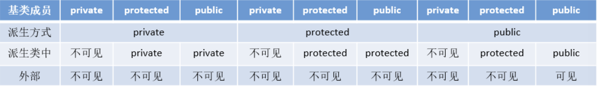

[TOC]

# C++基础语法

##  一、在main函数执行之前和之后执行的代码可能是什么？

main函数执行之前，主要是初始化系统相关资源：

- 设置栈指针
- 初始化静态static变量和global全局变量，.data段的内容
- 将未初始化的全局变量赋初值：数值型short, int, long等为0, bool为false，指针为NULL，.bss段的内容
- 全局对象初始化，在main之前调用构造函数，这是可能会执行的一些代码
- 将main函数的参数argc，argv等传参给main函数，然后真正运行main函数
-    _attribute__((constructor))


main函数执行之后：

- 全局对象的析构函数会在main函数之后执行
- 可以用atexit注册一个函数，它会在main函数执行之后执行
-    _attribute__((destructor))

## 二、结构体内存对齐问题

- 结构体内成员按照声明顺序存储，第一个成员地址和整个结构体地址相同
- 未特殊声明时，按结构体中size最大的成员对齐（若double成员，按8字节对齐）

​	c++11引入了alignas和alignof两个关键字。其中alignof可以计算出类型的对齐方式，alignas可以指定结构的对齐方式。

​	但是alignas在某些情况下是不能使用的。具体如下：

```c++
// alignas 生效的情况
struct Info {
    uint8_t a;
    uint16_t b;
    uint8_t c;
};

std::cout << sizeof(Info) << std::endl; // 6  2 + 2 + 2
std::cout << alignof(Info) << std::endl; // 2

struct alignas(4) Info2 {
    uint8_t a;
    uint16_t b;
    uint8_t c;
};

// alignas将内存对齐调整为4个字节，所以变成了8
std::cout << sizeof(Info2) << std::endl; // 8  2 + 2 + 2 + 2
std::cout << alignof(Info2) << std::endl; // 4
```

```c++
// alignas 失效的情况
struct Info {
    uint8_t a;
    uint32_t b;
    uint8_t c;
};

std::cout << sizeof(Info) << std::endl; // 12  4 + 4 + 4
std::cout << alignof(Info) << std::endl; // 4

struct alignas(2) Info2 {
    uint8_t a;
    uint32_t b;
    uint8_t c;
};

// alignas小于自然对齐的最小单位，被忽略掉了
std::cout << sizeof(Info2) << std::endl; // 12  4 + 4 + 4
std::cout << alignof(Info2) << std::endl; // 4
```

- 如果使用单字节对齐方式，使用alignas是无效的。应该使用如下方式

```c++
// #pragma pack(push, 1)或__attribute((packed))

#if defined(__GNUC__) || defined(__GNUG__)
	#define ONEBYTE_ALIGN __attribute((packed))
#elif defined(_MSC_VER)
	#define ONEBYTE_ALIGN
	#pragma pack(push, 1)
#endif

struct Info {
    uint8_t a;
    uint32_t b;
    uint8_t c;
} ONEBYTE_ALIGN;

#if defined(__GNUC__) || defined(__GNUG__)
	#undef ONEBYTE_ALIGN
#elif defined(_MSC_VER)
	#pragma pack(pop)
	#undef ONEBYTE_ALIGN
#endif

std::cout << sizeof(Info) << std::endl; // 6  1 + 4 + 1
std::cout << alignof(Info) << std::endl; // 1
```

- 确认结构体中每个元素的大小可以通过下面这种方法

```c++
#if defined(__GNUC__) || defined(__GNUG__)
	#define ONEBYTE_ALIGN __attribute((packed))
#elif defined(_MSC_VER)
	#define ONEBYTE_ALIGN
	#pragma pack(push, 1)
#endif

struct Info {
    uint16_t a : 1;
    uint16_t b : 2;
    uint16_t c : 3;
    uint16_t d : 2;
    uint16_t e : 1;
    uint16_t pad : 7;
} ONEBYTE_ALIGN;

#if defined(__GNUC__) || defined(__GNUG__)
	#undef ONEBYTE_ALIGN
#elif defined(_MSC_VER)
	#pragma pack(pop)
	#undef ONEBYTE_ALIGN
#endif

std::cout << sizeof(Info) << std::endl; // 2
std::cout << alignof(Info) << std::endl; // 1
```

## 三、指针和引用

- 指针是一个变量，存储的是一个地址，引用跟原来的变量实质上是一个东西，是原变量的别名
- 指针可以有多级，引用只有一级
- 指针可以为空，引用不能为NULL且在定义时必须要初始化
- 指针在初始化后可以改变指向，而引用在初始化之后不可再改变
- sizeof指针得到的是本指针的大小，sizeof引用得到的是引用所指向变量的大小
- 当把指针作为参数进行传递时，也是将实参的一个拷贝传递给形参，两者指向的地址相同，但不是同一个变量，在函数中改变这个变量的指向不影响实参，而引用可以
- 在汇编层面，一些编译器将引用当成指针操作，因此引用会占用空间。是否占用空间，应该结合编译器分析。
- 引用在声明时必须要初始化为另一变量，一旦出现必须为typename rename &varname，指针声明和定义可以分开，可以只声明指针变量而不初始化，等用到时再指向具体变量
- 不存在指向空值的引用，必须有具体试题，但是存在指向空值的指针

参考代码:

```c++
void test(int *p)
{
    int a = 1;
    p = &a;
    cout << p << " " << endl;
}

int main()
{
    int *p = NULL;
    test(p);
    if (p == NULL) {
        cout << "指针p为NULL" << endl;
    }
}

// 运行结果: 指针P为NULL


void testPTR(int *p)
{
    int a = 12;
    p = &a;
}

void testREFF(int &p)
{
    int a = 12;
    p = a;
}

int main()
{
    int a = 10;
    int *b = &a;
    testPTR(b);
    cout << a << endl;  // 10
    cout << *b << endl; // 10
    
    a = 10;
    testREFF(a);
    cout << a << endl;  // 12
}
```

## 四、在传递函数参数时，什么时候该用指针，什么使用该用引用？

- 需要返回函数内局部变量的内存的时候用指针。使用指针传参需要开辟内存，用完记得释放指针，不然会内存泄漏。而返回局部变量的引用是没有意义的
- 对栈空间大小比较敏感的时候使用引用，使用引用传递不需要创建临时变量，开销要小
- 类对象作为参数传递的时候使用引用，这是C++类对象传递的标准方式

## 五、堆和栈的区别

- 申请方式不同
  - 栈由系统自动分配
- 堆事自己申请和释放
- 申请大小限制不同
  - 栈顶和栈底是之前预设号的，栈是向栈底拓展的，大小固定，可以通过ulimit -a查看，ulimit -s修改
  - 堆是高地址拓展，是不连续的内存区域，大小可以灵活调整
- 申请效率不同
  - 栈由系统分配，速度快，不会有碎片
  - 堆由程序员分配，速度慢，且会有

|              |                              堆                              |                              栈                              |
| :----------: | :----------------------------------------------------------: | :----------------------------------------------------------: |
|   管理方式   |          堆中资源由程序员控制(容易产生memory leak)           |           栈资源由资源编译器自动管理，无需手工控制           |
| 内存管理机制 | 系统有一个记录空闲内存地址的链表，当系统收到程序申请时，遍历该链表，寻找第一个空间大于申请空间的堆结点，删除空闲结点链表中的该结点，并将该结点空间分配给程序(大多数系统会在这块内存空间首地址记录本次分配的大小，这样delete才能正确释放本内存空间，另外系统会将多余 的部分重新放入空闲链表中) | 只要栈的剩余空间大于所申请空间，系统为程序提供内存，否则报异常提示栈溢出。（这一块理解一下链表和队列的区别，不连续空间和连续空间的区别，应该就比较好理解这两种机制的区别） |
|   空间大小   | 堆是不连续的内存区域（因为系统是用链表来存储空闲内存地址，自然不是连续的），堆大小受限于计算机系统中有效的虚拟内存（32bit系统理论上是4G），所以堆的空间比较灵活，比较大。 | 栈是一块连续的内存区域，大小是操作系统预定好的，Windows下的栈大小是2M(也有1M，在编译时确定) |
|   碎片问题   |    对于堆，频繁的new/delete会造成大量碎片，使程序效率降低    | 对于栈，它是有点类似于数据结构上的一个先进后出的栈，进出一一对应，不会产生碎片 |
|   生长方向   |                   堆向上，向高地址方向增长                   |                   栈向下，向低地址方向增长                   |
|   分配方式   |                        堆都是动态分配                        | 栈有静态分配和动态分配，静态分配由编译器完成，动态分配由alloca函数分配，但栈的动态分配的资源由编译器进行释放，无需程序员实现 |
|   分配效率   |   堆由C/C++函数库提供，机制很复杂，所以堆的效率比栈低很多    | 栈是其系统提供的数据结构，计算机在底层对堆提供支持，分配专门寄存器存放栈地址，栈操作由专门指令 |


## 六、堆快一点还是栈快一点？

​	栈快一点。

​	因为操作系统会在底层对栈支持，会分配专门的寄存器存放栈的地址，栈的入栈出栈操作也十分简单，并且有专门的指令执行，所以栈的效率比较高也比较快。

​	而堆的操作由C/C++函数库提供，在分配堆内存的时候需要一定的算法寻找合适大小的内存。并且获取堆的内容需要两次访问，第一次访问指针，第二次根据指针保存的地址访问内存，因此堆比较慢。

## 七、区别以下指针类型

```C++
int *p[10];    // 指针数组 
int (*p)[10];  // 数组指针
int *p(int);   // 函数声明
int (*p)(int); // 函数指针
```


## 八、new/delete 与malloc/free的异同

相同点：

- 都可以用于内存的动态申请和释放

不同点：

- 前者是C++运算符，后者是C/C++语言标准库函数
- new自动计算需要分配的空间大小，malloc需要手工计算
- new是类型安全的，malloc不是，例如：

```c++
int *p = new float[2]; // 编译错误
int *p = (int *)malloc(2 * sizeof(double)); // 编译无错误
```

- new调用名为operator new的标准库函数分配足够空间并调用相关对象的构造函数，delete对指针所指对象运行适当的析构函数；然后通过调用名为operator delete的标准库函数释放该对象所用内存。后者均没有相关调用
- 后者需要库文件支持，前者不用
- new是封装了malloc，直接free不会报错，但是这样只是释放了内存，并不会析构对象


## 九、new和delete是如何实现的

- new的实现过程：首先调用名为operator new的标准库函数，分配足够大的原始为类型化的内存，以保存指定类型的一个对象；接下来运行该类型的一个构造函数，用于初始化构造对象；最后返回执行该新分配并构造后的对象的指针
- delete的实现过程：对指针所指向的对象运行适当的析构函数，然后通过调用名为operator delete的标准库函数释放该对象所用内存


## 十、malloc和new的区别

- malloc和free是标准库函数，支持覆盖；new和delete是运算符，支持重载
- malloc仅仅分配内存空间，free仅仅回收空间，不具备构造函数和析构函数功能，用malloc分配空间存储类的对象存在风险；new和delete除了分配回收功能外，还会调用构造函数和析构函数
- malloc和free返回的void类型指针(必须进行类型转换)，new和delete返回的是具体类型的指针


## 十一、既然有了malloc/free，C++中为什么还需要new/delete

- malloc/free和new/delete都是用来申请和回收内存的
- 在对于非基本数据类型的对象使用的时候，对象创建还需要执行对应的构造函数，销毁的时候还需要执行析构函数。而malloc/free是库函数，是已经编译的代码，所以不能把构造函数和析构函数的功能强加给malloc/free，所以new/delete是必不可少的


## 十二、被free回收的内存是立即返回给操作系统吗

​	不是的，被free回收的内存会首先被ptmalloc使用双链表保存起来，当用户下一次申请内存的时候，会尝试从这些内存中寻找合适的返回。这样就避免了频繁的系统调用，占用过多的系统资源。同时ptmalloc也会尝试对小块内存进行合并，避免过多的内存碎片。


## 十三、宏定义和函数有何区别

- 宏在预处理阶段完成替换，之后被替换的文本参与编译，相当于直接插入了代码，运行时不存在函数调用，执行起来更快；函数调用在运行时需要跳转到具体调用函数
- 宏定义属于在结构中插入代码，没有返回值；函数调用有返回值
- 宏定义参数没有类型，不会进行类型检查；函数参数有类型，需要检查类型
- 宏定义不要在最后加分号


## 十四、宏定义和typedef区别

- 宏主要用于定义常量及书写复杂的内容；typedef主要用于定义类型别名
- 宏替换发生在编译阶段之前，属于文本插入替换；typedef是编译的一部分
- 宏不检查类型；typedef会检查数据类型
- 宏不是语句，不在最后加分号；typedef是语句，要加分号标识结束
- 注意对指针的操作，typedef chat * p_char 和 #define p_char char *区别巨大


## 十五、变量声明和定义区别

- 申明仅仅是把变量的声明的位置及类型提供给编译器，并不分配内存空间；定义要在定义的地方为其分配存储空间
- 相同变量可以在多出声明(外部变量 extern)，但只能在一处定义


## 十六、strlen和sizeof的区别

- sizeof是运算符，并不是函数，结果在编译时得到，而非运行中得到；strlen是字符处理的库函数
- sizeof参数可以是任何数据的类型或者数据；strlen参数只能是字符指针且结尾是'\0'的字符串
- 因为sizeof值在编译时确定，所以不能用来得到动态分配存储空间的大小

```c++
int main()
{
    const char *str = "name";
    
    sizeof(str); // 取的指针str的长度，是8/4
    strlen(str); // 取的这个字符串的长度，不包含结尾的结束符，是4
    return 0;
}
```


## 十七、常量指针和指针常量的区别

- 指针常量是一个指针，读成常量的指针，只想一个只读变量，也就是后面所指明的int const和const int，都是一个常量，可以写作int const *p 和const int *p
- 常量指针是一个不能改变指向的指针。指针是个常量，必须初始化，一旦初始化完成，它的值(也就是存放在指针中的地址)就不能改变了，既不能中途改变指向


## 十八、a和&a有什么区别

​	假设数组int a[10]; int (*p)[10] = &a;其中：

- a是数组名，是数组首元素地址，+1表示地址值加上一个int类型的大小，如果a的值是0x00000001，加1操作后变为0x00000005。*(a + 1) = a[1]。
- &a是数组的指针，其类型为int (*)[10]（就是前面提到的数组指针），其加1时，系统会认为是数组首地址加上整个数组的偏移（10个int型变量），值为数组a尾元素后一个元素的地址
- 若(int *)p，此时输出*p时，其值为a[0]的值，因为被转为int *类型，解引用时按照int类型大小来读取。


## 十九、C++和Python的区别

- Python是一种脚本语言，是解释执行的，而C++是编译语言，是需要编译后在特定平台运行的。Python可以很方便的跨平台，但是效率没有C++高。
- Python使用缩进来区分不同的代码块，C++使用花括号来区分。
- C++中需要事先定义变量的类型，而Python不需要，Python的基本数据类型只有数字、布尔值、字符串、列表、元组等等。
- Python的库函数比C++的多，调用起来很方便。


## 二十、C++和C语言的区别

- C++中`new`和`delete`是对内存分配的运算符，取代了C中的`malloc`和`free`。
- 标准C++中的字符串类取代了标准C函数库头文件中的字符数组处理函数（C中没有字符串类型）。‘
- C++中用来做控制态输入输出的`iostream`类库替代了标准C中的`stdio`函数库。
- C++中的`try/catch/throw`异常处理机制取代了标准C中的`setjmp()`和`longjmp()`函数。
- 在C++中，允许有相同的函数名，只要它们的参数类型不同（函数重载），而C语言不允许函数重载。
- C++允许变量定义在程序的任何位置（只要在使用之前），而C语言必须在函数开头定义变量。此外，C++禁止重复定义变量，而C语言允许。
- C++引入了**引用**（`&`），作为变量的别名，而C语言只有值和指针。
- C++新增了一些关键字，如：`bool`、`using`、`dynamic_cast`、`namespace`等。


## 二十一、struct和class的区别

相同点：

- 两者都拥有成员函数、共有和私有部分
- 任何可以使用class完成的工作，同样可以使用struct完成

不同点：

- 如果不对成员变量指定公私有，struct默认是公有的，class默认是私有的
- class默认是private继承，struct默认是Public继承


**引申： ** C++和C的struct区别

- C语言中：struct是用户自定义数据类型；C++中struct是抽象数据类型，支持成员函数的定义（C++中的struct能继承，能实现多态）‘
- C中的struct是没有权限的设置的，且struct中只能说一些变量的集合体，可以封装数据却不可以隐藏数据，而且成员不可以是函数
- C++中，struct增加了访问权限，且可以和类一样有成员函数，成员默认访问说明符为Public
- struct作为类的一种特例是用来定义数据结构的。一个结构标记声明后，在C中必须在结构标记前加上struct，才能做结构类型名(除： typedef struct class {})，C++中结构体标记可以直接作为结构体类型名使用，此外结构体struct在C++中被当做类的一种特例


## 二十二、define宏定义和const的区别

**编译阶段**

- define是在编译的预处理阶段起作用，而const是在编译、运行的时候起作用

**安全性**

- define只做替换，不做类型检查和计算，也不求解，容易产生错误，一般最后加上一个大括号包含住全部的内容，要不然容易出错
- const常量有数据类型，编译器可以对其进行类型安全检查

**内存占用**

- define只是将宏名称进行替换，在内存中产生多分相同的备份。const在程序运行中只有一份备份，且可以执行常量折叠，能将复杂的表达式计算出结果放入常量表
- 宏替换发生在编译阶段之前，属于文本插入替换；const作用发生于编译过程中
- 宏不检查类型，const会检查数据类型
- 宏定义的数据没有分配内存空间，只是插入替换掉；const定义的变量只是值不能改变，但是要分配内存空间


## 二十三、C++中const和static的作用 

**static**

- 不考虑类的情况
  -   隐藏。所有不加static的全局变量和函数具有全局可见性，可以在其他文件中使用，加了之后只能在该文件所在的编译模块中使用
  - 默认初始化为0。包括未初始化的全局静态变量与局部静态变量，都存在全局未初始化区。
  - 静态变量在函数内定义，始终存在，且只进行一次初始化，具有记忆性，其作用范围与局部变量相同，函数退出后仍然存在，但不能使用
  
- 考虑类的情况

  - static成员变量：只与类关联，不与类的对象管理。定时要分配空间，不能在

  声明中初始化，必须在类定义体外部初始化，初始化时不需要标识为static；可以被非static成员函数任意访问

  - static成员函数：不具有this指针，无法访问类对象的非static成员变量和非static成员函数；不能被声明为const、虚函数和volatile；可以被非static成员函数任意访问

**const**

- 不考虑类的情况

    -   const常量在定义时必须初始化，之后无法更改

    -   const形参可以接受const和非const类型的实参

  -   考虑类的情况
      -   const成员变量：不能在类定义外部初始化 ，只能通过构造函数初始化列表进行初始化，并且必须有构造函数；不能类对其const数据成员的值要求可以不同，所以不能在类中声明时初始化。
      -   const成员函数：const对象不可以调用非const成员函数；非const对象都可以调用；不可以改变非mutable数据的值


## 二十四、C++的顶层const和底层const

**概念区分**

- 顶层const：指的是const修饰的变量本身是一个常量，无法修改，指的是指针，就是 * 号的右边
- 底层const：指的是const修饰的变量所指的对象是一个常量，指的是所指变量，就是 * 号的左边

```C++
int a = 10;
int* const b1 = &a;             // 顶层const，b1本身是一个常量
const int *b2 = &a;             // 底层const，b2本身可变，所指的对象是常量
const int b3 = 20;              // 顶层const，b3是常量不可变
const int* const b4 = &a;       // 前一个是底层，后一个为顶层，b4不可变
const int& b5 = a;              // 用于声明引用变量，都是底层const
```

**区分作用**

- 执行对象拷贝时有限制，常量的底层const不能赋值给非常量的底层const
- 使用命名的强制类型转换函数const_cast时，只能改变运算对象的底层const

```c++
const int a;
int const a;
const int *a;
int *const a;
```

- int const a和const int a均表示定义常量类型a
- const int *a，其中a为指向int型变量的指针，const在 * 左侧，表示a指向不可变常量。（看成const( *a)， 对引用加const）
- int *const a，已经是指针类型，表示a为指向整型数据的正常指针。(看成const(a)， 对指针)

## 二十五、数组名和指针

- 二者均可通过增减偏移量来访问数组的元素
- 数组名不是真正意义上的指针，可以理解为常指针，所以数组名没有自增、自减等操作
- 当数组名当做形参传递给调用函数后，就失去了原有的特性，退化成一般指针，多了自增、自减操作，但是sizeof运算符不能再得到原数组的大小


## 二十六、final和override关键字

**override**

​	当父类中使用了虚函数时候，你可以需要在某个子类中对这个虚函数进行重写，以下方式都可以：

```c++
class A
{
    virtual void foo();
};

class B : public A
{
    void foo();
    virtual void foo();
    void foo() override;
};
```

​	如果不使用override，将foo()写成了f00编译器并不会报错，因为它并不知道你的目的是重写虚函数，而是把它当成了新的函数。如果这个虚函数很重要的话，那就会对整个程序不利。所以，override的作用就出来了，它指定了子类的这个虚函数是重写的父类的，如果你的名字不小心打错了的话，编译器是不会编译通过的。

**final**

​	当不希望某个类被继承，或不希望某个虚函数被重写，可以在类名和虚函数后添加final关键字，添加final关键字后被继承或重写吗，编译器会报错

```c++
class Base
{
    virtual void foo();
};

class A : public Base
{
    void foo() final; // foo被override，并且是最后一个override，在其子类中不允许再被重写
};

class B final : A  // 指明B是不可以被继承的
{
    void foo() override; // Error: 在A中foo已经是final了
}

class C : B  // Error: B is final
{
    
}
```


## 二十七、拷贝初始化和直接初始化

- 当用于类类型对象时，初始话的拷贝形式和直接形式有所不同：直接初始化直接调用与实参匹配的构造函数，拷贝初始化总是调用拷贝构造函数。拷贝初始化首先指定构造函数创建一个临时对象，然后拷贝构造函数将那个临时对象拷贝到正在创建的对象。

```c++
string str1("I am a string");   // 直接初始化
string str2(str1);              // 直接初始化，str1是已经存在的对象，直接调用拷贝构造函数对str2进行初始化
string str3 = "I am a string";  // 拷贝初始化，先为字符串"I am a string"创建临时对象，再把临时对象作为参数，使用拷贝构造函数构造str3
string str4 = str1;             // 拷贝初始化，相当于隐式调用拷贝构造函数，而不是调用赋值运算符函数
```

- 为了提高效率，允许编译器跳过创建临时对象这一步，直接调用构造函数构造要创建的对象，这样就完全等价于直接初始化了，但是需要辨别两种情况：
  - 当拷贝构造函数为private时：语句3和语句4在编译时会报错
  - 使用explicit修饰构造函数时，如果构造函数存在隐式转换，编译时会报错


## 二十八、初始化和赋值的区别

- 对于简单类型来说，初始化和赋值没有区别
- 对于类和复杂类型来说，区别就很大了：

```C++
class A {
public: 
    int num1;
    int num2;
    
    A(int a = 0, int b = 0) : num1(a), num2(b){};
    A(const A &a) {};
    // 重载 = 号操作符函数
    A &operator=(const A &a) {
        num1 = a.num1 + 1;
        num2 = a.num2 + 1;
        return *this;
    }
};

int main()
{
    A a(1, 1);
    A a1 = a; // 拷贝初始化操作，调用拷贝构造函数
    A b;
    b = a;    // 赋值操作，对象a中，num1 = 1, num2 = 1, 对象b中，num1 = 2, num2 = 2
    
    return 0;
}
```

## 二十九、extern "C"的用法

​	为了能够正确的在C++代码中调用C语言的代码：在程序中加上extern "C"后，相当与告诉编译器这部分代码是C语言写的，因此要按照C语言进行编译，而不是C++

​	哪些情况下使用extern “C”：

- C++代码中调用C语言代码
- 在C++中的头文件中使用
- 在多个人协同开发时，有人擅长C语言，而有人擅长C++

```c++
#ifndef __MY_HANDLE_H__
#define __MY_HANDLE_H__

#ifdef __cplusplus
extern "C" {
#endif

    typedef unsigned int result_t;
    typedef void * my_handle_t;
    
    my_handle_t create_handle(const char *name);
    result_t operate_on_handle(my_handle_t handle);
    void close_handle(my_handle_t handle);
    
#ifdef __cplusplus
}
#endif // extern "C"
    
#endif // __MY_HANDLE_H__
```

综上，总结出使用方法：在C语言的头文件中，对齐外部函数只能指定为extern类型，C语言中不支持extern "C"声明，在.c文件中包含了extern "C"时会编译语法错误，所以使用extern "C"全部放于cpp程序相关文件或其头文件中

总结出如下形式：

C++调用C函数：

```c++
// xx.h
extern int add(...)

// xx.c
int add()
{
    
}
    
// xx.cpp
extern "C" {
    #include "xx.h"
}
```

C语言调用C++函数

```c++
// xx.h
extern "C" {
    int add();
}

// xx.c
int add()
{
    
}

// xx.cpp
extern int add();
```


## 三十、野指针和悬空指针

​	都是只想无效内存区域的指针，访问行为将会导致未定义行为

- 野指针

​	野指针，指的是没有被初始化过的指针

```c++
int main(void)
{
    int *p; // 未初始化
    std::cout << *p << std::endl;  // 未初始化就被使用
    
    return 0;
}
```

​	因此，为了防止出错，对于指针初始化时都是赋值为nullptr，这样在使用时编译器就不会直接报错，产生非法内存访问。 

- 悬空指针

​	悬空指针，指针最初指向的内存以及被释放了的一种指针。

```c++
int main(void)
{
    int *p = nullptr;
    int *p2 = new int;
    
    p = p2;
    delete p2;
}
```

​	此时的p和p2就是悬空指针，指向的内存已经被释放。继续使用这两个指针，行为不可预料。需要设置为p=p2=nullptr。此时再使用就会直接报错。

​	避免野指针比较简单，但悬空指针比较麻烦，C++引入了只能指针，C++智能指针的本质就是避免虚空指针的产生。

**产生原因及解决方法：**

​	野指针：指针变量未及时初始化 => 定义指针变量及时初始化，要么置空

​	悬空指针：指针free或delete之后没有及时置空 => 释放操作后立即置空


## 三十一、C和C++的类型安全

**什么是类型安全**

​	类型安全很大程度可以等价于内存安全，类型安全的代码不会视图访问自己没被授权的内存区域。"类型安全"常被用来形容编程语言，其根据在于该门变成语言是否提供保障类型安全的机制；有时候也用"类型安全"来形容某个程序，判别的标准在于该程序是否隐含类型错误。

​	类型安全的编程语言与类型安全的程序之间，没有必然联系。好的程序员可以使用类型不那么安全的语言写出类型想当安全的程序，相反的，差一点的程序员可能使用类型想当安全的语言写出类型不太安全的程序。绝对类型安全的编程语言暂时还没有。

**C的类型安全**

​	C只在局部上下文中表现出类型安全，比如视图从一种结构体的指针转换成另一个结构体的指针时，编译器将会报告错误，除非使用显示类型转换。然而，C中想当多的操作是不安全的。

- printf格式输出

```c
#include <stdio.h>

int main()
{
    printf("整型输出：%d\n", 10);   // 10
    printf("浮点型输出：%f\n", 10); // 0
    printf("字符串输出：%s\n", 10); // // segmentation fault
}
```

- malloc函数的返回值

​	malloc是C中进行内存分配的函数，它的返回类型是void *，即空类型指针，常常有如下的用法进行显示转换

```c
char *pStr = (char *)malloc(100 * sizeof(char));
```

​	类型匹配尚且没有问题，但是一旦出现如下不匹配的情况，就很看带来一些问题，而这样的转换C并不会提示错误

```c
int *pStr = (int *)malloc(100 * sizeof(char));
```


**C++的类型安全**

​	如果C++使用得当，它将远比C更有类型安全性。相比于C语言，C++提供了一些新的机制保障类型安全:

- 操作符new返回的指针类型严格与对象匹配，而不是void *
- C中很多以void *为参数的函数可以改写为C++模板函数，而模板是支持类型检查的
- 引入const关键字代替#define constants，它是有类型、又作用域的，而#define constants只是简单的文本替换
- 一些#define宏可以被改写为inline函数，结合函数的重载，可在类型安全部的前提下支持多种类型，当然改写为模板也能保障类型安全
- C++提供了dynamic_cast关键字，使得转换过程更加安全，因为dynamic_cast比static_cast涉及更多具体的类型检查


使用void *进行类型转换

```c++
#include <iostream>
using namespace std;

int main()
{
    int i = 5;
    void *pInt = &i;
    double d = (*(double *)pInt);
    cout << "转换后输出：" << d << endl; // 1.78416e-307
}
```


不同类型指针之间的转换

```c++
#include <iostream>
using namespace std;

class Parent {};

class Child1 : public Parent
{
public:
    int i;
    Child1(int e) : i(e) {};
};

class Child2 : public Parent
{
public:
    double d;
    Child2(double e) : d(e) {};
};

int main()
{
    Child1 c1(5);
    Child2 c2(4.1);
    Parent *pp;
    Child1 *pc1;
    
    pp = &c1;
    pc1 = (Child1 *)pp; // 类型向下转换，强制转换，但是由于类型仍然是Child1，不会发生错误
    cout << pc1->i << endl; // 5
    
    pp = &c2;
    pc1 = (Child1 *)pp; // 强制转换，且类型发生变化，将造成错误
    cout << pc1->i << endl; // 1717986918
}
```

## 三十二、C++中的重载、重写和隐藏的区别

1. 重载（overload）

     	重载是指在同一范围定义中的同名成员函数才存在重载关系。主要特点是函数名相同，参数类型和数目有所不同，不能出现参数个数和类型均相同，仅仅依靠返回值不同来区分的函数。重载和函数成员是否是虚函数无关

   ```c++
   class A {
       ...
       virtual int func();
       void func(int);
       void func(double, double);
       static int func(char)
       ...
   };
   ```

   

2. 重写（override）

   ​	重写指的是在派生类中覆盖基类中的同名函数，**重写就是重新函数体，要求基类函数必须是虚函数**且：

   - 与基类的虚函数有相同的参数个数
   - 与基类的虚函数有相同的参数类型
   - 与基类的虚函数有相同的返回值类型

   ```C++
   class A {
   public:
       virtual int fun(int a) {};
   };
   
   class B : public A {
   public:
       virtual int fun(int a) override {};
   }
   ```

   重载与重写的区别：

   - 重写是父类与子类的垂直关系，重载是不同函数之间的水平关系
   - 重写要求参数列表相同，重载要求参数列表不同，返回值不要求
   - 重写关系中，调用方法根据对象类型决定，重载根据调用时实参表与形参表的对应关系来选择函数体

3. 隐藏（hide）

​	隐藏指的是某些情况下，派生类的函数屏蔽了基类中的同名函数，包括以下情况：

- 两个函数参数相同，但是基类函数不是虚函数，和**重写的区别在于基类函数是否是虚函数**

```c++
class A {
public:
    void func(int a) {
        cout << "A中的func函数" << endl;
    }
}

class B : public A {
public:
    void func(int a) {
        cout << "B中的func函数" << endl;
    }
}

int main()
{
    B b;
    b.func(2);    // 调用的B中的func
    b.A::func(2); // 调用的A中的func
    return 0;
}
```

- 两个函数参数不同，无论基类函数是不是虚函数，都会被隐藏。和重载的区别在于两个函数不在一个类中

```c++
class A {
public:
    void func(int a) {
        cout << "A中的func函数" << endl;
    }
}

class B : public A {
public:
    void func(char *a) {
        cout << "B中的func函数" << endl;
    }
}

int main()
{
    B b;
    b.func(2);    // 报错，参数类型不对
    b.A::func(2); // 调用的A中的func
    return 0;
}
```


```c++
// 父类
class A {
public:
    virtual void fun(int a) { // 虚函数
        cout << "This is A fun " << a << endl;
    }  
    void add(int a, int b) {
        cout << "This is A add " << a + b << endl;
    }
};

// 子类
class B: public A {
public:
    void fun(int a) override {  // 覆盖
        cout << "this is B fun " << a << endl;
    }
    void add(int a) {   // 隐藏
        cout << "This is B add " << a + a << endl;
    }
};

int main() {
    // 基类指针指向派生类对象时，基类指针可以直接调用到派生类的覆盖函数，也可以通过 :: 调用到基类被覆盖
    // 的虚函数；而基类指针只能调用基类的被隐藏函数，无法识别派生类中的隐藏函数。

    A *p = new B();
    p->fun(1);      // 调用子类 fun 覆盖函数
    p->A::fun(1);   // 调用父类 fun
    p->add(1, 2);
    // p->add(1);      // 错误，识别的是 A 类中的 add 函数，参数不匹配
    // p->B::add(1);   // 错误，无法识别子类 add 函数
    return 0;
}
```


## 三十三、C++有哪几种构造函数

- 默认构造函数
- 初始化构造函数(有参数)
- 拷贝构造函数
- 移动构造函数
- 委托构造函数
- 转换构造函数

```c++
#include <iostream>
using namespace std;

class Student {
public:
    Student() { // 默认构造函数，没有参数
        this->age = 20;
        this->num = 1000;
    };

    Student(int a, int n):age(a), num(n){}; // 初始化构造函数，有参数和参数列表

    Student(const Student& s) { // 拷贝构造函数，这里与编译器生成的一致
        this->age = s.age;
        this->num = s.num;
    };

    Student(int r) { // 转换构造函数,形参是其他类型变量，且只有一个形参
        this->age = r;
		this->num = 1002;
    };

    Student(const char* name, double score) // 接受任意类型指定参数的构造函数
    {
        this->age = 0;
        this->num = (int)score;
    }

    Student(double r) { // 转换构造函数,形参是其他类型变量，且只有一个形参
        this->age = (int)r * 10;
		this->num = 1003;
    };

    ~Student(){}
public:
    int age;
    int num;
};

int main(){
    Student s1;
    Student s2(18,1001); // 初始化构造函数调用
    int a = 10;
    Student s3(a); // 重载构造函数调用,传参数形式
    Student s4(s3);
    Student s5("Demo", 56.45); // 重载构造函数调用
    Student s6 = 85.63; // 证明为转换构造函数调用
    float b = 5.2;
    Student s7 = b; // 为转换构造函数调用，带有隐式类型转换
	
    
    printf("s1 age:%d, num:%d\n", s1.age, s1.num);
    printf("s2 age:%d, num:%d\n", s2.age, s2.num);
    printf("s3 age:%d, num:%d\n", s3.age, s3.num);
    printf("s4 age:%d, num:%d\n", s4.age, s4.num);
    printf("s5 age:%d, num:%d\n", s5.age, s5.num);
    printf("s6 age:%d, num:%d\n", s6.age, s6.num);
    printf("s7 age:%d, num:%d\n", s7.age, s7.num);
    return 0;
}
// 运行结果
// s1 age:20, num:1000
// s2 age:18, num:1001
// s3 age:10, num:1002
// s4 age:10, num:1002
// s5 age:0, num:56
// s6 age:850, num:1003
// s7 age:50, num:1003

```

- 默认构造函数和初始化构造函数在定义类的对象，完成对象的初始化工作
- 拷贝构造函数用于复制本类的对象
- 转换构造函数用于将其他类型的变量，隐式转换为本类对象


## 三十四、浅拷贝和深拷贝的区别

 **浅拷贝**

​	浅拷贝只是拷贝一个指针，并没有新开辟一个地址，拷贝的指针和原来的指针指向同一块地址，如果原来的指针所指向的资源释放了，那么再释放浅拷贝的指针的资源就会出现错误。

**深拷贝**

​	深拷贝不仅拷贝值，还开辟一块新的空间用来存放新的值，即使原先的对象被析构掉，释放内存了也不会影响到深拷贝的值。在自己实现拷贝赋值的时候，如果有指针变量的话是需要自己实现深拷贝的。

```c++
#include <iostream>  
#include <string.h>
using namespace std;
 
class Student
{
private:
	int num;
	char *name;
public:
	Student(){
        name = new char(20);
		cout << "Student" << endl;
    };
	~Student(){
        cout << "~Student " << &name << endl;
        delete name;
        name = NULL;
    };
	Student(const Student &s) { // 拷贝构造函数
        // 浅拷贝，当对象的name和传入对象的name指向相同的地址
        name = s.name;
        // 深拷贝
        // name = new char(20);
        // memcpy(name, s.name, strlen(s.name));
        cout << "copy Student" << endl;
    };
};
 
int main()
{
	{ // 花括号让s1和s2变成局部对象，方便测试
		Student s1;
		Student s2(s1); // 复制对象
	}
	system("pause");
	return 0;
}
// 浅拷贝执行结果：
// Student
// copy Student
// ~Student 0x7fffed0c3ec0
// ~Student 0x7fffed0c3ed0
// *** Error in `/tmp/815453382/a.out': double free or corruption (fasttop): 0x0000000001c82c20 ***

//深拷贝执行结果：
// Student
// copy Student
// ~Student 0x7fffebca9fb0
// ~Student 0x7fffebca9fc0
```

​	从执行结果可以看出，浅拷贝在对象的拷贝创建时存在风险，即被拷贝的对象析构释放资源之后，拷贝对象析构时会再次释放一个已经释放的资源，深拷贝的结果是两个对象之间没有任何关系，各自成员地址不同。


## 三十五、内联函数和宏定义的区别

- 在使用时，宏只做简单字符串替换(编译前)。而内联函数可以进行参数类型检查(编译时)，且具有返回值
- 内联函数在编译时直接将函数代码嵌入到目标代码中，省去函数调用的开销来提高执行效率，并且进行参数类型检查，具有返回值，可以实现重载
-  宏定义要注意书写，否则容易出现歧义，内联函数不会产生歧义

**内联函数适用场景**

- 使用宏定义的地方都可以使用inline函数
- 作用类成员接口函数来读写类的私有成员或保护成员，提高效率


## 三十六、public、protected、private访问和继承权限public、protected、private的区别

- public的变量和函数在类的内部外部都可以访问
- protected的变量和函数只能在类的内部和派生类中访问
- private修饰的变量只能在类内访问


1. **访问权限**

   ​	派生类可以继承基类中除了构造/析构、赋值运算符重载函数之外的成员，但是这些成员的访问属性在派生过程中也是可以调整的，三种派生方式的访问权限如下所示：

   外部访问并不是真正的外部访问，而是通过派生类的对象对基类成员的访问

   

   ​	派生类对基类成员的访问形象有以下两种：

   - 内部访问：由派生类中新增的成员函数对从基类继承来的成员的访问
   - 外部访问：在派生类外部，通过派生类对象从基类继承的成员访问

2. **继承权限**

public继承

​	公有继承的特定是基类的公有成员和保护成员作为派生类的成员时，都保持原有的状态，而基类的私有成员仍然是私有的，不能被这个派生类的子类所访问

protected继承

​	保护继承的特点是基类的所有公有成员和保护成员都成为派生类的保护成员，并且只能被它的派生类成员函数或友元函数访问，基类的私有成员仍然是私有的


private继承

​	私有继承的特点是基类的所有公有成员和保护成员都成为派生类的私有成员，并不被它的派生类的子类所访问，基类的成员只能由自己派生类访问


## 三十七、如何用代码判断大小端存储

​	大端存储：字数据的高字节存储在低地址中

​	小端存储： 字数据的低字节存储在低地址中

​	**在socket编程中，往往需要将操作系统所有的小端存储的IP地址转换为大端存储，这样才能进行网络传输**

​	以32bit的数字0x12345678为例：

​	小端模式的存储方式为：


​	大端模式中的存储方式为：


**方式一：使用强制类型转换**

```c++
#include <iostream>
using namespace std;
int main()
{
    int a = 0x1234;
    // 由于int和char的长度不同，借助int型转换成char型，只会留下低地址的部分
    char c = (char)(a);
    if (c == 0x12) {
        cout << "big endian" << endl;
    } else if(c == 0x34) {
        cout << "little endian" << endl;
    }
}

```


**方式二：巧用union联合体**

```c++
#include <iostream>
using namespace std;
// union联合体的重叠式存储，endian联合体占用内存的空间为每个成员字节长度的最大值
union endian
{
    int a;
    char ch;
};

int main()
{
    endian value;
    value.a = 0x1234;
    // a和ch共用4字节的内存空间
    if (value.ch == 0x12) {
        cout << "big endian" << endl;
    } else if (value.ch == 0x34) {
        cout << "little endian" << endl;
    }
}

```


## 三十八、volatile、mutable和explicit关键字

**volatile**

​	volatile关键字是一种类型修饰符，**用它声明的类型变量表示可以被某些编译器未知的因素更改**，比如：操作系统、硬件或者其他线程等。遇到这个关键字声明的变量，编译器对访问该变量的代码不再进行优化，从而可以提供对特殊地址的稳定访问

​	当要求使用volatile声明的变量的值的时候，**系统总是重新从它所在的内存读取数据**，即使它前面的指令刚刚从该处读取过数据

​	**volatile定义变量的值是易变的，每次用到这个变量的值的时候都要去重新读取这个变量的值，而不是读寄存器内的备份。多线程中被几个任务共享的变量需要定义为volatile类型。**


**volatile指针**

​	volatile指针和const修饰词类类似，const有常量指针和指针常量的说法，volatile也有相应的概念

​	修饰由指针指向的对象、数据是const或volatile的

```c++
const char* cpch;
volatile char* vpch;
```

​	指针自身的值 --- 一个代表地址的整数变量，是const或volatile的

```c++
char* const pchc;
char* volatile pchv;
```

**注意：**

- 可以把一个非volatile int赋值给volatile int，但是不能把非volatile对象赋值给volatile对象
- 除了基本类型外，对用户定义类型也可以用volatile类型进行修饰
- C++中一个有volatile标识符的类只能访问它接口的子集，一个由类的实现者控制的字节。用户只能用const_cast来获得对类型接口的完全访问。此外volatile像const一样会从类传递到它的成员


**多线程下的volatile**

​	有些变量是用volatile关键字声明的，当两个线程都要用到某一个变量且变量的值会被改变时，应该用volatile声明，**该关键字的作用是防止编译器把变量从内存装入到CPU寄存器**

​	如果变量被装入寄存器，那么两个线程有可能一个使用内存中的变量，一个使用寄存器中的变量，那么会造成程序的错误执行

​	volatile的意思是让编译器每次操作该变量时一定要从内存中真正取出，而不是使用已经寄存在编译器中的值


**mutable**

​	mutable的中文意思是"可变的，易变的"，跟constant(即 const)是反义词，在C++中，mutable也是为了突破const的限制而设置的。被mutable修饰的变量，将永远处于可变的状态，即使在一个const函数中，我们知道如果类的成员函数不会改变对象的状态，那么这个成员函数一般会声明成const。但是，有时候，我们需要在**const函数里面修改一些跟类状态无关的数据成员，那么这个函数应该被mutable类修饰，并且放在函数后面关键字位置**

```c++
class person
{
    int m_A;
    mutable int m_B; // 特殊变量 在常函数里值也可以被修改
public:
    void add() const //在函数里不可修改this指针指向的值 常量指针
    {
        m_A = 10; // 错误  不可修改值，this已经被修饰为常量指针
        m_B = 20; // 正确
    }
};
```

```c++
class person
{
public:
    int m_A;
    mutable int m_B; // 特殊变量 在常函数里值也可以被修改
};

int main()
{
    const person p = person(); // 修饰常对象 不可修改类成员的值
    p.m_A = 10; // 错误，被修饰了指针常量
    p.m_B = 200; // 正确，特殊变量，修饰了mutable
}
```


**explicit**

​	explicit关键字用来修饰类的构造函数，被修饰的构造函数的类，不能发生相应的隐式类型转换，只能以显示的方式进行类型转换

- explicit关键字只能用于类内部的构造函数声明上
- 被explicit修饰的构造函数的类，不能发生相应的隐式类型转换


## 三十九、什么情况下会调用拷贝构造函数

- 用类的一个实例化对象去初始化另一个对象时
- 函数的参数是类型的对象时（非引用传递）
- 函数的返回值是函数体内局部对象的类对象时，此时虽然发生(Named Return Value) NRV优化，但是由于返回方式是值传递，所以会在返回值的地方调用拷贝构造函数


```c++
class A
{
public:
	A() {};
	A(const A& a)
	{
		cout << "copy constructor is called" << endl;
	};
	~A() {};
};

void useClassA(A a) {}

A getClassA() // 此时会发生拷贝构造函数的调用，虽然发生NRV优化，但是依然调用拷贝构造函数
{
	A a;
	return a;
}


A& getClassA2()//  VS2019下，此时编辑器会进行（Named return Value优化）NRV优化,不调用拷贝构造函数 ，如果是引用传递的方式返回当前函数体内生成的对象时，并不发生拷贝构造函数的调用
{
    A a;
	return a;
}


int main()
{
	A a1,a3,a4;
	A a2 = a1;  // 调用拷贝构造函数,对应情况1
	useClassA(a1); // 调用拷贝构造函数，对应情况2
	a3 = getClassA(); // 发生NRV优化，但是值返回，依然会有拷贝构造函数的调用 情况3
	a4 = getClassA2(a1); // 发生NRV优化，且引用返回自身，不会调用
    return 0;
}
```


## 四十、C++中有几种类型的new

在C++中，new有三种典型的使用方法：plain new，nothrow new和placement new

1. **plain new**

   言下之意就是普通的new，就是我们常用的new，在C++中定义如下

   ```c++
   void* operator new(std::size_t) throw(std::bad_alloc);
   void operator delete(void *) throw();
   ```

   因此plain new在空间分配失败的情况下，抛出异常std::bad_alloc而不是返回NULL，因此通过判断返回值是否是NULL是徒劳的

   ```c++
   #include <iostream>
   #include <string>
   using namespace std;
   int main()
   {
   	try
   	{
   		char *p = new char[10e11];
   		delete p;
   	}
   	catch (const std::bad_alloc &ex)
   	{
   		cout << ex.what() << endl;
   	}
   	return 0;
   }
   //执行结果：bad allocation
   
   ```

   

2. **nothrow new**

   nothrow new在空间分配失败的情况下是不抛出异常的，而是返回NULL，定义如下：

   ```c++
   void *operator new(std::size_t,const std::nothrow_t&) throw();
   void operator delete(void*) throw();
   ```

   ```c++
   #include <iostream>
   #include <string>
   using namespace std;
   
   int main()
   {
   	char *p = new(nothrow) char[10e11];
   	if (p == NULL) 
   	{
   		cout << "alloc failed" << endl;
   	}
   	delete p;
   	return 0;
   }
   //运行结果：alloc failed
   
   ```

   

3. **placement new**

​	这种new允许在一块已经分配成功的内存上重新构造对象或对象数组。placement new不用担心内存分配失败，因为它根本不分配内存，它做的唯一一件事情就是调用对象的构造函数。定义如下：

```c++
void *operator new(size_t,void*);
void operator delete(void*,void*);
```

​	使用placement new需要注意两点：

- placement new的主要用途就是反复使用一块较大的动态分配的内存来构造不同类型的对象或者他们的数组
- placement new构造起来的对象数组，要显示的调用他们的析构函数来销毁，千万不用使用delete，这是因为placement new构造起来的对象或数组大小并不一定等于原来分配的内存大小，使用delete会造成泄漏或者之后释放内存运行时的错误

```c++
#include <iostream>
#include <string>
using namespace std;
class ADT {
	int i;
	int j;
public:
	ADT() {
		i = 10;
		j = 100;
		cout << "ADT construct i=" << i << "j="<<j <<endl;
	}
	~ADT() {
		cout << "ADT destruct" << endl;
	}
};
int main()
{
	char *p = new(nothrow) char[sizeof ADT + 1];
	if (p == NULL) {
		cout << "alloc failed" << endl;
	}
	ADT *q = new(p) ADT;  // placement new:不必担心失败，只要p所指对象的的空间足够ADT创建即可
	// delete q; // 错误!不能在此处调用delete q;
	q->ADT::~ADT(); // 显示调用析构函数
	delete[] p;
	return 0;
}
// 输出结果：
// ADT construct i=10j=100
// ADT destruct

```


## 四十一、C++的异常处理方法

​	在程序执行过程中，由于程序员的疏忽或是系统资源紧张等因素都有可能导致异常，任何程序都无法保证绝对的稳定，常见的异常有：

- 数组下标越界
- 除0计算时除数为0
- 动态分配空间时空间不足
- ......

​	如果不及时对这些异常进行处理，程序多数情况下会崩溃。

1. **try、throw、catch关键字**

   C++中的异常处理机制主要使用try、throw、catch三个关键字，其在程序中的用法如下：

   ```c++
   #include <iostream>
   using namespace std;
   int main()
   {
       double m = 1, n = 0;
       try {
           cout << "before dividing." << endl;
           if (n == 0)
               throw -1;  // 抛出int型异常
           else if (m == 0)
               throw -1.0;  // 拋出 double 型异常
           else
               cout << m / n << endl;
           cout << "after dividing." << endl;
       }
       catch (double d) {
           cout << "catch (double)" << d << endl;
       }
       catch (...) {
           cout << "catch (...)" << endl;
       }
       cout << "finished" << endl;
       return 0;
   }
   // 运行结果
   // before dividing.
   // catch (...)
   // finished
   
   ```

   ​	代码中，对2个数进行除法计算，其中除数为0。可以看到以上三个关键字，程序的执行流程是先执行try包裹的语句块，如果执行过程中没有异常发生，则不会进入任何catch包裹的语句块，如果发生异常，则使用throw进行异常抛出，再由catch进行捕获，throw可以抛出各种数据类型的信息，代码中使用的是数字，也可以使用自定义异常class，**catch根据throw抛出的数据类型进行精确捕获，如果匹配不到就直接报错，可以使用catch(...)的方式捕获任何异常(不推荐)。**当然，如果catch了异常，当前函数如果不进行处理，或者已经处理了想通知上一层的调用者，可以在catch里面再throw异常。 

2. **函数的异常声明列表**

   ​	有时候，程序员在定义函数的时候知道可能发生的异常，可以在函数声明和定义时，指出所能抛出异常的列表

   ```c++
   int fun() throw(int,double,A,B,C){...};
   ```

   ​	这种写法表明函数可能会抛出int，double或者A、B、C三种类型的异常，如果throw中为空，表明不会抛出任何异常，如果没有throw则可能抛出任何异常

3. **C++标准异常类exception**

​	C++标准库中有一些类代表异常，这些类都是从exception类派生而来的

- bad_typeid：使用typeid运算符，如果其操作数是一个多态类的指针，而该指针的值为NULL，则会抛出此异常

```c++
#include <iostream>
#include <typeinfo>
using namespace std;

class A {
public:
  virtual ~A();
};

int main() {
	A *a = NULL;
	try {
  		cout << typeid(*a).name() << endl; // Error condition
  	}
	catch (bad_typeid) {
  		cout << "Object is NULL" << endl;
  	}
    return 0;
}

// 运行结果：bject is NULL
```

- bad_cast：在用dynamic_cast进行多态基类对象到派生类的引用的强制类型转换时，如果转换不是安全的，则会抛出此异常

- bad_alloc：在用new运算符进行动态内存分配时，如果没有足够的内存，则会引发此异常
- out_of_range：用vector或string的at成员函数根据下标访问元素时，如果下标越界，则会抛出此异常


## 四十二、static的用法与作用

- **隐藏**：在同时编译多个文件时，所有未加static前缀的全局变量和函数都具有全局可见性
- **保持内容的持久性**：存储在静态数据区的变量会在程序刚开始运行时就完成初始化，也就是唯一的一次初始化。共有两种变量存储在静态存储区：全局变量和static变量，只不过和全局变量比起来，static可以控制变量的课件范围。
- **默认初始化为0**：  全局变量也具有这一属性，因为全局变量也存储在静态数据区。在静态数据区所有的字节默认值都是0x00，某些时候这一特点也可以减少程序员的工作量。
- **C++中的类成员声明static**
  - 函数体内static变量的作用范围为该函数体，不同于auto变量，该变量的内存只被分配一次，因此其值在下次调用时仍维持上次的值
  - 在模块内的static全局变量可以被模块内所有函数访问，但不能被模块外的其他函数访问
  - 在类中的static成员变量属于整个类拥有，对类的所有对象只有一份拷贝
  - static类对象必须在类外进行初始化，static修饰的变量咸鱼对象存在，所以以static修饰的变量必须在类外初始化
  - 由于static修饰的类成员属于类，不属于对象，因此static类成员函数是没有this指针的，this指针是指向本对象的指针，正因为没有this指针，所以static类成员不能访问非static的类成员，只能访问static修饰的类成员
  - static成员函数不能被virtual修饰，static成员不属于任何对象或示例，所以加上virtual没有任何实际意义；静态成员函数没有this指针，虚函数的实现是为每一个对象分配一个vptr指针，而vptr指针是通过this指针调用的，所以不能为virtual，虚函数的调用关系，this->vptr->vtable->virtual function


## 四十三、指针和const的用法

- 当const修饰指针时，由于const的位置不同，它的修饰对象会有所不同
- int *const p2中const修饰p2的值，所以理解为p2的值不可以改变，即p2只能指向固定的一个变量地址，但可以通过 *p2读写这个变量的值 。
- int const *p1 或者 const int *p1两者情况中修饰 *p1，所以理解为 *p1的值不可以改变，即不可以给 *p1赋值改变p1所指向变量的值，但可以通过给p1赋值不同的地址改变这个指针的指向


## 四十四、形参与实参的区别

- 形参变量只有在被调用时才分配内存单元，在调用结束时，即刻释放所分配的内存单元。因此，形参只有在函数内部有效。函数调用结束返回主调函数后则不能再使用该形参变量
- 实参可以是常量、变量、表达式、函数等，无论实参是何种类型的变量，在进行函数调用时，它们都必须具有确定的值，以便把这些值传送给形参。因此应预先赋值，输入等办法使实参获得确定值，会产生一个临时变量。
- 实参和形参在参数上、类型上、顺序上应严格一致，否则会发生"类型不匹配"的错误
- 函数调用中发生的数据传送事单向的。即只能把实参的值传送给形参，而不能把形参的值反向地传送给实参。因此在函数调用过程中，形参的值发生改变，而实参中的值不会变化。
- 当形参和实参不是指针类型时，在该函数运行时，形参和实参是不同的变量，它们在内存中位于不同的位置，形参将实参的内容复制一份，在该函数运行结束时形参被释放，而实参内容不会改变


## 四十五、值传递、指针传递、引用传递的区别和效率

- 值传递：有一个形参向函数所属的栈拷贝数据的过程，如果值传递的对象是类对象或是大的结构体对象，将耗费一定的时间和空间
- 指针传递：同样有一个形参向函数所属的栈拷贝数据的过程，但拷贝的数据是一个固定位4字节的地址
- 引用传递：同样有上述的数据拷贝的过程，但其是针对地址的，相当于为该数据所在的地址起了一个别名

​	效率上讲，指针传递和引用传递比值传递效率高，一般主张使用引用产地，代码逻辑上更加紧凑、清晰


## 四十六、静态变量什么时候初始化

- 初始化只有一次，但是可以多次赋值，在主程序之前，编译器已经为其分配好了内存
- 静态局部变量和全局变量一样，数据都存放在全局区域，所以在主程序之前，编译器已经为其分配好了内存，但在C和C++中静态局部变量的初始化节点又有点不太一样。在C中，初始化发生在代码执行之前，编译阶段分配好内存之后，就会进行初始化，所以我们看到C语言中无法使用变量对静态局部变量进行初始化，在程序运行结束，变量所处的全局内存会背全部回收
- 而在C++中，初始化在执行相关代码时才会进行初始化，主要是由于C++引入对象后，要进行初始化必须执行相应构造函数和析构函数，在构造函数和析构函数中经常需要进行某些程序中需要进行的特定操作，并非简单地分配内存。所以C++标准定为全局或静态对象是由首次用到时才会进行构造，并通过atexit()来管理。在程序结束，按照构造顺序反向进行逐个析构。所以在C++中是可以使用变量对静态局部变量进行初始化的。


## 四十七、const关键字的作用有哪些

- 阻止一个变量被改变，可以使用const关键字。在定义该const变量时，通常需要对它进行初始化，因此以后就没有机会再去改变它了
- 对指针来说，可以指定指针本身为const，也快要指定指针所指的数据为const，或二者同时指定为const
- 在一个函数声明中，const可以修饰形参，表明它是一个输入参数，在函数内部不能改变其值
- 对于类的成员函数，若指定其为const类型，则表明其是一个常函数，不能修改类的成员变量，类的常对象只能访问类的常成员函数
- 对于类的成员函数，有时候必须指定其返回值为const类型，以使得其返回值不为左值
- const成员函数可以访问非const对象的非const数据成员、const数据成员，也可以访问const对象内的所有数据成员
- 非const成员函数可以访问非const对象的非const数据成员、const数据成员，但不能访问const对象的任意数据成员
- 一个没有明确声明为const的成员函数被看作是将要修改对象中数据成员的函数，而且编译器不允许它为一个const对象所调用。因此const对象只能调用const成员函数
- const类型变量可以通过类型转换符const_cast将const类型转换为非const类型
- const类型变量必须定义的时候进行初始化，因此也导致如果类的成员变量有const类型的变量，那么该变量必须在类的初始化列表中进行初始化
- 对于函数值传递的情况，因为参数传递是通过复制实参创建一个临时变量传递进函数的，函数内只能改变临时变量，但无法改变实参。则这个时候无论加不加const对实参不会产生任何影响。但是在引用或者指针传递函数调用时，因为穿进去的是一个引用或指针，这样函数内部可以改变引用或指针所指向的变量，这时const才是实实在在地保护了实参所指向的变量。因为在编译阶段编译器对调用函数的选择是根据实参进行的，所以，只有引用传递和指针传递可以用是否加const来重载


## 四十八、什么是类的继承

1. 类与类之间的关系

   - has-A 包含关系：用以描述一个类由多个部件类构成，实现has-A关系用类的成员属性表示，即一个类的成员属性是另一个已经定义好的类
   - use-A 使用关系：一个类使用另一个类，通过类之间的成员函数相互联系，定义友元或者传递参数的方式来实现
   - is-A 继承关系：关系具有传递性

2. 继承的相关概念

   所谓的继承就是一个类继承了另一个类的属性和方法，这个新的类包含了上一个类的属性和方法，被称为子类或者派生类，被继承的类称为父类或者基类

3. 继承的特点

   子类拥有父类的所有属性和方法，子类可以拥有父类没有的属性和方法，子类对象可以当做父类对象使用

4. 继承中的访问控制

   public、protected、private

5. 继承中的构造和析构函数

6. 继承中的兼容性原则


## 四十九、

```
9:	int x = 1;

00401048 mov dword ptr [ebp-4],1

10: int &b = x;

0040104F lea eax,[ebp-4]

00401052 mov dword ptr [ebp-8],eax
```

​	x的地址为ebp-4，b的地址为ebp-8，因为栈内的变量内存是从高往低进行分配的，所以b的地址比x的低。  

lea eax,[ebp-4] 这条语句将x的地址ebp-4放入eax寄存器。  

mov dword ptr [ebp-8],eax 这条语句将eax的值放入b的地址。  

ebp-8中上面两条汇编的作用即：将x的地址存入变量b中，这不和将某个变量的地址存入指针变量是一样的吗？所以从汇编层次来看，的确引用是通过指针来实现的。
