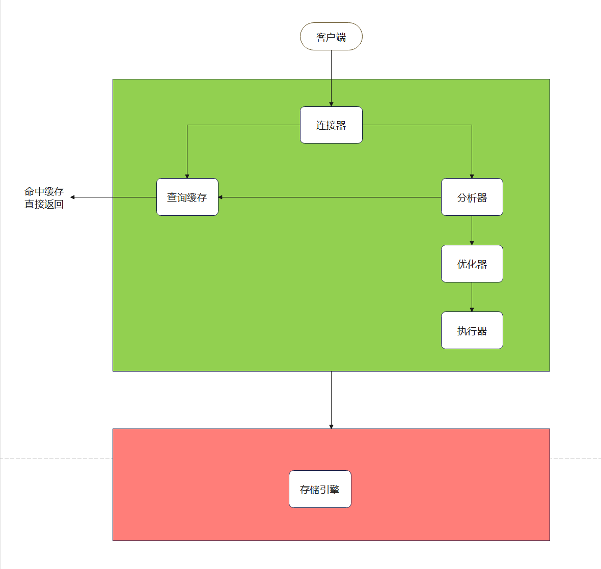

[TOC]

#  数据库

## 一、关系型和非关系型数据库的区别

- 关系型数据库的优点
  - 容易理解。因为它采用了关系模型来组织数据
  - 可以保持数据的一致性
  - 数据更新的开销比较小
  - 支持复杂查询(带where子句的查询)
- 非关系数据库的优点
  - 不需要经过SQL的解析，读写效率高
  - 基于键值对，数据的拓展性很好
  - 可以支持多种类型数据的存储，如图片、文档等

## 二、什么是非关系型数据库

​	非关系型数据库也叫NoSQL，采用键值对的形式进行存储。

​	它的读写性能很高，易于拓展，可分为内存性数据库以及文档数据库，比如Redis、MongoDB，HBase等等

​	适合使用非关系型数据库的场景：

- 日志系统
- 地址位置存储
- 数据量巨大
- 高可用

## 三、为什么使用索引

- 通过创建唯一性索引，可以保证数据库表中每一行数据的唯一性
- 可以大大加快数据的检索速度，这也是创建索引的最主要的原因
- 帮助服务器避免排序和临时表
- 将随机IO变为顺序IO
- 可以加速表和表之间的连接，特别是在实现数据的参考完整性方面特别有意义

## 四、Innodb为什么要用自增id作为主键

​	如果表使用自增主键，那么每次插入新的记录，记录就会顺序添加到当前索引节点的后续位置，当一页写满，就会自动开辟一个新的页。如果使用非自增主键，由于每次插入主键的值近似于随机，因此每次新纪录都要被插入到现有索引页的中间某个位置，频繁的移动、分页操作造成了大量的碎片，得到了不够紧凑的索引结构，后续不得不通过OPTIMIZE TABLE来重建表并优化填充页面。

## 五、MyISAM和InnoDB实现B树索引方式的区别方式是什么

- MyISAM，B+ Tree叶节点的data域存放的是数据记录的地址，在索引检索的时候，首先按照B+ Tree搜索算法搜索索引，如果指定的key存在，则取出其data域的值，然后以data的值为地址取相应的数据记录，这被称为"非聚簇索引"
- InnoDB，其数据文件本身就是索引文件，相比MyISAM，索引文件和数据文件时分离的，其表数据文件本身就是按B+ Tree组织的一个索引结构，树的结点data域保存了完成的数据记录，这个索引的key是数据表的主键，因此，InnoDB表数据文件本身就是主索引，这被称为"聚簇索引"或者聚集索引，而其余的索引都作为辅助索引，辅助索引的data域存储相应记录主键的值，而不是地址，这也是和MyISAM不同的地方

​	在根据主索引搜索时，直接找到key所在的节点即可取出数据；在根据辅助索引查找时，则需要先取出主键的值，再走一遍主索引。因此，在设计表的时候，不建议使用过长的字段为主键，也不建议使用非单调的字段作为主键，这样会造成主索引频繁分裂。

## 六、MySQL是如何执行一条SQL的，具体步骤有哪些？

**server层按顺序执行SQL的步骤：**

- 客户端请求
- 连接器：验证用户身份，给予权限
- 查询缓存：存在缓存则直接返回，不存在则执行后续操作
- 分析器：对SQL进行词法分析和语法分析操作
- 优化器：主要对执行的SQL优化选择最后的执行方案
- 执行器：执行时会先看用户是否有执行权限，有才去使用这个引擎提供的接口
- 去引擎层获取数据返回，如果开启查询缓存则会缓存查询结果

## 七、drop、delete、truncate的共同点和区别

- delete：用来删除表的全部或者一部分数据行，执行delete之后，用户需要提交commit或者rollback来执行删除或撤销删除，会触发这个表上所有的delete触发器
- truncate：删除表中所有的数据，这个操作不能回滚，也不会触发这个表上的触发器，truncate比delete更快，占用的空间更小
- drop：从数据库中删除表，所有的数据行，索引和权限也会被删除，所有的DML触发器也不会被触发，这个命令也不能回滚

## 八、MySQL能从哪些方面做到性能优化

- 为搜索字段创建索引
- 避免使用select *，列出需要查询的字段
- 垂直分割分表
- 选择正确的存储引擎

## 九、数据库隔离级别

- 未提交读：事务中发生了修改，即使没有提交，其他事务是可见的。比如对于一个数A，原来50修改为100，但是没有提交修改，另一个事务看到了这个修改，而这个时候原事务发生了回滚，此时A还是50，但是另一个事务看到的A是100，**可能会导致脏读、幻读或不可重复读**
- 提交读：对于一个事物从开始直到提交之前，所做的任何修改是其他事务不可见的。比如对于一个数A，原来50修改为100，这个时候另一个事务在A提交之前，读取的A是50，刚读取完，A就被修改成100，这个时候另一个事务再进行读取就突然变成100了。**可以阻止脏读，但是幻读或不可重复读仍然可能发生**
- 重复读：对于一个记录多次读取的记录是相同的，比如对一个A读取一直都是A。**可以阻止脏读和不可重复读，但幻读仍然可能发生**
- 可串行化读：在并发情况下，和串行话的读取结果是一致的，没有什么不同，比如不会发生脏读和幻读。**该级别可以防止脏读、不可重复读以及幻读**

MySQL InnoDB存储引起的默认支持的隔离级别是REPEATABLE-READ(可重复读)

## 十、数据库索引采用B+树而不是B树，主要原因是什么

​	B+树只要遍历叶子节点就可以实现整棵树的遍历，而且在数据库中基于范围的查询是非常频繁的，而B树只能中序遍历所有节点，效率太低。

## 十一、文件索引和数据库为什么使用B+树

​	文件与数据库都是需要较大的存储，也就是说，它们不能全部存储在内存中，需要存储到磁盘上。而所谓索引，就是为了快速定位和查找，那么索引的结构组织要尽量减少查找过程中磁盘I/O的存取次数，因此B+树比B树更为合适。数据库系统巧妙的利用了局部性原理与磁盘预读原理，将一个节点的大小设置为等于一个页，这样每个节点只需要一次I/O就可以完全载入，而红黑树这种结构，高度明显要深得多，并且由于逻辑上很近的节点物理上可能很远，无法利用局部性。

​	 最重要的是，B+树还有一个最大的好处：方便扫库

​	B树必须要用中序遍历的方法按序扫库，而B+树直接从叶子节点挨个扫一遍就完了，B+树支持range-query非常方便，而B树不支持，这个就是数据库选B+树的最主要原因。

​	B+树查找效率更加稳定，B树有可能在中间节点找到数据，稳定性不够。

​	B+树的磁盘读写代价更低：B+ Tree的内部结点并没有指向关键字具体信息的指针，因此其内部结点相对B树更小。

​	如果把所有同一内部结点的关键字存放在同一块盘中，那么盘块所能容纳的关键字数量也就越多。一次性读入内存中的需要查找的关键字也就越多，相对来说IO读写次数也就降低了。

​	B+ Tree的查询效率更加稳定：由于内部结点并不是最终指向文件内容的结点，而只是叶子结点中关键字的索引，所以，任何关键字的查找必须走一条从跟结点到叶子结点的路。所有关键字查询的路径相同，导致每一个数据的查询效率想当。

## 十二、视图和游标

​	视图是一种虚拟的表，通常是有一个表或多个表的行或列的子集，具有和物理表相同的功能，游标是对查询的结果集作为一个单元来有效的处理。一般不使用游标，但是需要逐条处理数据的时候，游标显得很重要。

## 十三、MySQL中的事务回滚机制

​	在MySQL中，恢复机制是通过回滚日志(undo log)实现的，所有事务进行的修改都会先记录到回滚日志中，然后在对数据库中的对应行进行写入。当事务已经被提交后，就无法再次回滚了。

​	回滚日志的作用：

- 能够在发生错误或者用户执行ROLLBACK时提供回滚相关的信息
- 在整个系统发生崩溃、数据库进程被直接杀死后，当用户再次启动数据库进程，还能够立刻通过查询回滚日志将之前未完成的事务进行回滚，这也就需要回滚日志必须先于输入持久化到磁盘上，是我们需要先写日志后写数据库的主要原因

## 十四、InnoDB和MyISAM的区别

**InnoDB**

- 是MySQL默认的事务型存储引擎，只有在需要它不支持的特性的时候，才考虑使用其他的存储引擎
- 实现了四个标准的隔离级别，默认级别是可重复读。在可重复读隔离级别下，通过多版本并发控制(MVCC)和间隙锁(Next-KeyLocking)防止幻读
- 主索引是聚簇索引，在索引中保存和数据，从而避免直接读取磁盘，因此对查询性能有很大的提升
- 内部做了很多优化，报错从磁盘读取数据时采用的可预测性读、能够加快读操作并且自动创建的自适应哈希索引、能够加速插入操作的插入缓冲区等。
- 支持真正的在线热备份。其它存储引擎不支持在线热备份，要获取一致性视图需要停止对所有表的写入，而在读写混合场景中，停止写入可能也意味着停止读取

**MyISAM**

- 设计简单，数据以紧密格式存储。对于只读数据，或者表比较小、可以容忍修复操作，则依然可以使用它
- 提供了大量的特性，包括压缩包、空间数据索引
- 不支持事务
- 不支持行级锁，只能对整张表加锁，读取时会对需要读到的所有表加共享锁，写入时则对表加排它锁。但在表有读取操作的同时，也可以往表中插入新的记录，这被称为并发插入

## 十五、数据库悲观锁和乐观锁的原理和应用场景分别有什么

​	悲观锁，先获取锁，再进行业务操作，一般是利用类似 select ... for update这样的语句，对数据加锁，避免其他事务意外修改数据。当数据库执行select ... for update时会获取被select中的数据行的行锁，select ... for update获取的行锁会在当前事务结束时自动释放，因此必须在事务中使用

​	乐观锁，先对业务操作，只在最后实际更新数据时进行检查数据是否被更新过。

## 十六、数据库并发事务会带来哪些问题

数据库并发会带来脏读、幻读、丢弃更改、不可重复读等四个常见问题

- 脏读：在第一个修改事务和读取事务进行的时候，读取事务读到的数据为100，这是修改后的数据，但是之后该修改事务满足一致性等特性而做了回滚操作，那么读取事务得到的结果就是脏数据了。
- 幻读：一般是T1在某个范围内进行修改操作，而T2读取该范围导致读到的数据时修改之间的了，强调时间范围
- 丢弃修改：两个写事务T1、T2同时对A=0进行递增操作，结果T2覆盖T1，导致最终的结果是1而不是2，事务被覆盖
- 不可重复读：T2读取一个数据，然后T1对该数据做了修改，结果T2再次读取这个数据，此时读取的结果和第一次读取的结果不同

## 十七、MySQL索引主要使用的两种数据结构是什么

- 哈希索引：对于哈希索引来说，底层的数据结构肯定是哈希表，因此**在绝大多数需求为单条记录查询**的时候，可以选择哈希索引，查询性能更快；其余大部分场景，建议选择BTree索引
- BTree索引：MySQL的BTree索引使用的是B树的B+ Tree，BTree索引就是一种将索引值按一定的算法，存入一个树形的数据结构中，每次查询时都是树的入口开始查询，异常遍历node，获取leaf

## 十八、数据库为什么进行分库和分表

​	分库和分表的目的在于，减小数据库的单库单表负担，提升查询性能，缩短查询时间。

​	通过分表，可以减少数据库的单表负担，将压力分散到不同的表上，同时因为不同的表上的数据量少了，起到提高查询性能，缩短查询时间的作用，此外还可以很大的缓解表锁的问题

- **水平分表**：取模分表属于随机分表，而时间维度分表就属于连续分表。如何设计好垂直拆分，建议是：将不常用的字段拆分到一张拓展表，将大文本的字段单独拆分到一张拓展表，将不经常修改的字段放到同一张表中，将经常改变的字段放到另外一张表中。对于海量用户场景，可以考虑取模分表，数据相对比较均匀，不容易出现热点和并发访问的瓶颈。
- **库内分表**：仅仅是解决了单表数据过大的问题，但并没有把单表的数据分散到不同的物理机上，因此不能减轻MySQL服务器的压力，仍然存在同一个物理机上的资源竞争和瓶颈，包括CPU、内存、磁盘IO、网络宽带等

## 十九、不可重复度和幻读的区别

​	不可重复读的重点是修改，幻读的重点在于新增或者删除

- 事务1中读取自己的工资为1000的操作未完成，事务2中修改了工资为2000，导致事务1再读取自己的工资变成了2000
- 工资单中工资大于3000的人有4人，事务1读取了所有工资大于3000的人，查到4条记录，此时事务2又插入了一条工资大于3000的记录，事务一再次读取时查到的记录就变成了5条，这样就导致了幻读

## 二十、MySQL中的四种索引

- FULLTEXT：全文索引，目前只有MyISAM引擎支持

  可以在CREATE TABLE，ALTER TABLE，CREATE INDEX使用，不同目前只有CHAR，VARCHAR，TEXT列上支持全文索引

- HASH：由于HASH的唯一以及类似键值对的形式，很适合作为索引，HASH索引可以一次定位，不需要想树形索引那样逐层查找，因此具有极高的效率，但是高效是有条件的，仅在=和in条件下高效，对于范围查询、排序、组合索引仍然效率不高

- BTREE：BTREE索引是一种将索引值按照一定的算法，存入一个树形的数据结构中，每次查询都是从树的入口开始，依次遍历node，获取leaf

- RBTREE：RBTREE在MySQL中很少使用，仅支持geometry数据类型，支持该类型的存储引擎有MyISAM、BDb、InnoDB、NDb、Archive几种。相比于BTREE，RBTREE的优势在于范围查找

## 二十一、视图的作用

​	视图是虚拟的表，与包含数据的表不一样，视图只包含使用时动态检索数据的查询；不包含任何列和数据

​	使用视图可以简化复杂查询的SQL操作，隐藏具体的细节，保护数据；视图创建后，可以使用与表相同的方式使用它们

​	视图不能被索引，也不能有关联的触发器或默认值，如果视图内有order by则对视图再次order by将被覆盖

​	对于某些视图，比如未使用联合子查询分组聚集函数Distinct Union等，是可以对其更新的，对视图的更新将对基表进行更新；但是视图只要用于简化检索，保护数据，并不用于更新，而且大部分视图都不可以更新

## 二十二、为什么B+ Tree比BTree更适合实际应用中操作系统的文件索引和数据库索引

​	B+树的磁盘读写代价更低，查询效率更高更稳定。

​	数据库采用B+树而不是B树的主要原因：B+树只要遍历叶子节点就可以实现整棵树的遍历，而且在数据库中基于范围的查询是非常频繁的，而B树只能中序遍历所有节点，效率太低

​	B+树的特点：

- 所有的关键字都出现在叶子节点的链表中，且链表中的关键字恰好是有序的
- 不可能在非叶子结点命中
- 非叶子结点相当于叶子结点的索引，叶子结点相当于是存储数据的数据层

## 二十三、什么时候需要建立数据库索引

​	在最频繁使用的、用以缩小查询范围的字段，需要排序的字段上建立索引

​	以下两种情况不适合：

- 对于查询中很少涉及的列或者重复值比较多的列
- 对于一些特殊的数据类型，不宜建立索引，比如文本字段text等

## 二十四、数据库运维优化手段

​	假如你所在公司选择MySQL作为数据存储，一天五万条以上的增量，有哪些优化手段：

- 设计良好的数据库结构，允许部分数据冗余，尽量避免join查询，提高效率
- 选择合适的表字段数据类型和存储引擎，适当的添加索引
- MySQL库主从读写分离
- 找规律分表，减少单表的数据量，提高查询速度
- 添加缓存机制，比如Memcached，Apc等
- 不经常改动的页面，生成静态页面
- 书写高效的SQL

## 二十五、覆盖索引是什么

​	如果一个索引包含(覆盖)所有需要查询的字段的值，我们就称之为覆盖索引

​	我们知道在InnoDB存储引擎中，如果不是主键索引，叶子结点存储的是主键+列值

​	最终还是要回表，也就是通过主键再查找一次，这样就会比较慢。覆盖索引就是把要查询出的列和索引是对应的，不做回表操作

## 二十六、数据库中的主键、超键、候选键、外键是什么？

- **超键：** 在关系中能唯一标识元组的属性集称为关系模式的超键
- **候选键：** 不含有多余属性的超键称为候选键。也就是候选键中，若再删除属性，就不是键了
- **主键：** 用户选做元组标识的一个候选键程序主键
- **外键：** 如果关系模式R中，属性K是其他模型的主键，那么K在模式R中被称为外键

|   学号   |  姓名  | 性别 | 年龄 |  系别  |   专业   |
| :------: | :----: | :--: | :--: | :----: | :------: |
| 20020612 |  李辉  |  男  |  20  | 计算机 | 软件开发 |
| 20020613 |  张明  |  男  |  18  | 计算机 | 软件开发 |
| 20020614 | 王小玉 |  女  |  19  |  物理  |   力学   |
| 20020615 | 李淑华 |  女  |  17  |  生物  |  动物学  |
| 20020616 |  赵静  |  男  |  21  |  化学  | 食品化学 |
| 20020617 |  赵静  |  女  |  20  |  生物  |  植物学  |

- 超键：学号是标识学生实体的唯一标识。那么该元组的超键就是学号。除此之外，我们还可以把它和其他属性组合起来，比如：(学号， 性别)，(学号， 年龄)
- 候选键：学号是一个可以唯一标识学生实体的唯一标识，因此学号是一个候选键，实际上，候选键是超键的子集，比如(学号， 性别)是超键，但是它不是候选键。因为它还有额外的属性。
- 主键：简单来说，例中的元组的候选键为学号，但是我们选定它作为该元组的唯一标识，那么学号就是主键
- 外键：外键是相对于主键的，比如在学生记录里，主键为学号，在成绩单表里也有学号字段，因此学号为成绩单表的外键，为学生表的主键

## 二十七、数据库三大范式

**第一范式**

​	在任何一个关系数据库中，第一范式是对关系模式的基本要求，不满足第一范式的数据库就不是关系型数据库

​	所谓第一范式是指数据库表的每一列都是不可分割的基本数据项，同一列中不能有多个值，即实体中的某个属性不能有多个值或不能有重复的属性

​	如果出现重复的属性，就看你需要定义一个新的实体，新的实体由重复的属性构成，新实体与原实体之间为一对多的关系。在第一范式中表的每一行只包含一个实例的信息。

​	**第一范式就是无重复的列**

**第二范式**

​	第二范式是在第一范式的基础上建立起来的，即满足第二范式必须先满足第一范式。第二范式要求数据库表中的每个实例或行必须可以被唯一的区分

​	为实现区分通常需要为表加上一个列，以存储各个实例的唯一标识，这个唯一标识属性列被称为主键。第二范式要求实体的属性完全依赖于主关键字

​	所谓完全依赖是指不能存在仅依赖主关键字的一部分属性，如果存在，那么属性和主关键字的这一部分应该分离出一个新的实体，新实体于原实体之间是一对多的关系

​	为实现区分通常需要为表加上一个列，以存储各个实例的唯一标识。

​	**第二范式就是非主属性非部分依赖于主关键字**

**第三范式**

​	满足第三范式必须先满足第二范式。

​	第三范式要求一个数据库表中不包含已在其他表中包含的非主关键字信息。

​	例如，存在一个部门信息表，其中每个部门有部门编号、部门名称、部门简介等信息。那么在员工信息表中列出部门编号后就不能再将部门名称、部门简介等于部门有关的信息再加入员工信息表中。如果不存在部门信息表，则根据第三范式也应该构建它，否则就会存在大量的数据冗余

​	**第三范式就是属性不依赖于其他非主属性**

## 二十八、事务四大特性(ACID)

- **原子性：**一个事务中所有的操作，要么全部完成，要么全部不完成，不会结束在中间某个环节。事务在执行过程中发生错误，要被恢复到事务开始前的状态，就像这个事务从来没有执行过一样
- **一致性：**在事务开始之前和事务结束之后，数据库的完整性没有被破坏。这表示写入的资料必须完全符合所有的预设规则，这包含资料的精确度、串联性已经后续数据库可以自发性地完成预定的工作
- **隔离性：**数据库多个并发事务同时对其数据进行读写和修改的能力，隔离性可以防止多个事务并发执行时由于交叉执行导致数据不一致。事务隔离分为不同级别，包括读未提交，读提交，可重复读，串行化
- **持久性：**事务处理结束后，对数据的修改就是永久的，即使系统故障也不会丢失

## 二十九、SQL中的NOW()和CURRENT_DATE()两个函数的区别

- NOW()：命令用于当前年份，月份，日期，小时，分钟和秒 
- CURRENT_DATE()：仅显示当前年份，月份，日期

## 三十、聚集索引

​	聚集索引就是按照拼音查询，非聚集索引就是按照偏旁等进行查询

​	起始，我们的汉语字典的正文本身就是一个聚集索引

​	比如，我们要查 安 字，就会很自然的翻开子带你的前几页，因为 安 的拼音是an，而按照拼音排序，汉字的字典就是以英文字母 a 开头并以 z 结尾的，那么 安 字就自然的排在字典的前部。

​	如果，你翻完了所有以a开头的部分仍然找不到这个字，那么就说明的字典中没有这个字

​	同样的，如果查 张 字，那么也会自然的将字典翻到最后部分，因为张的拼音是zhang，也就是说，字典的正文部分本身就是一个目录，不需要再去查其他目录来找到你需要的内容

​	我们把这种**正文内容本身就是一种按照一定规则排列的目录称为聚集索引**

## 三十一、非聚合索引

​	如果你认识某个字，你可以快速的地从自动中差到这个字。但你也可能会遇到你不认识的字，不知道它的声音，这时候，你就不能按照刚才的方法找到你要查的字，而需要根据偏旁部首查到你要找的字，然后根据这个字后的页码找到某页来找到你要找的字

​	但你结合部首目录和检字表而查到的字的排序并不是真正的正文的排序方法，比如你要查 张 字，要在差步骤之后在检字表中查到张的页码是xxx页，如果检字表中的上面是驰字，但是页码是xx页

​	很显然，这些并不是真正的位于 张 字的上下方，现在你看到的起始是它们在非聚集索引中的排序，就是字典正文中的字在非聚集索引中的映射

​	我们可以通过这种方式来找到需要的字，但是需要两个过程，先要找到目录中的结果，然后再翻到你所需要的页码

​	我们把**这种目录纯粹是目录，正文纯粹是正文的排序范式称为非聚集索引** 

## 三十二、聚集索引和非聚集索引的区别

​	聚集索引和非聚集索引的区别在于，通过聚集索引可以查到需要查找的数据，而通过非聚集索引可以查到记录对应的主键值，再使用主键的值通过聚集索引查找到需要的数据。

​	聚集索引和非聚集的根本区别是表记录的排序顺序与索引的排序顺序是否一致

​	聚集索引的叶节点就是数据节点，而非聚集索引的叶节点仍然是索引节点，只不过其包含一个指向对应数据块的指针

## 三十三、创建索引时需要注意什么

- 非空字段：应该指定列为NOT NULL，除非你想存储NULL。在MySQL，含有空值的列很难进行查询优化，因为它们使得索引、索引的统计信息已经比较运算更加复杂。你应该用0、一个特殊的值或者一个空串代替控制。
- 取值离散大的字段：（变量各个取值之间的差异程度）的列放到联合索引前面，可以通过count()函数查看字段的差异值，返回值越大说明字段的唯一值越多字段的离散程度高
- 索引字段越小越好：数据库的数据存储以页为单位一页存储的数据越多一次IO操作获取的数据越大效率越高。唯一、不为空、经常被查询的字段的字段适合建索引

## 三十四、MySQL中的CHAR和VARCHAR的区别有哪些

- char的长度是不可变的，用空格填充到指定长度大小，而varchar的长度是可变的
- char的存取速度还是比varchar要快得多
- char的存储方式是：对英文字符占用1个字节，对一个汉字占用2个字节。varchar的存储方式：对每个英文字符占用2个字节，汉子也占用2个字节

## 三十五、既然索引有那么多优点，为什么不对表的每一列创建一个索引

- 当对表中的数据进行增加、删除和修改的时候，索引也要动态的维护，这样就降低了数据的维护速度
- 索引需要占用物理空间，除了数据表占用数据空间外，每一个索引还要占一定的物理空间，如果要建立簇索引，那么需要的空间就会更大
- 创建索引和维护索引要耗费时间，这种时间随着数据库的增加而增加
