# neo4j

## 1.安装
### 1.1安装JDK
选择对应版本 安装后把bin/目录加入环境变量PATH
https://www.oracle.com/java/technologies/downloads/

### 1.2 安装neo4j
把bin/目录加入环境变量PATH
https://neo4j.com/deployment-center/#community

### 1.3 cmd启动数据库
neo4j.bat console
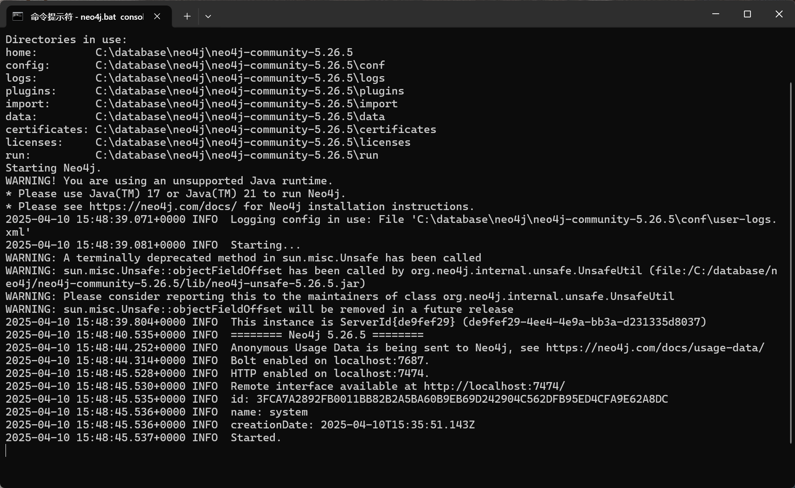

本地浏览器输入, 连接数据库
http://localhost:7474/browser/
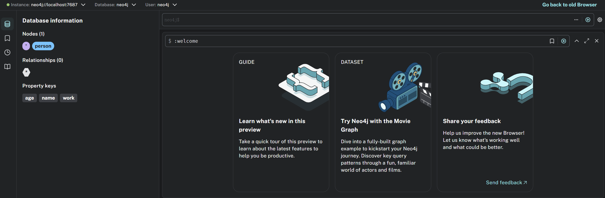

## 2.创建node
### 2.1 创建新node

指定node的标签为person和company, 一个node可以有多个properties
```GQL
CREATE (n:person {name: "BOB", age: 26, work: "software engineer"})

CREATE (n:person {name: "alice", age: 26, work: "software engineer"})

CREATE (n:person {name: "joe", age: 26, work: "unemployed"})

CREATE (n:COMPANY {name: "google", area: "USA"})

CREATE (n:COMPANY {name: "facebook", area: "USA"})
```


## 3. 连边

**Neo4j 的关系是有方向的**

```GQL
MATCH (alice:person {name: "alice"}),  (bob:person {name: "BOB"})
CREATE (alice)-[r:FRIEND]->(bob)
RETURN r

MATCH (alice:person {name: "alice"}),  (bob:person {name: "BOB"})
CREATE (bob)-[r:FRIEND]->(alice)
RETURN r

MATCH (c:COMPANY {name: "facebook"}),  (bob:person {name: "BOB"})
CREATE (bob)-[r:WORK_IN]->(c)
RETURN r

MATCH (c:COMPANY {c}),  (alice:person {name: "alice"})
CREATE (alice)-[r:WORK IN]->(c)
RETURN r
```


## 4. 查询

### 4.1 查询所有 node

```GQL
MATCH (n) RETURN n;
```
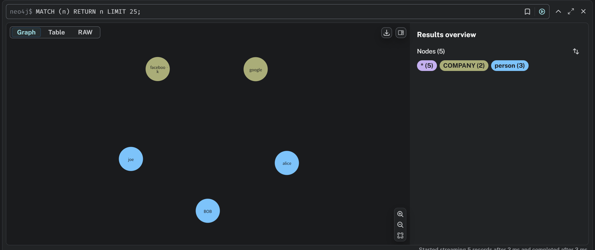


### 4.2 查询指定标签 node

```GQL
MATCH (n:COMPANY) RETURN n;
```
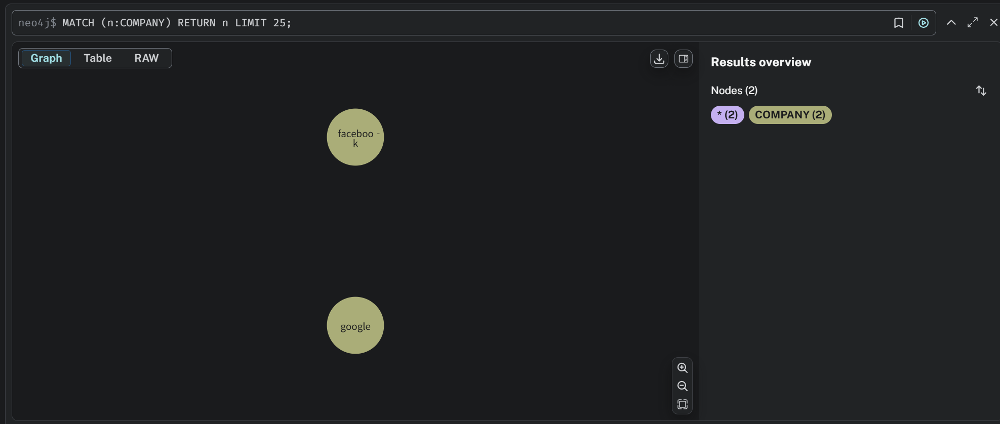

```GQL
MATCH (n:person) RETURN n;
```

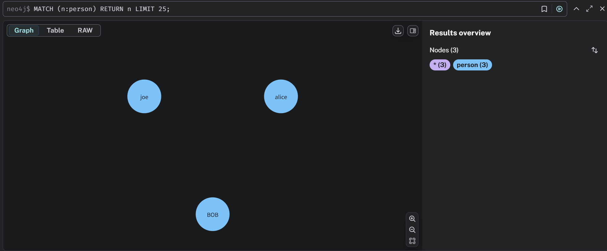


### 4.3 查询指定属性 node

```GQL
MATCH (n:person {name: "BOB"}) RETURN n;
```

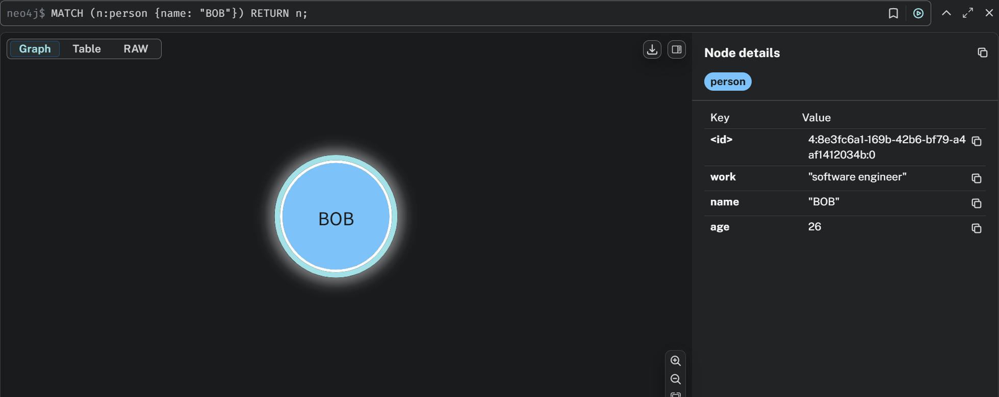

```GQL
MATCH (n:COMPANY {name: "google"}) RETURN n;
```
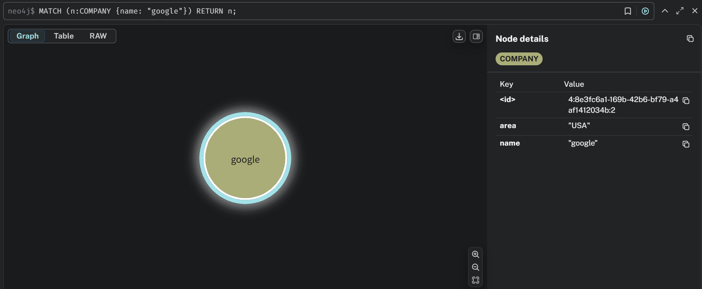


### 4.4 查询指定起点的边

#### 4.4.1 查询所有边

```GQL
MATCH p=()-[]->() RETURN p;
```

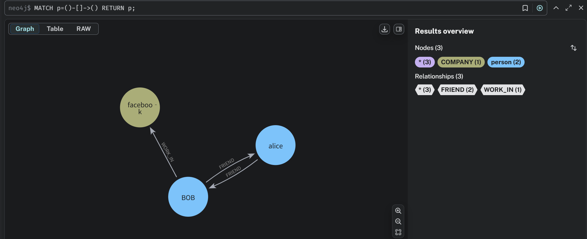

#### 4.4.2 指定起点的所有边

```GQL
MATCH p=(n: person {name: "BOB"})-[]->() RETURN p;
```

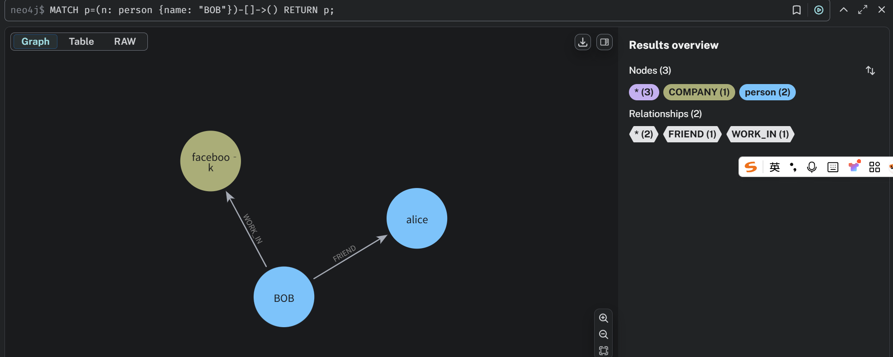

```GQL
MATCH p=(n: person {name: "alice"})-[]->() RETURN p;
```

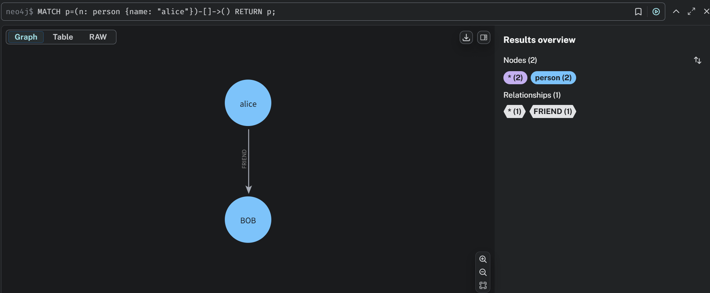

#### 4.4.3 指定起点 + 指定边属性

```GQL
MATCH r=(n: person {name: "BOB"})-[:WORK_IN]->() RETURN r;
```

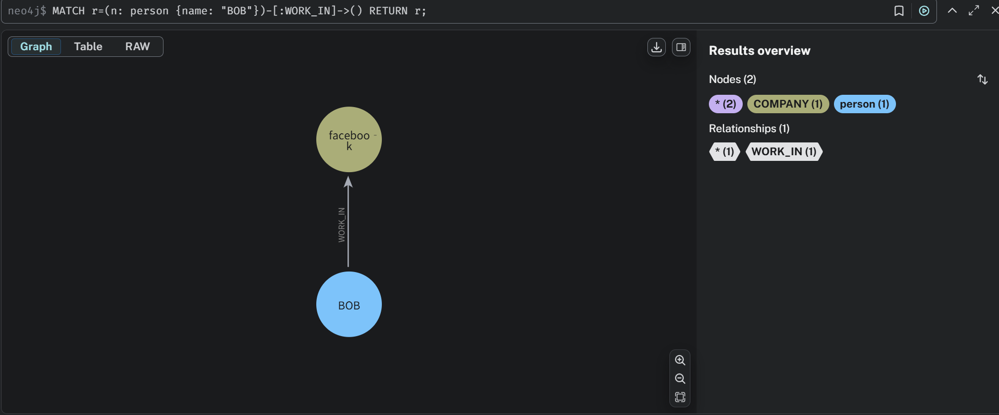

#### 4.4.4 指定起点 + 跳数

```GQL
MATCH r=(n:person {name: "BOB"})-[:WORK_IN*1..2]->() RETURN r
```

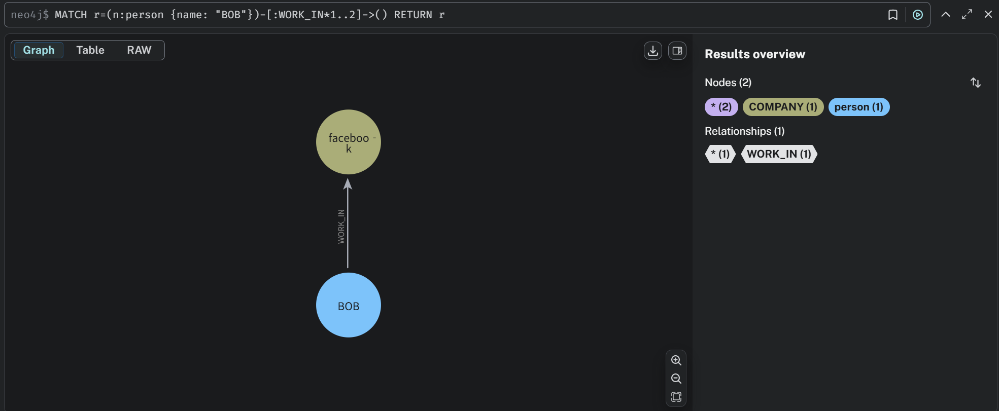


