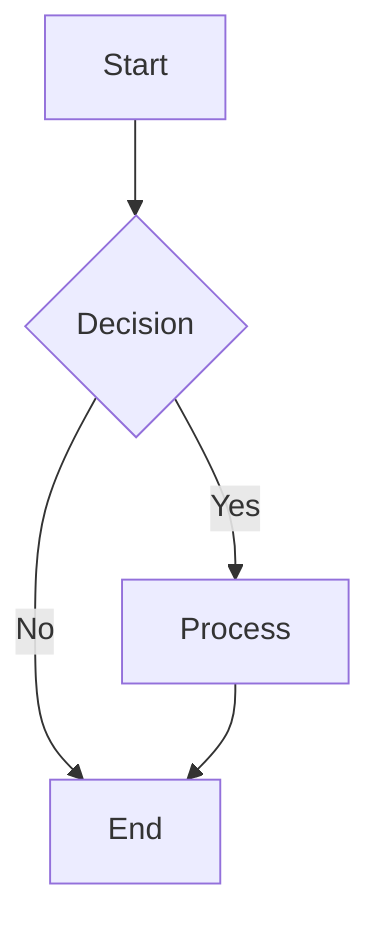

# Spec: Mermaid2Excalidraw Parser

## Purpose

为 Mermaid 图表提供解析器规范，将 Mermaid 语法转换为统一的中间表示 (IR)。

## Requirements

### Requirement: Mermaid 语法支持

解析器 SHALL 支持以下 Mermaid 图表类型：

#### Flowchart (流程图)

解析元素：
- `node`: 节点 (id, label, shape)
- `edge`: 边 (from, to, label, style)
- `subgraph`: 子图 (id, label, nodes[])

##### Scenario: 基本流程图解析

- **WHEN** 解析包含 4 个节点和 4 条边的 Mermaid 流程图
- **THEN** IR SHALL 包含正确的 4 个节点和 4 条边

#### Sequence Diagram (时序图)

##### Scenario: 时序图解析

- **WHEN** 解析包含参与者 A、B 和消息的时序图
- **THEN** IR SHALL 包含正确的参与者和消息

### Requirement: 中间表示 (IR)

解析结果 SHALL 转换为统一的中间表示：

##### Scenario: IR 结构验证

- **WHEN** 成功解析 Mermaid 图表
- **THEN** 返回的 DiagramIR SHALL 包含 type、nodes、edges、metadata 字段

### Requirement: 错误处理

- **WHEN** 解析失败时
- **THEN** SHALL 返回包含行列号的详细错误信息
- **AND** SHALL 提示可能的修复建议

##### Scenario: 语法错误

- **WHEN** Mermaid 文件包含未闭合的括号 `A[label`
- **THEN** 输出错误: "Line 3: Unclosed bracket, expected ']'"
